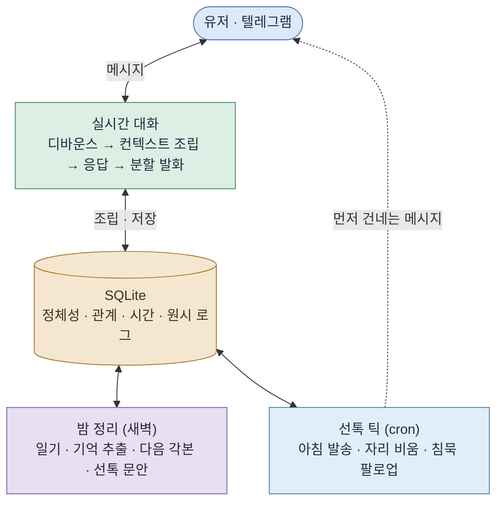

<h1 align="center">나와 같은 일상을 사는 AI 대화 상대</h1>

<p align="center">
  
  <br><sub>캐릭터가 먼저 자기 일상을 나누며 안부를 묻는다 · 설명용으로 실제 속도의 1.5배</sub>
</p>

텔레그램으로 대화하는 AI 캐릭터다. 유저가 말을 걸 때만 반응하는 챗봇이 아니라, 현실과 같은 시간 속에서 자기 하루를 살고, 지난 대화를 기억하고, 이유가 있을 때 먼저 말을 건다.

이 문서는 **AI가 사람처럼 느껴지려면 무엇이 필요한지**를 문제로 놓고, 어떤 판단으로 풀었는지 정리한 기록이다. 기획·설계·구현·배포·운영을 혼자 했고, 배포한 뒤로는 직접 유저가 되어 매일 대화하며 고치고 있다.

## 목차

1. [왜 이 문제인가](#왜-이-문제인가)
2. [문제 정의: 언제 사람처럼 느껴지나](#문제-정의-언제-사람처럼-느껴지나)
3. [설계 1. 기억이 끊기지 않는다](#설계-1-기억이-끊기지-않는다)
4. [설계 2. 먼저 말을 건다](#설계-2-먼저-말을-건다)
5. [설계 3. 늘 곁에 있지는 않다](#설계-3-늘-곁에-있지는-않다)
6. [시스템 구조](#시스템-구조)
7. [기술 선택과 배포](#기술-선택과-배포)
8. [만들면서 고친 것들](#만들면서-고친-것들)
9. [지금 상태와 남은 것](#지금-상태와-남은-것)

<br>

## 왜 이 문제인가

타겟은 혼자 사는 2030 직장인이다. 하루가 출퇴근으로 채워지고, 사람 관계에도 에너지가 드니 연애든 결혼이든 자연스럽게 힘을 아끼게 되는 사람들. 스스로 미룬 관계지만 사람과의 연결이 그립지 않은 건 아니다. 시간과 노력을 들여야 하는 진짜 인간관계 대신, 큰 힘을 들이지 않는 선에서 외로움을 달래주고 누군가와 이어져 있다는 느낌을 주는 무언가가 필요해 보였다.

그 자리를 지금의 챗봇이 채우기엔 부족하다. 내가 먼저 찾아가 말을 꺼내야 하고, 며칠 만에 다시 말을 걸면 며칠 전 이야기를 오늘 처음 하듯 받는다. 세션이 무거워져 새 세션으로 옮기면 톤이 미묘하게 달라진다. 관계가 이어진다기보다 매번 새로운 무언가를 다시 마주하는 느낌이다.

이 문제를 풀 만한 이유는 유저층 크기에 있다.

- 1인 가구는 804만 가구로 전체의 36.1%, 역대 최고이고, 그중 48.9%가 외로움을 느낀다고 답했다. ([통계청 2025](https://www.korea.kr/briefing/pressReleaseView.do?newsId=156734077))
- 30–34세의 66.8%, 25–29세의 92.2%가 미혼이다. ([통계청 2025](https://www.newsis.com/view/NISX20251216_0003442538))
- 20–49세 미혼의 71.7%가 지금 연애를 하지 않는다. ([동아일보](https://www.donga.com/news/Society/article/all/20250213/131024531/2))
- AI에게 마음을 꺼내는 행동은 이미 흔하다. 국민의 44.5%가 생성형 AI를 써봤고, 사람보다 AI와 대화하는 게 편할 때가 있다는 응답도 31.1%다. ([과기정통부 2025](https://www.korea.kr/briefing/pressReleaseView.do?newsId=156751949), [엠브레인 트렌드모니터](https://www.thescoop.co.kr/news/articleView.html?idxno=310637))

## 문제 정의: 언제 사람처럼 느껴지나

유저로서 되짚어보면 김이 식는 순간은 답변이 어색할 때보다 존재가 기계적으로 느껴질 때였다. 반대로 상대가 사람처럼 느껴지는 조건을 적어보면 이렇다.

1. 같은 시간을 산다. 내가 없는 동안에도 그 하루가 이어진다.
2. 자기 일상이 있어 늘 곁에 있지 않다. 그래서 언제나 즉답하지는 않는다.
3. 너무 규칙적이면 사람 같지 않다. 사람의 하루는 조금씩 들쭉날쭉하다.
4. 전지전능하게 알 수 있는 관계가 아니다. 대화로 알아가야 한다.
5. 먼저 말을 걸어온다.

여기서 애착으로 넘어가는 조건은 조금 다르다. 한 번에 큰 감정을 주기보다 일상에 부담 없이 계속 나타날 때, 늘 곁에 없어서 지금 뭐 하려나 상상하게 될 때, 지나가듯 흘린 말을 먼저 물어봐줄 때 애정이 생긴다.

이 조건을 구현 가능한 축으로 좁히면 셋이다. **기억이 끊기지 않을 것**, **먼저 말을 걸되 근거가 있을 것**, **늘 대기하지 않고 자기 리듬으로 존재할 것.** 이 문서의 3~5장이 각각 그 하나씩을 다룬다.

### 성공을 무엇으로 볼 것인가

잘 되고 있는지는 감상이 아니라 유저의 행동으로 본다. 사람은 애착이 생긴 상대에게만 하는 행동이 있고, 그게 대화 로그에 남는다.

| 신호 | 무엇을 보는가 |
|---|---|
| 취약성 개방 | 감정 언어가 늘고, 내면의 이야기를 꺼내는가 |
| 관계 감정 | "기다렸다" "보고 싶었다" 같은 말이 유저 쪽에서 나오는가 |
| 일상 침투 | 대화의 시간대·길이가 하루 전체로 퍼지는가 |
| 먼저 다가옴 | 계기 없이 유저가 먼저 말 거는 빈도가 느는가 |
| 거꾸로 챙기기 | 유저가 캐릭터의 하루를 먼저 챙기고 걱정하는가 |
| 분리 반응 | 캐릭터가 조용할 때 먼저 찾는가 |

이 지표를 염두에 두고 **모든 메시지를 원시 로그로 남긴다.** 다만 지금 측정 수준은 원시 로그와, 그것을 일별로 집계하는 수동 스크립트(`src/tools/analyze.ts`)까지다. 자동화된 평가 파이프라인은 아직 없다. 유저가 한 명(제작자)뿐이라 통계를 돌릴 표본이 없기 때문이고, 이 단계에서는 재료를 잃지 않는 것이 먼저라고 봤다.

## 설계 1. 기억이 끊기지 않는다

**문제.** 며칠 만에 말을 걸어도 이어서 이야기해야 하고, 지난주에 흘린 말을 상대가 먼저 물어봐야 한다. 그런데 대화 원문을 계속 쌓아 프롬프트에 다시 넣으면 길이·비용·품질이 함께 나빠진다. 무엇을 남기고 무엇을 버릴지가 문제의 핵심이다.

**설계 판단.**

- **원문 보관과 프롬프트 주입을 분리했다.** 주고받은 모든 메시지는 원시 로그로 남기되, 응답에 들어가는 것은 정리된 층뿐이다. 원문은 최근 40개까지만 실시간 창으로 쓴다.
- **기억을 층으로 나눴다.** 씨앗 정체성(바이블, 매칭 순간 생성 후 불변) / 관계 상태(유저에 대해 아는 것, 캐릭터가 대화 중 새로 말한 자기 디테일, 아직 닫히지 않은 이야깃거리, 둘만 쓰는 표현) / 시간(일기, 하루 각본, 흘린 일정, 주변 인물 관계도). 각 층은 저장 주기도 사용처도 다르다.
- **기록 시점을 둘로 뒀다.** 무거운 응고는 하루 한 번 밤에 하고, 세션 중에는 유저 턴 10회마다 가벼운 포착을 비동기로 돌린다. 후자는 직업·나이·사는 곳처럼 잘 안 바뀌는 사실만 뽑는다. 긴 세션에서 앞부분이 실시간 창 밖으로 밀려도, 다음 날 밤 정리를 기다리는 사이에도 핵심 사실은 남아 있어야 한다. 응답 지연을 만들지 않도록 답장 경로에서 fire-and-forget으로 호출한다.
- **절대 틀리면 안 되는 기초 사실은 프롬프트 맨 위에 못 박았다.** 층이 늘어날수록 LLM이 중간 정보를 잘못 읽는 일이 생겼다. 특히 말투는 프롬프트 지시만으로는 존댓말로 회귀해서, 최근 발화 표본을 코드가 판정해 반말/존댓말을 값으로 주입한다.
- **유저 선호는 캐릭터에게 주지 않는다.** 매칭에만 쓰는 별도 테이블에 보관하고 캐릭터 프롬프트에는 넣지 않는다. 상대가 내 취향을 처음부터 다 알고 맞춰주면 알아가는 과정이 사라지고 아부처럼 느껴진다.
- **한 번 나온 디테일은 발명하지 않는다.** 캐릭터가 대화 중 말한 자기 이야기는 누적 정체성으로 따로 저장해 다시 주입한다. 매번 새로 지어내면 그때뿐인 대사가 된다.

**결과.** 대화가 며칠 끊겨도 이어진다. 아래는 동작을 보여주기 위해 가공한 예시다.

```
(월)  유저   이번 주에 이사 준비해야 해서 정신없어
      우진   아 이번 주였구나

(목)  우진   이사 준비는 좀 됐어?
      우진   짐 싸는 게 제일 귀찮던데
```

## 설계 2. 먼저 말을 건다

**문제.** 유저가 먼저 찾을 때만 반응하면 관계보다 도구에 가깝다. 그렇다고 매일 정해진 시각에 알림을 울리면 오히려 기계처럼 느껴지고, 근거 없이 자주 보내면 스팸이 된다. 먼저 말을 걸되 이유가 있어야 하고 규칙적이지 않아야 한다.

**설계 판단.**

**선톡을 네 종류로 나누고 트리거를 다르게 뒀다.** 종류마다 필요한 판단의 무게가 다르다.

| 종류 | 언제 | LLM |
|---|---|---|
| 아침 안부 | 09:00~09:50 창 안, 유저가 그날 먼저 연락했으면 스킵 | 밤에 미리 작성 |
| 자리 비움 예고·복귀 | 20분 이상 답장 불가 블록 직전, 그리고 그 일정이 끝났을 때 | 그때 생성 |
| 침묵 팔로업 | 유저 무응답 100~139분 + 지금 각본이 근황을 흘릴 만한 전환점일 때 | 판단까지 위임 |
| 새벽 굿나잇 | 02~05시에 유저가 잔다는 말 없이 1시간 잠수하면 1회 | 그때 생성 |

- **문안 작성과 발송을 분리했다.** 아침 안부는 밤 배치가 문안까지 써두고, 10분마다 도는 디스패처는 조건 확인과 발송만 한다. 매 틱마다 LLM을 부를 이유가 없다. 반대로 침묵 팔로업은 지금 각본을 봐야 하므로 보낼지 말지 자체를 LLM이 정하고, 억지스러우면 스스로 보내지 않는다.
- **규칙성을 코드로 깼다.** 침묵 임계값을 고정 상수로 두면 매번 정확히 같은 간격이 된다. 그래서 마지막 메시지 시각을 해시해 100~139분 사이에서 결정론적으로 흔든다. 같은 상황에서는 값이 튀지 않으면서 구간마다 다른 값이 나온다. 아침 발송 시각도 같은 이유로 창 안에서 매일 다르게 고른다.
- **매달리지 않게 상한을 걸었다.** 연속 무응답이 2회면 그날은 물러나고, 하루 절대 상한은 6회다. 자리 비움 예고는 블록당 1회, 하루 4회까지. 침묵에 대고 계속 보내면 존재감보다 집착으로 읽힌다.

**결과.** 자리를 비우기 전에 알리고 돌아와서 알리므로, 답이 없는 시간이 막연한 침묵에서 알고 하는 기다림으로 바뀐다.

<p align="center">
  
  <br><sub>실제 대화 캡처 · 자리를 비우기 전에 알리고, 일정이 끝나자 돌아왔다고 먼저 건넨다</sub>
</p>

## 설계 3. 늘 곁에 있지는 않다

**문제.** 즉답하는 상대는 사람 같지 않다. 그런데 처음에 답장 텀을 그냥 랜덤으로 뒀더니 이유 없이 느려지는 게 더 어색했다. 답장 속도에는 근거가 있어야 한다.

**설계 판단.**

- **캐릭터에게 시간을 먼저 만들어줬다.** 3층 구조다. 아크(연·계절·월·주 흐름) → 월 리듬(한 달치 이벤트와 매일의 컨디션 시드) → 하루 각본(시간 블록). 컨디션을 매일 독립된 주사위로 굴리면 어제와 오늘이 이어지지 않는다. 그래서 한 달치를 미리 깔아 회식 다음 날은 피곤한 식의 인과가 성립하게 했고, 실제로 산 하루가 그 위를 덮어쓴다.

<p align="center">
  
  <br><sub>월 리듬 · 한 달치 기력·기상·이벤트를 미리 깔아둔다. 내부 상태를 확인하려고 만든 개발용 뷰다</sub>
</p>

<p align="center">
  
  <br><sub>하루 각본 · 블록마다 답장 여건이 붙는다. 갑자기 표시는 그날 계획에 없다가 생긴 일이다</sub>
</p>

- **블록에 직교하는 두 태그를 붙였다.** 답장 여건(즉답 / 짬짬이 / 불가) × 활동 성격(개인 / 사회 / 공적). 두 축은 독립이다. 회의는 불가·공적, 러닝은 불가·개인, 카페에서 혼자 있는 시간은 즉답·개인이 된다. **행동은 이 두 태그에서 파생시키고 이벤트별 예외처리는 금지했다.** 이벤트마다 분기를 추가하면 이벤트가 늘어날수록 관리가 불가능해진다.

<p align="center">
  
  <br><sub>두 태그가 만나는 아홉 칸에서 답장 텀 구간과 조정 가능 여부가 정해진다</sub>
</p>

- **답장 지연은 LLM이 아니라 코드가 정한다.** 블록의 두 태그, 시간대, 관계가 시작된 지 며칠째인지에서 구간을 고르고 그 안에서 매번 다른 값을 뽑는다. 규칙으로 굳는 판단을 LLM에 맡기면 매 턴 비용이 들고 지켜지지도 않는다.
- **유저 쪽 리듬도 학습한다.** 유저가 말을 나눠 보내면 다 올 때까지 기다렸다 한 번에 답하는데, 이 대기 시간을 그 유저의 연속 전송 간격 p80에 1.4배를 곱해 20~40초 사이로 잡는다. 사람마다 타이핑 속도가 다르므로 고정값으로는 말을 끊거나 너무 오래 기다린다.
- **발화도 나눠서 보낸다.** 긴 답을 한 덩어리로 보내지 않고 최대 6개 말풍선으로 쪼갠 뒤, 글자 수에 비례한 타이핑 시간을 두고 순차 전송한다.
- **서비스이므로 사람보다 유저 쪽으로 기울인 지점이 있다.** 개인 일정은 유저가 붙잡으면 접는다. 캐릭터가 응답에 `[남음]` 태그를 달면 코드가 그것을 읽어 일시적인 즉답 상태로 저장하고, 그 시간 동안은 지연 없이 답한다. 사회 일정은 양해를 구해 조정하고, 공적 일정은 못 접는다. 밤에도 자다가 연락이 오면 깬다.

**결과.** 답장 속도가 그때 무엇을 하고 있는지에 따라 달라진다. 회의 중에는 한참 뒤에 답이 오고, 점심시간에는 바로 오고, 운동 간다고 하고 사라졌다 돌아온다.

<p align="center">
  
  <br><sub>실제 대화 캡처 · 퇴근 시각이 지나도 그날 각본에 할 일이 남았으면 자리에 남는다</sub>
</p>

<p align="center">
  
  <br><sub>실제 대화 캡처 · 유저가 읽지 않는 동안에도 하루가 이어진다. 하려던 운동을 그날 사정으로 접기도 한다</sub>
</p>

## 시스템 구조



시스템은 두 층에서 돈다. 유저와 메시지를 주고받는 **반응형 실시간 대화**, 그리고 대화가 없는 동안 캐릭터의 하루를 굴리고 기억을 정리하는 **비동기 배치**다. 무거운 생성(일기·각본·월 리듬)을 대화 밖으로 뺀 이유는 두 가지다. 응답 지연에 영향을 주지 않아야 하고, 대화가 없는 날에도 캐릭터의 시간은 흘러야 한다.

### 모듈

| 모듈 | 하는 일 |
|---|---|
| `bot.ts` | 실시간 대화. 입력 디바운스, 답장 지연 계산, 말풍선 분할 발송, 전송 실패 복구 |
| `context.ts` | 매 응답의 시스템 프롬프트 조립. 기초 사실 고정, 층별 기억 선별 |
| `db.ts` | SQLite 스키마와 질의 |
| `llm.ts` / `config.ts` | 모델 호출과 환경 설정 |
| `life-plan.ts` | 월 리듬. 한 달치 이벤트와 매일의 컨디션 시드, 런웨이 롤링 |
| `day-plan.ts` | 하루 각본. 시간 블록과 두 태그 |
| `nightly.ts` | 밤 정리. 수집(gather)과 적용(apply)을 분리해 두 실행 경로가 같은 쓰기 코드를 쓴다 |
| `dispatch.ts` | 준비된 아침 안부 발송 |
| `presence.ts` | 자리 비움 예고와 복귀 |
| `followup.ts` | 침묵 팔로업과 새벽 굿나잇 |
| `capture.ts` | 세션 중 사실 포착 |
| `character.ts` | 캐릭터 씨앗 정체성(바이블) 생성 |
| `tools/` | 밤 정리 외부 실행, 신호 집계, 백스테이지 뷰 등 운영·개발용 스크립트 |

### 메시지 한 통이 오가는 과정

1. 메시지 수신. 원시 로그에 저장하고, 그 유저의 학습된 대기 시간으로 디바운스 타이머를 건다.
2. 타이머 만료. 지금 블록의 두 태그를 보고 답장 지연을 계산해 그만큼 더 기다린다.
3. 컨텍스트 조립. 기초 사실 → 바이블과 태도 규칙 → 지금 시각·근무일·만난 지 며칠째 → 오늘 각본의 현재 블록 → 일정·인물·아크 → 관계 상태 → 최근 일기 → 최근 대화 순으로 쌓는다. 아직 오지 않은 블록 중 캐릭터가 미리 알 수 없는 것은 가린다.
4. 대화 모델 호출. 응답에 붙은 제어 태그를 코드가 읽어 상태에 반영하고 본문에서 제거한다.
5. 말풍선으로 쪼개 타이핑 시간을 두고 순차 전송. 전송에 성공한 뒤에야 복구용 워터마크를 올린다.
6. 유저 턴이 10회 쌓였으면 사실 포착을 비동기로 던진다.

### 저장

| 갈래 | 테이블 |
|---|---|
| 정체성 | `characters`(바이블), `relationships`(유저 사실·누적 정체성·미결 이야깃거리·둘만의 표현) |
| 시간 | `arcs`, `day_seeds`, `day_plans`, `schedules`, `diary_entries`, `cast_members` |
| 운영 | `scheduled_sends`, `attention_override`, `recovery_marks`, `capture_marks` |
| 측정 | `messages` 원시 로그. 발송 종류(답장·복구·아침·팔로업·자리비움)를 메타로 구분 |
| 분리 보관 | `user_preferences`. 매칭 전용이며 캐릭터 프롬프트에 주입하지 않는다 |

관계의 온도는 별도 값으로 두지 않고 일기 안에만 비공개로 남긴다. 호칭이나 말투처럼 대화에서 자리 잡아야 할 것을 시스템이 값으로 강제하면 관계가 대화보다 설정에서 결정된다.

## 기술 선택과 배포

| 영역 | 선택 | 이유 |
|---|---|---|
| 채널 | Telegram Bot API (grammY), long polling | 이미 유저의 일상에 있는 앱. long polling이라 인바운드 포트와 공개 도메인이 필요 없다 |
| 런타임 | Node.js 22 + TypeScript (ESM, strict) | 자동 점검이 타입 검사(`yarn typecheck`)뿐이라 strict와 `any` 금지로 조인다. 빌드 단계 없이 tsx로 바로 실행 |
| LLM | Claude. 실시간 대화는 빠른 모델, 일기·각본·월 리듬은 품질 우선 모델 | 대화는 지연이 곧 어색함이고, 하루 한 번 도는 생성은 품질이 오래 남는다 |
| 저장 | SQLite (better-sqlite3, WAL) | 지금 유저 규모에서 별도 DB 서버를 띄울 이유가 없다. WAL로 배치와 대화의 동시 접근을 처리한다 |
| 스케줄 | node-cron (Asia/Seoul) | 캐릭터의 하루가 KST 기준이라 타임존을 프로세스가 아니라 스케줄에 고정 |
| 배포 | Docker Compose, 클라우드 VM, 데이터 볼륨 마운트 | 새로 크게 구축하기보다 기존 자원에 가볍게 얹는 쪽으로 정했다. `restart: unless-stopped`로 프로세스가 종료돼도 자동으로 다시 뜬다 |

### 상시 가동에서 신경 쓴 것

이 봇은 유저가 열어야 도는 게 아니라 계속 떠 있어야 한다. 그래서 실패를 전제로 설계한 부분이 있다.

- **답장 유실 복구.** 디바운스 대기 중에 프로세스가 죽거나(재배포) 전송이 네트워크 오류로 실패하면 그 답장은 그대로 유실된다. 부팅 8초 뒤 한 번, 그리고 2분마다 놓친 답장을 점검해 이어서 보낸다. 워터마크로 중복 발송을 막고, 최근 3시간 안의 것만 복구한다.
- **밤 정리의 이중 경로.** 기본 경로는 외부 스케줄러가 VM의 수집·적용 도구를 호출해 처리하고, 그게 돌지 않았을 때만 봇 안의 05:40 크론이 API로 대신 한다. 수집과 적용을 나눠 두 경로가 같은 쓰기 코드를 쓰게 했고, 일기가 이미 있으면 건너뛰어 이중 실행을 막는다.
- **중복 방지.** 하루 한 통 가드, 일기 존재 확인, 포착 워터마크. 크론이 겹쳐 돌아도 같은 일을 두 번 하지 않는다.
- **로그.** 에러 로그에 토큰이 섞여 나가지 않도록 마스킹한다.

### 주기 작업

| 주기 | 하는 일 | LLM 호출 |
|---|---|---|
| 10분 (06–22시) | 준비된 아침 안부 발송 | 없음 |
| 10분 (07–23시) | 자리 비움 예고·복귀 | 문안 |
| 15분 (00–04, 08–23시) | 침묵 팔로업, 새벽 굿나잇 | 판단 + 문안 |
| 2분 | 놓친 답장 복구 | 없음 |
| 05:40 | 밤 정리 폴백 | 무거운 생성 |

### 만든 방식

초기 구축까지 약 5일이 걸렸고, 그 뒤로는 매일 쓰면서 고치는 중이다. 구현에는 AI를 적극적으로 썼고, 무엇을 사람이 정하고 무엇을 맡길지는 이렇게 나눴다.

- **사람**: 무엇을 만들지와 어떤 경험을 노릴지, 설계 방향과 캐릭터가 지킬 태도, 어색한 순간을 무엇으로 고칠지의 판단. 서버를 어디에 띄우고 스택을 어느 범위로 가져갈지. 직접 유저로 지내며 무엇이 진짜 같고 무엇이 어색한지 감각으로 판정하는 일.
- **AI**: 정해진 범위 안에서의 구성 제안과 세팅, 코드 작성, 캐릭터 생성 프롬프트, 자료 조사, 선택지 만들기.

## 만들면서 고친 것들

설계는 대부분 직접 써보다 어색한 지점을 만나서 나왔다.

- **한 덩어리 답장 → 나눠 보내기.** 처음엔 할 말을 한 메시지에 길게 담아 보냈다. 사람처럼 쪼개 보내게 하고, 쪼갠 게 한꺼번에 쏟아지지 않도록 사이 간격을 뒀다. 유저의 길이와 개수를 미러링하되 조금 더 적극적으로 보이도록 살짝 길게 답한다.
- **랜덤 지연 → 각본 기반 지연.** 너무 빨리 답하는 게 어색해 텀을 랜덤으로 줬더니 이유 없이 느려지는 게 또 어색했다. 그래서 캐릭터에게 일정을 만들어줬고, 하루하루가 끊기지 않도록 연·계절·월의 흐름을 먼저 만들고 그 위에서 하루를 생성했다.
- **일정과 답장의 불일치.** 회의 중이라면서 즉답하는 일이 있었다. 일정 성격에 따라 답장이 가능한지를 체계화해 즉답·짬짬이·불가로 나누고 각각 텀 구간을 정했다. 불가일 때도 한없이 기다리게 두지 않도록 지연에 상한을 걸었다.
- **말없이 사라짐 → 예고와 복귀.** 답이 안 되는 시간에 그냥 사라지면 유저는 이유를 모른다. 자리를 비우기 전에 알리고 돌아오면 다시 말을 걸게 했다.
- **사람 같음과 서비스다움의 충돌.** 일정을 개인·사회·공적으로 나눠, 유저가 붙잡으면 캐릭터가 스스로 조정하게 했다. 이 분류가 나중에 답장 텀을 더 세밀하게 만드는 축으로도 쓰였다.
- **말투 회귀.** 반말로 자리 잡은 관계인데 시간이 지나면 존댓말로 돌아가는 문제가 있었다. 프롬프트 지시로는 안정적이지 않아 최근 발화를 코드가 판정해 값으로 주입하는 방식으로 바꿨다.

## 지금 상태와 남은 것

### 지금 구현된 범위

고정 캐릭터 한 명('우진', 출퇴근하는 30대 중반 직장인)으로 구현했다. 직업·나이·취미 같은 뼈대만 정하고 나머지 성격과 디테일은 LLM이 생성했다. 랜덤 생성 코드도 남아 있지만, 지금은 한 사람이 얼마나 사람처럼 느껴지는지에 집중했다. 유저는 제작자 한 명이다.

동작하는 것: 시간 흐름(아크·월 리듬·하루 각본), 각본 기반 답장 행동, 이어지는 기억, 밤 정리 배치, 네 종류의 선톡, 개발용 백스테이지 뷰와 신호 집계 스크립트.

### 더 검증이 필요한 것

- **규모.** 지금은 디테일이 촘촘한데, 유저가 늘면 매 턴 다시 실어 보내는 맥락이 비용의 병목이 된다. 관계가 오래될수록 유저 한 명당 비용이 우상향하는 구조이기도 하다. 코드 기반으로 한 번 검토한 내용은 [규모와 비용, 그리고 기억 설계](scaling.md)에 정리했다. 방향은 고정 맥락 캐시, 요약 기반 기억, 모델 분리, 그리고 규칙으로 굳는 판단을 LLM에서 코드로 옮기는 것이다.
- **다른 유저에게도 통하는가.** 셀프 테스트 한 명의 경험뿐이다. 어떤 면에서는 너무 잔잔해서 초반에 흥미를 붙들지 못할 수 있다.
- **자리 비움이 이탈을 부르지 않는가.** 의도적으로 자리를 비우는 설계가 오히려 유저를 떠나게 만들 가능성을 지켜봐야 한다.
- **애착까지 얼마나 걸리는가.** 시점을 예측하기 어렵고, 너무 오래 걸리면 그 자체가 이탈 이유가 된다. 기준을 더 촘촘히 세워 데이터로 봐야 한다.
- **어디까지 받아줄 것인가.** 있는 그대로 받아주는 태도는 애착의 조건이지만 무한정 받아줄 수는 없다. 그 경계를 모델 판단에 맡길지 서비스에서 한 번 더 거를지가 남았다.

### 여기서 더 간다면

서비스로 키운다면 후보 몇 명 중에 고르게 하고, 동시에 대화할 수 있는 수를 제한해 새 상대를 만나려면 기존 상대를 떠나보내게 하는 방향을 보고 있다. 애착은 제한이 있을 때 생기고, 떠날 때 물어보는 이유는 다음 캐릭터를 만드는 재료가 된다.

구조적으로 열어둔 가능성이 하나 더 있다. 이 시스템은 특정 캐릭터에 묶여 있지 않다. 씨앗 정체성만 갈아끼우면 같은 시간을 살고 기억을 쌓고 먼저 말을 거는 층은 그대로 돈다. 이미 팬층이 있는 기존 캐릭터 위에 이 층을 얹는 방향으로도 확장할 수 있다.

## 실행

```bash
yarn
cp .env.example .env   # 봇 토큰과 API 키를 채운다
yarn dev               # 로컬 기동 (long polling)
```
