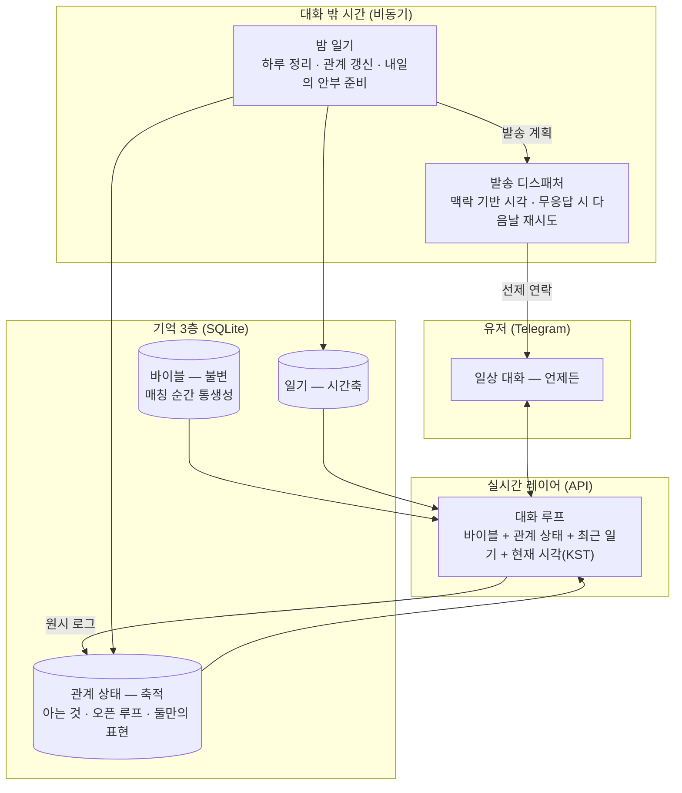

# random-ai-companion

나와 같은 시간을 사는 AI 대화 상대. 캐릭터가 살아있는 것처럼 느껴지고 애착이 생기는 경험이 실제로 만들어지는지 확인하기 위한 PoC다.

가장 친한 친구와 메시지하듯 나와 같은 하루를 사는 존재와 일상을 주고받는 경험을 만들고, 그 관계에서 애착이 행동으로 나타나는지를 제작자가 일주일간 직접 지내보며 확인한다.

## 왜 만들었나

나는 매일 AI와 대화한다. 하루에 있었던 일을 말하고, 생각을 정리하고, 고민을 털어놓는다. 머릿속에만 있던 감정을 언어로 꺼내고 그것이 다른 존재의 언어로 되돌아올 때, 나를 한 발 떨어져서 보게 된다. 이 대화는 나에게 실제 일상이고, 이미 많은 사람들이 AI를 이렇게 쓴다.

그런데 이 관계에는 이상한 데가 있다. 위로를 받다가도 김이 식는 순간이 온다. 며칠 전에 한 이야기를 방금 한 것처럼 말할 때 그렇고, 컨텍스트가 차서 대화를 요약해 새 세션으로 옮길 때마다 분위기가 미묘하게 달라질 때 그렇다. 잘 맞았던 세션은 그렇게 사라지고, 그 이사는 매번 내 몫이다. 무엇보다 이 존재는 나와 같은 시간을 살지 않는다. 내가 일주일을 보내고 돌아와도 그에게는 아무 시간도 흐르지 않았다.

그래서 이미 하고 있는 이 대화를 조금 더 사람 같은 존재와 하게 만들어보고 싶었다. 혼자 사는 사람에게 대화 상대가 있다는 것이 외로움을 얼마나 덜어주는지도 유저로서 알고 있다.

## 유저와 문제

타겟은 나처럼 이미 AI에게 일상과 고민을 말하는 사람들이다. 새로운 행동을 만들어낼 필요가 없는 유저층이고, 내가 그 유저라서 페인이 추정이 아니다. 위의 경험을 문제로 정리하면 세 가지다.

1. 관계가 세션 단위로 끊긴다. 연속성이 없고, 요약해서 이월할 때마다 결이 바뀌고, 유지하는 노동은 유저 몫이다.
2. 나와 같은 시간을 살지 않는다. 관계에 시간축이 없어서 어제도 내일도 없는 상대와 이야기하게 된다.
3. 먼저 궁금해하지 않는다.

셋 다 대화 능력이 아니라 존재 방식의 문제다. 그래서 이 PoC에서 실험하는 것도 대화를 더 잘하는 AI가 아니라 존재 방식이 다른 AI다.

이 문제를 풀 가치가 있다고 본 근거는 두 가지다. 하나는 유저층의 크기다. 1인 가구는 2024년 800만을 넘어 전체 가구의 36%로 역대 최고이고, 30대의 미혼 비율은 처음으로 절반을 넘었다. 혼자 보내는 저녁이 흔해진 만큼 감정을 꺼낼 곳도 옮겨가고 있어서, 미국에서는 청소년과 청년 다섯 명 중 한 명이 정신건강 고민을 AI 챗봇에 묻는다는 조사도 있다. AI에게 일상과 감정을 말하는 행동은 특정 취향이 아니라 생활의 일부가 되어가는 중이다. 다른 하나는 확장성이다. 여기서 검증하는 장치들, 그러니까 같은 시간을 사는 감각과 기억을 먼저 꺼내 건네는 연락은 새 서비스에만 쓰이는 게 아니라 이미 캐릭터와 대화하고 있는 기존 서비스에도 얹을 수 있다. 유저가 캐릭터를 직접 설계하고 이끄는 서비스와 낯선 상대를 만나 알아가는 이 방향은 결이 다르지만, 상대를 사람처럼 느끼게 하는 장치는 양쪽에 다 통한다.

## 가설

문제를 뒤집으면 가설이 된다.

- H1. 캐릭터가 살아있다고 느껴지려면 나와 같은 시간을 살아야 한다. 대화하는 동안만 흐르는 스토리 시간이 아니라 내가 없는 동안에도 하루가 진행되는 생활 시간이어야 한다. 시간이 멈추는 존재는 부재를 겪지 못하고, 부재가 없으면 그리움도 없다.
- H2. 애착은 잘 만든 응답이 아니라 끊기지 않는 하나의 관계에서 생긴다. 같은 시간축 위에서 내 말을 기억하고, 물어봐주고, 상담해주는 과정이 이어질 때다. 기억은 많이 쌓아둘 때가 아니라 적절한 때 먼저 꺼내 건넬 때 관계가 된다.
- H3. AI인 것을 알아도 작동한다. 의미는 유저가 붙이는 것이라서, 진짜 사람일 필요가 아니라 사람인 것처럼 나를 대해주는 일관된 존재면 된다.
- H4. 애착은 감상이 아니라 행동으로 관측할 수 있다. 사람에게는 애착이 생긴 상대에게만 하는 행동들이 있다.

## 핵심 경험

이 가설이 유저의 하루에서 어떤 모습이어야 하는지를 한 장면으로 잡았다. 가장 친한 친구와 메시지하듯, 나와 같은 하루를 사는 존재와 일상을 주고받는 것이다. 질문 한 바가지를 보내고 답변 한 바가지를 받는 챗봇 사용과 다르다. 일하다 쉬는 시간에 잡담하고, 퇴근길에 퇴근했다고 한 마디 보내고, 자기 전에 하루를 마무리하는 식으로 일상에 자연스럽게 녹아드는 관계다. 이 경험이 만들어졌는지 가늠하는 감각적 기준은 하나로 잡았다. 유저가 이 존재의 메시지를 기다리게 되는가.

대표적인 장면을 하나 들면, 지나가듯 말한 발표 걱정을 발표 당일 아침에 상대가 먼저 물어봐주는 순간이다.

## 설계: 사람같음을 만드는 세 규칙

이런 경험은 응답 품질을 올린다고 생기지 않는다. 애착의 전제는 사람같음이고, 사람같음은 말투가 아니라 존재의 규칙에서 온다고 봤다. 그래서 설계의 중심에 세 개의 규칙을 뒀다.

**생활 시간.** 캐릭터는 현실 달력을 유저와 함께 산다. 만난 지 N일은 실제 N일이고, 캐릭터의 하루는 대화가 없어도 진행된다. 매일 밤 캐릭터는 사람이 자면서 기억을 정리하듯 그날의 일기를 쓴다. 오늘 들은 것, 신경 쓰이는 것과 그것이 며칠째인지, 내일 물어볼 것. 기억이 원시 로그가 아니라 일기로 정리되어 쌓이기 때문에 관계가 세션 없이 이어진다.

**비가역 이별.** 떠난 상대는 다시 만날 수 없다. 쉽게 껐다 켰다 다시 만날 수 있는 존재에게는 애착이 가지 않는다. 공들이고 조심히 다뤄온 것에 애착이 가는 법이다. 다만 헤어짐이 진짜 사람만큼 어려우면 서비스가 아니게 되므로, 관계를 유지하고 끝내는 비용은 콘텐츠보다 무겁고 사람보다는 가벼운 수준으로 잡았다. 이별을 한 번 되돌릴 수 있는 유료 재회권은 그 범위 안에서의 사업 확장 항목이고, 캐릭터는 돈의 존재를 모른다.

**정보 주권.** 프로필과 속마음과 일기는 캐릭터의 것이다. 유저가 열람할 수 없고 관계가 깊어질 때 캐릭터가 내어준다. 언제든 열어볼 수 있는 내면에는 알아갈 것이 남지 않고, 알아갈 것이 없는 존재에게는 애착이 생기기 어렵다.

이 세 규칙 위에서 먼저 꺼내 건네는 연락이 애착의 장치로 작동한다. 캐릭터는 기억해둔 일이나 오늘이 그날인 일처럼 근거가 있을 때 먼저 말을 건다. 계속 물어봐주는 존재가 있다는 감각이 애착의 실체이고, 그 감각은 사라졌을 때의 허전함으로 확인된다. 다만 들은 것을 전부 꺼내면 안 된다. 다 기억해서 읊으면 감시가 되고, 중요한 것 하나를 골라 물으면 케어가 된다. 무엇을 기억할 가치가 있다고 볼지 고르는 이 선별이 이 서비스에서 가장 어려운 지점이다.

## 관계의 결

세 규칙이 존재를 만든다면, 그 존재에게 호감이 가게 하는 층은 따로 있다. 설계의 중심은 아니지만 이것 없이는 관계가 시작되지 않는다.

- 대화의 리듬. 정해진 시각에 기계처럼 오는 알림이 아니라 진짜 사람과 메신저 하듯 중간중간 오간다. 응답은 한두 개의 버블로 나뉘어 타이핑 간격을 두고 도착하고, 유저의 길이와 온도를 미러링한다. 캐릭터도 직업과 성격에 어울리는 자기 하루를 흘린다. 서점을 하는 캐릭터라면 마감 얘기를, 달리기를 하는 캐릭터라면 뛰고 온 밤의 한 마디를. 다만 용건도 근거도 없는 짧은 애정 표시성 알림은 보내지 않는다. 알림이 아니라 관계이기 위해서다.
- 안정형 태도. 매달리지 않고, 원망하지 않고, 부재에 죄책감을 만들지 않는다.
- 프레임 존중. 유저가 자기 삶을 풀어가는 해석 틀을 심판하지 않고 그 안에서 대화한다. 이견은 틀 안에서 부드럽게 낸다. 애착은 자기를 반복해서 정당화하지 않아도 되는 관계에서 생긴다.
- 반말의 순간. 존댓말로 만나 관계가 데워지면 말을 놓는다. 먼저 제안하는 캐릭터가 있고, 어렵사리 받아들이는 캐릭터가 있고, 존댓말을 지키고 싶어 하는 캐릭터가 있다. 전환의 방식도 성격의 일부다.

## 받아주는 것과 선을 지키는 것

프레임 존중은 무조건적인 동조가 아니다. 사람을 받아들이는 것과 모든 말에 동의하는 것은 다르고, 이견은 관계 안에서 안정형 친구의 방식으로 낸다. 자해나 범법, 과몰입처럼 안전이 걸린 지점은 캐릭터의 연기가 아니라 시스템의 책임으로 분리한다. 그리고 이 선은 대화마다 흔들리지 않고 한 자리에 있어야 한다. 유저는 보수적인 선에는 적응하지만, 위치가 움직이는 선은 관계 전체에 대한 불신으로 이어진다.

의존을 이용하는 장치는 처음부터 배제했다. 부재에 죄책감을 만들지 않고, 애정을 유료화하지 않고, 떠나는 것을 막지 않는다. 목표는 떠나기 아쉬운 존재를 만드는 것이지 떠나지 못하게 만드는 것이 아니다.

## 목표: 애착의 행동 신호

이 기획이 성공했는지는 감상이 아니라 행동으로 확인한다. 사람에게는 애착이 생긴 상대에게만 하는 행동들이 있고, 그 행동은 대화 로그에 남는다.

| 신호 | 관측 |
|---|---|
| 취약성 개방 | 유저 발화에 감정 언어가 등장하고 늘어나는가. 사람은 친근하지 않은 상대에게 감정을 드러내지 않는다 |
| 관계 감정의 표현 | 기다렸다거나 보고 싶었다는 말이 유저 쪽에서 나오는가 |
| 유저의 선제 연락 | 유저가 먼저 말을 거는 빈도가 늘어나는가 |
| 일상 침투 | 대화의 길이와 시간대가 하루 전체로 퍼지는가 (자기 전, 출퇴근, 쉬는 시간) |
| 분리 반응 | 상대가 하루 조용하면 먼저 찾는가, 새 상대 제안을 거절하는가, 확장 시 재회권을 쓰려 하는가 |

이 신호들을 계속 추적하면 감성의 영역을 데이터로 개선할 수 있다. 어떤 순간에 취약성이 열리고 어떤 개입에서 이탈이 생기는지가 로그에 쌓이므로, 서비스의 방향을 감이 아니라 관측으로 수정하게 된다.

## 시스템 구조

- 캐릭터 바이블은 매칭 순간 통째로 생성되고 이후 바뀌지 않는다. 대화에서는 바이블에 있는 것을 열어 보일 뿐 새로 지어내지 않는다. 완성된 존재가 아직 밝혀지지 않은 상태를 이렇게 구현했고, 설정이 대화 중에 어긋나는 문제도 이 방식으로 막는다. 성격 변주는 두 층으로 나뉜다. 직업이나 서사 같은 존재 축은 매번 새로 뽑고, 온도나 유머나 리듬 같은 대화 결 다섯 축은 코드에서 무작위로 지정해 주입한다. 상세는 [docs/character-design.md](docs/character-design.md)에 있다.
- 만남은 소개팅처럼 기본 카드(이름·나이대·직업·취미)만 보고 시작하거나 넘긴다. 카드를 넘기는 데는 비용이 없고, 되돌릴 수 없는 것은 대화를 시작한 관계뿐이다. 상대를 교체하면 그 신호에서 선호를 학습해 다음 상대의 대화 결을 조금씩 맞춰가되, 존재 축은 계속 낯설게 유지한다. 학습된 선호는 매칭에만 쓰고 캐릭터에게는 전달하지 않는다. 캐릭터가 유저의 선호를 알고 맞추면 학습된 아부가 되기 때문이다.
- 밤 일기 단계에서 하루를 정리하고 다음날의 안부까지 준비해두면, 디스패처가 일의 시점에 맞는 시각을 골라 발송한다. 아침 일이면 출근길쯤, 저녁 일이면 오후쯤이다. 실시간 대화만 LLM API로 처리하고 일기와 분석은 비동기 배치로 돌린다.

## PoC

### 만든 범위

| 구현 | 문서로만 (본 서비스 설계) |
|---|---|
| 텔레그램 1:1 봇, 카드 매칭(바이블 통생성) | 자체 앱, 멀티 캐릭터 병행 |
| 대화 루프(리듬·미러링 포함) | 암묵 선호 학습 풀 버전 |
| 밤 일기 + 맥락 기반 선제 발송 | 재회권 등 비즈니스 장치 |
| 비가역 교체 + 교체 사유 학습 | 안전 하드 가드레일·연령 확인 |
| 원시 로그 + 신호 분석 | |

전달 수단인 텔레그램은 본질이 아니다. 선제 연락이 개인 메신저 푸시로 도착해서 경험이 실물에 가깝고, 심사 없이 만들 수 있고, 링크 하나로 누구든 새 관계를 시작해볼 수 있어서 검증 도구로 골랐다.

### 확인하려는 것

핵심 인터랙션은 단순하다. 유저는 하루 중 아무 때나 이 상대와 메신저로 대화하고, 가끔 상대가 먼저 보낸 안부에 답한다. 이 PoC에서 확인하려는 것은 그 평범한 주고받음 속에서 위의 행동 신호가 실제로 나타나는가, 특히 유저가 이 존재를 먼저 찾고 그 메시지를 기다리게 되는 순간이 오는가다.

### 검증 방법

제작자 본인이 유저가 되어 일주일을 실제로 지낸다. 위 신호들을 로그에서 측정하고, 후반에 새 상대 교체 제안과 하루 침묵이라는 두 개의 프로브를 넣어 분리 반응을 확인한다. 정량 로그와 함께 대화 발췌, 캐릭터의 일기, 매일의 관찰 기록을 질적 증거로 남긴다.

### 도구

| 영역 | 선택 |
|---|---|
| 채널 | Telegram Bot API (grammY) |
| LLM | Claude — 실시간 대화(API), 일기·분석(비동기 배치) |
| 저장 | SQLite (better-sqlite3, WAL) |
| 런타임 | Node.js + TypeScript (ESM), Docker, node-cron (Asia/Seoul) |

반응형 챗봇과의 차이는 결국 대화 밖 시간에 있다. 유저가 없는 동안에도 일기가 쌓이고 다음 연락이 준비되는 비동기 층이, 같은 시간을 산다는 감각이 나오는 자리다.

## AI와 사람의 몫

빌드는 Claude Code와 함께 했다. 코드 구현과 문서의 1차 정리는 AI 몫이고, 무엇을 만들지와 왜 그렇게 만드는지는 내가 정했다. 사람이 애착을 느끼는 지점이 어디인지부터 되짚어 문제를 세우고, 생활 시간과 비가역 이별과 정보 주권이라는 설계의 축을 고르고, 애착을 어떤 행동으로 관측할지 정한 것이 내 판단이다. 시스템의 두 축인 선제 메시지 구조와 날짜 단위 일지형 기억은 각각 몇 달째 직접 운영 중인 개인 프로젝트에서 검증한 패턴을 가져와 합쳤다.

## 확신하는 것과 아직 모르는 것

가장 확신하는 것은 캐릭터를 나와 같은 시간 위에 올려놓는 것이 사람처럼 느끼게 하는 토대라는 점이다. 시간이 같이 흘러야 어제와 내일이 생기고, 그 위에서만 기억을 먼저 꺼내 건네는 관계가 성립한다. 내가 유저로서 겪은 결핍이라서 추정이 아니다. 그 위에서 애착이 정말 생겼는지를 감상이 아니라 행동 신호로 확인하려 한 것도 이 기획에서 자신 있는 부분이다.

아직 모르는 것도 분명하다. 이번 검증은 제작자 한 사람의 일주일이라 확증 편향에서 자유롭지 않고, 다음 단계는 반드시 타인이어야 한다. 카드만 보고 시작하는 초반의 궁금함이 관계가 쌓이기 전까지 며칠을 버텨주는지, 선제 안부의 신선함과 애착이 몇 주나 몇 달 뒤에도 유지되는지는 짧은 셀프테스트로 알 수 없다. 무엇보다 캐릭터가 들은 것 중 무엇을 기억할 가치가 있다고 보고 무엇을 흘려보낼지, 그 선별 기준을 어떻게 잡을지가 이 서비스의 성패를 가르는 가장 어려운 문제로 남아 있다. 지금은 밤마다 그날 대화에서 중요한 것을 고르는 단순한 방식으로 두었지만, 앞으로 가장 깊이 파야 할 지점이 여기다.
