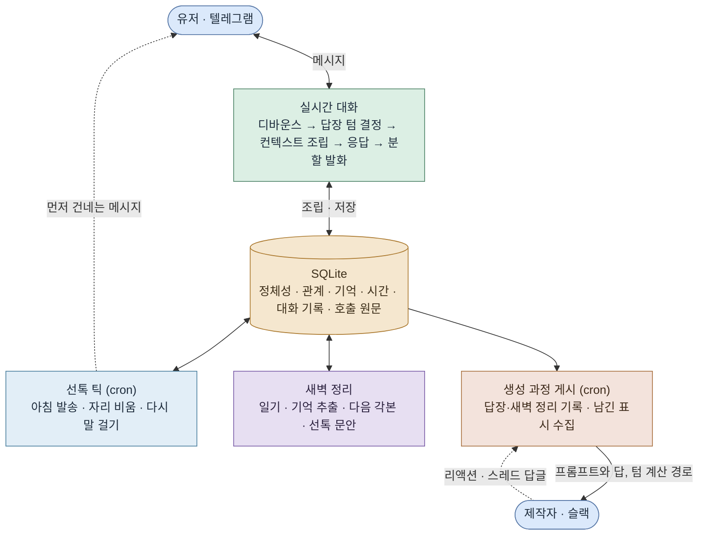

<h1 align="center">내가 직접 만드는, 나와 같은 일상을 사는 AI 대화 상대</h1>

<p align="center">
  
  <br><sub>캐릭터가 먼저 자기 일상을 나누며 건네는 안부 · 설명용으로 실제 속도의 1.5배</sub>
</p>

유저가 원하는 캐릭터를 직접 만들어 대화한다. 소개팅에서 만난 사이, 오래된 친구나 연인처럼 어떤 관계로 시작할지부터 성격과 분위기, 나이와 성별까지 유저가 자유롭게 정할 수 있다. 만들어진 캐릭터는 유저가 정한 대로 자기 직업과 사는 곳, 하루 일과를 갖고 현실 세계에서 자기 일상을 살기 시작한다.

기존 AI 캐릭터 채팅은 가상의 세계관 안에서 진행되지만, 여기서는 유저가 살고 있는 현실이 그대로 배경이 된다. 가상과 현실이 맞닿는 자리에 캐릭터를 두어, 실제로 세상 어딘가에 살고 있을 것 같다고 느끼게 하는 것이 목표다.

캐릭터는 유저와 같은 시간을 살면서 실제 사람처럼 자기 하루를 보낸다. 회의나 운동처럼 핸드폰을 볼 수 없는 시간에는 답이 느리거나 아예 오지 않고 일정이 끝난 뒤에 밀린 답장을 읽고 답하며, 반대로 유저가 답이 없으면 먼저 연락해 요즘 어떻게 지내는지 묻기도 한다.

주고받은 일상 대화는 캐릭터가 계속 기억으로 쌓아 가기 때문에, 오래 이야기할수록 서로에 대해 아는 것이 늘고 대화도 풍부해진다.

서비스의 주요 타겟은 혼자 사는 2030 직장인으로, 일상에 지쳐 인간관계를 이어 갈 힘은 없지만 사람과의 소통은 여전히 그리워하는 사람들로 잡았다. 서비스를 이용하려고 시간을 따로 만들 필요 없이 일상 속에서 틈틈이 주고받는 방식이라, 유저의 삶에 자연스럽게 녹아들어 부담 없이 상호작용하며 애착을 쌓아 가게 된다.

<details>
<summary>유저층 규모</summary>

<br>

- 1인 가구는 804만 가구로 전체의 36.1%, 역대 최고이고, 그중 48.9%가 외로움을 느낀다고 답했다. ([통계청 2025](https://www.korea.kr/briefing/pressReleaseView.do?newsId=156734077))
- 30–34세의 66.8%, 25–29세의 92.2%가 미혼이다. ([통계청 2025](https://www.newsis.com/view/NISX20251216_0003442538))
- 20–49세 미혼의 71.7%가 지금 연애를 하지 않는다. ([동아일보](https://www.donga.com/news/Society/article/all/20250213/131024531/2))
- AI에게 마음을 꺼내는 행동은 이미 흔하다. 국민의 44.5%가 생성형 AI를 써봤고, 사람보다 AI와 대화하는 게 편할 때가 있다는 응답도 31.1%다. ([과기정통부 2025](https://www.korea.kr/briefing/pressReleaseView.do?newsId=156751949), [엠브레인 트렌드모니터](https://www.thescoop.co.kr/news/articleView.html?idxno=310637))

</details>

기획·설계·구현·배포·운영을 혼자 했고 첫 구축에 5일이 걸렸다. 배포한 뒤로는 직접 유저가 되어 매일 쓰면서 어색한 지점을 찾아 설계로 고치고 있고, 리드미에는 그동안 내린 설계 판단을 순서대로 정리했다.

<br>

## 목차

1. [캐릭터 생성](#1-캐릭터-생성)
2. [캐릭터의 연락 방식](#2-캐릭터의-연락-방식)
3. [기억 저장 구조](#3-기억-저장-구조)
4. [프롬프트 조합과 관리](#4-프롬프트-조합과-관리)
5. [새벽 정리](#5-새벽-정리)
6. [유저의 한마디부터 답장까지](#6-유저의-한마디부터-답장까지)
7. [답변 품질 관측과 개선](#7-답변-품질-관측과-개선)
8. [시스템 구조와 기술 선택](#8-시스템-구조와-기술-선택)
9. [지금 상태와 남은 것](#9-지금-상태와-남은-것)

<br>

## 1. 캐릭터 생성

<!-- 이미지: 만들어진 캐릭터의 정체성·주변 인물·진행 중인 일이 채워진 화면. -->

유저는 만나고 싶은 캐릭터를 직접 묘사해서 넣는다. 이름과 성별, 나이대처럼 짧게 정해지는 것부터 어떤 성격과 분위기였으면 하는지, 유저와 어떤 사이로 시작할지, 캐릭터에게 바라는 모습까지 적는다. 유저가 적은 내용을 바탕으로 모델이 캐릭터의 정체성부터 매일을 살아가는 데 필요한 데이터까지 알아서 채운다.

### 캐릭터

| 만드는 것 | 채워지는 값 |
|---|---|
| 정체성 | 이름과 생년월일, 고향, 직업과 다니는 회사, 사는 곳, 말투, 생활 습관 등 27개 항목 |
| 주변 인물 | 가족과 직장 동료, 오래된 친구 등 캐릭터의 주변 사람들과 각각 어떤 사이인지 |
| 진행 중인 일 | 요즘 집중하는 일, 지금 무엇을 하고 있는지, 언제 마무리되는지 |
| 유저와의 관계 | 유저와 어떤 사이인지, 서로 부르는 호칭, 유저와 쌓았던 추억 |

### 캐릭터의 삶

캐릭터의 요소들과 유저와의 관계가 채워지면, 그다음은 캐릭터가 현실에서 살아갈 삶을 만들어둔다.

| 만드는 것 | 담기는 내용 |
|---|---|
| 삶의 흐름 | 올해 무엇에 집중하고 있는지, 이번 계절과 이번 달은 어떤 시기인지, 이번 주는 어떤 주인지. 날짜별 일정이 아니라 그 기간의 성격이라, 캐릭터가 요즘 어떤 시기를 지나고 있는지가 여기서 나온다 |
| 한 달치 이벤트 | 삶의 흐름을 보고 그달의 주요 일정을 실제 날짜 위에 만든다. 친구와의 약속, 회사 승진 심사일처럼 굵직한 일 몇 가지와 함께 날마다의 기력과 기분, 아침에 일어나는 시각을 앞뒤 이벤트와 이어지게 정해서, 회식이 있던 다음 날은 기력이 떨어지고 늦게 일어난다 |
| 하루 각본 | 그날의 이벤트와 기력을 보고 하루의 세세한 일상을 만든다. 몇 시에 일어나 무엇을 하고 언제 어디에 있는지를 시간대별로 정하고, 캐릭터는 자기 하루가 미리 정해져 있다는 것을 모른 채 그 하루를 자신의 삶으로 알고 살아간다 |

<p align="center">
  
  <br><sub>월 리듬 · 한 달치 주요 일정과 날마다의 기력·기분을 미리 생성 · 내부 상태 확인용 개발 뷰</sub>
</p>

여기까지 끝나면 유저가 만든 캐릭터가 현실의 시간 위에서 자기 삶을 살기 시작하고, 캐릭터가 건네는 첫 인사로 대화가 열린다.

<br>

## 2. 캐릭터의 연락 방식

캐릭터는 자신의 일상을 가지기 때문에 유저의 연락에 언제나 바로 답하지 않는다. 캐릭터에게 주어진 하루 각본에서 지금 시간이 어떤 성격의 일정인지에 따라 답장 텀이 정해진다. 하루 각본은 날마다 새로 만들어져 일정이 조금씩 달라지므로 답장 텀도 계속 바뀌고, 정해진 간격으로 답이 돌아오지 않아 실제 사람과 연락하는 것처럼 느껴지도록 했다.

<p align="center">
  
  <br><sub>하루 각본 · 시간대마다 무엇을 하는지와 함께 붙는 두 태그, 그 조합에서 나온 답장 텀</sub>
</p>

### 답장 텀

<p align="center">
  
  <br><sub>세로는 답장 여건, 가로는 활동 성격 · 두 태그가 만나는 칸의 답장 텀 구간</sub>
</p>

하루 각본을 만들 때 모델이 일정마다 성격에 맞는 태그를 두 개씩 붙인다. 지금 메신저를 볼 수 있는지를 나누는 답장 여건(즉답 / 틈틈이 / 불가)과, 유저가 붙잡을 때 미루거나 취소할 수 있는 일인지를 나누는 활동 성격(개인 / 사회 / 공적)이다. 답장 텀은 두 태그의 조합이 가리키는 칸에서 코드가 무작위로 고르므로, 새로운 일정이 생겨도 태그 두 개만 붙으면 텀이 나온다.

답장이 불가한 일정에서는 캐릭터도 실제로 답하지 못하고, 그 일정이 끝난 뒤에 그동안 온 메시지를 한 번에 읽고 답한다. 다만 유저가 남아 있기를 원하면 회의나 시험 같은 공적인 일정이 아닌 한 그 일정을 미루거나 취소하고 남는 쪽을 고르도록 구현해뒀다.

<p align="center">
  
  <br><sub>실제 대화 캡처 · 뭐 하는 중이냐는 물음에 그 시간 각본에 있는 일정 그대로 답하는 모습</sub>
</p>

### 선톡

실제 사람처럼 상호작용하는 캐릭터가 되려면 유저가 연락할 때만 답하는 데서 그치지 않고 캐릭터가 먼저 연락하기도 해야 한다. 기계적으로 같은 시각에 말을 걸기보다 필요한 상황에 맞춰 먼저 말을 걸도록, 선톡을 아래 5가지로 나눠 구성해뒀다.

| 종류 | 보내는 때 |
|---|---|
| 아침 안부 | 그날 각본의 기상·출근 시각에 맞춰 아침에 먼저 연락한다. 유저가 아침에 먼저 연락했으면 보내지 않는다 |
| 자리 비움 예고·복귀 | 캐릭터가 20분 이상 자리를 비워야 하면 유저에게 미리 알린다. 일정이 시작하기 전과 끝난 뒤에 한 번씩 연락한다 |
| 대화가 끊겼을 때 다시 말 걸기 | 유저가 4시간 넘게 답이 없을 때, 캐릭터 쪽에서 자신의 근황을 전하거나 유저의 안부를 묻는다 |
| 밤 인사 | 자정을 넘겨 대화하다 유저가 잔다는 말 없이 1시간 조용하면 다정하게 인사를 남긴다 |
| 오랜만의 안부 | 유저가 2주째 연락이 없을 때 저녁에 한 번, 가볍게 근황을 묻는다 |

<p align="center">
  
  <br><sub>실제 대화 캡처 · 자리를 비우기 전에 알리고 일정이 끝나면 돌아왔다고 먼저 건네는 모습</sub>
</p>

<br>

## 3. 기억 저장 구조

캐릭터가 유저와 서로의 일상을 자연스럽게 주고받으려면, 유저에 대해 알게 된 것을 계속 기억하고 자기가 한 말도 앞뒤가 맞게 이어 가야 한다. 그래서 대화를 통해 알게 된 것들을 주제별로 나눠 기억하는 구조부터 설계했다.

매일 대화를 주고받는 서비스라 원문을 통째로 쌓거나 대화를 요약한 기억을 계속 더해 가면, 오래 대화할수록 데이터가 과도하게 쌓인다. 그렇다고 오래된 것부터 지우는 식으로 시간순으로 관리하면, 유저와의 관계에서 중요한 기억까지 함께 지워져 애착을 쌓기 어렵다. 일상에서 매일 대화하며 애착을 쌓아 가는 것이 목표라 시간이 지나도 유저와 관련된 핵심적인 기억은 남아 있어야 했고, 그래서 주제를 기준으로 기억을 관리하는 방식을 택했다.

대화를 통해 알게 된 것들을 주제별로 키를 붙여 저장하고, 이후에 같은 주제의 내용이 나오면 그 키를 찾아 업데이트한다. 저장할 때 내용과 관련된 단어를 태그로 함께 붙여, 태그를 기준으로 기억을 검색할 수 있게 구성했다.

기억은 잘 바뀌지 않는 사실, 진행 중인 일, 주변 인물 3가지로 나누고 각각을 캐릭터 쪽인지 유저 쪽인지로 한 번 더 갈라, 총 6가지로 나눠 저장한다. 아래는 실제로 저장된 기억 3건이다.

| 저장 항목 | 주인 | 키 | 내용 | 태그 |
|---|---|---|---|---|
| 진행 중인 일 | 캐릭터 | 일/과장 승진 심사 | 하반기 승진 심사 서류를 준비해 8/29 오후에 온라인으로 최종 제출한다 | 과장 승진 심사 · 부점장님 · 승진 · 은행 · 일 |
| 사실 | 유저 | 영화/영화제 | 영화제 다니는 게 취미. 부산·전주·정동진에 가봤고 무주산골·부천판타스틱은 가보고 싶어한다 | 영화 · 영화제 |
| 주변 인물 | 캐릭터 | 친구/박민석 | 가끔 전화로 근황을 나누는 친구. 성격이 정반대라 오히려 편한 사이 | 박민석 · 친구 |

### 키

키는 의미 범위가 넓은 단어를 앞에, 좁은 단어를 뒤에 놓고 슬래시로 이어 두 단어로 짓는다. 영화/오디세이, 가족/부모님, 일/과장 승진 심사처럼 쓴다. 한 단어는 범위가 넓어 다른 기억과 겹치고 세 단어부터는 순서가 애매해져 같은 사실에 다른 키가 생기기 때문에, 두 단어로 고정했다. 주변 인물은 가족·직장·친구 같은 갈래를 앞에 두고 이름을 뒤에 붙인다.

키는 내용이 바뀌어도 그대로인 말로만 짓고, 바뀌는 사실은 그 키가 가리키는 내용 쪽에 넣는다. 같은 사실을 여러 키로 나눠 저장하는 것을 막기 위해, 키를 붙이는 모델에게 지금 쓰고 있는 키 목록을 함께 넘겨 같은 기억이면 있는 키를 그대로 쓰게 했다.

캐릭터를 만들 때 생성한 데이터도 전부 이 기억 구조에 저장한다. 그중 생성 시점에 만든 기억은 캐릭터의 주요한 정체성이기 때문에, 대화를 통해 그 정체성이 바뀌지 않도록 구성했다.

### 태그

답장을 만들 때는 유저가 보낸 메시지에서 관련 주제를 뽑고, 그 주제로 태그를 검색해 걸린 기억을 꺼내 답장에 참고한다.

키는 기억 한 건에 하나씩 붙지만 태그는 여러 개가 붙는다. 메시지에서 뽑은 주제가 태그에 걸려야 그 기억이 검색되기 때문에, 기억을 저장할 때 내용과 관련된 단어를 넉넉히 붙여 더 잘 걸리게 했다.

태그는 기억뿐 아니라 캐릭터의 일정과 매일 남기는 일기에도 붙인다. 같은 단어를 태그로 쓰기 때문에, 예를 들어 박민석이라는 주제 태그 하나로 그 사람에 대한 기억과 그 사람과 잡힌 일정, 그 사람이 나온 일기가 함께 검색된다.

### 기억 저장 시점

매 대화마다 기억을 정리하면 답장을 만드는 데 부담이 되기 때문에, 하루 대화를 새벽에 몰아서 한 번에 읽고 기억을 저장·업데이트한다. 이때는 실시간 대화보다 성능이 높은 opus 모델을 쓴다.

<br>

## 4. 프롬프트 조합과 관리

답장 하나를 만들 때 프롬프트에 넣는 데이터는 캐릭터 정체성부터 유저와의 관계, 기억, 오늘 각본, 지금 시각까지 계속 늘어난다. 무엇을 어디에 넣을지는 자주 바뀌지 않는 데이터를 위에, 자주 바뀌는 데이터를 아래에 넣는 순서 하나로 정했다.

| 순서 | 들어가는 데이터 | 바뀌는 주기 |
|---|---|---|
| 1 · 잘 바뀌지 않는 데이터 | 캐릭터 정체성, 유저 프로필, 태도와 말투 규칙 | 캐릭터가 사는 한 그대로 |
| 2 · 하루 동안 같은 데이터 | 유저와의 관계, 주변 인물, 진행 중인 일, 삶의 흐름, 가까운 예정된 일, 최근 3일치 일기 | 새벽에 한 번 |
| 3 · 대화 주제에 맞춰 가져오는 데이터 | 주제 태그가 맞는 기억과 지난 일기, 지난 일정 | 대화 주제마다 |
| 4 · 답장할 때마다 달라지는 데이터 | 오늘 각본, 오늘 메모, 최근 대화 40개, 지금 시각, 직전 대화 뒤로 지난 시간, 지금 쓰는 말투 | 답장 한 번마다 |

### 재사용 표시 두 곳

1번 끝과 2번 끝에 여기까지 재사용하라는 표시를 붙인다. 프롬프트 앞부분이 직전 요청과 글자까지 같으면 그 부분은 다시 계산하지 않고 요금도 십분의 일이라, 답장마다 달라지는 데이터는 전부 표시 뒤로 뺐다. 답장 한 번에 들어가는 입력이 약 1만 8천 토큰인데 그중 1만 5천 토큰이 두 표시 안쪽이라, 하루 동안 오가는 답장이 앞부분을 그대로 다시 쓴다.

4번을 맨 끝에 두면 답의 정확도에도 도움이 된다. 모델은 프롬프트 맨 끝에 있는 내용을 가장 강하게 반영하기 때문에, 지금 시각과 방금 온 말이 여기 있어야 답이 지금 상황에 맞는다.

캐릭터가 내보내는 글은 답장 말고도 아침 안부와 자리 비움 예고 같은 선톡 문안까지 7가지 자리에서 나오는데, 여기도 1번과 2번은 같게 넣고 맨 끝에 상황 한 문단만 바꿔 붙인다. 그래서 태도와 대화 규칙, 표기, 말의 결처럼 모든 글에 공통으로 걸릴 규칙은 1번 한 곳에서만 관리한다. 자리마다 따로 적으면 한 곳을 고쳤을 때 나머지가 그대로 남는다.

### 프롬프트에 넣는 순서와 개수

3번은 주제 태그가 맞는다고 다 넣지 않는다. 진행 중인 일, 주변 인물, 알게 된 사실 순으로 담고 같은 항목 안에서는 마지막으로 갱신된 것부터 넣되, 항목마다 몇 건까지 넣을지 상한을 둬서 한 항목이 자리를 다 차지하지 않게 했다. 한 주제에 몇 달치가 한꺼번에 걸릴 때가 있어서, 개수가 넘치면 지금 진행 중인 일이 먼저 들어가고 지나간 얘기는 자리가 남을 때 들어간다.

언제 일인지 붙지 않으면 가져온 내용이 전부 오늘 일처럼 읽혀서, 데이터마다 마지막으로 갱신된 날짜를 함께 넣는다.

### 코드가 계산해서 넣는 값

반말을 쓰는 사이인데도 존댓말로 돌아가는 일, 12시 반인데 곧 12시라고 말하는 식으로 분을 고려하지 않고 답하는 일이 프롬프트 문구를 강하게 써도 반복됐다. 그래서 말투와 시각은 규칙으로 지시하는 대신 코드가 계산해 값으로 넣는다. 말투는 최근 발화를 보고 반말인지 존댓말인지 판정해 넣고, 시각은 낮 12시 반쯤처럼 말로 풀어 숫자와 함께 준다. 지난 대화 40개에도 각 발화가 언제 한 말인지 코드가 세어 어제 22시나 사흘 전처럼 붙여, 며칠 전 대화를 방금 일처럼 받지 않게 했다.

### 본문과 신호를 나눠 받는 방법

답장 전체를 JSON 객체 하나로 받는다. 유저에게 그대로 나가는 문장은 reply 칸의 배열에만 담고, 오늘 안에 다시 꺼낼 말이나 관계 단계와 호칭이 바뀌었다는 신호는 그 옆 칸에 따로 담는다. 담기는 자리가 갈려 있어서 코드가 읽는 데 실패해도 신호가 유저에게 보이는 문장에 섞여 나가지 않고, 신호를 따로 물어보느라 호출이 한 번 더 들지도 않는다.

모델이 형식을 늘 지키지는 않아서 읽는 쪽은 4단계로 뒀다. 온전한 JSON을 먼저 읽고, 길이 제한에 잘린 답에서는 닫힌 조각만 건지고, 형식을 쓰지 않은 답은 줄바꿈으로 나누고, 그것도 안 되면 한 번 다시 만든다. 형식을 쓰려던 흔적이 있으면 못 읽어도 원문을 유저에게 내보내지 않는다. 시키는 형식과 읽는 코드는 한 파일에 두어, 둘이 어긋나 답장이 통째로 사라지는 일을 막았다.

<br>

## 5. 새벽 정리

캐릭터가 하루를 지내고 나면 남길 것을 정리하고 내일을 만드는 작업이 새벽에 한 번 돈다. 기억 정리, 하루 일기, 내일 각본, 아침에 보낼 선톡 문장이 여기서 나오고, 앞 단계의 결과를 다음 단계가 쓰기 때문에 순서대로 실행한다.

1. **하루치 데이터 수집.** 오늘 메모와 오늘 주고받은 대화 원문, 오늘 각본과 실제로 지낸 기록을 모은다. 여기에 다음 단계가 쓸 저장 항목 이름과 이미 있는 키, 주제 태그 목록을 함께 넘겨, 같은 내용에 매번 다른 이름이 붙어 여러 건으로 쌓이는 것을 막는다.
2. **기억으로 남길 내용 정리.** 오늘 나눈 이야기 가운데 남겨 둘 것을 골라 저장 항목별로 나눈다. 오늘 대화로 달라진 관계 항목과, 대화 중에 잡힌 약속을 일정으로 옮기는 것도 같은 응답에 함께 담게 해서 모델 호출이 늘지 않게 했다.
3. **하루 일기 작성.** 계획한 각본과 실제로 지낸 하루를 나란히 놓고, 캐릭터가 그 하루를 보낸 사람의 시점에서 무엇을 했고 유저와 나눈 이야기가 어땠는지 적는다. 한 일과 그때의 기분을 같이 적어 두기 때문에, 다음 날 그 하루를 자기 이야기로 이어서 말할 수 있다. 유저와 말을 나누지 않은 날에도 각본을 보고 혼자 보낸 하루로 짧게 쓴다.
4. **삶의 흐름 갱신과 다음 한 달 생성.** 월요일이면 이번 주 흐름을, 1일이면 이번 달과 계절 흐름을 이어 쓴다. 이번 달 남은 날이 6일 이하면 다음 달의 이벤트와 날마다의 기력·기분을 미리 만든다. 셋 다 아닌 날은 이 단계를 건너뛴다.
5. **내일 각본과 선톡 문장 작성.** 컨디션, 어제 일기, 예정된 일, 매주 반복하는 것, 진행 중인 일, 지금 흐름 여섯 가지를 읽고 내일 하루를 시간 블록으로 짠다. 보낼 시각이 정해져 있는 아침 선톡과 안부 선톡은 문장까지 여기서 써 두고, 그날 아침에 코드가 조건을 다시 확인한 뒤 보낸다.
6. **한 번에 저장하고 오늘 메모 비우기.** 앞 단계에서 만든 일기와 저장 항목별 업데이트, 내일 각본, 선톡 문장을 한 번에 저장한다. 일기는 저장됐는데 각본이 없는 상태를 막기 위해서고, 도중에 오류가 나면 그때까지 쓴 것을 되돌려 어제 상태 그대로 두고 그 날짜는 다음 실행에서 다시 처리한다. 낮에 적어 둔 오늘 메모는 각 저장 항목으로 옮기고 비운다.

### 각본과 실제로 지낸 하루

캐릭터의 하루가 각본대로만 흘러가지는 않는다. 유저가 붙잡아 일정을 미루거나 취소하면 그 시간에 실제로 무엇을 했는지를 계획과 따로 적어 두고, 프롬프트에는 지나간 시간을 실제 기록으로, 남은 시간을 계획으로 넣는다. 일기를 쓸 때도 계획과 실제를 나란히 놓기 때문에, 유저 때문에 달라진 하루가 그대로 캐릭터의 기억으로 남는다. 각본이 없는 채로 시작한 하루에 임시 각본을 만들어 쓰다가 새벽 정리가 만든 각본으로 넘어가도, 실제 기록은 따로 저장돼 있어 그대로 남는다.

### 하루의 경계는 새벽 5시

하루는 새벽 5시에 시작해 다음 날 새벽 5시에 끝난다. 잠드는 시각을 기준으로 끊어서, 새벽 3시에 나눈 이야기는 날짜가 바뀌었어도 어제 일기에 들어간다. 선톡에서 며칠째 답이 없는지 셀 때도 같은 기준을 쓴다. 사람이 하루를 느끼는 방식에 맞춘 것이라, 모든 데이터의 하루 기준을 새벽 5시로 맞췄다.

### 예외와 실패

- **일부만 만드는 날.** 유저가 3일째 답이 없으면 일기와 컨디션까지만 만들고 각본과 선톡 문장은 만들지 않는다. 14일째에는 안부 선톡 문장만 만든다.
- **정해진 시각에 실행하지 못한 날.** 서버가 꺼져 있었거나 모델 호출이 실패한 경우다. 다음 날 새벽에 실행하면서 대화가 있었던 빠진 날짜의 일기와 기억 정리를 먼저 채우고 그날 몫을 이어서 처리한다. 지난 날짜의 각본과 선톡 문장은 만들지 않는다.
- **각본 없이 시작한 하루.** 유저가 말을 걸면 그 시점에 컨디션을 읽어 임시 각본을 만들고, 새벽 정리가 만든 각본이 그 자리를 넘겨받는다.
- **같은 날짜를 두 번 처리할 때.** 빠진 날짜를 채우다 겹칠 수 있어서, 그날 일기가 이미 있으면 그 날짜는 건너뛴다.

<br>

## 6. 유저의 한마디부터 답장까지

앞의 장치들이 실제로 어떤 순서로 도는지를 메시지 한 통 기준으로 정리하면 이렇다.

1. **메시지 수신.** 기록에 저장하고, 그 유저의 학습된 대기 시간으로 디바운스 타이머를 건다.
2. **답장 텀 결정.** 타이머가 만료되면 지금 시각이 각본의 어느 블록인지 보고 두 태그로 텀을 정한다. 답장이 불가한 일정이면 여기서 만들지 않고, 그 구간이 끝날 때 깨어나도록 표시만 걸어둔다. 구간이 끝나면 그동안 쌓인 메시지를 한 번에 읽고 몰아서 답한다.
3. **주제 태그 고르기.** 저장된 태그 목록을 짧은 호출로 훑어 이번 발화와 관련된 것을 고르고, 목록에 없는 말이 섞여 나오면 버린다.
4. **컨텍스트 조립.** 앞의 네 자리를 순서대로 쌓는다. 아직 오지 않은 블록 중 캐릭터가 미리 알 수 없는 것은 가린다.
5. **대화 모델 호출.** 답장 본문과 신호를 함께 담은 JSON 객체로 받아, 코드가 신호를 읽어 반영하고 본문만 내보낸다.
6. **발송.** 정한 시각까지 기다렸다가 말풍선으로 쪼개 타이핑 시간을 두고 순차 전송한다. 전송에 성공한 뒤에야 어디까지 보냈는지 기록하고, 기다리는 사이 유저가 말을 더 보내면 만들어둔 답장을 버리고 2번부터 다시 한다.
7. **게시.** 발송이 끝나면 그 호출의 프롬프트와 모델이 쓴 답, 텀이 정해진 경로를 슬랙 채널에 올린다.

<br>

## 7. 답변 품질 관측과 개선

### 좋은 결과를 보는 기준

캐릭터가 사람처럼 느껴지는지는 직접 대화해 보면 판단할 수 있지만 유저에게 애착이 생겼는지는 그렇지 않아서, 체류시간 같은 사용량 대신 유저의 행동으로 판단한다. 사람에게는 애착이 생긴 상대에게만 하는 행동이 있고, 그 행동이 대화 기록에 남기 때문이다.

| 신호 | 보는 것 |
|---|---|
| 취약성 개방 | 감정 언어가 늘고 내면의 이야기가 나오는 정도 |
| 관계 감정 | 기다렸다, 보고 싶었다 같은 말이 유저 쪽에서 나오는 빈도 |
| 일상 침투 | 대화의 시간대와 길이가 하루 전체로 퍼지는 정도 |
| 먼저 다가옴 | 계기 없이 유저가 먼저 말 거는 빈도 |
| 거꾸로 챙기기 | 유저가 캐릭터의 하루를 먼저 챙기고 걱정하는 말 |
| 분리 반응 | 캐릭터가 조용해졌을 때 유저가 먼저 찾는 반응 |

이 지표를 염두에 두고 **주고받은 모든 메시지를 기록으로 남긴다.** 발송 종류도 함께 남겨 어느 선톡이 반응을 끌어냈는지 나중에 볼 수 있게 했고, 날짜별 집계는 `src/tools/analyze.ts`로 돌린다. 다만 유저가 제작자 한 명뿐이라 통계를 낼 표본이 없어서, 지표를 자동으로 판정하는 데까지는 가지 않고 나중에 분석할 데이터를 잃지 않는 쪽을 먼저 챙겼다. 대신 매일 나가는 답장이 어떻게 만들어졌는지는 한 건씩 눈으로 확인하고 있다.

### 답장이 만들어진 과정 게시

LLM이 쓴 답은 코드처럼 실행을 따라가며 원인을 찾을 수 없어서, 무엇을 넣었을 때 무엇이 나왔는지를 한자리에 붙여 남기지 않으면 고칠 방법이 없다. 답장이 어색했을 때 프롬프트가 문제였는지, 꺼내온 기억이 엉뚱했는지, 답장 텀 계산이 틀렸는지를 나중에 가려낼 수 있어야 했다.

- **답장 한 건마다 만들어진 과정을 슬랙 채널에 올린다.** 답장을 만드는 동안 파이프라인이 무엇을 했는지 기록해두면, 1분마다 도는 크론이 그 기록을 읽어 채널에 쌓는다. 본문에는 어떤 발화에 답한 것인지, 답장 텀이 어느 경로로 정해졌는지, 검색에 쓴 주제 태그와 그걸로 꺼내온 기억, 모델이 실제로 쓴 답이 들어간다. 스레드에는 그 호출에 들어간 프롬프트 중 매번 바뀌는 부분을 전문으로 붙이고, 발송에 성공했는지 중간에 폐기됐는지도 같은 스레드에 이어 붙인다. 하루 동안 바뀌지 않는 앞의 두 층은 그날 첫 호출에서 한 번만 올리고, 하루 중에 바뀌면 바뀐 대목 이름과 바뀐 줄만 올린다.
- **모델 호출은 원문 그대로 저장한다.** 보낸 프롬프트와 받은 답, 토큰 수와 캐시 적중을 호출 단위로 남기고 90일 뒤 지운다. 게시와 저장을 나눠 둬서 슬랙이 실패해도 원문은 DB에 남고, 오늘 몫을 지워 다시 올리는 도구로 복구한다. 새벽 정리도 같은 방식으로 남기는데, 이쪽은 반영하기 전의 값과 반영한 뒤의 값을 함께 올려 무엇이 어떻게 덮였는지 보이게 했다.

### 사람이 남긴 표시 수집

- **읽다가 이상한 답장을 찾으면 리액션 하나로 표시한다.** 리액션 4개로 분류를 고른다. ❌는 사실 오류, 💬는 말투, ⏰는 타이밍, 👍는 좋음이고 이유는 스레드 답글로 적는다. 10분마다 최근 3일치 글을 다시 읽어 지금 붙어 있는 표시를 모으고, 게시한 글과 모델 호출 번호가 이어져 있어서 어느 답장에 대한 표시인지까지 함께 저장된다. 리액션을 뗀 것은 지우지 않고 뗐다는 표시만 남겨 다시 붙이면 되살아나게 했다. 표시가 달린 호출은 90일 정리에서 빼둔다.
- **표시를 수집하는 쪽은 답장 경로에 손대지 않는다.** 답장 파이프라인에 갈고리를 걸면 표시를 모으다 생긴 오류가 대화를 멈춘다. 그래서 수집은 이미 올라간 게시물을 읽어 따로 돌게 하고, 실패해도 답장에는 영향이 없게 분리했다.
- **모은 표시를 캐릭터에게 돌려주지 않는다.** 표시는 프롬프트에도 기억에도 넣지 않고, 사람이 읽고 설계를 고칠 때만 쓴다. 평가가 그대로 캐릭터 행동으로 들어가면 유저를 만족시키는 쪽으로 말이 흘러서, 아부하지 않는다는 태도가 무너진다.

이와 별개로 DB를 구조 그대로 열어보는 관리 화면을 만들어, 기억·일정·관계·하루 각본이 지금 어떤 값인지와 주제 태그로 무엇이 검색되는지를 프롬프트에 들어가는 것과 같은 규칙으로 확인한다.

판단이 갈렸던 대목은 따로 기록해 두었는데, 호출 원문을 어디에 저장할지는 [ADR 0006](docs/adr/0006-llm-call-log-storage.md), 표시를 캐릭터에게 돌려주지 않기로 한 것은 [ADR 0009](docs/adr/0009-slack-feedback-polling.md)에 있다.

<br>

## 8. 시스템 구조와 기술 선택



시스템은 크게 세 부분으로 돌아간다. 유저와 메시지를 주고받는 **반응형 실시간 대화**, 대화가 없는 동안 캐릭터의 하루를 만들고 기억을 정리하는 **비동기 배치**, 그리고 앞의 둘이 남긴 기록을 읽어 제작자에게 보내는 **생성 과정 게시**다. 일기·각본·월 리듬처럼 시간이 오래 걸리는 생성을 대화 밖으로 뺀 것은 응답 지연에 영향을 주지 않으면서, 대화가 없는 날에도 캐릭터의 시간이 흐르게 하기 위해서다.

### 기술 선택

혼자 만들고 혼자 운영하므로, 운영 부담을 늘리지 않는 쪽을 우선했다.

| 영역 | 선택 | 이유 |
|---|---|---|
| 채널 | Telegram Bot API (grammY), long polling | 이미 유저의 일상에 있는 앱. long polling이라 인바운드 포트와 공개 도메인이 필요 없다 |
| 런타임 | Node.js 22 + TypeScript (ESM, strict) | 자동 점검이 타입 검사(`yarn typecheck`)뿐이라, 그 검사에서 최대한 많이 걸러지도록 strict와 `any` 금지를 걸었다. 빌드 단계 없이 tsx로 바로 실행 |
| LLM | Claude. 실시간 대화는 빠른 모델, 일기·각본·월 리듬은 품질 우선 모델 | 대화는 응답이 늦어지면 그 자체로 어색해서 속도를 우선했고, 하루 한 번 도는 배치는 실시간일 필요가 없어 품질을 우선했다 |
| 저장 | SQLite (better-sqlite3, WAL) | 지금 유저 규모에서 별도 DB 서버를 띄울 이유가 없다. WAL로 배치와 대화의 동시 접근을 처리한다 |
| 스케줄 | node-cron (Asia/Seoul) | 캐릭터의 하루가 KST 기준이라 타임존을 프로세스가 아니라 스케줄에 고정 |
| 확인 | 슬랙 Web API 직접 호출 | 답장이 어떻게 만들어졌는지 보려고 별도 화면을 만드는 대신, 이미 매일 쓰는 앱에 쌓기로 했다. SDK를 넣지 않고 네이티브 fetch로 엔드포인트 몇 개만 부른다 |
| 배포 | Docker Compose, 클라우드 VM, 데이터 볼륨 마운트 | 새로 크게 구축하기보다 기존 자원에 가볍게 얹는 쪽으로 정했다. `restart: unless-stopped`로 프로세스가 종료돼도 자동으로 다시 뜬다 |

무엇이 어디서 돌아가고 어떤 외부 서비스에 계정을 두는지, 그 자격증명을 어떤 기준으로 나눴는지는 [운영 구성](infra.md)에 따로 정리했다.

### 서비스가 멈추지 않게 만든 것

유저가 앱을 열지 않아도 캐릭터의 하루는 계속 돌아야 한다. 재배포로 프로세스가 내려가는 순간이나 간헐적인 네트워크 오류는 계속 돌아가는 서비스에서 피할 수 없어서, 그런 일이 생겨도 대화가 끊기지 않도록 복구 경로를 함께 만들었다.

- **답장 유실 복구.** 유저가 나눠 보낸 말을 기다리는 동안 프로세스가 내려가거나 전송이 네트워크 오류로 실패하면 그 답장은 그대로 사라진다. 부팅 8초 뒤 한 번, 그다음 2분마다 놓친 답장을 점검해 이어서 보내되, 어디까지 보냈는지를 따로 적어 같은 답장이 두 번 나가지 않게 했다.
- **새벽 정리의 두 경로.** 기본 경로는 외부 스케줄러가 VM의 수집·적용 도구를 부르고, 그게 돌지 않은 날만 봇 안의 05:40 크론이 API로 대신한다. 수집과 적용을 나눠 두 경로가 같은 쓰기 코드를 쓰게 했고, 적용은 트랜잭션 하나로 묶어 중간에 실패해도 반쪽짜리 상태가 남지 않는다. 그날 일기가 이미 있으면 건너뛰기 때문에 두 경로가 겹쳐 돌아도 같은 날을 두 번 정리하지 않고, 며칠 밀렸으면 빠진 날짜를 오래된 것부터 채운다.
- **전송 실패의 기록.** 먼저 거는 연락이 전송에 실패하면 몇 번 시도했고 마지막 에러가 무엇이었는지를 남기고, 보낼 시간대를 놓쳐도 90분의 유예 안에서는 늦게라도 보낸다. 하루 한 통을 이미 보냈는지도 저장해 두고 매번 확인해서 크론이 겹쳐 돌아도 같은 연락이 두 번 나가지 않고, 정상적으로 건너뛴 것과 실패해서 못 보낸 것을 기록에서 구분할 수 있다.
- **연결 유지.** 몇 시간 만에 나가는 연락은 매번 새 HTTPS 연결을 맺어야 해서, 그 연결이 간헐적으로 실패하면 먼저 거는 연락만 골라 사라진다. 가장 가벼운 API를 주기적으로 호출해 연결 하나를 끊기지 않게 유지하고, 발송이 그 연결을 재사용하게 했다.
- **로그와 비용.** 에러 로그에 토큰이 섞여 나가지 않게 마스킹하고, LLM 호출량과 캐시 적중을 날짜별로 저장해 로그를 뒤지지 않아도 비용 상태를 바로 볼 수 있게 했다.

### 만든 방식

구현에는 AI를 적극적으로 썼고, 무엇을 사람이 정하고 무엇을 맡길지는 이렇게 나눴다.

- **사람**: 무엇을 만들지와 어떤 경험을 노릴지, 설계 방향과 캐릭터가 지킬 태도, 어색한 순간을 무엇으로 고칠지의 판단. 서버를 어디에 띄우고 스택을 어느 범위로 가져갈지. 직접 유저로 지내며 무엇이 진짜 같고 무엇이 어색한지 감각으로 판정하는 일.
- **AI**: 정해진 범위 안에서의 구성 제안과 세팅, 코드 작성, 캐릭터 생성 프롬프트, 자료 조사, 선택지 만들기.

<details>
<summary>모듈과 저장 구조</summary>

<br>

| 모듈 | 하는 일 |
|---|---|
| `bot.ts` | 실시간 대화. 입력 디바운스, 말풍선 분할 발송, 답장이 불가한 구간이 끝난 뒤의 몰아 답장, 전송 실패 복구 |
| `reply-timing.ts` | 답장 텀 결정. 지금 블록의 두 태그로 텀을 정하고, 유저가 붙잡았는지 판정 |
| `pending.ts` | 만들어둔 답장을 정한 시각에 발송. 유저가 말을 더 보내면 폐기하고 텀부터 다시 |
| `reply-signal.ts` | 답장에 실려 오는 신호의 출력 형식과 그 답을 읽는 파서 |
| `context.ts` | 매 응답의 시스템 프롬프트 조립. 바뀌는 빈도 순으로 세 덩어리 |
| `memory.ts` / `recall.ts` | 기억 저장·검색과, 그중 무엇을 프롬프트에 넣을지 고르는 규칙 |
| `tag-pick.ts` | 이번 발화로 찾아볼 주제 태그 고르기 |
| `relationship-update.ts` | 관계 단계·호칭·말투를 답장 자리에서 갱신 |
| `life-plan.ts` | 월 리듬. 한 달치 이벤트와 날마다의 컨디션, 지나간 만큼 앞을 다시 채우기 |
| `day-plan.ts` | 하루 각본. 시간 블록과 두 태그 |
| `nightly.ts` | 새벽 정리. 수집(gather)과 적용(apply)을 분리해 두 실행 경로가 같은 쓰기 코드를 쓴다 |
| `dispatch.ts` | 준비된 아침·점심·안부 문안 발송 |
| `presence.ts` | 자리 비움 예고와 복귀 |
| `followup.ts` | 다시 말 걸기와 밤 인사 |
| `proactive-policy.ts` | 먼저 말을 걸어도 되는지의 판단. 무응답 기간으로 침묵 단계를 계산한다 |
| `trace.ts` / `reply-trace.ts` / `nightly-trace.ts` | 답장과 새벽 정리가 만들어진 과정을 슬랙 채널에 게시 |
| `feedback.ts` | 채널에 남은 리액션과 스레드 답글 수집 |
| `character.ts` | 유저 입력으로 캐릭터 생성 |
| `labels.ts` / `thresholds.ts` | 닫힌 목록 값의 이름표와 고정 기준값을 한곳에 |
| `db.ts` / `llm.ts` / `config.ts` | SQLite 스키마와 질의, 모델 호출, 환경 설정 |
| `tools/` | 새벽 정리 외부 실행, 관리 화면, 신호 집계 등 운영·개발용 스크립트 |

| 종류 | 테이블 |
|---|---|
| 정체성 | `characters`, `relationships`(관계 단계·호칭·말투·조심할 것 등 8개 항목), `user_profile` |
| 기억 | `memory_items`(사실·진행 중인 일·주변 인물을 캐릭터 쪽과 유저 쪽으로), `tags`, `areas`, `today_notes` |
| 시간 | `arcs`, `day_seeds`, `day_plans`, `day_actuals`(각본과 달라진 부분), `schedules`, `diary_entries`, `cast_members` |
| 운영 | `messages`(발송 종류를 메타로 구분), `pending_replies`, `scheduled_messages`, `send_failures`, `recovery_marks` |
| 확인 | `llm_calls` / `prompt_blobs`(호출 원문), `trace_events`(게시함), `call_feedback`(사람이 남긴 표시), `llm_usage`(날짜별 호출량·캐시 적중) |
| 분리 보관 | `user_preferences`. 캐릭터 프롬프트에는 주입하지 않는다 |

</details>

<details>
<summary>주기 작업</summary>

<br>

| 주기 | 하는 일 | LLM 호출 |
|---|---|---|
| 1분 | 답장이 만들어진 과정을 게시함에 쌓고 슬랙으로 발송 | 없음 |
| 2분 | 놓친 답장 복구 | 없음 |
| 3분 (06–22시) | 준비된 아침·점심·안부 문안 발송 | 없음 |
| 10분 (07–23시) | 자리 비움 예고·복귀 | 문안 |
| 10분 | 슬랙 채널에 남은 표시 수집 | 없음 |
| 15분 (00–04, 08–23시) | 다시 말 걸기, 밤 인사 | 판단 + 문안 |
| 05:40 | 새벽 정리 폴백 | 시간이 오래 걸리는 생성 |
| 05:50 | 보관 기간이 지난 기록 정리 | 없음 |

</details>

<br>

## 9. 지금 상태와 남은 것

### 지금 구현된 범위

유저는 제작자 한 명이고, 직접 만든 캐릭터와 매일 대화하며 어색한 지점을 찾고 있다. 여러 상대를 동시에 두는 대신 한 사람이 얼마나 사람처럼 느껴지는지에 집중하는 단계다.

동작하는 것은 유저 입력으로 하는 캐릭터 생성, 시간 흐름(삶의 흐름·한 달치 이벤트·하루 각본), 각본에서 나오는 답장 텀과 몰아 답장, 태그로 찾아 넣는 기억, 새벽 정리 배치, 먼저 거는 연락과 무응답 백오프, 프롬프트 캐싱, 답장이 만들어진 과정 게시와 표시 수집, DB를 그대로 열어보는 관리 화면이다.

### 더 검증이 필요한 것

아래 항목은 지금 확인이 덜 됐다고 알고 있는 것들이고, 유저를 늘리기 전에 한 사람의 경험을 먼저 다듬는 중이라 그다음 순서로 두고 있다.

- **규모.** 지금은 디테일이 촘촘한데, 유저가 늘면 매 턴 다시 보내는 맥락이 비용의 병목이 된다. 관계가 오래될수록 유저 한 명당 비용이 우상향하는 구조이기도 하다. 코드 기반으로 한 번 검토한 내용은 [규모와 비용, 그리고 기억 설계](scaling.md)에 정리했다. 이 중 고정 맥락 캐시는 구현을 마쳤다. 프롬프트를 바뀌는 빈도 순으로 다시 배열하고 그 경계에 캐시를 걸어, 캐시가 유지되는 동안 입력의 90%가 기본 요금의 10분의 1로 처리된다. 남은 방향은 요약 기반 기억, 모델 분리, 그리고 규칙으로 정리되는 판단을 LLM에서 코드로 옮기는 것이다.
- **셀프 테스트 밖의 반응.** 지금은 한 명의 경험뿐이라, 어떤 면에서는 너무 잔잔해서 초반에 흥미를 붙들지 못할 수 있다. 유저를 늘리기 전에 채점 기준을 세워 답장 자체의 품질부터 확인할 계획이다.
- **자리 비움이 이탈로 이어질 가능성.** 의도적으로 자리를 비우는 설계가 오히려 유저를 떠나게 만들 수도 있어, 슬랙에 쌓아둔 표시 중 타이밍 분류를 모아 조정할 부분으로 두고 있다.
- **애착이 생기기까지의 기간.** 언제쯤 붙는지 예측하기 어렵고 너무 오래 걸리면 그 자체가 이탈 이유가 되는데, 지금은 기준이 촘촘하지 않아 데이터로 확인하지 못하고 있다.
- **받아주는 태도의 경계.** 있는 그대로 받아주는 것은 애착의 조건이지만 무한정 받아줄 수는 없어서, 그 경계를 모델 판단에 맡길지 서비스에서 한 번 더 거를지를 정해야 한다.

### 앞으로의 확장 방향

서비스로 키운다면 유저 한 명이 동시에 대화할 수 있는 캐릭터 수를 제한해, 새 상대를 만들려면 지금 상대를 떠나보내게 하는 방향을 생각하고 있다. 언제든 새로 만들 수 있으면 한 명에게 붙는 애착이 옅어진다고 생각했고, 떠나보낼 때는 이유를 물어 다음 캐릭터를 만드는 데 쓴다.

시간을 살고 기억을 쌓고 먼저 말을 거는 장치는 캐릭터 설정과 분리돼 있어서, 설정을 넣는 자리를 바꾸면 유저가 만든 캐릭터가 아닌 다른 캐릭터도 같은 방식으로 일상을 살게 할 수 있다. 이미 팬층이 있는 캐릭터에 이 구조를 얹는 방향으로도 확장할 수 있다.

<br>

## 실행

```bash
yarn
cp .env.example .env   # 봇 토큰과 API 키를 채운다
yarn dev               # 로컬 기동 (long polling)
```

<br>

## 함께 보는 문서

- [설계 판단 기록](docs/adr/README.md)에는 되돌리기 어려운 판단을 결정한 시점에 남겨 두었다. 기억을 어떤 항목으로 나눌지, 답장을 왜 JSON으로 받는지, 사람이 남긴 표시를 캐릭터에게 주지 않기로 한 이유가 여기 있다.
- [규모와 비용, 그리고 기억 설계](scaling.md)는 유저가 늘었을 때 비용이 어디서 늘어나는지 코드를 놓고 검토한 기록이다.
- [운영 구성](infra.md)에는 무엇이 어디서 돌아가고 어떤 외부 서비스에 계정을 두는지 적었다.
