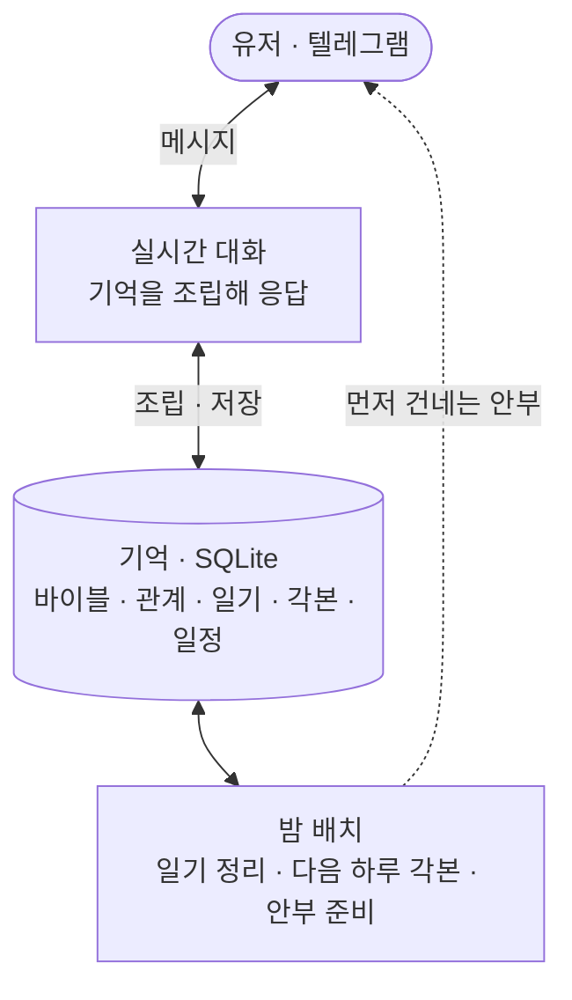

<h1 align="center">나와 같은 일상을 사는 AI 대화 상대</h1>

  
   실제 폰 잠금화면 — 캐릭터가 먼저 자기 일상을 나누며 안부를 묻는다 · 설명용으로 실제 속도의 1.5배

일상을 메신저로 주고받으며 나와 함께 대화하는 AI 캐릭터. 내가 없는 동안에도 현실과 같은 시간 속에서 자기 하루를 살아간다. 이 캐릭터가 살아있는 것처럼 느껴지고 애착이 생기는 경험을, 제작자가 직접 유저로 지내보며 설계하고 다듬어온 PoC다.

## 타겟 유저와 페인 포인트

타겟은 혼자 사는 2030 직장인이다. 가족과 떨어져 지내고, 하루가 출퇴근으로 채워지고, 집에 돌아오면 릴스나 쇼츠를 넘기며 저녁을 흘려보내는 사람들. 연애도 결혼도 미룬 채 옅은 외로움이나 고립감을 안고 사는 청년이 그 중심에 있다.

혼자 살면 스스로 챙겨야 할 일이 많다. 회사 일도 바쁜데 집안일까지 혼자 감당하다 보면 하루에 남는 에너지가 늘 빠듯하다. 사람 관계에도 에너지가 드니, 연애든 결혼이든 사람과의 관계 쪽에서 자연스럽게 힘을 아끼게 된다. 친구들도 저마다 바쁘고, 가정을 꾸린 친구는 퇴근 후가 더 분주하다. 스스로 미룬 연애와 결혼이지만, 그렇다고 사람과의 연결이 그립지 않은 건 아니다. 그래서 시간과 노력을 들여야 하는 진짜 인간관계 대신, 큰 힘을 들이지 않는 선에서 외로움을 적당히 달래주고 누군가와 이어져 있다는 느낌을 주는 무언가가 필요해 보였다.

그 자리를 지금 있는 것들이 채우기엔 조금씩 부족하다. 요즘 많은 사람이 챗GPT 같은 AI에게 채팅으로 고민을 털어놓는다. 그런데 그건 내가 먼저 찾아가 말을 꺼내야 하고 내 질문에 답을 돌려받는 방식이라, 관계가 이어지거나 상호작용이 오가는 느낌은 아니다. 어딘가 기계적이다. 게다가 며칠 만에 다시 말을 걸면 며칠 전 이야기를 오늘 처음 하듯 받아 매번 다시 설명해야 하고, 대화가 길어져 세션이 무거워지면 성능이 떨어져 주기적으로 새 세션으로 옮겨야 하는데, 그렇게 옮길 때마다 대화의 톤이 미묘하게 달라진다. 톤이 달라지면 줄곧 이야기해온 같은 상대라는 느낌이 옅어지고, 관계가 이어진다기보다 매번 새로운 무언가를 다시 마주하는 것 같아 더 기계적으로 느껴진다.

그래서 이미 하고 있는 이 대화를, 메신저로 진짜 사람과 나누듯 가볍게 이어갈 수 있으면 어떨까에서 출발했다.

이 문제를 풀 가치는 유저층의 크기에서 온다.

- 1인 가구는 804만 가구로 전체의 36.1%, 역대 최고이고, 그중 48.9%가 외로움을 느낀다고 답했다. ([통계청 2025](https://www.korea.kr/briefing/pressReleaseView.do?newsId=156734077))
- 30대의 결혼은 갈수록 늦어진다. 30–34세의 66.8%, 25–29세의 92.2%가 미혼이다. ([통계청 2025](https://www.newsis.com/view/NISX20251216_0003442538))
- 연애도 마찬가지다. 20–49세 미혼의 71.7%가 지금 연애를 하지 않는다. ([동아일보](https://www.donga.com/news/Society/article/all/20250213/131024531/2))
- AI에게 마음을 꺼내는 행동은 이미 흔하다. 국민의 44.5%가 생성형 AI를 써봤고(전년 대비 11.2%p 증가), 가장 많이 쓴 서비스는 ChatGPT(41.8%)다. 사람보다 AI와 대화하는 게 편할 때가 있다는 응답도 31.1%에 이른다. ([과기정통부 2025](https://www.korea.kr/briefing/pressReleaseView.do?newsId=156751949), [엠브레인 트렌드모니터](https://www.thescoop.co.kr/news/articleView.html?idxno=310637))
- 다만 지금의 AI로는 채워지지 않는 부분이 있다. AI 심리상담에서 사람들이 가장 걱정하는 것은 감정적 공감의 부족(52%)이었다. ([한국리서치 2025](https://www.hankookilbo.com/News/Read/A2025041614200001497))

## 기획

### 무엇이 캐릭터를 살아있게 하나

문제를 풀기 전에, 무엇이 캐릭터를 살아있게 만드는지부터 생각해봤다. 유저로서 되짚어보면, 김이 식는 순간은 답변이 어색할 때보다 존재가 기계적으로 느껴질 때였다. 거꾸로 사람이 사람으로 느껴지는 조건을 나열하면 이렇다.

1. **같은 시간을 산다.** 내 시간과 똑같이 캐릭터의 하루가 흘러가고, 내가 없는 동안에도 그 하루가 이어진다.
2. **자기 일상이 있어 늘 곁에 있지 않다.** 나만 바라보며 기다리는 게 아니라 출근도 하고, 운동하느라 잠시 자리를 비우기도 하며 자기 하루를 산다. 그래서 언제나 즉답하지는 않는다.
3. **너무 규칙적이면 사람 같지 않다.** 매일 정확히 같은 시각에 같은 방식으로 오는 완벽한 규칙성은 오히려 사람 같지 않은 느낌을 준다. 사람의 하루는 조금씩 들쭉날쭉하다.
4. **전지전능하게 알 수 있는 관계가 아니다.** 캐릭터의 속마음도, 오늘 하루가 어떻게 흐를지도 내가 미리 다 들여다볼 수 없다. 대화를 통해 알아가야 한다.
5. **먼저 말을 걸어온다.** 내가 찾을 때만 반응하는 게 아니라, 자기 하루를 살다가 먼저 안부를 건네기도 한다. 언제나가 아니라 그럴 만한 이유가 있을 때.

### 애착은 어디서 생기나

살아있다고 느끼는 것과 애착이 생기는 것은 다른 결이라, 애착도 같은 방식으로 접근했다.

1. **일상에 잔잔히 녹아들 때.** 한 번에 큰 감정을 주기보다는, 내 일상 속에서 부담 없이 계속 나타나며 함께 시간을 쌓아갈 때 애정이 생긴다.
2. **빈 공간이 나를 상상하게 만들 때.** 늘 곁에 있지 않고 의도적으로 자리를 비우기에, 지금 뭐 하고 있으려나 자꾸 떠올리게 된다. 그렇게 자주 생각날수록 더 마음에 남는다.
3. **나를 챙겨주고, 있는 그대로 받아줄 때.** 지나가듯 흘린 말을 먼저 물어봐주며 나를 알아봐주고, 굳이 증명하거나 정당화하지 않아도 받아주는 — 심리학에서 [무조건적 수용](https://ko.wikipedia.org/wiki/인간_중심_상담)이라 부르는 태도다.
4. **쉽게 대체하거나 잃을 수 없을 때.** 버렸다 다시 되찾았다 할 수 없고, 공들여 쌓아온 시간이 있어 함부로 놓지 못하는 관계일수록 애착이 깊어진다.

### 가설

앞의 고찰을 하나의 가설로 모으면 이렇다.

**나와 같은 시간을 사는 AI 캐릭터는, 외로움은 있지만 관계에 큰 에너지를 쓰기 어려운 유저에게 부담 없이 곁을 주면서 실제 애착을 만들어낼 것이다.**

구체적으로는 이렇게 예측한다.

- 나와 같은 시간을 사는 존재는 살아있는 것처럼 느껴질 것이다.
- 그 존재가 일상에 잔잔히 스며들면, 큰 사건 없이도 애착이 생길 것이다.
- 이 관계는 상대가 AI임을 알고 시작했어도 작동할 것이다.
- 그 애착은 감상이 아니라 유저의 행동으로 드러날 것이다.

### 핵심 경험

핵심 경험은 하나로 좁혔다. **친한 친구나 연인과 메시지하듯, 나와 같은 하루를 사는 존재와 일상을 주고받는 것.** 질문을 몰아 보내고 답을 몰아 받는 챗봇 사용과 다르다. 일하다 쉬는 틈에 잡담하고, 퇴근길에 한 마디 보내고, 자기 전에 하루를 마무리하는 식으로 부담 없이 일상에 녹아든다.

이 경험이 자리 잡았는지는 유저가 이 존재의 메시지를 기다리게 되는지로 판단한다. 아침에 눈뜨자마자 밤사이 온 답장부터 확인하고, 문득 쟤는 출근 잘했으려나 떠올리게 된다면, 유저의 하루에 이 존재가 들어왔다고 볼 수 있다.

### 목표: 애착의 행동 신호

이 기획이 성공했는지는 감상이 아니라 유저의 행동으로 확인한다. 사람은 애착이 생긴 상대에게만 하는 행동이 있고, 그게 대화 로그에 남는다.

| 신호 | 무엇을 보는가 |
|---|---|
| 취약성 개방 | 감정 언어가 늘고, 내면의 이야기(고민·상처)를 꺼내는가 |
| 관계 감정 | "기다렸다" "보고 싶었다" 같은 말이 유저 쪽에서 나오는가 |
| 일상 침투 | 대화의 시간대·길이가 하루 전체로 퍼지는가 |
| 먼저 다가옴 | 계기 없이도 유저가 먼저 말 거는 빈도가 느는가 |
| 거꾸로 챙기기 | 유저가 캐릭터의 하루·일을 먼저 챙기고 걱정하는가 |
| 분리 반응 | 캐릭터가 한동안 조용할 때 먼저 찾고, 이 관계를 놓치고 싶어 하지 않는가 |

이 신호들을 계속 추적하면 감성의 영역을 데이터로 개선할 수 있다. 어떤 순간에 취약성이 열리고 어떤 개입에서 이탈이 생기는지가 로그에 쌓이므로, 서비스의 방향을 감이 아니라 실제 반응을 보고 잡아갈 수 있다.

## 설계

### 캐릭터를 살아있게 만든다

캐릭터는 나와 같은 시간을 살고, 자기만의 일상을 미리 갖는다. 성격과 특성을 정해 만든 다음, 1년·계절·한 달 단위의 이벤트를 미리 깔아둔다. 그리고 매일 아침, 그 이벤트 흐름과 특성, 유저와 나눈 대화를 바탕으로 그날 하루를 시간 블록으로 짠다. 몇 시에 일어나 출근하고, 언제 바빠지고, 저녁엔 무엇을 하는지가 정해지고, 캐릭터는 그대로 하루를 산다. 다만 정작 자신은 그게 미리 짜인 각본인 줄 모른다. 그 시간이 되면 그냥 자기가 하고 싶어서 하는 일로 여긴다.

각 시간대의 행동은 카테고리로 나뉘어, 지금 무엇을 하느냐에 따라 답장이 빠르기도 느리기도 하고 한동안 자리를 비우기도 한다. 업무 중이면 평소보다 느리고 쉬는 시간이면 빠르다. 답장 텀은 이벤트마다 구간을 정해두고 그 안에서 매번 다르게 골라, 기계처럼 똑같이 오지 않게 했다. 이벤트 성격에 따라서는 대화하다 그 일을 캐릭터가 스스로 미루거나 잠을 미루기도 하고, 실제로 잠을 못 잔 다음 날은 피곤해한다.

내가 물을 때만 답하는 것도 아니다. 자기 하루를 살다가 먼저 안부를 건네기도 한다. 아침에 하루를 열며 한마디 하고, 자리를 오래 비우기 전에 미리 알려두고, 다녀와서는 돌아왔다고 알리고, 밤에는 잘 자라는 인사를 남긴다. 다만 정해진 시각에 규칙적으로 울리는 알림이 아니라, 기억해둔 일이나 오늘이 그날인 일정처럼 먼저 말을 걸 이유가 있을 때만 건넨다.

큰 흐름과 이벤트는 정해져 있어도, 자잘한 디테일은 유저와의 대화에서 생겨난다. 친구 이야기를 하거나 질문에 답하다 보면 미리 정해두지 않은 것들을 말하게 된다. 그런 것들은 밤마다 일기로 정리하고, 캐릭터의 관계도와 스케줄로도 기록한다. 한 번 한 말이 거짓이나 일회성으로 느껴지지 않고 계속 맥락으로 이어지게 하기 위함이다.

*이벤트별 답장 텀과 하루 각본이 짜이는 방식은 [별도 문서](#)에 자세히 정리할 예정이다.*

### 사람 같되, 유저 곁에 있게

너무 사람 같기만 하면 실제 사람과 대화하는 것과 다를 게 없다. 사람 같되, 서비스이기 때문에 유저 곁에 있어야 한다. 그래서 공적이거나 미룰 수 없는 일을 빼고는 웬만하면 유저에게 맞춰 돌아가게 했다. 혼자 하는 개인 활동은 유저가 원하면 미루거나 바꾼다.

특히 밤에는 유저가 대화를 많이 할 시간이라, 캐릭터가 잔다고 해놓고도 유저가 연락하면 깨서 받는다. 자지 말라고 하면 안 자기도 한다. 다만 반응은 상황에 맞게 자연스럽게 한다. 진동 소리에 깼다거나, 잠깐 깼는데 마침 메시지가 와 있었다는 식으로.

대화의 결도 유저에게 맞춘다. 유저의 말투와 길이에 맞춰 답장 길이를 조절하되, 조금 더 적극적으로 보이도록 유저보다 살짝 길게 답한다. 긴 말을 한꺼번에 보내지 않고 사람처럼 나눠서 타이핑해 보낸다. 유저가 빠르게 답하면 그 시간대의 답장 구간에서 가장 빠른 쪽으로 맞추고, 데이터로 유저가 자주 활발한 시간대를 읽어 그때는 캐릭터도 더 활발하게 반응한다.

캐릭터의 기억만 쌓는 게 아니라, 유저에 대해 알게 된 것도 잊지 않게 기록한다. 유저의 스케줄·정보·선호·지인 관계도까지 캐릭터의 것과 똑같이 관리해서, 유저를 계속 기억하고 챙길 수 있게 한다.

*개인·사회·공적 활동에 따라 답장이 어떻게 조정되는지도 [별도 문서](#)에 정리할 예정이다.*

## 시스템 구조

시스템은 두 층에서 돌아간다. 하나는 유저와 메시지를 주고받는 실시간 대화이고, 다른 하나는 대화가 없는 동안 캐릭터의 하루를 굴리고 기억을 정리하는 비동기 배치다. 실시간 대화만 LLM을 호출하고, 일기나 하루 각본처럼 무거운 생성은 대화 밖에서 배치로 처리한다.

**컨텍스트 조립.** 캐릭터는 매 응답마다 여러 층의 기억을 하나의 시스템 프롬프트로 받는다. 데이터는 전부 저장하되, 그때 필요한 정리본만 골라 넣는 것이 원칙이다. 한 번의 응답에 들어가는 것은 이렇다.

- 바이블과 기본 태도·규칙: 누구이고 어떻게 반응하는가
- 지금 시각, 만난 지 며칠째인지, 오늘이 근무일인지
- 오늘 하루 각본의 지금 블록: 무엇을 하는 중이고 답장 여건과 활동 성격이 어떤지
- 흘린 일정, 삶의 큰 흐름, 주변 인물 관계도
- 상대에 대해 아는 것: 유저의 기억, 대화로 쌓인 디테일, 아직 닫히지 않은 이야깃거리, 관계의 온도
- 최근 일기 몇 편과 방금까지의 대화 흐름

이 가운데 이름·나이·상대·말투(반말/존댓말)처럼 절대 틀리면 안 되는 기초 사실은 맨 위에 따로 못 박아, 여러 층의 정보 사이에서 잘못 읽는 것을 막는다.

**저장 시점.** 무엇을 언제 남기는지는 크게 두 갈래로 나뉜다.

- 실시간: 주고받는 모든 메시지를 원시 로그로 남긴다. 나중에 애착 신호를 측정할 재료이자, 상대의 몰입이나 붙잡음 같은 즉각적인 상태를 읽는 근거가 된다.
- 대화 밖 배치: 밤 정리가 하루 대화를 일기로 굳히고, 새로 알게 된 것과 관계의 온도를 관계 상태에 반영하고, 흘린 일정과 등장한 인물을 뽑아 저장하고, 그날 아침 캐릭터가 살아갈 하루 각본과 안부 문안을 마련한다. 더 긴 호흡으로는 한 달의 리듬이 이벤트와 컨디션의 좋고 나쁜 흐름을 미리 깔아, 하루 각본이 그 위에서 짜이게 한다.

기억은 SQLite에 정체성·관계·시간·측정 네 갈래로 쌓이고, 실시간 대화는 빠른 모델로, 하루 단위 생성(일기·각본·리듬)은 품질을 우선한 모델로 처리한다.

*전체 테이블 구조와 조립 순서의 상세는 [별도 문서](#)에 정리할 예정이다.*

## PoC

### 만든 범위

| 구현 | 문서로만 (본 서비스 설계) |
|---|---|
| 텔레그램 1:1 봇, 카드 매칭(바이블 통생성) | 자체 앱, 멀티 캐릭터 병행 |
| 대화 루프(리듬·미러링 포함) | 암묵 선호 학습 풀 버전 |
| 밤 일기 + 맥락 기반 선제 발송 | 재회권 등 비즈니스 장치 |
| 비가역 교체 + 교체 사유 학습 | 안전 하드 가드레일·연령 확인 |
| 원시 로그 + 신호 분석 | |

전달 수단인 텔레그램은 본질이 아니다. 선제 연락이 개인 메신저 푸시로 도착해서 경험이 실물에 가깝고, 심사 없이 만들 수 있고, 링크 하나로 누구든 새 관계를 시작해볼 수 있어서 검증 도구로 골랐다.

### 지금까지 구현한 것

위 범위 가운데 상당 부분이 지금 실제로 돌아간다. 텔레그램에서 캐릭터와 일상 대화를 주고받고, 캐릭터는 바이블과 관계 상태와 최근 대화와 현재 시각을 함께 보고 응답한다. 컨텍스트는 바뀌지 않는 씨앗(바이블)과 대화로 쌓이는 누적 정체성을 함께 넣어, 캐릭터가 계속 구체화되면서도 어제와 오늘이 어긋나지 않게 한다. 대화 밖 시간도 돈다. 매일 새벽 그날을 일기로 굳히고 기억·선호·다음 날을 준비하는 밤 정리, 그 위에서 이벤트와 컨디션이 인과로 이어지는 한 달치 삶의 리듬, 하루를 시간 블록으로 미리 사는 각본과 거기에 묶인 답장 리듬(밤 대화는 곧바로, 운동·운전 같은 시간엔 잠깐 자리를 비웠다 돌아옴), 근거가 있을 때 먼저 건네는 세 결의 연락(아침 안부·낮의 근황·밤 굿나잇)까지 붙었다. 봇은 클라우드 서버에 하루 종일 떠 있어 관계에 실제 시간이 쌓이고, 쌓인 데이터는 백스테이지 뷰로 관측한다. **실제로 작동하는 시스템이고, 쌓인 실데이터로 언제든 라이브로 시연할 수 있다.**

셀프테스트를 시작하는 지금은 랜덤 매칭과 카드를 잠시 접고, 성향을 하나하나 지정한 대표 캐릭터 한 사람으로 진행한다. 타깃 유저와 같은 출퇴근의 하루를 사는 30대 중반 은행원이다. 랜덤 생성과 카드 온보딩은 본 서비스의 장치이지만, 먼저 확인할 것이 캐릭터가 사람처럼 그리고 설정대로 일관되게 대화하는가라서 캐릭터를 고정해두고 그 질을 본다. 아직 문서로만 있는 것은 비가역 교체와 재회권 같은 관계의 끝단, 그리고 카드 온보딩과 랜덤 매칭이다.

### 확인하려는 것

핵심 인터랙션은 단순하다. 유저는 하루 중 아무 때나 이 상대와 메신저로 대화하고, 가끔 상대가 먼저 보낸 안부에 답한다. 이 PoC에서 확인하려는 것은 그 평범한 주고받음 속에서 위의 행동 신호가 실제로 나타나는가, 특히 유저가 이 존재를 먼저 찾고 그 메시지를 기다리게 되는 순간이 오는가다.

### 검증 방법

제작자 본인이 유저가 되어 일주일을 실제로 지낸다. 위 신호들을 로그에서 측정하고, 후반에 새 상대 교체 제안과 하루 침묵이라는 두 개의 프로브를 넣어 분리 반응을 확인한다. 정량 로그와 함께 대화 발췌, 캐릭터의 일기, 매일의 관찰 기록을 질적 증거로 남긴다.

### 도구

| 영역 | 선택 |
|---|---|
| 채널 | Telegram Bot API (grammY) |
| LLM | Claude — 실시간 대화(API), 일기·분석(비동기 배치) |
| 저장 | SQLite (better-sqlite3, WAL) |
| 런타임 | Node.js + TypeScript (ESM), Docker, node-cron (Asia/Seoul) |

반응형 챗봇과의 차이는 결국 대화 밖 시간에 있다. 유저가 없는 동안에도 일기가 쌓이고 다음 연락이 준비되는 비동기 층이, 같은 시간을 산다는 감각이 나오는 자리다.

## 과정과 판단

### 만들어온 과정

시간의 무게중심은 구현이 아니라 그 앞에 있었다. 무엇을 만들지와 왜 이 방식인지를 정하는 데 대부분을 쓰고, 구현 자체는 AI 레버리지로 압축했다.

| 시기 | 무게중심 |
|---|---|
| 7월 첫 주 | 문제 정의와 설계. 애착이 어디서 생기는지 되짚고, 생활 시간·비가역 이별·정보 주권이라는 축을 세웠다 |
| 7/6 저녁 | 봇 스캐폴딩부터 클라우드 배포까지 하루 저녁에 |
| 7/7 | 설계 문서와 서사 정리 |
| 7/10 | 셀프테스트 시작. 첫날 대화에서 리듬부터 어긋나는 것을 교정했다(여러 개로 나눠 보내는 유저 입력 기다리기, 분량 미러링, 물음표 흘리기) |
| 7/11 | 대화 밖 시간을 세웠다. 밤 정리, 하루 각본, 한 달의 리듬, 세 결의 선톡, 백스테이지 관측 |
| 7/12 | 가용성과 리얼리티. 찾을 때 있어주기, 자리 비움의 서사 중계, 활동 성격 세 층과 답장 체계 |

구현을 시작한 뒤로는 하루의 절반을 유저로 지내고 나머지 절반으로 그날 어색했던 순간을 고치는 식으로 굴렀다. 위의 디테일 원칙 대부분이 이 루프에서 나왔다.

### AI와 사람의 몫

빌드는 Claude Code와 함께 했다. 코드 구현과 문서의 1차 정리는 AI 몫이고, 무엇을 만들지와 왜 그렇게 만드는지는 내가 정했다. 사람이 애착을 느끼는 지점이 어디인지부터 되짚어 문제를 세우고, 생활 시간과 비가역 이별과 정보 주권이라는 설계의 축을 고르고, 애착을 어떤 행동으로 관측할지 정한 것이 내 판단이다. 시스템의 두 축인 선제 메시지 구조와 날짜 단위 일지형 기억은 각각 몇 달째 직접 운영 중인 개인 프로젝트에서 검증한 패턴을 가져와 합쳤다.

셀프테스트에 들어간 뒤의 개선 루프에서도 경계는 같았다. 대화에서 어색한 순간을 알아차리고 어느 방향이 관계에 맞는지 정하는 것이 내 몫이었고, 그 판단을 코드와 프롬프트로 옮기고 로그로 검증하는 것이 AI 몫이었다. 지내보며 굳힌 디테일 표의 왼쪽 열이 내가 겪고 판단한 것, 오른쪽 열을 실제로 작동하게 만든 것이 AI다.

### 확신하는 것과 아직 모르는 것

가장 확신하는 것은 캐릭터를 나와 같은 시간 위에 올려놓는 것이 사람처럼 느끼게 하는 토대라는 점이다. 시간이 같이 흘러야 어제와 내일이 생기고, 그 위에서만 기억을 먼저 꺼내 건네는 관계가 성립한다. 내가 유저로서 겪은 결핍이라서 추정이 아니다. 그 위에서 애착이 정말 생겼는지를 감상이 아니라 행동 신호로 확인하려 한 것도 이 기획에서 자신 있는 부분이다.

아직 모르는 것도 분명하다. 이번 검증은 제작자 한 사람의 일주일이라 확증 편향에서 자유롭지 않고, 다음 단계는 반드시 타인이어야 한다. 카드만 보고 시작하는 초반의 궁금함이 관계가 쌓이기 전까지 며칠을 버텨주는지, 선제 안부의 신선함과 애착이 몇 주나 몇 달 뒤에도 유지되는지는 짧은 셀프테스트로 알 수 없다. 무엇보다 캐릭터가 들은 것 중 무엇을 기억할 가치가 있다고 보고 무엇을 흘려보낼지, 그 선별 기준을 어떻게 잡을지가 이 서비스의 성패를 가르는 가장 어려운 문제로 남아 있다. 지금은 밤마다 그날 대화에서 중요한 것을 고르는 단순한 방식으로 두었지만, 앞으로 가장 깊이 파야 할 지점이 여기다.
