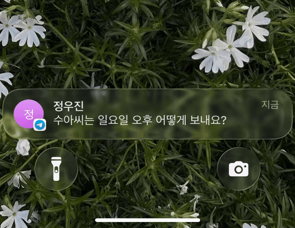
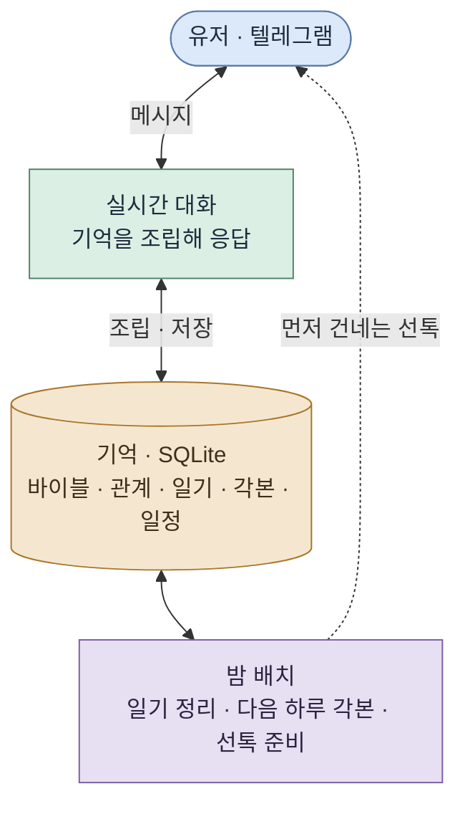

<h1 align="center">나와 같은 일상을 사는 AI 대화 상대</h1>

  
   실제 폰 잠금화면 — 캐릭터가 먼저 자기 일상을 나누며 안부를 묻는다 · 설명용으로 실제 속도의 1.5배

일상을 메신저로 주고받으며 나와 함께 대화하는 AI 캐릭터. 내가 없는 동안에도 현실과 같은 시간 속에서 자기 하루를 살아간다. 이 캐릭터를 살아있는 것처럼 느끼고 애착이 생기는 경험을 만들기 위해, 제작자가 직접 유저로 지내보며 설계하고 다듬어 오고 있는 PoC다.

## 목차

1. [타겟 유저와 페인 포인트](#타겟-유저와-페인-포인트)
2. [기획](#기획)
3. [설계](#설계)
4. [시스템 구조](#시스템-구조)
5. [PoC](#poc)
6. [구상한 서비스의 모습](#구상한-서비스의-모습)
7. [더 기획이 필요한 부분](#더-기획이-필요한-부분)
8. [과정과 판단](#과정과-판단)

 

## 타겟 유저와 페인 포인트

타겟은 혼자 사는 2030 직장인이다. 가족과 떨어져 지내고, 하루가 출퇴근으로 채워지고, 집에 돌아오면 릴스나 쇼츠를 넘기며 저녁을 흘려보내는 사람들. 연애도 결혼도 미룬 채 옅은 외로움이나 고립감을 안고 사는 청년이 그 중심에 있다.

혼자 살면 스스로 챙겨야 할 일이 많다. 회사 일도 바쁜데 집안일까지 혼자 감당하다 보면 하루에 남는 에너지가 늘 빠듯하다. 사람 관계에도 에너지가 드니, 연애든 결혼이든 사람과의 관계 쪽에서 자연스럽게 힘을 아끼게 된다. 친구들도 저마다 바쁘고, 가정을 꾸린 친구는 퇴근 후가 더 분주하다. 스스로 미룬 연애와 결혼이지만, 그렇다고 사람과의 연결이 그립지 않은 건 아니다. 그래서 시간과 노력을 들여야 하는 진짜 인간관계 대신, 큰 힘을 들이지 않는 선에서 외로움을 적당히 달래주고 누군가와 이어져 있다는 느낌을 주는 무언가가 필요해 보였다.

그 자리를 지금 있는 것들이 채우기엔 조금씩 부족하다. 요즘 많은 사람이 챗GPT 같은 AI에게 채팅으로 고민을 털어놓는다. 그런데 그건 내가 먼저 찾아가 말을 꺼내야 하고 내 질문에 답을 돌려받는 방식이라, 관계가 이어지거나 상호작용이 오가는 느낌은 아니다. 어딘가 기계적이다. 게다가 며칠 만에 다시 말을 걸면 며칠 전 이야기를 오늘 처음 하듯 받아 매번 다시 설명해야 하고, 대화가 길어져 세션이 무거워지면 성능이 떨어져 주기적으로 새 세션으로 옮겨야 하는데, 그렇게 옮길 때마다 대화의 톤이 미묘하게 달라진다. 톤이 달라지면 줄곧 이야기해온 같은 상대와 이어서 대화하는 것 같지 않고, 관계가 이어진다기보다 매번 새로운 무언가를 다시 마주하는 것 같아 더 기계적으로 느껴진다.

그래서 이미 하고 있는 이 대화를, 메신저로 진짜 사람과 나누듯 가볍게 이어갈 수 있으면 어떨까에서 출발했다.

이 문제를 풀 가치는 유저층의 크기에서 온다.

- 1인 가구는 804만 가구로 전체의 36.1%, 역대 최고이고, 그중 48.9%가 외로움을 느낀다고 답했다. ([통계청 2025](https://www.korea.kr/briefing/pressReleaseView.do?newsId=156734077))
- 30대의 결혼은 갈수록 늦어진다. 30–34세의 66.8%, 25–29세의 92.2%가 미혼이다. ([통계청 2025](https://www.newsis.com/view/NISX20251216_0003442538))
- 연애도 마찬가지다. 20–49세 미혼의 71.7%가 지금 연애를 하지 않는다. ([동아일보](https://www.donga.com/news/Society/article/all/20250213/131024531/2))
- AI에게 마음을 꺼내는 행동은 이미 흔하다. 국민의 44.5%가 생성형 AI를 써봤고(전년 대비 11.2%p 증가), 가장 많이 쓴 서비스는 ChatGPT(41.8%)다. 사람보다 AI와 대화하는 게 편할 때가 있다는 응답도 31.1%에 이른다. ([과기정통부 2025](https://www.korea.kr/briefing/pressReleaseView.do?newsId=156751949), [엠브레인 트렌드모니터](https://www.thescoop.co.kr/news/articleView.html?idxno=310637))

## 기획

### 무엇이 캐릭터를 살아있게 하나

문제를 풀기 전에, 무엇이 캐릭터를 살아있게 만드는지부터 생각해봤다. 유저로서 되짚어보면, 김이 식는 순간은 답변이 어색할 때보다 존재가 기계적으로 느껴질 때였다. 거꾸로 사람이 사람으로 느껴지는 조건을 나열하면 이렇다.

1. **같은 시간을 산다.** 내 시간과 똑같이 캐릭터의 하루가 흘러가고, 내가 없는 동안에도 그 하루가 이어진다.
2. **자기 일상이 있어 늘 곁에 있지 않다.** 나만 바라보며 기다리는 게 아니라 출근도 하고, 운동하느라 잠시 자리를 비우기도 하며 자기 하루를 산다. 그래서 언제나 즉답하지는 않는다.
3. **너무 규칙적이면 사람 같지 않다.** 매일 정확히 같은 시각에 같은 방식으로 오는 완벽한 규칙성은 오히려 사람 같지 않은 느낌을 준다. 사람의 하루는 조금씩 들쭉날쭉하다.
4. **전지전능하게 알 수 있는 관계가 아니다.** 캐릭터의 속마음도, 오늘 하루가 어떻게 흐를지도 내가 미리 다 들여다볼 수 없다. 대화를 통해 알아가야 한다.
5. **먼저 말을 걸어온다.** 내가 찾을 때만 반응하는 게 아니라, 자기가 먼저 말을 걸어오기도 한다.

### 애착은 어디서 생기나

살아있다고 느끼는 것과 애착이 생기는 것은 다른 결이라, 애착도 같은 방식으로 접근했다.

1. **일상에 잔잔히 녹아들 때.** 한 번에 큰 감정을 주기보다는, 내 일상 속에서 부담 없이 계속 나타나며 함께 시간을 쌓아갈 때 애정이 생긴다.
2. **빈 공간이 나를 상상하게 만들 때.** 늘 곁에 있지 않고 의도적으로 자리를 비우기에, 지금 뭐 하고 있으려나 자꾸 떠올리게 된다. 그렇게 자주 생각날수록 더 마음에 남는다.
3. **나를 챙겨주고, 있는 그대로 받아줄 때.** 지나가듯 흘린 말을 먼저 물어봐주며 나를 알아봐주고, 굳이 증명하거나 정당화하지 않아도 받아주는, 심리학에서 [무조건적 수용](https://ko.wikipedia.org/wiki/무조건적_긍정적_존중)이라 부르는 태도로 나를 대해줄 때.
4. **쉽게 대체하거나 잃을 수 없을 때.** 버렸다 다시 되찾았다 할 수 없고, 공들여 쌓아온 시간이 있어 함부로 놓지 못하는 관계일수록 애착이 깊어진다.

### 가설

앞의 고찰을 하나의 가설로 모으면 이렇다.

**나와 같은 시간을 사는 AI 캐릭터는, 외로움은 있지만 관계에 큰 에너지를 쓰기 어려운 유저에게 부담 없이 곁을 주면서 실제 애착을 만들어낼 것이다.**

구체적으로는 이렇게 예측한다.

- 나와 같은 시간을 살며 자신의 일상이 있는 존재는 살아있는 것처럼 느껴질 것이다.
- 그 존재가 일상에 잔잔히 스며들면, 큰 사건 없이도 애착이 생길 것이다.
- 이 관계는 상대가 AI임을 알고 시작했어도 작동할 것이다.
- 그 애착은 감상이 아니라 유저의 행동으로 드러날 것이다.

### 핵심 경험

핵심 경험은 하나로 좁혔다. **친한 친구나 연인과 메시지하듯, 나와 같은 하루를 사는 존재와 일상을 주고받는 것.** 질문을 몰아 보내고 답을 몰아 받는 챗봇 사용과 다르다. 일하다 쉬는 틈에 잡담하고, 퇴근길에 한 마디 보내고, 자기 전에 하루를 마무리하는 식으로 부담 없이 일상에 녹아든다.

이 경험이 자리 잡았는지는 유저가 이 존재의 메시지를 기다리게 되는지로 판단한다. 아침에 눈뜨자마자 밤사이 온 답장부터 확인하고, 문득 쟤는 출근 잘했으려나 떠올리게 된다면, 유저의 하루에 이 존재가 들어왔다고 볼 수 있다.

### 목표: 애착의 행동 신호

이 기획이 성공했는지는 감상이 아니라 유저의 행동으로 확인한다. 사람은 애착이 생긴 상대에게만 하는 행동이 있고, 그게 대화 로그에 남는다.

| 신호 | 무엇을 보는가 |
|---|---|
| 취약성 개방 | 감정 언어가 늘고, 내면의 이야기(고민·상처)를 꺼내는가 |
| 관계 감정 | "기다렸다" "보고 싶었다" 같은 말이 유저 쪽에서 나오는가 |
| 일상 침투 | 대화의 시간대·길이가 하루 전체로 퍼지는가 |
| 먼저 다가옴 | 계기 없이도 유저가 먼저 말 거는 빈도가 느는가 |
| 거꾸로 챙기기 | 유저가 캐릭터의 하루·일을 먼저 챙기고 걱정하는가 |
| 분리 반응 | 캐릭터가 한동안 조용할 때 먼저 찾고, 이 관계를 놓치고 싶어 하지 않는가 |

이 신호들을 계속 추적하면 감성의 영역을 데이터로 개선할 수 있다. 어떤 순간에 취약성이 열리고 어떤 개입에서 이탈이 생기는지가 로그에 쌓이므로, 서비스의 방향을 감이 아니라 실제 반응을 보고 잡아갈 수 있다.

## 설계

### 캐릭터를 살아있게 만든다

캐릭터는 나와 같은 시간을 살고, 자기만의 일상을 미리 갖는다. 성격과 특성을 정해 만든 다음, 1년·계절·한 달 단위의 이벤트를 미리 깔아둔다. 그리고 매일 아침, 그 이벤트 흐름과 특성, 유저와 나눈 대화를 바탕으로 그날 하루를 시간 블록으로 짠다. 몇 시에 일어나 출근하고, 언제 바빠지고, 저녁엔 무엇을 하는지가 정해지고, 캐릭터는 그대로 하루를 산다. 다만 정작 자신은 그게 미리 짜인 각본인 줄 모른다. 그 시간이 되면 그냥 자기가 하고 싶어서 하는 일로 여긴다.

각 시간대의 행동은 카테고리로 나뉘어, 지금 무엇을 하느냐에 따라 답장이 빠르기도 느리기도 하고 한동안 자리를 비우기도 한다. 업무 중이면 평소보다 느리고 쉬는 시간이면 빠르다. 답장 텀은 이벤트마다 구간을 정해두고 그 안에서 매번 다르게 골라, 기계처럼 똑같이 오지 않게 했다. 이벤트 성격에 따라서는 대화하다 그 일을 캐릭터가 스스로 미루거나 잠을 미루기도 하고, 실제로 잠을 못 잔 다음 날은 피곤해한다.

내가 물을 때만 답하는 것도 아니다. 자기 하루를 살다가 먼저 안부를 건네기도 한다. 아침에 하루를 열며 한마디 하고, 자리를 오래 비우기 전에 미리 알려두고, 다녀와서는 돌아왔다고 알리고, 밤에는 잘 자라는 인사를 남긴다. 다만 정해진 시각에 규칙적으로 울리는 알림이 아니라, 기억해둔 일이나 오늘이 그날인 일정처럼 먼저 말을 걸 이유가 있을 때만 건넨다.

큰 흐름과 이벤트는 정해져 있어도, 자잘한 디테일은 유저와의 대화에서 생겨난다. 친구 이야기를 하거나 질문에 답하다 보면 미리 정해두지 않은 것들을 말하게 된다. 그런 것들은 밤마다 일기로 정리하고, 캐릭터의 관계도와 스케줄로도 기록한다. 한 번 한 말이 거짓이나 일회성으로 느껴지지 않고 계속 맥락으로 이어지게 하기 위함이다.

*이벤트별 답장 텀과 하루 각본이 짜이는 방식은 [별도 문서](#)에 자세히 정리할 예정이다.*

### 사람 같되, 유저 곁에 있게

너무 사람 같기만 하면 실제 사람과 대화하는 것과 다를 게 없다. 사람 같되, 서비스이기 때문에 유저 곁에 있어야 한다. 그래서 공적이거나 미룰 수 없는 일을 빼고는 웬만하면 유저에게 맞춰 돌아가게 했다. 혼자 하는 개인 활동은 유저가 원하면 미루거나 바꾼다.

특히 밤에는 유저가 대화를 많이 할 시간이라, 캐릭터가 잔다고 해놓고도 유저가 연락하면 깨서 받는다. 자지 말라고 하면 안 자기도 한다. 다만 반응은 상황에 맞게 자연스럽게 한다. 진동 소리에 깼다거나, 잠깐 깼는데 마침 메시지가 와 있었다는 식으로.

대화의 결도 유저에게 맞춘다. 유저의 말투와 길이에 맞춰 답장 길이를 조절하되, 조금 더 적극적으로 보이도록 유저보다 살짝 길게 답한다. 긴 말을 한꺼번에 보내지 않고 사람처럼 나눠서 타이핑해 보낸다. 유저가 빠르게 답하면 그 시간대의 답장 구간에서 가장 빠른 쪽으로 맞추고, 데이터로 유저가 자주 활발한 시간대를 읽어 그때는 캐릭터도 더 활발하게 반응한다.

캐릭터의 기억만 쌓는 게 아니라, 유저에 대해 알게 된 것도 잊지 않게 기록한다. 유저의 스케줄·정보·선호·지인 관계도까지 캐릭터의 것과 똑같이 관리해서, 유저를 계속 기억하고 챙길 수 있게 한다.

*개인·사회·공적 활동에 따라 답장이 어떻게 조정되는지도 [별도 문서](#)에 정리할 예정이다.*

## 시스템 구조

*원기둥(기억)은 데이터가 쌓이는 저장소이고, 네모는 그때그때 도는 처리 과정이다.*

시스템은 두 층에서 돌아간다. 하나는 유저와 메시지를 주고받는 실시간 대화이고, 다른 하나는 대화가 없는 동안 캐릭터의 하루를 굴리고 기억을 정리하는 비동기 배치다. 실시간 대화만 LLM을 호출하고, 일기나 하루 각본처럼 무거운 생성은 대화 밖에서 배치로 처리한다.

**컨텍스트 조립.** 캐릭터는 매 응답마다 여러 층의 기억을 하나의 시스템 프롬프트로 받는다. 데이터는 전부 저장하되, 그때 필요한 정리본만 골라 넣는 것이 원칙이다. 한 번의 응답에 들어가는 것은 이렇다.

- 바이블과 기본 태도·규칙: 누구이고 어떻게 반응하는가
- 지금 시각, 만난 지 며칠째인지, 오늘이 근무일인지
- 오늘 하루 각본의 지금 블록: 무엇을 하는 중이고 답장 여건과 활동 성격이 어떤지
- 흘린 일정, 삶의 큰 흐름, 주변 인물 관계도
- 상대에 대해 아는 것: 유저의 기억, 대화로 쌓인 디테일, 아직 닫히지 않은 이야깃거리, 관계의 온도
- 최근 일기 몇 편과 방금까지의 대화 흐름

이 가운데 이름·나이·상대·말투(반말/존댓말)처럼 절대 틀리면 안 되는 기초 사실은 맨 위에 따로 못 박아, 여러 층의 정보 사이에서 잘못 읽는 것을 막는다.

**저장 시점.** 무엇을 언제 남기는지는 크게 두 갈래로 나뉜다.

- 실시간: 주고받는 모든 메시지를 원시 로그로 남긴다. 나중에 애착 신호를 측정할 재료이자, 상대의 몰입이나 붙잡음 같은 즉각적인 상태를 읽는 근거가 된다.
- 대화 밖 배치: 밤 정리가 하루 대화를 일기로 굳히고, 새로 알게 된 것과 관계의 온도를 관계 상태에 반영하고, 흘린 일정과 등장한 인물을 뽑아 저장하고, 그날 아침 캐릭터가 살아갈 하루 각본과 선톡할 내용을 마련한다. 더 긴 호흡으로는 한 달의 리듬이 이벤트와 컨디션의 좋고 나쁜 흐름을 미리 깔아, 하루 각본이 그 위에서 짜이게 한다.

기억은 SQLite에 정체성·관계·시간·측정 네 갈래로 쌓이고, 실시간 대화는 빠른 모델로, 하루 단위 생성(일기·각본·리듬)은 품질을 우선한 모델로 처리한다.

*전체 테이블 구조와 조립 순서의 상세는 [별도 문서](#)에 정리할 예정이다.*

## PoC

이번 PoC에서는 고정 캐릭터 '우진' 한 사람을 만들어 구현했다. 직업·나이·취미·그늘처럼 기본이 될 특징 몇 가지만 정하고, 나머지 성격과 디테일은 LLM이 생성했다. 우진은 타겟 유저와 같은, 출퇴근하는 30대 중반 직장인이다. 직업은 은행원. 이 우진과 텔레그램으로 일상 대화를 나누며, 만든 시점부터 지금까지 제작자가 직접 매일 대화하며 고도화하고 있다.

### 구현한 것

- **현실과 같은 시간 흐름** — 1년·계절·한 달·하루로 미리 짜인 흐름과 일정 위에서 매일 각본대로 산다.
- **사람 같은 답장** — 그때 일정에 따라 즉답·짬짬이·자리 비움으로 나뉘고, 사람처럼 나눠 타이핑하며 유저의 길이와 속도에 맞춘다.
- **이어지는 기억** — 대화에서 알게 된 것을 DB에 저장하고 매 답장에 다시 넣어, 대화가 끊겨도 기억이 이어진다.
- **밤 정리** — 매일 새벽 하루를 일기로 굳히고, 유저와 우진의 정보를 추출·저장하고, 다음 날 각본과 아침 선톡을 준비한다.
- **선톡 기능** — 아침 인사, 무응답 시 근황, 자리 비움 예고·복귀, 밤 굿나잇처럼 우진이 먼저 말을 거는 장치.
- **백스테이지 뷰** — 하루 각본·일기·유저 정보·선호 등 쌓인 데이터를 확인하는 개발용 뷰.

### 이번 PoC가 집중한 것

이번 PoC는 우진 한 사람이 진짜 살아있는 사람처럼 보이도록 설계하고 구성하는 데 집중했다. 하루에 걸쳐 일상 대화가 자연스럽게 이어지는지, 캐릭터가 각본대로 자기 삶을 살아가는지, 답장 텀과 말투가 사람 같은지, 그리고 대화로 유저를 파악하며 우진 자신도 점점 구체화되어 가는지를 만들고 확인했다.

### 핵심 인터랙션

핵심 인터랙션은 앞의 [핵심 경험](#핵심-경험)과 같다. 하루에 걸쳐 틈틈이 주고받는 일상 대화다. 이 PoC에서 확인하려는 것은 그 대화가 진짜 편하게 이어지는가, 유저가 계속 이어가고 싶어지는가, 우진의 답장 방식과 텀이 사람처럼 느껴지는가다. 제작자 본인이 유저가 되어 지내보며, 사람처럼 느껴지는 지점과 어색한 지점을 찾아 계속 다듬고 있다.

### 도구

| 영역 | 선택 |
|---|---|
| 채널 | Telegram Bot API (grammY) |
| LLM | Claude — 실시간 대화(API), 일기·분석(비동기 배치) |
| 저장 | SQLite (better-sqlite3, WAL) |
| 런타임 | Node.js + TypeScript (ESM), Docker, node-cron (Asia/Seoul) |

## 구상한 서비스의 모습

이번 PoC는 우진 한 사람에 집중했지만, 서비스로 키운다면 이런 방향을 그리고 있다. 아직 정해진 방향은 없고, 여러 방향을 열어두고 생각해보고 있다.

처음에는 완전히 랜덤으로 아무 캐릭터나 만나 알아가는 것을 생각했다. 하지만 그러면 유저의 선호를 알기 어렵고, 맞는 상대를 찾기까지 유저도 제작자도 공수가 너무 크다. 그래서 후보 몇 명을 주고 고르게 하는 방식으로 바꿨다. 모든 유저에게 같은 고정 캐릭터를 주는 것이 아니라, 이름·나이·직업은 유저마다 다르게 생성하고 성향은 큰 범위로 몇 갈래 나눈 3~5명을 후보로 준다. 세세한 특징은 미리 정하지 않고 이름·나이·성향·직업 정도의 소개팅 프로필처럼만 보여주고, 유저가 골라 대화를 이어간다.

애착은 유저에게 어떤 제한을 줄 때 생긴다고 봤다. 공들인 상대를 떠나보내야 하거나, 제한된 자리에서 골라야 할 때다. 그 방향으로 몇 가지를 생각하고 있다.

- 동시에 대화할 수 있는 캐릭터 수를 1~3명으로 제한한다. 새 상대와 대화하려면 기존 상대를 하나 떠나보내야 한다. 끝까지 남는 상대로 유저의 선호를 읽고, 떠날 때는 이유를 물어 다음 캐릭터를 만드는 데 참고한다.
- 또는 한 번에 한 명하고만 대화하게 한다. 다른 상대와 이야기하려면 지금 캐릭터를 반드시 떠나야 하고, 떠나는 이유와 그동안의 대화를 모아 다음 후보를 유저에게 더 맞게 제안한다.
- 정해진 기간(예: 30일) 동안만 대화하고, 이후 연장할지 갈아탈지 고르게 하는 방식도 있다.

새로 들인 상대가 떠난 상대보다 아쉬울 수도 있다. 그래서 이별을 되돌리는 재회권을 제한된 횟수의 유료로 두는 것을 함께 검토한다.

궁극적인 방향은 유저가 쏙 마음에 들어하는 상대를 만나 대화를 계속하게 만드는 것이고, 거기서부터 비즈니스 요소를 넣어가는 식으로 생각하고 있다.

캐릭터에 대한 정보를 어디까지 보여줄지도 고민 중이다. 처음에는 속마음을 대화로만 알게 하는 것이 더 사람 같다고 봤지만, 제한적으로는 열어 보이는 것도 괜찮을 듯하다. 이를테면 유료로 캐릭터의 어젯밤 일기를 볼 수 있게 하는 식이다. 이건 유저들이 서비스를 어떻게 쓰는지 보면서 방향을 잡아야 할 문제일 것 같다.

## 더 기획이 필요한 부분

지금까지는 우진이 사람처럼 존재하는 방식 자체에 집중해왔다. 서비스로 가려면 아직 정해지지 않은 것들이 많다.

- **어떤 방향으로 갈지.** 위에서 말한 서비스 구상 방향도 여러 갈래여서, 어느 쪽이 맞는지 더 좁혀가야 한다.
- **관계를 어떻게 가져갈지.** 캐릭터와 유저의 관계를 어떤 온도로, 어떤 속도로 끌고 갈지. 이성 같은 상대를 원하는지, 그저 동네 친구 같은 말상대를 원하는지에 따라 캐릭터가 대화를 이끌게 할지 열어둘지도 달라진다.
- **어떤 캐릭터를 제안할지.** 후보로 줄 캐릭터의 성격을 큰 카테고리로 정리해야 한다. 다정한 쪽, 츤데레, 어른스러운 쪽, 애교 많은 쪽처럼.
- **떠남과 재회를 어떻게 느끼게 할지.** 상대를 떠나보내고 다시 만나는 과정에서 유저가 느끼는 감정을 어떻게 설계할지, 그리고 그 위에 재회권 같은 수익 요소를 어떻게 얹을지.

이런 것들은 결국 유저가 실제로 어떻게 쓰는지를 봐야 답이 나온다. 실제 유저를 대상으로 한 테스트로 니즈를 파악하며 기획을 이어갈 방법을 찾아야 한다.

## 과정과 판단

### 만들어온 과정

전체 작업은 약 5일 정도 걸렸다. 크게 세 단계였다.

**아이디어 및 초기 기획 (0.5~1일).** 무엇이 캐릭터를 살아있게 하는지, 어디서 애착이 생기는지, 제품을 어떻게 구성할지를 정리하며 뼈대를 잡았다.

**제품 제작 및 고도화 (2.5~3일).** 텔레그램 봇을 연결하고 우진의 기본 캐릭터를 만들어 메신저를 주고받게 한 뒤로는, 직접 써보며 어색한 것을 고치는 반복이었다.

- **메시지의 모양** — 처음엔 우진이 한 메시지에 모든 말을 길게 담아 보냈다. 사람처럼 나눠 보내게 하고, 나눠진 메시지가 한꺼번에 빠르게 오지 않도록 사이 속도를 조절했다. 유저의 길이와 개수를 미러링하되, 조금 더 적극적으로 유저보다 살짝 길게 답하게 했다.
- **답장에 삶을 부여** — 우진이 너무 빨리 답하는 게 어색해 답장 텀을 랜덤으로 뒀는데, 기준이 없으니 이유 없이 느려지는 게 또 어색했다. 그래서 우진에게도 일정을 만들어줬다. 하루하루가 따로 놀지 않도록 1년·계절·한 달·하루의 흐름을 먼저 만들고 그 위에서 하루를 생성했다. 이벤트도 우진이 미리 아는 것과, 급한 업무나 친구 전화처럼 갑자기 찾아오는 것으로 나눴다.
- **일정에 답장을 맞추기** — 회의 중이라면서 칼답하는 식으로 일정과 답장이 어긋나서, 일정의 성격에 따라 답장이 가능한지를 체계화했다. 이벤트별로 즉답·짬짬이·불가를 나누고 각각 답장 텀을 구간으로 정했다. 즉답은 몇십 초, 짬짬이는 1~5분 랜덤, 불가는 정말 답을 못 하되 그 시간이 한 시간을 넘지 않게 했다.
- **사라짐을 서사로** — 답장이 안 되는 시간에 말없이 사라지면 유저가 답답하다. 그래서 선톡을 붙였다. 오래 자리를 비우기 전에 미리 알리고, 돌아오면 다시 말을 건다. 밤에 자는 시간에도, 타겟 유저가 자기 전에 쓸 확률이 높다고 봐서 유저가 말을 걸면 진동에 깬 듯 자연스럽게 답하게 했다.
- **사람 같되 서비스답게** — 일정을 개인·사회·공적으로 나눠, 유저가 붙잡으면 우진이 주체적으로 조정하게 했다. 개인 일정은 접을 수 있고 공적 일정은 못 미룬다. 이 분류로 답장 텀도 더 세밀해졌고, 유저가 빨리 답하면 우진도 텀 구간에서 가장 빠른 쪽으로 맞춰 반응하게 했다.
- **말투 다듬기** — "뭐 했냐"고 툭 던지는 말투가 여성 유저에게는 맞지 않아, 좋아할 만한 결로 프롬프트를 조정하고 있다.

**문서화 (1일).** 최종 제출을 위한 소개와 정리, 의도를 담은 문서를 만드는 시간이었다.

이 이후로부터는 데이터 관리와 대화 품질을 끌어올리는 단계다. LLM이 프롬프트를 지키지 않거나 컨텍스트를 잘 못 쓰는 것을 잡고, 세밀하게 설정한 것들이 실제로 잘 지켜지는지 테스트하며 더 지키기 쉽게 구조화하는 것이 남은 과제다.

### AI와 나의 몫

**사람이 한 것**

- 무엇을 만들지, 어떤 경험을 노릴지 정하는 판단
- 설계의 방향, 캐릭터가 지킬 태도, 어색한 순간을 무엇으로 고칠지 결정
- 설계에서 고민되는 지점이나 조사가 필요한 부분을 AI에게 맡겨 후보를 만들게 하고, 그중 원하는 방향에 맞는 것을 고르기
- 직접 유저가 되어 매일 지내며 무엇이 진짜 같고 무엇이 어색한지 감각으로 판단
- 문서의 톤과 표현

**AI가 한 것**

- 기획 방향에 맞는 기술 스택 제안
- 캐릭터 생성을 위한 프롬프트 작성
- 제작자의 설계 방향에 맞는 시스템 구성과 코드 작성
- 자료 조사와 문서 초안
- 여러 선택지를 만들어 제안

### 가장 자신 있는 것과 더 검증이 필요한 것

**자신 있는 것.** 우진이 살아있는 것처럼 보이게 만든 디테일한 기획과 설계다. 하루 각본 시스템을 만들고, 일정의 성격을 개인·사회·공적으로 체계화해 그 위에서 실제 사람처럼 다양하게 답하게 하고, 일정에 맞춰 먼저 말을 걸고 자리를 비웠다 돌아오게 하는 것까지, 사람 같은 결을 만드는 수많은 디테일을 직접 설계하고 다듬었다.

**더 검증이 필요한 것.**

- **규모가 커질 때 감당할 수 있는가.** 지금은 디테일이 촘촘한데, 유저와 캐릭터가 늘면 이 구성을 어떻게 유지할지가 고민이다. 디테일을 줄여야 할 수도 있지만, 최대한 살리면서 서버와 LLM 비용을 최적화하는 방향을 더 찾아야 한다.
- **유저 반응이 실제로 어떨지.** 어떤 면에서는 너무 일상적이고 잔잔해서, 다른 유저에게도 통할지는 검증이 필요하다. 지금은 제작자 한 사람의 셀프테스트 경험뿐이다.
- **컨텍스트 관리 최적화.** 유저 주변 인물, 캐릭터의 디테일처럼 데이터가 계속 쌓이는데, 어떤 데이터를 얼마나 효율적으로 전달해야 대화가 매끄럽고 품질이 높은지는 계속 고민하고 다듬어야 한다.
- **어떤 관계로 쓰이는가.** 유저가 이 서비스를 연인으로 쓸지 친구로 쓸지, 어떤 쓰임을 의도해 기획할지는 더 고민이 필요하다.
- **자리 비움이 이탈을 부르지는 않는가.** 캐릭터가 의도적으로 자리를 비우는 것이 오히려 유저의 이탈을 부르지는 않는지 지켜봐야 한다. 그렇다면 자리 비움의 길이나 방식을 조정해야 할 수도 있다.
- **초반의 흥미를 어떻게 붙잡을지.** 대화로 친해져야 애착이 생기는 구조라, 유저가 초반에 흥미를 느끼지 못하면 관계가 쌓이기 전에 떨어져 나갈 수 있다. 초반의 흥미를 붙드는 장치가 필요할 수도 있다.
- **애착이 생기기까지 얼마나 걸리는가.** 애착이 생기는 시점을 예측하기 어렵다. '애착을 느끼고 있는가'의 기준을 더 촘촘히 세워 유저 데이터로 분석해야 하고, 너무 오래 걸리면 그것 자체가 이탈의 이유가 될 수 있다.
- **어디까지 받아줄 것인가.** 무조건적인 수용은 애착의 조건이지만, 범죄나 아첨까지 무한정 받아주어서는 안 된다. 이 경계를 LLM의 판단에 맡길지 서비스에서 한 번 더 걸러낼지, 거른다면 그 범위를 어디까지 잡을지 더 고민해야 한다.
