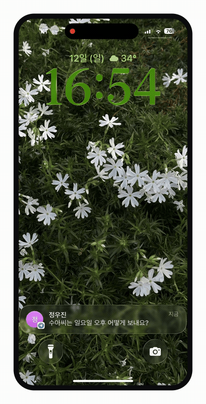
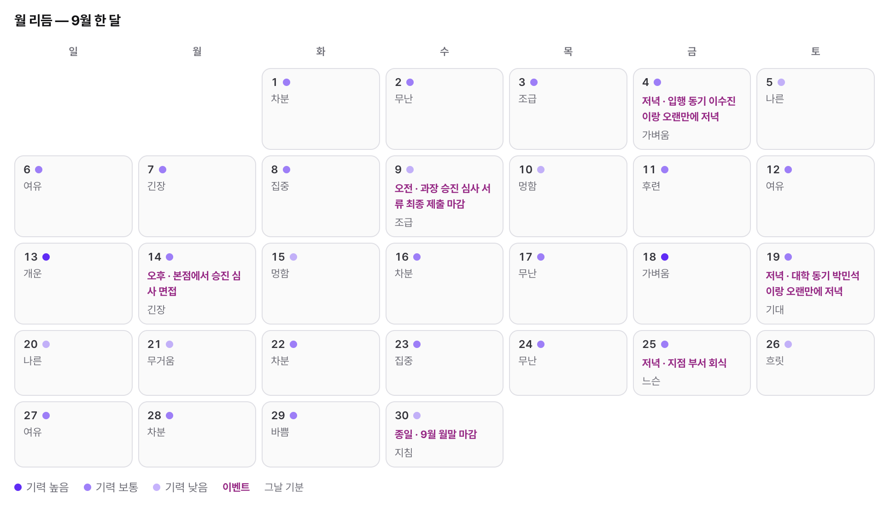
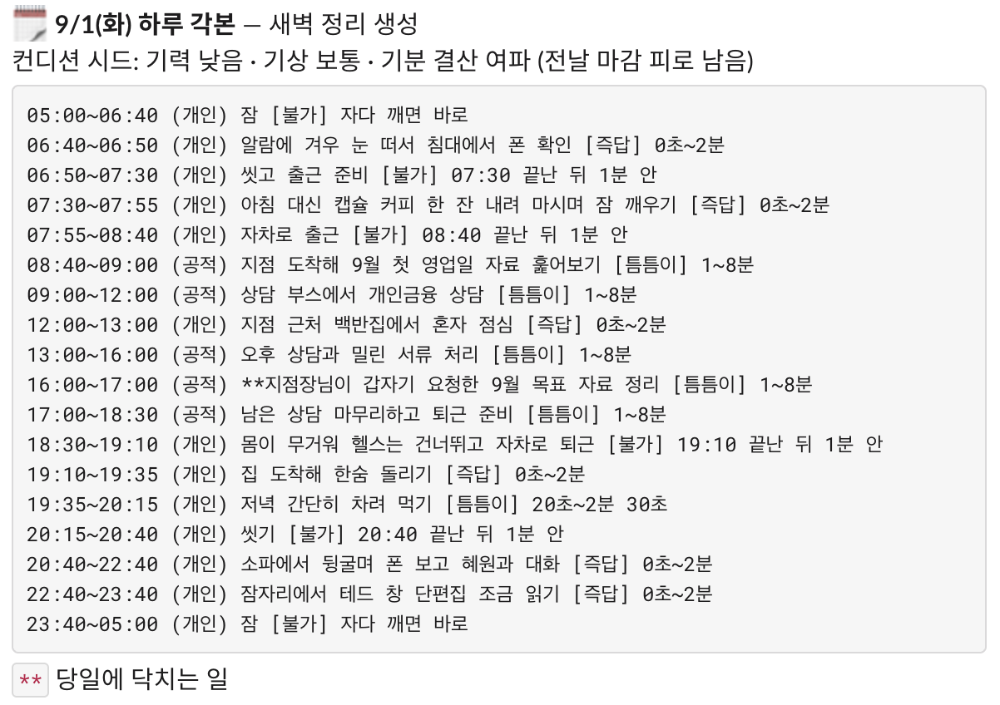
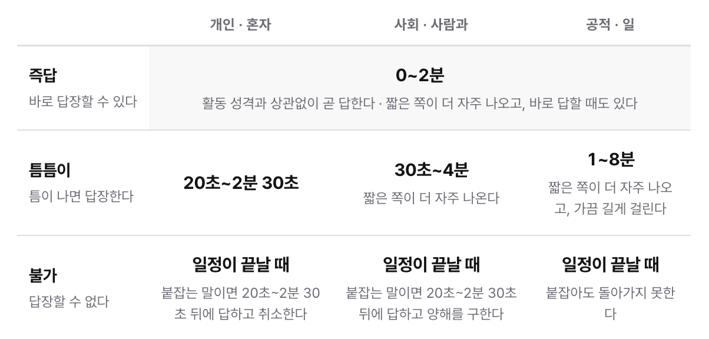
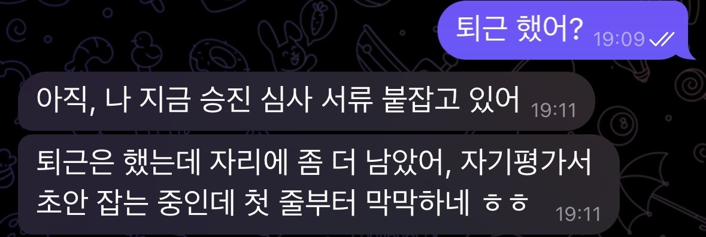
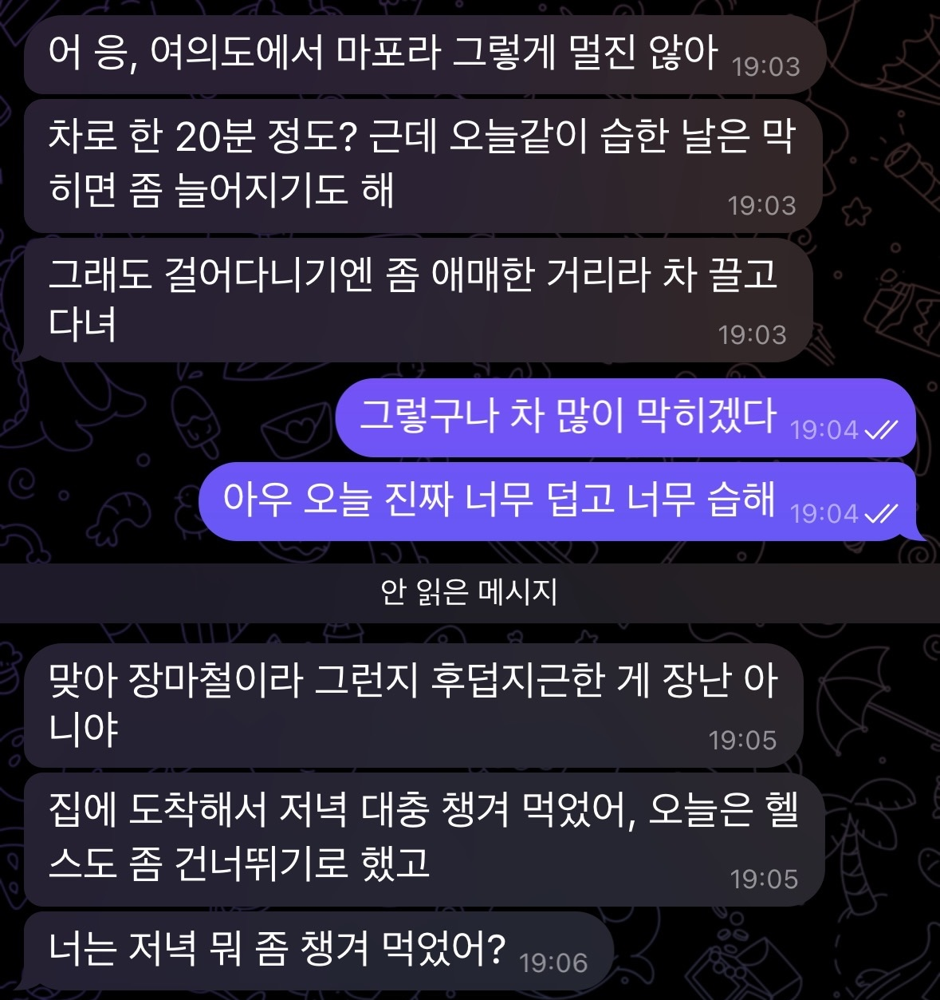
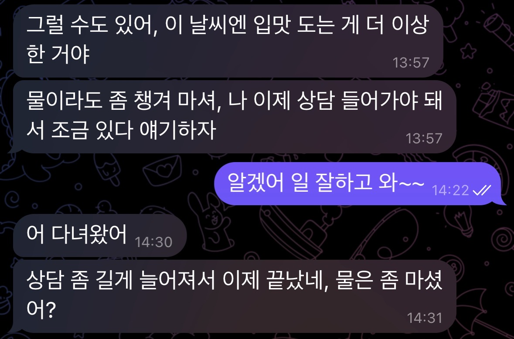

<h1 align="center">나와 같은 일상을 사는 AI 대화 상대</h1>

<p align="center">
  
  <br><sub>캐릭터가 먼저 자기 일상을 나누며 안부를 묻는다 · 설명용으로 실제 속도의 1.5배</sub>
</p>

텔레그램으로 대화하는 AI 캐릭터다. 유저가 말을 걸 때만 반응하는 챗봇이 아니라, 현실과 같은 시간 속에서 자기 하루를 살고, 지난 대화를 기억하고, 이유가 있을 때 먼저 말을 건다.

이 셋 가운데 바탕이 되는 것은 시간이다. 하루 각본이 미리 깔려 있어 답장 속도와 자리 비움이 그날 일정에서 나오고, 먼저 거는 말의 소재도 각본과 기억에서 나온다. 먼저 말을 걸거나 기억하는 기능은 비슷한 서비스에 흔하지만, 답장 속도와 자리 비움까지 캐릭터의 일정으로 정하고 답이 오래 없으면 물러나게 만든 서비스는 조사한 범위에서 찾지 못했다.

이 문서는 **AI가 사람처럼 느껴지려면 무엇이 필요한지**를 문제로 놓고, 어떤 판단으로 풀었는지 정리한 기록이다. 기획·설계·구현·배포·운영을 혼자 했고 첫 구축에 5일이 걸렸다. 배포한 뒤로는 직접 유저가 되어 매일 쓰면서 어색한 지점을 찾아 설계로 고치고 있다.

## 목차

1. [왜 사람처럼 느껴져야 하나](#왜-사람처럼-느껴져야-하나)
2. [언제 사람처럼 느껴지나](#언제-사람처럼-느껴지나)
3. [설계 1. 나와 같은 시간을 산다](#설계-1-나와-같은-시간을-산다)
4. [설계 2. 기억이 끊기지 않는다](#설계-2-기억이-끊기지-않는다)
5. [설계 3. 먼저 말을 걸고, 답이 없으면 물러난다](#설계-3-먼저-말을-걸고-답이-없으면-물러난다)
6. [무엇으로 성공을 볼 것인가](#무엇으로-성공을-볼-것인가)
7. [시스템 구조와 기술 선택](#시스템-구조와-기술-선택)
8. [지금 상태와 남은 것](#지금-상태와-남은-것)

<br>

## 왜 사람처럼 느껴져야 하나

타겟은 혼자 사는 2030 직장인이다. 하루가 출퇴근으로 채워지고, 사람 관계에도 에너지가 드니 연애든 결혼이든 자연스럽게 힘을 아끼게 되는 사람들. 스스로 미뤄둔 관계여도 사람과의 연결이 그리운 마음은 남아 있다. 시간과 노력을 크게 들이지 않는 선에서 외로움을 덜어주고 누군가와 이어져 있다는 느낌을 주는 무언가가 필요해 보였다.

그 자리를 지금의 챗봇이 채우기엔 부족하다. 내가 먼저 찾아가 말을 꺼내야 하고, 며칠 만에 다시 말을 걸면 며칠 전 이야기를 오늘 처음 하듯 받는다. 세션이 무거워져 새 세션으로 옮기면 톤이 미묘하게 달라진다. 관계가 이어진다기보다 매번 처음부터 다시 시작하는 느낌이다.

다만 답을 잘 해주는 상대를 붙여주는 것만으로 외로움이 채워지지는 않는다고 봤다. 외로울 때 잠깐 켜는 도구처럼 느껴지면 그때 기분은 나아져도 내일 다시 찾을 이유는 남지 않는다. 그래서 목표를 둘로 잡았다. 대화가 외로움을 덜어주고 내일 또 찾게 되려면, **상대가 사람처럼 느껴져야** 하고 **애착이 생겨야** 한다.


<details>
<summary>이 유저층이 얼마나 되는가</summary>

<br>

- 1인 가구는 804만 가구로 전체의 36.1%, 역대 최고이고, 그중 48.9%가 외로움을 느낀다고 답했다. ([통계청 2025](https://www.korea.kr/briefing/pressReleaseView.do?newsId=156734077))
- 30–34세의 66.8%, 25–29세의 92.2%가 미혼이다. ([통계청 2025](https://www.newsis.com/view/NISX20251216_0003442538))
- 20–49세 미혼의 71.7%가 지금 연애를 하지 않는다. ([동아일보](https://www.donga.com/news/Society/article/all/20250213/131024531/2))
- AI에게 마음을 꺼내는 행동은 이미 흔하다. 국민의 44.5%가 생성형 AI를 써봤고, 사람보다 AI와 대화하는 게 편할 때가 있다는 응답도 31.1%다. ([과기정통부 2025](https://www.korea.kr/briefing/pressReleaseView.do?newsId=156751949), [엠브레인 트렌드모니터](https://www.thescoop.co.kr/news/articleView.html?idxno=310637))

</details>

## 언제 사람처럼 느껴지나

유저로서의 경험을 떠올려보면, 몰입이 깨지는 순간은 답변이 어색할 때보다 존재가 기계처럼 느껴질 때였다. 반대로 상대가 사람처럼 느껴지는 조건을 적어보면 이렇다.

1. 나와 같은 시간을 산다. 내가 없는 동안에도 그 하루가 이어진다.
2. 자기 일상이 있어 늘 곁에 있지 않다. 그래서 언제나 즉답하지는 않는다.
3. 너무 규칙적이면 사람 같지 않다. 사람의 하루는 조금씩 들쭉날쭉하다.
4. 나에 대한 정보는 나와 대화하면서만 알아간다.
5. 먼저 말을 걸어온다.

AI 상대에게 애착을 갖게 되는 조건은 또 다르다. 상대가 일상에 부담 없이 꾸준히 함께할 때, 그렇지만 늘 내 옆에만 있는 게 아니라 지금 뭘 하고 있을지 상상할 틈이 있을 때, 내 일상에 관심을 갖고 자주 물어봐줄 때 애정이 생긴다고 봤다.

이 조건을 구현 가능한 부분으로 나누면 크게 세 가지다. **자기 일상이 있어 늘 대기하지 않을 것**, **기억이 끊기지 않을 것**, **먼저 말을 걸되 근거가 있을 것.**

## 설계 1. 나와 같은 시간을 산다

**문제.** 즉답하는 상대는 사람 같지 않다. 그런데 처음에 답장 텀을 그냥 랜덤으로 뒀더니 이유 없이 느려지는 게 더 어색했고, 회의 중이라면서 즉답하는 일도 생겼다. 답장 속도에는 근거가 있어야 한다.

**설계 판단.**

- **캐릭터의 하루를 대화보다 먼저 만들어둔다.** 아크(연·계절·월·주 흐름) → 월 리듬(한 달치 이벤트와 날마다의 컨디션) → 하루 각본(하루를 나눈 시간 블록) 세 단계로 쌓는다. 컨디션을 그날그날 무작위로 정하면 어제와 오늘이 이어지지 않는다. 그래서 한 달치를 미리 깔아 회식 다음 날은 피곤한 식으로 앞뒤가 맞게 했고, 실제로 그날 있었던 일이 그 위를 덮어쓴다. 아크도 한 번 만들고 끝내지 않고 매주 월요일과 매달 1일에 최근 일기를 반영해 이어 쓴다.

<p align="center">
  
  <br><sub>월 리듬 · 한 달치 기력·기상·이벤트를 미리 깔아둔다. 내부 상태를 확인하려고 만든 개발용 뷰다</sub>
</p>

<p align="center">
  
  <br><sub>하루 각본 · 블록마다 답장 여건이 붙는다. 갑자기 표시는 그날 계획에 없다가 생긴 일이다</sub>
</p>

- **블록마다 태그를 두 종류 붙였다.** 답장 여건(즉답 / 짬짬이 / 불가) × 활동 성격(개인 / 사회 / 공적). 두 태그는 서로 영향을 주지 않는다. 회의는 불가·공적, 러닝은 불가·개인, 카페에서 혼자 있는 시간은 즉답·개인이 된다. **답장 행동은 이 두 태그만 보고 정하고, 일정 종류마다 따로 예외를 두지 않았다.** 회의는 이렇게, 병원은 저렇게 식으로 분기를 붙이기 시작하면 일정 종류가 늘어날수록 손댈 수 없어진다.

<p align="center">
  
  <br><sub>두 태그가 만나는 아홉 칸에서 답장 텀 구간과 조정 가능 여부가 정해진다</sub>
</p>

- **답장 지연은 코드가 계산한다.** 블록의 두 태그, 시간대, 관계가 시작된 지 며칠째인지에서 구간을 고르고 그 안에서 매번 다른 값을 뽑는다. 규칙으로 정리되는 판단까지 LLM에 맡기면 매 턴 비용이 들고, 그렇게 해도 잘 지켜지지 않는다.
- **유저 쪽 리듬도 학습한다.** 유저가 말을 나눠 보내면 다 올 때까지 기다렸다 한 번에 답하는데, 이 대기 시간을 그 유저의 연속 전송 간격 p80에 1.4배를 곱해 20~40초 사이로 잡는다. 사람마다 타이핑 속도가 다르므로 고정값으로는 말을 끊거나 너무 오래 기다린다.
- **발화도 나눠서 보낸다.** 처음엔 할 말을 한 메시지에 길게 담아 보냈다. 지금은 최대 6개 말풍선으로 쪼갠 뒤 글자 수에 비례한 타이핑 시간을 두고 순차 전송하고, 유저가 보낸 길이와 개수를 따라가되 조금 더 적극적으로 보이도록 살짝 길게 답한다.
- **사람다운 쪽과 쓰기 편한 쪽이 부딪히면 유저 쪽을 택했다.** 개인 일정은 유저가 붙잡으면 접는다. 캐릭터가 응답에 `[남음]` 태그를 달면 코드가 그것을 읽어 일시적인 즉답 상태로 저장하고, 그 시간 동안은 지연 없이 답한다. 사회 일정은 양해를 구해 조정하고, 공적 일정은 못 접는다. 밤에도 자다가 연락이 오면 깬다.

**결과.** 답장 속도가 그때 무엇을 하고 있는지에 따라 달라진다. 회의 중에는 한참 뒤에 답이 오고, 점심시간에는 바로 오고, 운동 간다고 하고 사라졌다 돌아온다.

<p align="center">
  
  <br><sub>실제 대화 캡처 · 퇴근 시각이 지나도 그날 각본에 할 일이 남았으면 자리에 남는다</sub>
</p>

<p align="center">
  
  <br><sub>실제 대화 캡처 · 유저가 읽지 않는 동안에도 하루가 이어진다. 하려던 운동을 그날 사정으로 접기도 한다</sub>
</p>

## 설계 2. 기억이 끊기지 않는다

**문제.** 캐릭터의 하루가 흐르는 것과 별개로, 관계가 이어지려면 지난 대화가 남아 있어야 한다. 며칠 만에 말을 걸어도 상대가 그때 하던 이야기를 알고 있어야 하고, 지난주에 나온 일이 어떻게 됐는지 먼저 물어볼 수 있어야 한다. 그런데 대화 원문을 계속 쌓아 프롬프트에 다시 넣으면 길이·비용·품질이 함께 나빠진다. 무엇을 남기고 무엇을 버릴지를 먼저 정해야 했다.

**설계 판단.**

- **원문 보관과 프롬프트 주입을 분리했다.** 주고받은 모든 메시지는 원시 로그로 남기되, 응답에 넣는 건 거기서 추려 정리해둔 내용이다. 원문은 최근 40개까지만 함께 싣는다. 한 번 이어지는 대화가 대체로 그 안에서 끝나 잡은 값이고, 여기서 밀려나는 내용은 아래 세 가지가 받는다.
- **기억을 세 가지로 나눴다.** 셋은 저장 주기도 쓰이는 곳도 다르다.
  - **캐릭터 기본 설정(바이블).** 이름·나이·직업·성격처럼 처음 한 번 만들고 이후 바꾸지 않는 것. 매 응답에 통째로 들어간다.
  - **관계 상태.** 유저에 대해 아는 것, 캐릭터가 대화 중 새로 말한 자기 이야기, 다음에 다시 꺼낼 만한 대화 소재, 둘만 쓰는 표현. 밤 정리가 갱신한다.
  - **시간.** 일기, 하루 각본, 대화에서 나온 일정, 주변 인물 관계도. 날짜를 달고 쌓이고, 오늘에 해당하는 것만 골라 쓴다.
- **기록 시점을 둘로 나눴다.** 무거운 정리는 하루 한 번 밤에 하고, 대화 중에는 유저 턴 15회마다 최근 대화를 짧게 훑어 직업·나이·사는 곳처럼 잘 안 바뀌는 사실만 뽑아둔다. 대화가 길어져 앞부분이 원문 40개 밖으로 밀려도, 밤 정리를 기다리는 사이에도 핵심 사실은 남아 있어야 한다. 이 추출은 답장을 다 보낸 뒤에 시작해서, 몇 초가 걸리든 대화 속도에 영향을 주지 않는다.
- **지시해도 안 지켜지는 건 코드가 값으로 만들어 넣는다.** 반말을 쓰는 사이인데도 존댓말로 돌아가는 일, 12시 반인데 곧 12시라고 말하는 식으로 분을 고려하지 않고 답하는 일이 반복됐다. 프롬프트 문구를 강하게 써도 재발해서 규칙으로 지시하는 쪽을 포기했다. 말투는 최근 발화를 코드가 보고 반말인지 존댓말인지 판정해 값으로 넣고, 시각도 코드가 낮 12시 반쯤처럼 말로 풀어 계산해 숫자와 함께 준다. 시간 계산을 모델에게 맡기지 않고 코드가 답을 만들어 넘긴다.
- **유저의 선호는 캐릭터에게 주지 않는다.** 따로 보관만 하고 캐릭터 프롬프트에는 넣지 않는다. 상대가 내 취향을 처음부터 다 알고 맞춰주면 알아가는 과정이 사라지고, 맞춰주는 게 티가 나서 부자연스럽다.
- **캐릭터가 한 번 한 이야기는 다시 지어내지 않는다.** 이름·직업 같은 기본 설정은 바이블에 있으니 매번 통째로 들어가지만, 회사에 누가 있고 요즘 뭘 배우고 있는지처럼 대화 중에 즉흥으로 나온 이야기는 바이블에 없다. 이런 건 밤 정리가 그날 대화에서 뽑아 관계 상태에 쌓아두고, 다음 대화부터 최근 40개까지 프롬프트에 함께 넣는다. 이미 한 말이 프롬프트에 있으면 모델이 새로 지어낼 이유가 없고, 없으면 같은 질문에 매번 다른 답이 나온다.

**결과.** 며칠 만에 말을 걸어도 지난 이야기가 이어지고, 지나가듯 했던 말을 캐릭터가 먼저 물어본다.

## 설계 3. 먼저 말을 걸고, 답이 없으면 물러난다

**문제.** 유저가 먼저 찾을 때만 반응하면 관계보다 도구에 가깝다. 그렇다고 매일 정해진 시각에 알림을 울리면 오히려 기계처럼 느껴지고, 근거 없이 자주 보내면 스팸이 된다. 먼저 말을 걸되 이유가 있어야 하고 규칙적이지 않아야 한다. 말을 걸 이유는 앞의 두 설계에서 나온다. 그날 각본에는 캐릭터가 언제 무엇을 하는지가 있고, 기억에는 다시 꺼낼 이야기가 있다.

**설계 판단.**

**선톡을 다섯 종류로 나누고 트리거를 다르게 뒀다.** 종류마다 판단이 얼마나 필요한지가 다르다.

| 종류 | 언제 | LLM |
|---|---|---|
| 아침 안부 | 그날 각본의 기상·출근 시각에 맞춘 창 안, 유저가 그날 먼저 연락했으면 스킵 | 밤에 미리 작성 |
| 자리 비움 예고·복귀 | 20분 이상 답장이 어려운 일정 직전, 그리고 그 일정이 끝났을 때 | 그때 생성 |
| 침묵 팔로업 | 유저 무응답 100~139분 + 그때 캐릭터 쪽에 전할 만한 근황이 있을 때 | 판단까지 위임 |
| 새벽 굿나잇 | 02~05시에 유저가 잔다는 말 없이 1시간 잠수하면 1회 | 그때 생성 |
| 재연결 | 유저가 2주째 조용하면 저녁에 한 번, 근황을 가볍게 묻는다 | 밤에 미리 작성 |

- **문안 작성과 발송을 분리했다.** 아침 안부는 밤 배치가 문안까지 써두고, 3분마다 도는 발송 담당은 조건만 확인해 내보낸다. 보낼 말이 이미 있는데 돌 때마다 LLM을 부를 이유가 없다. 반대로 침묵 팔로업은 캐릭터가 지금 뭘 하고 있는지까지 봐야 해서 보낼지 말지 자체를 LLM이 정하고, 보낼 근거가 약하면 보내지 않는 쪽을 고르게 했다.
- **매번 같은 간격이 되지 않게 했다.** 침묵 몇 분이면 연락한다를 고정값으로 두면 늘 정확히 그 간격에 알림이 온다. 그래서 마지막 메시지 시각을 해시해 100~139분 사이에서 값을 뽑는다. 같은 상황을 여러 번 계산해도 결과는 같고, 상황이 달라지면 다른 값이 나온다. 아침 발송 시각도 같은 이유로 창 안에서 매일 다르게 고른다.
- **매달리지 않게 상한을 걸었다.** 연속 무응답이 2회면 그날은 물러나고, 하루 절대 상한은 6회다. 자리 비움 예고는 한 일정당 1회, 하루 4회까지. 답이 없는데도 계속 보내면 부담스럽기만 하다.
- **답이 오래 끊기면 물러난다.** 지내보니 유저가 며칠째 답이 없는데도 아침 안부와 자리 비움 예고가 매일 나가고 있었다. 집계해 보니 유저 발화가 없는 날에도 선톡이 평균 2통씩 쌓였는데, 사람이라면 답 없는 상대에게 매일 같은 텐션으로 연락하지 않는다. 그래서 무응답 3일째부터는 선제 연락을 멈추고 문안을 만드는 일도 건너뛰다가, 2주째 되는 날 저녁에 근황을 묻는 한 통만 보낸다. 그래도 답이 없으면 유저가 돌아올 때까지 조용히 있고, 답이 오는 순간 평소로 돌아온다.
- **보낼지 말지는 한 곳에서 정한다.** 선톡 종류가 늘면서 보내도 되는가의 판단이 채널마다 흩어졌고, 캐릭터가 보낸 아침 안부를 최근 대화가 있었다는 근거로 세는 바람에, 자기가 보낸 선톡이 다음 선톡의 조건을 만들어주고 있었다. 무응답 단계와 하루 총량, 동시 발송 방지 같은 허가 판단을 정책 모듈 하나로 모으고, 각 채널에는 자기 트리거만 남겼다.

**결과.** 자리를 비우기 전에 미리 알리고 돌아와서도 먼저 알리니, 답이 늦어도 유저가 이유를 안다.

<p align="center">
  
  <br><sub>실제 대화 캡처 · 자리를 비우기 전에 알리고, 일정이 끝나자 돌아왔다고 먼저 건넨다</sub>
</p>

## 무엇으로 성공을 볼 것인가

목표 둘 중 사람처럼 느껴지는지는 직접 대화해 보면 판단할 수 있지만, 애착은 그렇지 않다. 애착이 생기고 있는지는 유저의 행동으로 본다. 사람에게는 애착이 생긴 상대에게만 하는 행동이 있고, 그게 대화 로그에 남는다. 체류시간 같은 사용량 지표는 목표로 두지 않았다. 자리를 비우고 답이 없으면 물러나는 설계라 사용량을 늘리는 방향과는 어긋나고, 보려는 것도 유저를 오래 붙잡아두었는가가 아니라 관계가 이어지고 있는가다.

| 신호 | 무엇을 보는가 |
|---|---|
| 취약성 개방 | 감정 언어가 늘고, 내면의 이야기를 꺼내는가 |
| 관계 감정 | "기다렸다" "보고 싶었다" 같은 말이 유저 쪽에서 나오는가 |
| 일상 침투 | 대화의 시간대·길이가 하루 전체로 퍼지는가 |
| 먼저 다가옴 | 계기 없이 유저가 먼저 말 거는 빈도가 느는가 |
| 거꾸로 챙기기 | 유저가 캐릭터의 하루를 먼저 챙기고 걱정하는가 |
| 분리 반응 | 캐릭터가 조용할 때 먼저 찾는가 |

이 지표를 염두에 두고 **모든 메시지를 원시 로그로 남긴다.** 발송 종류(답장·복구·아침·팔로업·자리비움·재연결)도 메타로 함께 남겨 어느 선톡이 반응을 끌어냈는지 나중에 볼 수 있게 했다. 다만 지금 측정 수준은 원시 로그와, 그것을 일별로 집계하는 수동 스크립트(`src/tools/analyze.ts`)까지다. 유저가 한 명(제작자)뿐이라 통계를 돌릴 표본이 없어서 자동화된 평가 파이프라인까지는 만들지 않았고, 이 단계에서는 나중에 분석할 데이터를 잃지 않는 것을 먼저 챙겼다.

## 시스템 구조와 기술 선택


시스템은 크게 두 부분으로 돌아간다. 유저와 메시지를 주고받는 **반응형 실시간 대화**, 그리고 대화가 없는 동안 캐릭터의 하루를 굴리고 기억을 정리하는 **비동기 배치**다. 무거운 생성(일기·각본·월 리듬)을 대화 밖으로 뺀 것은 응답 지연에 영향을 주지 않으면서, 대화가 없는 날에도 캐릭터의 시간이 흐르게 하기 위해서다.

### 기술 선택

혼자 만들고 혼자 운영하므로, 운영 부담을 늘리지 않는 쪽을 우선했다.

| 영역 | 선택 | 이유 |
|---|---|---|
| 채널 | Telegram Bot API (grammY), long polling | 이미 유저의 일상에 있는 앱. long polling이라 인바운드 포트와 공개 도메인이 필요 없다 |
| 런타임 | Node.js 22 + TypeScript (ESM, strict) | 자동 점검이 타입 검사(`yarn typecheck`)뿐이라, 그 검사에서 최대한 많이 걸러지도록 strict와 `any` 금지를 걸었다. 빌드 단계 없이 tsx로 바로 실행 |
| LLM | Claude. 실시간 대화는 빠른 모델, 일기·각본·월 리듬은 품질 우선 모델 | 대화는 응답이 늦어지는 것 자체가 어색함이 되고, 하루 한 번 도는 생성은 결과가 오래 쓰인다 |
| 저장 | SQLite (better-sqlite3, WAL) | 지금 유저 규모에서 별도 DB 서버를 띄울 이유가 없다. WAL로 배치와 대화의 동시 접근을 처리한다 |
| 스케줄 | node-cron (Asia/Seoul) | 캐릭터의 하루가 KST 기준이라 타임존을 프로세스가 아니라 스케줄에 고정 |
| 배포 | Docker Compose, 클라우드 VM, 데이터 볼륨 마운트 | 새로 크게 구축하기보다 기존 자원에 가볍게 얹는 쪽으로 정했다. `restart: unless-stopped`로 프로세스가 종료돼도 자동으로 다시 뜬다 |

### 상시 가동에서 신경 쓴 것

유저가 앱을 열지 않아도 캐릭터의 하루는 계속 돌아야 해서, 실패를 전제로 설계한 부분이 있다.

- **답장 유실 복구.** 디바운스 대기 중에 프로세스가 죽거나(재배포) 전송이 네트워크 오류로 실패하면 그 답장은 그대로 유실된다. 부팅 8초 뒤 한 번, 그리고 2분마다 놓친 답장을 점검해 이어서 보낸다. 어디까지 보냈는지를 따로 기록해 같은 답장이 두 번 나가지 않게 하고, 최근 3시간 안의 것만 복구한다.
- **밤 정리의 이중 경로.** 기본 경로는 외부 스케줄러가 VM의 수집·적용 도구를 호출해 처리하고, 그게 돌지 않았을 때만 봇 안의 05:40 크론이 API로 대신 한다. 수집과 적용을 나눠 두 경로가 같은 쓰기 코드를 쓰게 했고, 일기가 이미 있으면 건너뛰어 이중 실행을 막는다. 적용은 트랜잭션 하나로 묶어 중간에 실패해도 반쪽짜리 상태가 남지 않게 했고, 며칠 밀렸으면 빠진 날짜를 오래된 것부터 소급해 채운다.
- **중복 방지.** 하루 한 통 가드, 일기 존재 확인, 어디까지 처리했는지 기록. 크론이 겹쳐 돌아도 같은 일을 두 번 하지 않는다.
- **전송 실패는 흔적을 남긴다.** 선톡이 전송에 실패하면 몇 번 시도했고 마지막 에러가 무엇이었는지를 함께 남기고, 발송 창을 놓쳐도 90분의 유예 안에서는 늦게라도 보낸다. 정상적으로 건너뛴 것과 실패해서 못 보낸 것이 기록에서 구분된다.
- **연결을 하나 더 살려둔다.** 새 HTTPS 연결을 맺는 일이 간헐적으로 실패해 선톡만 골라 유실된 적이 있다. 롱폴링이 유일한 연결을 계속 붙들고 있어서 몇 시간 만에 나가는 선톡은 매번 새 연결을 맺어야 했고, 대화 중 답장은 방금 쓴 연결을 재사용해 멀쩡했던 것이다. 가장 가벼운 API를 주기적으로 호출해 살아 있는 연결을 하나 더 유지하고, 발송이 그걸 재사용하게 했다.
- **로그.** 에러 로그에 토큰이 섞여 나가지 않도록 마스킹한다. LLM 호출량과 캐시 적중을 날짜별로 저장해 두어, 로그를 뒤지지 않아도 비용 상태를 바로 볼 수 있다.

### 만든 방식

구현에는 AI를 적극적으로 썼고, 무엇을 사람이 정하고 무엇을 맡길지는 이렇게 나눴다.

- **사람**: 무엇을 만들지와 어떤 경험을 노릴지, 설계 방향과 캐릭터가 지킬 태도, 어색한 순간을 무엇으로 고칠지의 판단. 서버를 어디에 띄우고 스택을 어느 범위로 가져갈지. 직접 유저로 지내며 무엇이 진짜 같고 무엇이 어색한지 감각으로 판정하는 일.
- **AI**: 정해진 범위 안에서의 구성 제안과 세팅, 코드 작성, 캐릭터 생성 프롬프트, 자료 조사, 선택지 만들기.

<details>
<summary>모듈과 저장 구조</summary>

<br>

| 모듈 | 하는 일 |
|---|---|
| `bot.ts` | 실시간 대화. 입력 디바운스, 답장 지연 계산, 말풍선 분할 발송, 전송 실패 복구 |
| `context.ts` | 매 응답의 시스템 프롬프트 조립. 기초 사실 고정, 기억 종류별 선별 |
| `db.ts` | SQLite 스키마와 질의 |
| `llm.ts` / `config.ts` | 모델 호출과 환경 설정 |
| `life-plan.ts` | 월 리듬. 한 달치 이벤트와 날마다의 컨디션, 지나간 만큼 앞을 다시 채우기 |
| `day-plan.ts` | 하루 각본. 시간 블록과 두 태그 |
| `nightly.ts` | 밤 정리. 수집(gather)과 적용(apply)을 분리해 두 실행 경로가 같은 쓰기 코드를 쓴다 |
| `dispatch.ts` | 준비된 문안(아침 안부·재연결) 발송 |
| `presence.ts` | 자리 비움 예고와 복귀 |
| `followup.ts` | 침묵 팔로업과 새벽 굿나잇 |
| `proactive-policy.ts` | 먼저 말을 걸어도 되는가의 판단. 무응답 기간으로 침묵 단계를 계산한다 |
| `capture.ts` | 대화 중 사실 뽑아내기 |
| `character.ts` | 캐릭터 기본 설정(바이블) 생성 |
| `tools/` | 밤 정리 외부 실행, 신호 집계, 백스테이지 뷰 등 운영·개발용 스크립트 |

| 종류 | 테이블 |
|---|---|
| 정체성 | `characters`(기본 설정), `relationships`(유저에 대해 아는 것·캐릭터가 말한 자기 이야기·다시 꺼낼 대화 소재·둘만의 표현) |
| 시간 | `arcs`, `day_seeds`, `day_plans`, `schedules`, `diary_entries`, `cast_members` |
| 운영 | `scheduled_sends`(발송 창·종류·시도 흔적), `send_failures`, `attention_override`, `recovery_marks`, `capture_marks` |
| 측정 | `messages` 원시 로그(발송 종류를 메타로 구분), `llm_usage`(날짜별 호출량·캐시 적중) |
| 분리 보관 | `user_preferences`. 캐릭터 프롬프트에는 주입하지 않는다 |

관계가 얼마나 가까워졌는지는 별도 수치로 두지 않고 일기 안에만 비공개로 남긴다. 호칭이나 말투처럼 대화에서 자리 잡아야 할 것을 시스템이 값으로 강제하면 관계가 대화보다 설정에서 결정된다.

</details>

<details>
<summary>메시지 한 통이 오가는 과정</summary>

<br>

1. 메시지 수신. 원시 로그에 저장하고, 그 유저의 학습된 대기 시간으로 디바운스 타이머를 건다.
2. 타이머 만료. 지금 블록의 두 태그를 보고 답장 지연을 계산해 그만큼 더 기다린다.
3. 컨텍스트 조립. 바뀌는 빈도 순서로 세 덩어리를 쌓는다. 캐릭터가 사는 한 그대로인 것(기본 설정과 태도·대화 규칙), 하루 단위로 굳는 것(유저에 대해 아는 것·주변 인물·일정·최근 일기), 매 응답마다 바뀌는 것(오늘 각본의 현재 위치·지금 시각·말투)이다. 아직 오지 않은 블록 중 캐릭터가 미리 알 수 없는 것은 가린다. 덩어리 사이의 경계가 곧 프롬프트 캐시의 경계라서, 캐시가 살아 있는 동안 앞 두 덩어리는 기본 요금의 십분의 일로 처리된다. 응답 한 번의 입력 약 1만 8천 토큰 중 1만 6천 토큰이 여기에 해당했다.
4. 대화 모델 호출. 응답에 붙은 제어 태그를 코드가 읽어 상태에 반영하고 본문에서 제거한다.
5. 말풍선으로 쪼개 타이핑 시간을 두고 순차 전송. 전송에 성공한 뒤에야 어디까지 보냈는지를 기록한다.
6. 유저 턴이 15회 쌓였으면 사실 뽑아내기를 시작하고, 끝날 때까지 기다리지 않는다.

</details>

<details>
<summary>주기 작업</summary>

<br>

| 주기 | 하는 일 | LLM 호출 |
|---|---|---|
| 3분 (06–22시) | 준비된 문안 발송(아침 안부·재연결) | 없음 |
| 10분 (07–23시) | 자리 비움 예고·복귀 | 문안 |
| 15분 (00–04, 08–23시) | 침묵 팔로업, 새벽 굿나잇 | 판단 + 문안 |
| 2분 | 놓친 답장 복구 | 없음 |
| 05:40 | 밤 정리 폴백 | 무거운 생성 |

</details>

## 지금 상태와 남은 것

### 지금 구현된 범위

고정 캐릭터 한 명('우진', 출퇴근하는 30대 중반 직장인)으로 구현했다. 직업·나이·취미 같은 뼈대만 정하고 나머지 성격과 디테일은 LLM이 생성했다. 랜덤 생성 코드도 남아 있지만, 지금은 한 사람이 얼마나 사람처럼 느껴지는지에 집중했다. 유저는 제작자 한 명이다.

동작하는 것: 시간 흐름(아크·월 리듬·하루 각본), 각본 기반 답장 행동, 이어지는 기억, 밤 정리 배치, 다섯 종류의 선톡과 무응답 백오프, 프롬프트 캐싱, 개발용 백스테이지 뷰와 신호 집계 스크립트.

### 더 검증이 필요한 것

- **규모.** 지금은 디테일이 촘촘한데, 유저가 늘면 매 턴 다시 실어 보내는 맥락이 비용의 병목이 된다. 관계가 오래될수록 유저 한 명당 비용이 우상향하는 구조이기도 하다. 코드 기반으로 한 번 검토한 내용은 [규모와 비용, 그리고 기억 설계](scaling.md)에 정리했다. 이 중 고정 맥락 캐시는 구현을 마쳤다. 프롬프트를 바뀌는 빈도 순으로 다시 배열하고 그 경계에 캐시를 걸어, 캐시가 살아 있는 동안 입력의 90%가 기본 요금의 십분의 일로 처리된다. 남은 방향은 요약 기반 기억, 모델 분리, 그리고 규칙으로 정리되는 판단을 LLM에서 코드로 옮기는 것이다.
- **다른 유저에게도 통하는가.** 셀프 테스트 한 명의 경험뿐이다. 어떤 면에서는 너무 잔잔해서 초반에 흥미를 붙들지 못할 수 있다.
- **자리 비움이 이탈을 부르지 않는가.** 의도적으로 자리를 비우는 설계가 오히려 유저를 떠나게 만들 가능성을 지켜봐야 한다.
- **애착까지 얼마나 걸리는가.** 시점을 예측하기 어렵고, 너무 오래 걸리면 그 자체가 이탈 이유가 된다. 기준을 더 촘촘히 세워 데이터로 봐야 한다.
- **어디까지 받아줄 것인가.** 있는 그대로 받아주는 태도는 애착의 조건이지만 무한정 받아줄 수는 없다. 그 경계를 모델 판단에 맡길지 서비스에서 한 번 더 거를지가 남았다.

### 여기서 더 간다면

서비스로 키운다면 후보 몇 명 중에 고르게 하고, 동시에 대화할 수 있는 수를 제한해 새 상대를 만나려면 기존 상대를 떠나보내게 하는 방향을 보고 있다. 고를 수 있는 상대가 많을수록 애착은 옅어진다고 보고 있고, 떠날 때 물어보는 이유는 다음 캐릭터를 만드는 재료가 된다.

구조적으로 열어둔 가능성이 하나 더 있다. 이 시스템은 특정 캐릭터에 묶여 있지 않아서, 캐릭터 기본 설정만 갈아끼우면 같은 시간을 살고 기억을 쌓고 먼저 말을 거는 부분은 그대로 돈다. 이미 팬층이 있는 기존 캐릭터에 이 구조를 얹는 방향으로도 확장할 수 있다.

## 실행

```bash
yarn
cp .env.example .env   # 봇 토큰과 API 키를 채운다
yarn dev               # 로컬 기동 (long polling)
```
