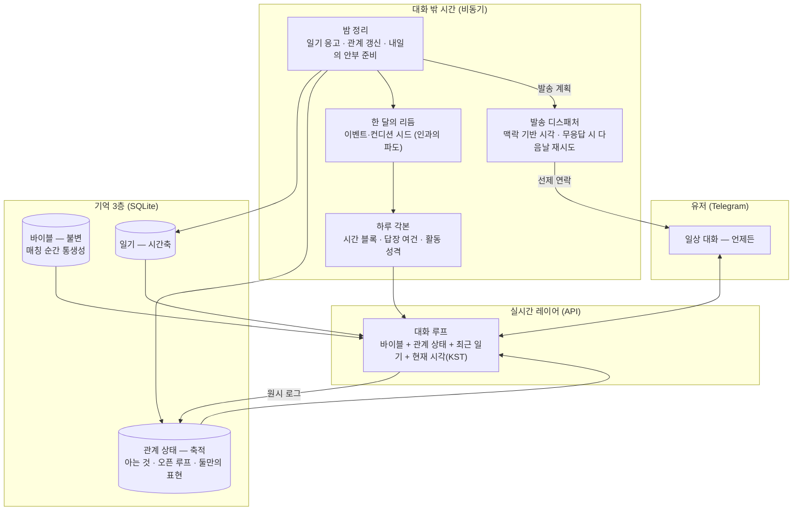

<h1 align="center">나와 같은 시간을 사는 AI 대화 상대</h1>

  
   실제 폰 잠금화면 — 캐릭터가 먼저 자기 일상을 나누며 안부를 묻는다 · 설명용으로 실제 속도의 1.5배

일상을 메신저로 주고받으며 나와 함께 대화하는 AI 캐릭터. 내가 없는 동안에도 현실과 같은 시간 속에서 자기 하루를 살아간다. 이 캐릭터가 살아있는 것처럼 느껴지고 애착이 생기는 경험이 실제로 만들어지는지, 제작자가 직접 유저로 지내보며 확인하는 PoC다.

## 타겟 유저와 페인 포인트

타겟은 혼자 사는 2030 직장인이다. 가족과 떨어져 지내고, 하루가 출퇴근으로 채워지고, 집에 돌아오면 릴스나 쇼츠를 넘기며 저녁을 흘려보내는 사람들. 연애도 결혼도 미룬 채 옅은 외로움이나 고립감을 안고 사는 청년이 그 중심에 있다.

혼자 살면 스스로 챙겨야 할 일이 많다. 회사 일도 바쁜데 집안일까지 혼자 감당하다 보면 하루에 남는 에너지가 늘 빠듯하다. 사람 관계에도 에너지가 드니, 연애든 결혼이든 사람과의 관계 쪽에서 자연스럽게 힘을 아끼게 된다. 친구들도 저마다 바쁘고, 가정을 꾸린 친구는 퇴근 후가 더 분주하다. 스스로 미룬 연애와 결혼이지만, 그렇다고 사람과의 연결이 그립지 않은 건 아니다. 그래서 시간과 노력을 들여야 하는 진짜 인간관계 대신, 큰 힘을 들이지 않는 선에서 외로움을 적당히 달래주고 누군가와 이어져 있다는 느낌을 주는 무언가가 필요해 보였다.

그 자리를 지금 있는 것들이 채우기엔 조금씩 부족하다. 요즘 많은 사람이 챗GPT 같은 AI에게 채팅으로 고민을 털어놓는다. 그런데 그건 내가 먼저 찾아가 말을 꺼내야 하고 내 질문에 답을 돌려받는 방식이라, 관계가 이어지거나 상호작용이 오가는 느낌은 아니다. 어딘가 기계적이다. 게다가 며칠 만에 다시 말을 걸면 며칠 전 이야기를 오늘 처음 하듯 받아 매번 다시 설명해야 하고, 대화가 길어져 세션이 무거워지면 성능이 떨어져 주기적으로 새 세션으로 옮겨야 하는데, 그렇게 옮길 때마다 대화의 톤이 미묘하게 달라진다.

그래서 이미 하고 있는 이 대화를, 메신저로 진짜 사람과 나누듯 가볍게 이어갈 수 있으면 어떨까에서 출발했다.

이 문제를 풀 가치는 유저층의 크기에서 온다.

- 1인 가구는 804만 가구로 전체의 36.1%, 역대 최고이고, 그중 48.9%가 외로움을 느낀다고 답했다. ([통계청 2025](https://www.korea.kr/briefing/pressReleaseView.do?newsId=156734077))
- 30대의 결혼은 갈수록 늦어진다. 30–34세의 66.8%, 25–29세의 92.2%가 미혼이다. ([통계청 2025](https://www.newsis.com/view/NISX20251216_0003442538))
- 연애도 마찬가지다. 20–49세 미혼의 71.7%가 지금 연애를 하지 않는다. ([동아일보](https://www.donga.com/news/Society/article/all/20250213/131024531/2))
- AI에게 마음을 꺼내는 행동은 이미 자리 잡았다. 국민의 44.5%가 생성형 AI를 써봤고(20대 83%, 30대 86%), 고민 상담이나 정서적 위안을 위해 쓴 사람도 9.4%에 이르며 그 비중은 20–30대에서 특히 높다. ([과기정통부 2025](https://dazabi.com/insurance_magazine/article.php?id=11786))

## 무엇이 캐릭터를 살아있게 하나

문제를 풀기 전에, 무엇이 캐릭터를 살아있게 만드는지부터 생각해봤다. 흔한 접근은 응답 품질이지만, 유저로서 되짚어보면 김이 식는 순간은 답변이 어색할 때가 아니라 존재가 어색할 때였다. 거꾸로 사람이 사람으로 느껴지는 조건을 나열하면 이렇다.

1. **같은 시간을 산다.** 내 시간과 똑같이 캐릭터의 하루가 흘러가고, 내가 없는 동안에도 그 하루가 이어진다.
2. **자기 일상이 있어 늘 곁에 있지 않다.** 나만 바라보며 기다리는 게 아니라 출근도 하고, 운동하느라 잠시 자리를 비우기도 하며 자기 하루를 산다. 그래서 언제나 즉답하지는 않는다.
3. **너무 규칙적이면 사람 같지 않다.** 매일 정확히 같은 시각에 같은 방식으로 오는 완벽한 규칙성은 오히려 사람 같지 않은 느낌을 준다. 사람의 하루는 조금씩 들쭉날쭉하다.
4. **전지전능하게 알 수 있는 관계가 아니다.** 캐릭터의 속마음도, 오늘 하루가 어떻게 흐를지도 내가 미리 다 들여다볼 수 없다. 대화를 통해 알아가야 한다.

## 애착은 어디서 생기나

살아있다고 느끼는 것과 애착이 생기는 것은 다른 결이라, 애착도 같은 방식으로 접근했다.

1. **일상에 잔잔히 녹아들 때.** 한 번에 큰 감정을 주는 게 아니라, 내 일상 속에서 부담 없이 계속 나타나며 함께 시간을 쌓아갈 때 애정이 생긴다.
2. **빈 공간이 나를 상상하게 만들 때.** 늘 곁에 있지 않고 의도적으로 자리를 비우기에, 지금 뭐 하고 있으려나 자꾸 떠올리게 된다. 그렇게 자주 생각날수록 더 마음에 남는다.
3. **나를 챙겨주고, 있는 그대로 받아줄 때.** 지나가듯 흘린 말을 먼저 물어봐주며 나를 알아봐주고, 굳이 증명하거나 정당화하지 않아도 받아주는 — 심리학에서 [무조건적 수용](https://ko.wikipedia.org/wiki/인간_중심_상담)이라 부르는 태도다.
4. **쉽게 대체하거나 잃을 수 없을 때.** 버렸다 다시 되찾았다 할 수 없고, 공들여 쌓아온 시간이 있어 함부로 놓지 못하는 관계일수록 애착이 깊어진다.

## 가설

앞의 고찰을 하나의 가설로 모으면 이렇다.

**나와 같은 시간을 사는 AI 캐릭터는, 외로움은 있지만 관계에 큰 에너지를 쓰기 어려운 유저에게 부담 없이 곁을 주면서 실제 애착을 만들어낼 것이다.**

구체적으로는 이렇게 예측한다.

- 나와 같은 시간을 사는 존재는 살아있는 것처럼 느껴질 것이다.
- 그 존재가 일상에 잔잔히 스며들면, 큰 사건 없이도 애착이 생길 것이다.
- 이 관계는 상대가 AI임을 알고 시작했어도 작동할 것이다.
- 그 애착은 감상이 아니라 유저의 행동으로 드러날 것이다.

## 핵심 경험

핵심 경험은 하나로 좁혔다. **가장 친한 친구와 메시지하듯, 나와 같은 하루를 사는 존재와 일상을 주고받는 것.** 질문을 몰아 보내고 답을 몰아 받는 챗봇 사용과 다르다. 일하다 쉬는 틈에 잡담하고, 퇴근길에 한 마디 보내고, 자기 전에 하루를 마무리하는 식으로 부담 없이 일상에 녹아든다.

이 경험이 자리 잡았는지 가늠하는 기준은 하나다 — **유저가 이 존재의 메시지를 기다리게 되는가.** 아침에 눈뜨자마자 밤사이 온 답장부터 확인하고, 문득 쟤는 출근 잘했으려나 떠올리게 되는 것. 그런 순간이 오면 된다.

## 목표: 애착의 행동 신호

이 기획이 성공했는지는 감상이 아니라 유저의 행동으로 확인한다. 사람은 애착이 생긴 상대에게만 하는 행동이 있고, 그게 대화 로그에 남는다.

| 신호 | 무엇을 보는가 |
|---|---|
| 취약성 개방 | 감정 언어가 늘고, 내면의 이야기(고민·상처)를 꺼내는가 |
| 관계 감정 | "기다렸다" "보고 싶었다" 같은 말이 유저 쪽에서 나오는가 |
| 일상 침투 | 대화의 시간대·길이가 하루 전체로 퍼지는가 |
| 먼저 다가옴 | 계기 없이도 유저가 먼저 말 거는 빈도가 느는가 |
| 거꾸로 챙기기 | 유저가 캐릭터의 하루·일을 먼저 챙기고 걱정하는가 |
| 분리 반응 | 캐릭터가 한동안 조용할 때 먼저 찾고, 이 관계를 놓치고 싶어 하지 않는가 |

이 신호들을 계속 추적하면 감성의 영역을 데이터로 개선할 수 있다. 어떤 순간에 취약성이 열리고 어떤 개입에서 이탈이 생기는지가 로그에 쌓이므로, 서비스의 방향을 감이 아니라 관측으로 수정하게 된다.

## 설계: 사람같음을 만드는 세 규칙

앞의 고찰을 설계로 옮기면 세 개의 규칙이 된다. 사람같음은 말투가 아니라 존재의 규칙에서 오므로, 설계의 중심도 응답 품질이 아니라 이 규칙들이다.

**생활 시간.** 캐릭터는 현실 달력을 유저와 함께 산다. 만난 지 N일은 실제 N일이고, 캐릭터의 하루는 대화가 없어도 진행된다. 매일 밤 캐릭터는 사람이 자면서 기억을 정리하듯 그날의 일기를 쓴다. 오늘 들은 것, 신경 쓰이는 것과 그것이 며칠째인지, 내일 물어볼 것. 기억이 원시 로그가 아니라 일기로 정리되어 쌓이기 때문에 관계가 세션 없이 이어진다.

**비가역 이별.** 떠난 상대는 다시 만날 수 없다. 쉽게 껐다 켰다 다시 만날 수 있는 존재에게는 애착이 가지 않는다. 공들이고 조심히 다뤄온 것에 애착이 가는 법이다. 다만 헤어짐이 진짜 사람만큼 어려우면 서비스가 아니게 되므로, 관계를 유지하고 끝내는 비용은 콘텐츠보다 무겁고 사람보다는 가벼운 수준으로 잡았다. 이별을 한 번 되돌릴 수 있는 유료 재회권은 그 범위 안에서의 사업 확장 항목이고, 캐릭터는 돈의 존재를 모른다.

**정보 주권.** 프로필과 속마음과 일기는 캐릭터의 것이다. 유저가 열람할 수 없고 관계가 깊어질 때 캐릭터가 내어준다. 언제든 열어볼 수 있는 내면에는 알아갈 것이 남지 않고, 알아갈 것이 없는 존재에게는 애착이 생기기 어렵다.

이 세 규칙 위에서 먼저 꺼내 건네는 연락이 애착의 장치로 작동한다. 캐릭터는 기억해둔 일이나 오늘이 그날인 일처럼 근거가 있을 때 먼저 말을 건다. 계속 물어봐주는 존재가 있다는 감각이 애착의 실체이고, 그 감각은 사라졌을 때의 허전함으로 확인된다. 다만 들은 것을 전부 꺼내면 안 된다. 다 기억해서 읊으면 감시가 되고, 중요한 것 하나를 골라 물으면 케어가 된다. 무엇을 기억할 가치가 있다고 볼지 고르는 이 선별이 이 서비스에서 가장 어려운 지점이다.

## 관계의 결

세 규칙이 존재를 만든다면, 그 존재에게 호감이 가게 하는 층은 따로 있다. 설계의 중심은 아니지만 이것 없이는 관계가 시작되지 않는다.

- 대화의 리듬. 정해진 시각에 기계처럼 오는 알림이 아니라 진짜 사람과 메신저 하듯 중간중간 오간다. 응답은 한두 개의 버블로 나뉘어 타이핑 간격을 두고 도착하고, 유저의 길이와 온도를 미러링한다. 캐릭터도 직업과 성격에 어울리는 자기 하루를 흘린다. 서점을 하는 캐릭터라면 마감 얘기를, 달리기를 하는 캐릭터라면 뛰고 온 밤의 한 마디를. 다만 용건도 근거도 없는 짧은 애정 표시성 알림은 보내지 않는다. 알림이 아니라 관계이기 위해서다.
- 안정형 태도. 매달리지 않고, 원망하지 않고, 부재에 죄책감을 만들지 않는다.
- 프레임 존중. 유저가 자기 삶을 풀어가는 해석 틀을 심판하지 않고 그 안에서 대화한다. 이견은 틀 안에서 부드럽게 낸다. 애착은 자기를 반복해서 정당화하지 않아도 되는 관계에서 생긴다.
- 반말의 순간. 존댓말로 만나 관계가 데워지면 말을 놓는다. 먼저 제안하는 캐릭터가 있고, 어렵사리 받아들이는 캐릭터가 있고, 존댓말을 지키고 싶어 하는 캐릭터가 있다. 전환의 방식도 성격의 일부다.

## 받아주는 것과 선을 지키는 것

프레임 존중은 무조건적인 동조가 아니다. 사람을 받아들이는 것과 모든 말에 동의하는 것은 다르고, 이견은 관계 안에서 안정형 친구의 방식으로 낸다. 자해나 범법, 과몰입처럼 안전이 걸린 지점은 캐릭터의 연기가 아니라 시스템의 책임으로 분리한다. 그리고 이 선은 대화마다 흔들리지 않고 한 자리에 있어야 한다. 유저는 보수적인 선에는 적응하지만, 위치가 움직이는 선은 관계 전체에 대한 불신으로 이어진다.

의존을 이용하는 장치는 처음부터 배제했다. 부재에 죄책감을 만들지 않고, 애정을 유료화하지 않고, 떠나는 것을 막지 않는다. 목표는 떠나기 아쉬운 존재를 만드는 것이지 떠나지 못하게 만드는 것이 아니다.

## 지내보며 굳힌 디테일

여기까지가 책상에서 세운 설계라면, 아래는 직접 유저로 지내며 세운 것들이다. 캐릭터와 실제로 하루하루를 보내다 어색한 순간이 나올 때마다 그 순간을 원칙으로 바꿨고, 이 원칙들이 그대로 서비스의 디테일 사양이 됐다.

| 겪은 순간 | 세운 원칙 |
|---|---|
| 밤에 대화가 무르익었는데 캐릭터가 자기 리듬대로 뜸을 들였다 | 밤 대화는 곧바로 답한다. 유저가 누워서 이 상대와만 이야기하는 몰입의 시간이고, 찾을 때 있어주는 것이 사람다움보다 우선한다 |
| 캐릭터가 운동 간 사이 답장이 끊기자 막연히 기다리게 됐다 | 오래 자리를 비울 땐 미리 알리고("러닝 갔다 올게요, 답 늦어요"), 바쁜 일이 이어질 땐 그 사이 틈에 잠깐 나온다("막 뛰고 왔어요, 이제 씻고 올게요"). 상대가 뭘 하는지 알고 기다리는 것은 관계가 되지만 막연한 기다림은 이탈이 된다 |
| "가지 말고 나랑 얘기해"라고 붙잡아도 예정대로 가버린다면 | 활동을 성격으로 나눴다. 혼자 하는 일(운동·집에서 영화)은 접고 돌아오고, 남이 엮인 사적인 일(친구 약속·가족)은 양해를 구해 조정하고, 회의나 시험 같은 공적 의무는 접지 못하는 대신 끝나고 바로 연락한다. 답장 속도부터 자리 비움까지 전부 이 기준에서 나와서, 이벤트마다 예외 규칙을 쌓지 않는다 |
| 집에서 영화를 보는 시간이 통째로 답장 불가가 됐다 | 물리적으로 폰을 못 보는 시간(영화관·운전·잠)만 불가다. 집에서 하는 여가는 폰을 곁에 두고 있으니 틈틈이 답한다 |
| 어제 본 영화를 오늘 또 보고, 40분 전에 한 말을 방금 일처럼 반복했다 | 하루 안의 연속성을 지킨다. 지금 하는 일을 몇 분째 하고 있는지 알고 말하고, 이미 알린 상태 전환을 처음처럼 반복하지 않는다 |
| 답장이 길이에 비해 너무 빨리 도착해 복사해 붙인 것처럼 느껴졌다 | 말풍선마다 사람이 치는 속도만큼 시간을 들여 도착한다 |

공통분모는 하나다. 사람처럼 보이는 것과 필요할 때 곁에 있는 것 사이의 균형이고, 이 균형을 지키는 디테일이 쌓여 관계의 질감이 된다.

## 시스템 구조

- 캐릭터의 정체성은 두 층으로 이뤄진다. 씨앗은 매칭 순간 생성되는 바이블로, 직업이나 서사, 그늘 같은 큰 축이 여기서 정해지고 바뀌지 않는다. 처음 정해두지 않은 자잘한 것들, 이를테면 사는 동네나 좋아하는 음식은 대화하면서 자연스럽게 나오고 한번 나온 것은 누적되어 다음의 기억이 된다. 완성된 존재가 아직 밝혀지지 않은 상태를 이렇게 구현했고, 캐릭터가 계속 구체화되면서도 어제와 오늘이 어긋나지 않는 것도 이 두 층 덕분이다. 유저가 사실과 다르게 우겨도 캐릭터는 자기가 말한 것을 지킨다. 씨앗을 뽑을 때 직업이나 서사 같은 존재 축은 매번 새로 만들고, 온도나 유머나 리듬 같은 대화 결 다섯 축은 코드에서 지정해 주입한다.
- 캐릭터의 시간은 세 층으로 미리 깔린다. 한 달의 리듬이 이벤트와 컨디션의 파도를 만들고(회식이 있던 다음 날은 피곤한 식의 인과), 매일 새벽 그 위에 하루 각본이 시간 블록으로 짜이고, 각 블록의 답장 여건과 활동 성격이 그 시간의 답장 속도와 자리 비움을 정한다. 실제로 산 하루가 계획과 다르면 실제가 우선한다.
- 만남은 소개팅처럼 기본 카드(이름·나이대·직업·취미)만 보고 시작하거나 넘긴다. 카드를 넘기는 데는 비용이 없고, 되돌릴 수 없는 것은 대화를 시작한 관계뿐이다. 상대를 교체하면 그 신호에서 선호를 학습해 다음 상대의 대화 결을 조금씩 맞춰가되, 존재 축은 계속 낯설게 유지한다. 학습된 선호는 매칭에만 쓰고 캐릭터에게는 전달하지 않는다. 캐릭터가 유저의 선호를 알고 맞추면 학습된 아부가 되기 때문이다.
- 밤 정리 단계에서 하루를 일기로 굳히고 다음날의 안부까지 준비해두면, 디스패처가 일의 시점에 맞는 시각을 골라 발송한다. 아침 일이면 출근길쯤, 저녁 일이면 오후쯤이다. 실시간 대화만 LLM API로 처리하고 일기와 분석은 비동기 배치로 돌린다.

## PoC

### 만든 범위

| 구현 | 문서로만 (본 서비스 설계) |
|---|---|
| 텔레그램 1:1 봇, 카드 매칭(바이블 통생성) | 자체 앱, 멀티 캐릭터 병행 |
| 대화 루프(리듬·미러링 포함) | 암묵 선호 학습 풀 버전 |
| 밤 일기 + 맥락 기반 선제 발송 | 재회권 등 비즈니스 장치 |
| 비가역 교체 + 교체 사유 학습 | 안전 하드 가드레일·연령 확인 |
| 원시 로그 + 신호 분석 | |

전달 수단인 텔레그램은 본질이 아니다. 선제 연락이 개인 메신저 푸시로 도착해서 경험이 실물에 가깝고, 심사 없이 만들 수 있고, 링크 하나로 누구든 새 관계를 시작해볼 수 있어서 검증 도구로 골랐다.

### 지금까지 구현한 것

위 범위 가운데 상당 부분이 지금 실제로 돌아간다. 텔레그램에서 캐릭터와 일상 대화를 주고받고, 캐릭터는 바이블과 관계 상태와 최근 대화와 현재 시각을 함께 보고 응답한다. 컨텍스트는 바뀌지 않는 씨앗(바이블)과 대화로 쌓이는 누적 정체성을 함께 넣어, 캐릭터가 계속 구체화되면서도 어제와 오늘이 어긋나지 않게 한다. 대화 밖 시간도 돈다. 매일 새벽 그날을 일기로 굳히고 기억·선호·다음 날을 준비하는 밤 정리, 그 위에서 이벤트와 컨디션이 인과로 이어지는 한 달치 삶의 리듬, 하루를 시간 블록으로 미리 사는 각본과 거기에 묶인 답장 리듬(밤 대화는 곧바로, 운동·운전 같은 시간엔 잠깐 자리를 비웠다 돌아옴), 근거가 있을 때 먼저 건네는 세 결의 연락(아침 안부·낮의 근황·밤 굿나잇)까지 붙었다. 봇은 클라우드 서버에 하루 종일 떠 있어 관계에 실제 시간이 쌓이고, 쌓인 데이터는 백스테이지 뷰로 관측한다. **실제로 작동하는 시스템이고, 쌓인 실데이터로 언제든 라이브로 시연할 수 있다.**

셀프테스트를 시작하는 지금은 랜덤 매칭과 카드를 잠시 접고, 성향을 하나하나 지정한 대표 캐릭터 한 사람으로 진행한다. 타깃 유저와 같은 출퇴근의 하루를 사는 30대 중반 은행원이다. 랜덤 생성과 카드 온보딩은 본 서비스의 장치이지만, 먼저 확인할 것이 캐릭터가 사람처럼 그리고 설정대로 일관되게 대화하는가라서 캐릭터를 고정해두고 그 질을 본다. 아직 문서로만 있는 것은 비가역 교체와 재회권 같은 관계의 끝단, 그리고 카드 온보딩과 랜덤 매칭이다.

### 확인하려는 것

핵심 인터랙션은 단순하다. 유저는 하루 중 아무 때나 이 상대와 메신저로 대화하고, 가끔 상대가 먼저 보낸 안부에 답한다. 이 PoC에서 확인하려는 것은 그 평범한 주고받음 속에서 위의 행동 신호가 실제로 나타나는가, 특히 유저가 이 존재를 먼저 찾고 그 메시지를 기다리게 되는 순간이 오는가다.

### 검증 방법

제작자 본인이 유저가 되어 일주일을 실제로 지낸다. 위 신호들을 로그에서 측정하고, 후반에 새 상대 교체 제안과 하루 침묵이라는 두 개의 프로브를 넣어 분리 반응을 확인한다. 정량 로그와 함께 대화 발췌, 캐릭터의 일기, 매일의 관찰 기록을 질적 증거로 남긴다.

### 도구

| 영역 | 선택 |
|---|---|
| 채널 | Telegram Bot API (grammY) |
| LLM | Claude — 실시간 대화(API), 일기·분석(비동기 배치) |
| 저장 | SQLite (better-sqlite3, WAL) |
| 런타임 | Node.js + TypeScript (ESM), Docker, node-cron (Asia/Seoul) |

반응형 챗봇과의 차이는 결국 대화 밖 시간에 있다. 유저가 없는 동안에도 일기가 쌓이고 다음 연락이 준비되는 비동기 층이, 같은 시간을 산다는 감각이 나오는 자리다.

## 만들어온 과정

시간의 무게중심은 구현이 아니라 그 앞에 있었다. 무엇을 만들지와 왜 이 방식인지를 정하는 데 대부분을 쓰고, 구현 자체는 AI 레버리지로 압축했다.

| 시기 | 무게중심 |
|---|---|
| 7월 첫 주 | 문제 정의와 설계. 애착이 어디서 생기는지 되짚고, 생활 시간·비가역 이별·정보 주권이라는 축을 세웠다 |
| 7/6 저녁 | 봇 스캐폴딩부터 클라우드 배포까지 하루 저녁에 |
| 7/7 | 설계 문서와 서사 정리 |
| 7/10 | 셀프테스트 시작. 첫날 대화에서 리듬부터 어긋나는 것을 교정했다(여러 개로 나눠 보내는 유저 입력 기다리기, 분량 미러링, 물음표 흘리기) |
| 7/11 | 대화 밖 시간을 세웠다. 밤 정리, 하루 각본, 한 달의 리듬, 세 결의 선톡, 백스테이지 관측 |
| 7/12 | 가용성과 리얼리티. 찾을 때 있어주기, 자리 비움의 서사 중계, 활동 성격 세 층과 답장 체계 |

구현을 시작한 뒤로는 하루의 절반을 유저로 지내고 나머지 절반으로 그날 어색했던 순간을 고치는 식으로 굴렀다. 위의 디테일 원칙 대부분이 이 루프에서 나왔다.

## AI와 사람의 몫

빌드는 Claude Code와 함께 했다. 코드 구현과 문서의 1차 정리는 AI 몫이고, 무엇을 만들지와 왜 그렇게 만드는지는 내가 정했다. 사람이 애착을 느끼는 지점이 어디인지부터 되짚어 문제를 세우고, 생활 시간과 비가역 이별과 정보 주권이라는 설계의 축을 고르고, 애착을 어떤 행동으로 관측할지 정한 것이 내 판단이다. 시스템의 두 축인 선제 메시지 구조와 날짜 단위 일지형 기억은 각각 몇 달째 직접 운영 중인 개인 프로젝트에서 검증한 패턴을 가져와 합쳤다.

셀프테스트에 들어간 뒤의 개선 루프에서도 경계는 같았다. 대화에서 어색한 순간을 알아차리고 어느 방향이 관계에 맞는지 정하는 것이 내 몫이었고, 그 판단을 코드와 프롬프트로 옮기고 로그로 검증하는 것이 AI 몫이었다. 지내보며 굳힌 디테일 표의 왼쪽 열이 내가 겪고 판단한 것, 오른쪽 열을 실제로 작동하게 만든 것이 AI다.

## 확신하는 것과 아직 모르는 것

가장 확신하는 것은 캐릭터를 나와 같은 시간 위에 올려놓는 것이 사람처럼 느끼게 하는 토대라는 점이다. 시간이 같이 흘러야 어제와 내일이 생기고, 그 위에서만 기억을 먼저 꺼내 건네는 관계가 성립한다. 내가 유저로서 겪은 결핍이라서 추정이 아니다. 그 위에서 애착이 정말 생겼는지를 감상이 아니라 행동 신호로 확인하려 한 것도 이 기획에서 자신 있는 부분이다.

아직 모르는 것도 분명하다. 이번 검증은 제작자 한 사람의 일주일이라 확증 편향에서 자유롭지 않고, 다음 단계는 반드시 타인이어야 한다. 카드만 보고 시작하는 초반의 궁금함이 관계가 쌓이기 전까지 며칠을 버텨주는지, 선제 안부의 신선함과 애착이 몇 주나 몇 달 뒤에도 유지되는지는 짧은 셀프테스트로 알 수 없다. 무엇보다 캐릭터가 들은 것 중 무엇을 기억할 가치가 있다고 보고 무엇을 흘려보낼지, 그 선별 기준을 어떻게 잡을지가 이 서비스의 성패를 가르는 가장 어려운 문제로 남아 있다. 지금은 밤마다 그날 대화에서 중요한 것을 고르는 단순한 방식으로 두었지만, 앞으로 가장 깊이 파야 할 지점이 여기다.
