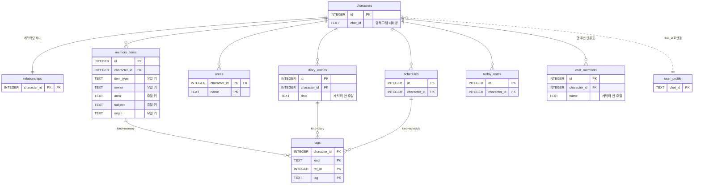
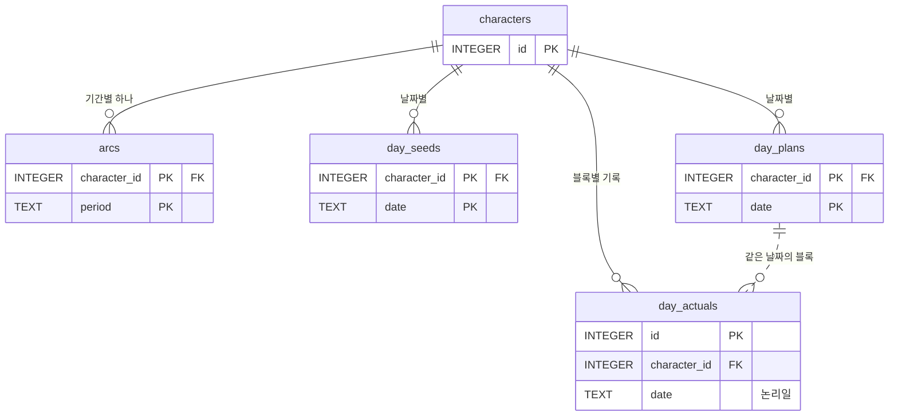
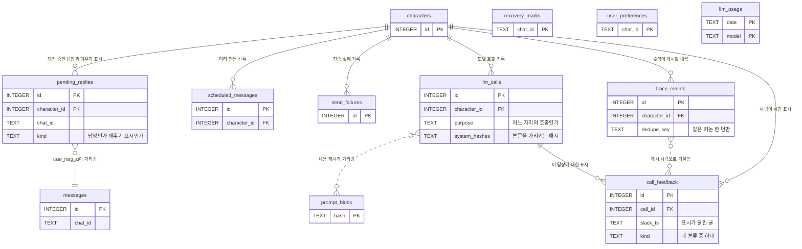

# ERD — 데이터베이스 구조

캐릭터 시스템이 저장하는 데이터 전체의 테이블 구조와 참조 관계다. 데이터는 무엇에 관한 것인지에 따라 세 묶음으로 나뉜다. 유저와의 대화에서 쌓이는 **기억**, 하루 각본과 컨디션처럼 캐릭터의 생활을 미리 만들어 두는 **캐릭터의 삶**, 시스템 운영 기록이 남는 **발송과 운영**이다. 프롬프트에는 기억 묶음 대부분과 삶 묶음의 오늘 각본 · 실제 기록이 들어간다. 관계도에는 테이블과 키·참조선만 그리고, 컬럼 명세는 관계도마다 그 아래에 붙였다.

스키마 공통 규칙 일곱.

- 미리 정한 값만 들어가는 컬럼(저장 항목·답장 여건·활동 성격 등)은 영어 식별자로 저장하고, 목록에 없는 값이 들어오면 데이터베이스가 거부하도록 CHECK 제약을 건다. 값의 한글 이름은 컬럼 명세와 아래 「값이 정해진 컬럼」 표에 적었다.
- 모델이 대화를 읽고 직접 만들어 넣는 값(키의 단어, 태그, 저장하는 내용, 영역 이름)은 한글 그대로 저장한다.
- 외래 키는 `PRAGMA foreign_keys = ON`으로 켜서 실제로 강제한다.
- SQLite에는 날짜 타입이 없어서 날짜와 시각은 ISO 8601 문자열(TEXT)로 저장한다. 이 형식은 문자열을 사전순으로 정렬하면 시간순 정렬이 되기 때문에 비교와 범위 조회를 그대로 쓸 수 있다.
- 날짜 컬럼의 설명에 논리일이라고 적은 것은 새벽 5시를 하루 경계로 삼아 센 날짜다. 새벽 3시에 나눈 대화는 달력으로 다음 날이어도 전날 날짜로 저장한다.
- 시각을 담는 컬럼은 행이 생긴 시각이면 `created_at`, 그 밖에는 무슨 일이 언제 있었는지가 드러나게 `sent_at` · `failed_at`처럼 이름을 붙인다.
- 명세의 필수 열에 O 표시가 있는 컬럼은 NOT NULL이고, 표시가 없는 컬럼은 비워둘 수 있다.

## 관계도 1 — 대화에 쓰는 기억

**characters** — 캐릭터와 대화방 연결

| 컬럼 | 타입 | 필수 | 설명 |
| --- | --- | --- | --- |
| id | INTEGER | O | PK |
| chat_id | TEXT | O | 텔레그램 대화방 |
| status | TEXT | O | 대화 상태 — `active` 대화 중 · `ended` 이별 |
| genesis_json | TEXT | O | 유저의 생성 입력과 생성 결과 원본, 코드는 읽지 않음 |
| created_at | TEXT | O | |

키·인덱스: PK `id`, 인덱스 `chat_id`

status는 한 대화방에 캐릭터 행이 여러 개 쌓여도 지금 대화하는 캐릭터 하나를 고르는 값이다. 이별한 캐릭터의 행은 지우지 않고 `ended`로 바꿔 남기기 때문에 값이 둘인데, 교체 플로우를 만들기 전까지는 `active`만 쓴다.

genesis_json은 유저가 캐릭터를 만들 때 적어 낸 입력과 생성 호출이 돌려준 결과를 함께 담아 두는 컬럼이다. 생성 결과는 저장 항목별로 나눠서 memory_items와 relationships에 넣기 때문에 대화나 배치가 이 컬럼을 읽지는 않고, 무엇을 받아 무엇을 만들었는지 나중에 확인할 수 있게 남겨둔다.

**relationships** — 유저와 캐릭터의 관계. 두 사람 사이의 상태라 누구 것인지 나눌 수 없고, 항목이 미리 정해져 있어 기억 대신 컬럼으로 저장

| 컬럼 | 타입 | 필수 | 설명 |
| --- | --- | --- | --- |
| character_id | INTEGER | O | PK, FK characters.id |
| met_at | TEXT | O | 만난 날 |
| last_contact_at | TEXT | | 마지막으로 주고받은 시각. 지금은 채우는 코드가 없다 |
| stage | TEXT | | 사이 정의 — 친구 · 썸처럼 지금 어떤 사이인지 짧은 서술 |
| speech_level | TEXT | | 지금 말투 — `polite` 존댓말 · `casual` 반말 |
| speech_note | TEXT | | 상대에게 쓰는 말투 — 장난스러운 반말처럼 값으로 담기지 않는 부분 |
| address_terms | TEXT | | 서로 부르는 말 |
| rapport | TEXT | | 잘 통하는 것 — 유저가 잘 반응하는 주제와 방식, 둘 사이에 생긴 표현 |
| cautions | TEXT | | 조심할 것 |
| history | TEXT | | 만나 온 이야기 — 어떻게 만났고 사이가 어떻게 변해 왔는지 |
| feelings | TEXT | | 마음 상태 — 캐릭터가 유저에게 가지는 마음 |
| updated_at | TEXT | | 갱신 시각 |
| legacy_state_json | TEXT | | 관계 전체를 한 덩어리로 담던 옛 JSON |

관계를 담는 항목은 일곱이다(사이 정의부터 마음 상태까지, 말투는 값과 서술이 한 항목). 프롬프트에는 이 일곱이 항상 전부 들어간다. 초기값은 캐릭터를 만들 때 유저가 적은 관계 설정에서 생성 배치가 채우고, 잘 통하는 것과 조심할 것은 비워 두고 시작해 새벽 정리가 대화에서 채운다.

캐릭터 번호와 만난 날 말고는 전부 비워둘 수 있다. 프롬프트를 조립할 때 빈 항목은 줄째로 빼도록 만들어 둬서, 아직 채우지 못한 항목이 있어도 그대로 돌아간다. legacy_state_json에는 관계 전체를 한 덩어리 JSON으로 담던 옛 값이 들어간다. 생성 배치가 캐릭터를 만들면서 빈 값을 한 번 넣고, 그 뒤로는 개발 도구만 읽는다.

캐릭터가 유저를 어떻게 대하는지는 이 표에 두지 않고 memory_items의 `태도` 영역에 `creation` 행으로 넣는다(2026-08-29 변경). 이 표의 항목은 새벽 정리가 매일 다시 쓰기 때문에, 유저가 캐릭터를 만들며 적어 낸 태도를 여기에 두면 며칠 대화에 밀려 흐려진다. 생성 때 정한 값은 저장 함수가 고치지 않아 그 자리라야 유지된다. 사이가 어떻게 변해 왔는지는 만나 온 이야기가 계속 담는다.

값을 바꾸는 자리는 둘로 갈린다. 말투 값 · 사이 정의 · 서로 부르는 말 셋은 답장 파이프라인이 대화 도중에 바로 바꾸고, 나머지 다섯(상대에게 쓰는 말투 · 잘 통하는 것 · 조심할 것 · 만나 온 이야기 · 마음 상태)은 새벽 정리가 바꾼다. 관계 갱신은 기억을 정리하는 호출의 출력에 같이 들어 있어서 이 항목들 때문에 새벽의 모델 호출이 늘지 않는다. 마음 상태는 최근 일기에 뚜렷한 근거가 있을 때만 움직이고, 말을 놓거나 사이가 달라진 사건은 만나 온 이야기에 날짜와 함께 이어 적는다. 변화를 날짜별로 남기는 로그 테이블은 따로 두지 않고 그날그날의 기록은 일기가 담당한다. 만난 지 며칠인지와 연락이 얼마나 잦은지는 만난 날과 대화 기록에서 계산할 수 있어 저장하지 않는다.

**memory_items** — 기억 데이터 한 건. 사실 · 진행 중인 일 · 주변 인물 세 항목을 캐릭터 쪽과 유저 쪽으로 나눠 저장

| 컬럼 | 타입 | 필수 | 설명 |
| --- | --- | --- | --- |
| id | INTEGER | O | PK |
| character_id | INTEGER | O | FK characters.id |
| item_type | TEXT | O | 저장 항목 — `fact` · `ongoing` · `person` |
| owner | TEXT | O | 누구 것인가 — `char` · `user` |
| area | TEXT | O | 키의 영역, 한글, areas에 있는 이름 |
| subject | TEXT | O | 키의 단어, 무엇에 대한 것인지, 한글. 주변 인물은 이 자리에 사람 이름 |
| value | TEXT | O | 값, 한글 |
| origin | TEXT | O | 어디서 생긴 값인가 — `creation` · `conversation` |
| user_knows | TEXT | O | 유저가 아는가 — `unknown` · `known` · `waiting`, 캐릭터 쪽 행에서만 의미 |
| relation | TEXT | | 어떤 사이 — 주변 인물 행에서만 |
| contact_mode | TEXT | | 만나는 방식 — 주변 인물 행에서만 |
| region | TEXT | | 사는 곳 — 주변 인물 행에서만 |
| last_mentioned_at | TEXT | | 마지막 등장 시각 — 주변 인물 행에서만, 코드가 갱신 |
| end_condition | TEXT | | 끝나는 조건 — 진행 중인 일 행에서만 |
| interest | TEXT | | 관심도 — `high` · `medium` · `low`, 캐릭터 쪽 행에서만 |
| last_retrieved_at | TEXT | | 마지막으로 꺼낸 시각 — 태그 검색으로 프롬프트에 넣을 때 갱신 |
| retrieval_count | INTEGER | O | 꺼낸 횟수, 기본 0 |
| updated_at | TEXT | O | 갱신 시각 |

키·인덱스: PK `id`, UNIQUE `(character_id, item_type, owner, area, subject, origin)`, 인덱스 `(character_id, item_type)`

데이터 한 건의 예시다. 앞 다섯 열을 합친 것이 키라서, 같은 자리에 새 사실이 오면 값을 고쳐 쓴다.

| item_type | owner | area | subject | origin | value |
| --- | --- | --- | --- | --- | --- |
| fact | char | 취향 | 커피 | creation | 산미 있는 원두를 좋아한다 |
| fact | char | 취향 | 커피 | conversation | 요즘은 카페인을 줄여서 디카페인으로 마신다 |
| fact | user | 취미 | 등산 | conversation | 주말마다 근교 산에 다닌다 |
| ongoing | char | 일 | 포트폴리오 | conversation | 개인 작업을 다음 달까지 정리하려고 한다 |
| person | char | 일 | 팀장 | creation | 프로젝트 마감이 다가와 요즘 예민하다 |

첫 두 줄이 같은 키에 두 행이 놓인 경우다. 커피 취향은 캐릭터를 만들 때 정해진 값이라 대화에서 다른 이야기가 나와도 그 행은 건드리지 않고, 새벽 정리가 같은 키의 `conversation` 행에 새로 쓴다(이미 있으면 값만 고쳐 쓴다). 프롬프트에는 두 줄이 갱신 날짜와 함께 같이 들어가서, 캐릭터는 원래 산미 있는 원두를 좋아하지만 요즘은 디카페인을 마시는 사람으로 말한다.

키는 영역과 단어를 짝지은 두 자리로 항상 만든다. 두 자리를 `취향/커피` 같은 한 문자열로 붙이지 않고 컬럼 둘로 나눠 저장하는 것은 태그 때문이 아니라, 나눠 두면 키가 한 자리나 세 자리로 어긋날 수 없고 저장할 때 남는 검사가 영역 자리의 이름이 areas 목록에 있는지 하나뿐이기 때문이다. 슬래시는 화면에 보여줄 때만 붙인다.

owner는 세 항목 모두에서 갈린다. 캐릭터의 취향과 유저의 취미, 캐릭터가 하는 일과 유저가 준비하는 일, 캐릭터의 지인과 유저의 지인이 이 값으로 나뉘어 세 항목과 두 쪽의 여섯 조합이 전부 유효하고, 어느 쪽 것인지는 저장할 때 모델이 내용을 보고 정한다. 캐릭터 쪽 사실은 프롬프트에 항상 들어가고, 나머지 조합은 태그 검색으로 골라 넣는다. user_knows는 캐릭터 쪽 행에서만 의미가 있어서 유저 쪽 행은 `known`으로 고정한다.

origin은 이 값이 어디서 생겼는지, 그래서 앞으로 누가 고칠 수 있는지를 가른다. `creation`은 캐릭터를 만들 때 생성 배치가 한 번 쓰는 값이고, `conversation`은 대화에서 드러난 사실을 새벽 정리가 나중에 추가한 값이다. 저장 함수는 origin을 확인하는 분기 없이 언제나 `conversation` 행에만 써서(있으면 고치고 없으면 만든다), 생성 때 정한 큰 정체성이 대화에 휩쓸려 바뀌지 않는 원칙이 이 쓰기 규칙 하나로 지켜진다. UNIQUE 키에 origin이 들어가 같은 자리에 두 행이 나란히 놓일 수 있고, 프롬프트에 넣을 때는 둘을 구분하지 않고 같이 넣는다.

저장 항목별 추가 정보는 JSON 한 칸이 아니라 전용 컬럼으로 둔다(2026-08-27 확정). 진행 중인 일은 끝나는 조건 하나, 주변 인물은 어떤 사이 · 만나는 방식 · 사는 곳 · 마지막 등장 넷이고, 사실은 추가 정보가 없다. 필드가 전부 미리 정해져 있어 자유 칸을 열어 둘 이유가 없고, 마지막 등장 시각은 프롬프트에 넣을 인물을 고르는 코드가 정렬에 쓰는 값이라 컬럼이어야 쿼리에서 바로 쓴다. 목록에 없는 필드를 쓰기 코드가 버리던 검사도 스키마가 대신한다. 항목에 해당 없는 컬럼은 CHECK로 막아 값이 들어갈 수 없다. 인물 전용 넷은 주변 인물 행에서만, 끝나는 조건은 진행 중인 일 행에서만, 관심도는 캐릭터 쪽 행에서만 값을 가진다. 새 필드가 필요해지면 컬럼을 더하는 설계 변경으로 다룬다.

마지막으로 꺼낸 시각과 꺼낸 횟수는 검색 함수가 채운다. 태그 검색으로 골라 프롬프트에 넣을 때만 갱신하고, 항상 들어가는 캐릭터 쪽 사실에는 매 턴 값이 올라 신호가 되지 않으므로 찍지 않는다. 지금 이 값을 읽는 코드는 없지만 지나가면 다시 만들 수 없는 기록이라 저장부터 시작하고, 잘 안 꺼내는 기억을 응축하는 규칙은 별도 설계로 남긴다.

관심도는 캐릭터 쪽 행이 세 항목 공통으로 갖는다(2026-08-27 확정). 그 항목에 대한 유저의 관심 수준을 많음 · 보통 · 적음 3단계로 담고, 캐릭터가 화제로 꺼내는 빈도만 조절한다. 처음에는 값 이름을 먼저 물음 같은 행동으로 지었다가 행동끼리 엇갈리는 날에 둘 곳이 애매해서 관심 수준으로 바꿨다(같은 날 정정) — 행동은 저장되는 값이 아니라 단계를 옮기는 신호다. 처음에는 가운데 `medium`에서 시작하고, 새벽 정리가 코드가 센 숫자와 그날 대화를 읽고 단계를 옮긴다. 유저 쪽 행은 유저 자신의 이야기라 이 값을 비워 둔다.

주변 인물은 키의 단어 자리에 사람 이름이 들어가는 예외다. 이름이 태그와 같은 문자열이어서, 이름 하나로 인물 행과 그 사람이 나오는 일기 · 일정을 함께 찾는다. 같은 쪽에 같은 이름이 오면 영역이 달라도 같은 사람으로 보고 한 행을 고쳐 쓰기 때문에, 인물의 유일성은 네 자리 키가 아니라 쓰기 코드가 이름으로 지킨다. 다른 사람이면 회사 민수처럼 이름을 늘려 가르고, 태그는 두 이름에 다 남긴다.

인물 행의 값에는 요즘 이 사람과 어떻게 지내는지를 적고, 함께 있었던 일은 이 행에 쌓지 않고 이름 태그로 일기와 일정에 남긴다. 인물 행의 전용 컬럼 넷은 읽는 곳이 서로 다르다. 어떤 사이인지는 값과 함께 프롬프트에 들어가 캐릭터가 그 사람 이야기를 할 때 쓰이고, 만나는 방식과 사는 곳은 한 달치 이벤트를 만드는 월 리듬이 읽는다. 이 둘이 없으면 이벤트에 누구와 무엇을 하는지가 비어서, 매일 보는 팀장과 명절에나 보는 부모님이 같은 빈도로 나오고 멀리 사는 부모님이 평일 저녁 약속에 나온다. 마지막 등장 시각은 프롬프트에 넣을 인물을 코드가 고를 때 쓴다.

감정은 기억에 저장하지 않는다. 그날의 감정은 일기에 남고, 유저를 향해 이어지는 마음은 relationships의 마음 상태가 담는다.

**tags** — 주제 태그. 기억 · 지난 일기 · 예정된 일에 같은 방식으로 붙어 이름 하나로 함께 검색

| 컬럼 | 타입 | 필수 | 설명 |
| --- | --- | --- | --- |
| character_id | INTEGER | O | FK characters.id |
| kind | TEXT | O | 대상 종류 — `memory` · `diary` · `schedule` |
| ref_id | INTEGER | O | 대상 행의 id |
| tag | TEXT | O | 한글, 사람 이름 포함 |

키·인덱스: PK `(kind, ref_id, tag)`, 인덱스 `(character_id, tag)`

태그가 붙는 대상이 셋뿐인 것은 대화 주제로 검색해서 프롬프트에 넣는 데이터가 그 셋이기 때문이다. 주변 인물도 기억 데이터의 한 항목이라 `memory`로 함께 검색되고, 오늘 메모와 오늘 각본처럼 그날 것을 통째로 넣는 데이터는 골라낼 일이 없어 태그가 필요 없다.

**areas** — 영역 이름 목록. 키 앞자리에 쓰는 삶의 갈래를 캐릭터마다 따로 관리

| 컬럼 | 타입 | 필수 | 설명 |
| --- | --- | --- | --- |
| character_id | INTEGER | O | PK, FK characters.id |
| name | TEXT | O | PK, 영역 이름, 한글 |
| note | TEXT | | 영역이 덮는 범위 설명. 키를 고르는 모델에게 이름과 함께 보여준다 |

영역은 일 · 건강 · 가족 · 친구처럼 삶을 나누는 갈래다. 주제 태그와는 쓰임이 달라서, 영역은 저장할 자리를 정하는 값이라 목록에 있는 이름 중에서 고르고 태그는 나중에 찾아오려고 붙이는 검색어라 관련된 만큼 붙인다.

목록은 캐릭터를 만들 때 제품이 들고 나가는 8개로 시작하고, 여기에 캐릭터 설정에서 확실한 갈래(밴드를 하는 캐릭터면 음악)와 유저 프로필에서 확실한 갈래(학생이면 학교)를 얹는다. 시작한 뒤로는 새벽 정리가 늘린다. 맞는 영역이 없어 억지로 고른 경우가 항목 셋 이상에 쌓이고 그것들이 두 영역 이상에 흩어져 있으면, 그날 새벽에 목록 관리 호출이 한 번 돌아 기존 영역으로 다시 앉히거나 새 이름을 하나 짓는다. 매일 밤의 저장 단계는 그 시점의 목록에서 고르기만 하고 새 이름을 만들지 못한다. 이렇게 캐릭터마다 목록이 달라지기 때문에 CHECK 대신 테이블로 관리한다.

**today_notes** — 오늘 메모. 답장하면서 같이 적어 둔 사실 한 줄을 그대로 보관하고, 새벽 정리가 기억으로 옮긴 뒤 비움

| 컬럼 | 타입 | 필수 | 설명 |
| --- | --- | --- | --- |
| id | INTEGER | O | PK |
| character_id | INTEGER | O | FK characters.id |
| created_at | TEXT | O | 적힌 시각 |
| note | TEXT | O | 사실 한 줄 |
| message_id | INTEGER | | 원문 위치, messages.id |

키·인덱스: PK `id`, 인덱스 `(character_id, created_at)`

**schedules** — 예정된 일. 날짜로 찾는 목록이라 키 없이 태그로 검색

| 컬럼 | 타입 | 필수 | 설명 |
| --- | --- | --- | --- |
| id | INTEGER | O | PK |
| character_id | INTEGER | O | FK characters.id |
| owner | TEXT | O | 캐릭터 일정인가 유저 일정인가 — `char` · `user` |
| date | TEXT | O | 날짜 |
| time_hint | TEXT | | 몇 시인지, 저녁처럼 대략적인 표현도 들어감 |
| content | TEXT | O | 무슨 일인지 |
| with_name | TEXT | | 누구와, 이름 태그와 같은 문자열 |
| area | TEXT | | 이 일이 속한 영역, areas에 있는 이름 |
| user_knows | TEXT | O | 유저가 아는가 — `unknown` · `known` · `waiting` |
| origin | TEXT | O | 어디서 생긴 일정인가 — `conversation` · `rhythm` · `ongoing` |
| parent_kind | TEXT | | 이 일정을 만든 항목의 종류 — `memory` · `schedule` |
| parent_id | INTEGER | | 이 일정을 만든 항목의 행 id |
| status | TEXT | O | `active` 유효 · `cancelled` 취소 · `deferred` 미룸 |
| created_at | TEXT | O | |

키·인덱스: PK `id`, 인덱스 `(character_id, date)`

origin은 이 일정이 어디서 나왔는지를 남긴다. `conversation`은 대화에서 유저와 정한 약속이고, 답장하면서 오늘 메모에 적어 둔 것을 새벽 정리가 옮겨 온 것도 여기 들어간다. `rhythm`은 한 달치 이벤트를 만드는 월 리듬이 미리 만들어 둔 일정이다. `ongoing`은 진행 중인 일에서 나온 일정으로, 이사를 준비하는 중이라는 데이터를 새벽 정리가 읽고 이번 주말에 집을 보러 가기로 정하면 이 값으로 저장한다.

parent_kind와 parent_id는 이 일정을 만든 항목을 가리킨다. 토요일 오후에 집을 보러 가는 일정에서 왜 가는지를 다시 적지 않고, 그 일정을 만든 진행 중인 일(이사 준비)을 가리키게 두는 것이다. 같은 내용을 여러 곳에 적으면 한쪽만 고쳐질 수 있어서, 원본은 한 곳에 두고 일정은 가리키기만 한다. `memory`는 memory_items의 행을 가리키고, 진행 중인 일과 아직 날짜가 잡히지 않은 하고 싶다는 마음(사실 항목으로 저장되는 의향)이 다 여기 있다. `schedule`은 앞선 일정이 다음 일정을 만든 경우다.

**diary_entries** — 하루 일기. 매일 한 편씩 쌓이고, 일기가 있는 날짜는 새벽 정리가 다시 만들지 않는다

| 컬럼 | 타입 | 필수 | 설명 |
| --- | --- | --- | --- |
| id | INTEGER | O | PK |
| character_id | INTEGER | O | FK characters.id |
| date | TEXT | O | 논리일 |
| entry_json | TEXT | O | 한 일과 그때의 기분 |

키·인덱스: PK `id`, UNIQUE `(character_id, date)`

**user_profile** — 유저 쪽 값. 대화방마다 한 행

| 컬럼 | 타입 | 필수 | 설명 |
| --- | --- | --- | --- |
| chat_id | TEXT | O | PK |
| preferred_name | TEXT | | 유저를 부르는 이름 |
| gender | TEXT | | |
| birth_year | INTEGER | | 출생연도 |
| job | TEXT | | 하는 일 |
| region | TEXT | | 사는 지역 |
| age_band | TEXT | | 나이대. birth_year로 옮길 옛 컬럼 |
| updated_at | TEXT | | |

이 표를 채우는 코드는 새벽 정리 하나로, 대화에서 하는 일과 사는 지역이 분명히 드러나면 그 둘을 채우고 빈 값은 이미 아는 값을 덮지 않는다. 부르는 이름과 출생연도는 가입할 때 받을 자리인데, 가입 절차를 아직 만들지 않아 넣는 코드도 없다.

나이대를 담는 자리는 age_band와 birth_year 둘로 나뉘어 있다. 캐릭터가 자기 나이를 말할 때는 정체성 기억의 생년월일에서 계산하므로 이 표를 보지 않지만, 유저를 어떻게 부를지 정하는 프롬프트 블록이 유저 나이대를 아직 age_band에서 읽어서 두 컬럼을 함께 둔다. 성별과 나이대는 환경변수로 지정하면 저장값 대신 그 값이 프롬프트에 들어간다.

**cast_members** — 주변 인물을 담던 옛 표

| 컬럼 | 타입 | 필수 | 설명 |
| --- | --- | --- | --- |
| id | INTEGER | O | PK |
| character_id | INTEGER | O | FK characters.id |
| owner | TEXT | O | 누구 쪽 사람인가 — `char` 캐릭터 · `user` 유저. 기본값 `char` |
| name | TEXT | O | 이름 |
| relation_label | TEXT | O | 어떤 사이인가 |
| area | TEXT | | 영역 |
| meet_pattern | TEXT | | 만나는 주기 |
| place | TEXT | | 만나는 곳 |
| recent_note | TEXT | | 최근 이야기 |
| user_knows | TEXT | O | 유저가 아는 사람인가 — `unknown` · `known` · `waiting`. 기본값 `unknown` |
| last_mentioned_at | TEXT | | 마지막으로 언급된 시각 |
| created_at | TEXT | O | |

키·인덱스: PK `id`, UNIQUE `(character_id, name)`

주변 인물은 memory_items의 `person` 행에 저장한다. 이 표에는 미리 정해둔 캐릭터 하나로 시작하는 경로에서만 생성 배치가 행을 넣고, 프롬프트는 이 표를 읽지 않는다. 남은 행은 관리 대시보드와 옛 데이터를 옮기는 도구가 읽는다.

## 관계도 2 — 캐릭터의 삶

한 달치 이벤트와 매일의 컨디션을 미리 만드는 월 리듬은 따로 저장하는 테이블이 없다. 한 번의 생성이 내놓는 값이 예정된 일(schedules, origin=rhythm)과 컨디션 시드(day_seeds)여서 그 두 테이블에 나눠 저장하고, 생성 결과를 통째로 담아 두는 자리는 두지 않는다.

**arcs** — 기간이 다른 네 가지 삶의 흐름

| 컬럼 | 타입 | 필수 | 설명 |
| --- | --- | --- | --- |
| character_id | INTEGER | O | PK, FK characters.id |
| period | TEXT | O | PK, 기간 — `year` · `season` · `month` · `week` |
| content | TEXT | O | 구체적인 사건 대신 요즘 어떻게 지내는지를 담은 서술 |

**day_seeds** — 매일 컨디션 시드 네 값

| 컬럼 | 타입 | 필수 | 설명 |
| --- | --- | --- | --- |
| character_id | INTEGER | O | PK, FK characters.id |
| date | TEXT | O | PK |
| energy | TEXT | O | 기력 |
| wake_hint | TEXT | O | 일어나는 시각 |
| mood | TEXT | O | 기분 |
| reason | TEXT | | 그날 컨디션이 그런 이유 |

**day_plans** — 하루 각본. 블록마다 답장 여건과 활동 성격을 값으로 저장

| 컬럼 | 타입 | 필수 | 설명 |
| --- | --- | --- | --- |
| character_id | INTEGER | O | PK, FK characters.id |
| date | TEXT | O | PK, 논리일 |
| plan_json | TEXT | O | 블록 목록. 필수 다섯(시작·종료 시각 · 활동 · 답장 여건 · 미리 아는 일정인지 여부)과 선택 셋(활동 성격 · 출처 · 출처 행 번호) |
| made_by | TEXT | O | 만든 경로 — `nightly` · `ondemand` |

plan_json 안 블록의 태그도 영어 식별자로 저장한다. 답장 여건은 `instant` · `intermittent` · `unavailable`, 활동 성격은 `personal` · `social` · `official`, 출처는 `schedule` 예정된 일 · `routine` 매주 루틴이다. JSON 안이라 CHECK가 걸리지 않아 쓰기 코드에서 검사한다. 블록의 `advance_known`은 미리 아는 일정인지를 담는데, 미리 아는 일정이면 시작 10분 전에 자리를 비운다고 예고하고 닥쳐야 아는 일이면 시작한 뒤에 알린다.

활동 성격은 비어 있을 수 있어서, 그런 블록은 읽는 코드가 활동 이름으로 성격을 가려낸다. 회의·시험·발표는 공적, 친구·가족·병원은 사회, 나머지 혼자 하는 일은 개인이다. 출처와 출처 행 번호는 예정된 일이나 매주 루틴을 그날 블록으로 옮겨 적었을 때만 붙어서, 원본이 어느 행인지 가리킨다.

**day_actuals** — 계획과 다르게 지낸 기록. 각본을 교체해도 남도록 별도 테이블

| 컬럼 | 타입 | 필수 | 설명 |
| --- | --- | --- | --- |
| id | INTEGER | O | PK |
| character_id | INTEGER | O | FK characters.id |
| date | TEXT | O | 논리일 |
| block_start | TEXT | | 각본 블록의 시작 시각, 블록 밖이면 비움 |
| intended | TEXT | O | 하려던 것 |
| outcome | TEXT | O | 어떻게 됐나 |
| reason | TEXT | | 왜 |
| recorded_at | TEXT | O | 적힌 시각 |

키·인덱스: PK `id`, 인덱스 `(character_id, date)`

## 관계도 3 — 발송과 운영

**messages** — 대화 원문 기록. 프롬프트에 넣는 최근 대화를 여기서 가져오고, 채점과 분석도 이 데이터로 한다

| 컬럼 | 타입 | 필수 | 설명 |
| --- | --- | --- | --- |
| id | INTEGER | O | PK |
| chat_id | TEXT | O | |
| character_id | INTEGER | | |
| sent_at | TEXT | O | 주고받은 시각 |
| role | TEXT | O | 누가 한 말인가 — `user` 유저 · `assistant` 캐릭터 |
| text | TEXT | O | 말 내용 |
| meta_json | TEXT | | 발송 종류 kind 포함 — `reply` · `recover` · `morning` · `checkin` · `away` · `catchup` · `goodnight` |

키·인덱스: PK `id`, 인덱스 `(chat_id, sent_at)`

role의 `user`와 `assistant`는 모델 API가 대화 기록을 받을 때 쓰는 이름이다. 저장한 대화를 프롬프트에 넣을 때 이 형식 그대로 보내기 때문에 캐릭터가 한 말도 `assistant`로 적는다.

**pending_replies** — 만들어 두고 정한 시각에 보낼 답장, 그리고 답장 불가 구간이 끝날 때 깨어나기 위한 표시. 봇이 다시 떠도 여기 남은 행을 보고 이어서 보낸다

| 컬럼 | 타입 | 필수 | 설명 |
| --- | --- | --- | --- |
| id | INTEGER | O | PK |
| chat_id | TEXT | O | |
| character_id | INTEGER | O | FK characters.id |
| user_msg_at | TEXT | O | 답할 유저 메시지의 시각 |
| bubbles_json | TEXT | O | 보낼 말풍선들. 깨우기 표시는 문안이 없어 빈 목록 |
| note_to_save | TEXT | | 발송 후 today_notes에 적을 한 줄 |
| send_at | TEXT | O | 보낼 시각. 깨우기 표시는 구간이 끝나는 시각 |
| kind | TEXT | O | 행의 종류 — `reply` · `recover` · `wake` |
| meta_json | TEXT | | 깨우기 표시일 때 그 구간의 활동과 시작 · 종료 시각 |
| call_id | INTEGER | | 이 답장을 만든 모델 호출의 llm_calls 행. 발송과 폐기 결과를 그 호출의 슬랙 트레이스 스레드에 이을 때 쓴다 |
| status | TEXT | O | `waiting` · `sent` · `superseded` · `failed` |
| attempts | INTEGER | O | |
| last_error | TEXT | | |
| created_at | TEXT | O | |
| sent_at | TEXT | | |

키·인덱스: PK `id`, 인덱스 `(status, send_at)`, 인덱스 `(chat_id, status)`

`wake` 행은 답장이 아니라 깨우기 표시다. 답장 불가 구간에 유저가 말을 걸면 몇 시간 뒤에 나갈 답장을 지금 만들지 않고 이 행만 걸어 두었다가, 구간이 끝나는 시각에 깨어나 그 사이 쌓인 메시지를 한 번에 읽고 답한다. 유저가 말을 더 보내면 만들어 둔 답장은 버리지만 이 행은 남겨 둔다. 구간이 끝날 때 몰아 읽는 것은 메시지가 몇 개든 같기 때문이다.

**scheduled_messages** — 미리 만드는 선톡 둘(아침 · 안부)의 문안과 발송 창

| 컬럼 | 타입 | 필수 | 설명 |
| --- | --- | --- | --- |
| id | INTEGER | O | PK |
| character_id | INTEGER | O | FK characters.id |
| chat_id | TEXT | O | |
| date | TEXT | O | |
| window_start | TEXT | O | |
| window_end | TEXT | O | |
| text | TEXT | O | |
| kind | TEXT | O | 선톡 종류 — `morning` · `checkin` |
| status | TEXT | O | `pending` · `sent` · `skipped` |
| skip_reason | TEXT | | 폐기 사유 |
| attempts | INTEGER | O | |
| last_error | TEXT | | |
| created_at | TEXT | O | |
| sent_at | TEXT | | |

키·인덱스: PK `id`, 인덱스 `(status, date)`

유저가 이틀째 답이 없어 아침 대신 점심에 보내는 날도 `morning` 행으로 저장하고 window_start·window_end만 점심 시간대로 잡는다. 보내는 문장과 준비 시점이 아침 선톡과 같아서 종류를 하나 더 만들면 저장값만 늘고 분기가 두 벌이 된다. 슬랙 기록에서는 llm_calls.purpose가 `lunch`로 갈라 준다.

**recovery_marks** — 대화방별로 답장을 마친 마지막 유저 메시지 시각. pending_replies 행이 생기기 전에 멈춘 경우를 부팅 때 잡아냄

| 컬럼 | 타입 | 필수 | 설명 |
| --- | --- | --- | --- |
| chat_id | TEXT | O | PK |
| replied_up_to | TEXT | O | 이 시각까지 온 유저 메시지에는 답장을 마침 |

**send_failures** — 대화 중에 보내는 선톡 넷(자리비움 · 근황 · 밤 인사 · 달래기)이 전송에 실패한 기록

| 컬럼 | 타입 | 필수 | 설명 |
| --- | --- | --- | --- |
| id | INTEGER | O | PK |
| chat_id | TEXT | O | |
| character_id | INTEGER | | |
| kind | TEXT | O | `away` · `catchup` · `goodnight` · `mend` |
| error | TEXT | O | |
| failed_at | TEXT | O | |

**user_preferences** — 캐릭터와 무관한 유저 자체의 선호를 담을 자리. 지금은 쓰기·읽기 모두 없이 자리만 유지

| 컬럼 | 타입 | 필수 | 설명 |
| --- | --- | --- | --- |
| chat_id | TEXT | O | PK |
| pref_json | TEXT | O | |

캐릭터마다 다른 선호는 relationships의 잘 통하는 것이 담고, 이 테이블은 캐릭터를 여럿 두는 구조가 생겼을 때 유저가 어떤 캐릭터와 잘 맞는지 같은 유저 단위의 선호를 담는다. 읽는 코드가 없는 값을 미리 쌓으면 기준이 바뀔 때 버리게 되어서 지금은 자리와 뜻만 정해 두고, 채울 때가 오면 대화 원문과 카드 반응, 관계가 얼마나 이어졌는지의 기록에서 뽑는다.

**llm_usage** — 모델 호출량과 캐시 재사용 집계

| 컬럼 | 타입 | 필수 | 설명 |
| --- | --- | --- | --- |
| date | TEXT | O | PK |
| model | TEXT | O | PK |
| calls | INTEGER | O | |
| input_tokens | INTEGER | O | |
| cache_write_tokens | INTEGER | O | |
| cache_read_tokens | INTEGER | O | |
| output_tokens | INTEGER | O | |

**llm_calls** — 모델 호출 하나가 행 하나. 답이 이상할 때 그 호출에 무엇을 넣었고 무엇이 나왔는지 열어 본다

| 컬럼 | 타입 | 필수 | 설명 |
| --- | --- | --- | --- |
| id | INTEGER | O | PK |
| character_id | INTEGER | | FK characters.id |
| chat_id | TEXT | | |
| purpose | TEXT | O | 어느 자리의 호출인가 — `reply` 답장 · `hold` 붙잡기 판정 · `tags` 주제 고르기 · `day_plan` 하루 각본 · `life_plan` 월 리듬 · `arc` 흐름 · `diary` 일기 · `extract` 기억 정리 · `genesis` 캐릭터 생성 · `bible` 옛 랜덤 생성 · 선톡 일곱(`morning` · `lunch` · `reconnect` · `catchup` · `goodnight` · `away` · `comeback`) · `tool` 개발 도구 |
| model | TEXT | O | |
| max_tokens | INTEGER | | 출력 상한 |
| attempt | INTEGER | O | 같은 자리에서 몇 번째로 부른 호출인가. 응답 형식이 어긋나 다시 부르면 attempt가 2인 행이 따로 생긴다 |
| system_hashes | TEXT | | 시스템 프롬프트 층별 해시 목록(JSON 배열) |
| turns_hash | TEXT | | 함께 보낸 대화 기록의 해시 |
| output_hash | TEXT | | 모델이 낸 글의 해시 |
| input_tokens | INTEGER | | |
| cache_write_tokens | INTEGER | | |
| cache_read_tokens | INTEGER | | |
| output_tokens | INTEGER | | |
| latency_ms | INTEGER | | 호출에 걸린 시간 |
| error | TEXT | | 실패한 호출의 사유 |
| context_json | TEXT | | 판단 근거 — 검색한 태그와 꺼낸 기억, 개수 상한에 걸려 빠진 후보, 답장 텀이 나온 길과 붙잡기 판정, 답을 읽어낸 길과 말풍선 수·길이, 바꾼 관계 항목과 접은 일정, 발송 결과 |
| code_version | TEXT | | 호출한 코드의 판을 가리키는 src 파일 지문 12자. 컨테이너에 git 기록이 없어 커밋 해시 대신 쓴다 |
| created_at | TEXT | O | |
| traced | INTEGER | O | 슬랙 트레이스 채널에 올렸는지 표시, 기본 0 |

키·인덱스: PK `id`, 인덱스 `(created_at)`, 인덱스 `(character_id, purpose, id)`

purpose에는 CHECK를 걸지 않는다. 호출하는 자리가 하나 늘 때마다 스키마를 옮겨야 하고, 제약에 걸린 INSERT는 기록을 통째로 잃기 때문이다. 목록에 없는 값은 코드의 타입이 컴파일할 때 막는다.

판단 근거를 호출한 그 시점에 함께 적는 이유는 나중에 같은 프롬프트를 다시 만들 수 없어서다. 기억 검색은 꺼낸 기록을 남기는 쓰기 동작이라 같은 검색을 다시 돌리면 값이 달라지고, 각본과 기억은 새벽마다 새로 쓰인다.

**prompt_blobs** — 프롬프트와 출력 본문. 키가 내용 해시라 같은 글자는 한 벌만 쌓인다

| 컬럼 | 타입 | 필수 | 설명 |
| --- | --- | --- | --- |
| hash | TEXT | O | PK, 본문의 sha256 앞 16자 |
| text | TEXT | O | 본문 |
| bytes | INTEGER | O | 본문 크기 |
| first_seen_at | TEXT | O | 이 내용을 처음 저장한 시각 |
| last_seen_at | TEXT | O | 같은 내용이 마지막으로 다시 나온 시각 |

불변층과 일간층은 하루 종일 같은 글자라, 호출마다 본문을 다시 담으면 데이터베이스가 호출 수에 비례해 커진다. 내용 해시를 키로 두면 답장 한 건에 새로 쌓이는 양이 40KB에서 7.5KB로 줄어든다. 본문은 90일이 지나면 지우고 메타와 사용량은 남긴다. 새벽 5시 50분에 오래된 행의 해시와 판단 근거를 비우고, 아무 호출도 가리키지 않게 된 본문을 함께 지운다.

**trace_events** — 슬랙 트레이스 채널에 게시할 내용을 쌓아 두는 자리. 파이프라인이 행으로 적어 두면 1분 간격 틱이 가져가 게시한다

| 컬럼 | 타입 | 필수 | 설명 |
| --- | --- | --- | --- |
| id | INTEGER | O | PK |
| character_id | INTEGER | | FK characters.id |
| kind | TEXT | O | 게시 종류 |
| dedupe_key | TEXT | | 같은 내용을 두 번 쌓지 않게 하는 키, UNIQUE |
| thread_key | TEXT | | 스레드의 부모가 자기 이름으로 적는 키 |
| parent_key | TEXT | | 스레드의 자식이 부모를 가리키는 키 |
| text | TEXT | O | 게시할 본문 |
| status | TEXT | O | `pending` 대기 · `sent` 게시 · `failed` 실패 · `skipped` 건너뜀 |
| slack_ts | TEXT | | 게시된 슬랙 메시지의 시각. 자식이 이 스레드에 붙을 때 쓴다 |
| attempts | INTEGER | O | |
| last_error | TEXT | | |
| created_at | TEXT | O | |

키·인덱스: PK `id`, UNIQUE `dedupe_key`, 인덱스 `(status, id)`, 인덱스 `(thread_key)`

보낼 것을 행으로 남겨 두기 때문에 봇이 다시 뜨거나 슬랙이 응답하지 않아도 게시가 밀리기만 한다. 부모가 아직 게시되지 않은 자식은 다음 틱으로 미루고, 채널에 봇이 없는 경우처럼 다시 시도해도 결과가 같은 오류는 재시도하지 않고 실패로 적는다.

**call_feedback** — 슬랙 채널에 올라간 답장을 읽고 사람이 남긴 표시. 리액션으로 고른 분류 하나가 행 하나이고, 그렇게 본 이유를 적은 스레드 답글도 같은 표에 들어간다

| 컬럼 | 타입 | 필수 | 설명 |
| --- | --- | --- | --- |
| id | INTEGER | O | PK |
| character_id | INTEGER | | FK characters.id |
| call_id | INTEGER | | FK llm_calls.id — 표시가 달린 글을 만든 모델 호출. 호출과 이어지지 않는 게시(아침 각본 알림 같은)에 달린 표시는 비어 있다 |
| slack_ts | TEXT | O | 표시가 달린 글의 슬랙 시각. 이 값으로 게시 기록을 찾아 어느 호출인지 되짚는다 |
| trace_kind | TEXT | | 표시가 달린 글의 게시 종류 |
| source | TEXT | O | 표시를 남긴 방법 — `reaction` 리액션으로 고른 분류 · `reply` 스레드에 적은 이유 |
| kind | TEXT | | 네 분류 중 하나 — `fact` 사실 오류 · `tone` 말투 · `timing` 타이밍 · `good` 좋음. 이유 쪽은 비어 있다 |
| slack_user | TEXT | | 표시를 남긴 슬랙 계정 |
| text | TEXT | | 스레드에 적은 이유 |
| reply_ts | TEXT | | 그 답글 자신의 슬랙 시각 |
| dedupe_key | TEXT | O | 같은 표시를 두 번 쌓지 않게 하는 키, UNIQUE |
| created_at | TEXT | O | 표시를 확인한 시각. 이유는 슬랙에 적힌 시각이고, 리액션은 누른 시각을 슬랙이 주지 않아 처음 읽은 시각이다 |
| removed_at | TEXT | | 리액션을 뗀 것을 확인한 시각. 행은 지우지 않는다 |

키·인덱스: PK `id`, UNIQUE `dedupe_key`, 인덱스 `(call_id)`, 인덱스 `(slack_ts, source)`

10분 간격으로 채널을 다시 읽어 지금 붙어 있는 리액션과 이 표를 맞춘다. 없어진 리액션은 행을 지우지 않고 removed_at에 시각을 적어서, 무엇이 있다가 없어졌는지가 남는다. 이유 쪽은 새로 적힌 것만 넣고 고치거나 지우지 않는다.

표시가 붙은 호출은 90일 정리에서 뺀다. 답장이 왜 그렇게 나왔는지 사람이 판단한 기록이라, 프롬프트와 출력이 함께 있어야 나중에 채점표의 정답지로 쓸 수 있다. 리액션을 뗀 호출은 다시 정리 대상이 된다.

## 쓰는 곳과 읽는 곳

쓰는 주체는 다섯이다. 생성 배치(캐릭터를 만들 때 한 번), 새벽 정리(하루 한 번), 답장 파이프라인(대화할 때), 선톡 모듈(발송할 때), 월 리듬(한 달치를 만들 때). 대화 중에는 저장 항목을 판정하지 않고 오늘 메모에만 적고, 기억으로 옮기는 일은 새벽 정리가 한다.

| 테이블 | 쓰는 곳 | 읽는 곳 |
| --- | --- | --- |
| characters | 생성 배치 | 모든 모듈 (id 연결) |
| relationships | 생성 배치(초기값), 답장 파이프라인(말투 값 · 사이 정의 · 서로 부르는 말), 새벽 정리(나머지 다섯) | 프롬프트 조립(관계 항목 항상, 만난 날수 계산) |
| memory_items | 생성 배치(origin=creation), 새벽 정리 | 프롬프트 조립, 새벽 정리, 각본 생성, 월 리듬(주변 인물) |
| tags | 생성 배치, 새벽 정리, 월 리듬(리듬 일정의 태그) | 프롬프트 조립(태그 일치 검색) |
| areas | 생성 배치, 새벽 정리 | 새벽 정리(키 판정) |
| today_notes | 답장 파이프라인 | 프롬프트 조립(오늘 것 항상), 새벽 정리 |
| schedules | 새벽 정리, 월 리듬 | 프롬프트 조립, 각본 생성, 선톡 모듈 |
| diary_entries | 새벽 정리 | 프롬프트 조립(최근 며칠 항상, 지난 것은 태그 일치), 새벽 정리, 아크 갱신 |
| user_profile | 새벽 정리(하는 일 · 사는 지역) | 프롬프트 조립, 생성 배치, 각본 생성, 선톡 모듈 |
| cast_members | 생성 배치(미리 정해둔 캐릭터로 시작할 때만) | 관리 대시보드 |
| arcs | 새벽 정리(달력 경계) | 프롬프트 조립, 각본 생성, 월 리듬 |
| day_seeds | 월 리듬 | 각본 생성, 새벽 정리 |
| day_plans | 새벽 정리, 각본 생성(임시) | 답장 파이프라인(텀 결정), 프롬프트 조립, 선톡 모듈, 새벽 정리 |
| day_actuals | 답장 파이프라인(붙잡기 즉시), 새벽 정리 | 프롬프트 조립(지난 시간은 실제로 읽음), 새벽 정리 |
| messages | 답장 파이프라인, 선톡 모듈 | 프롬프트 조립(최근 대화), 새벽 정리, 채점·분석 |
| pending_replies | 답장 파이프라인 | 답장 파이프라인(발송 틱·부팅 복구), 선톡 모듈(대기 중이면 선톡 미발송) |
| scheduled_messages | 새벽 정리 | 선톡 모듈 |
| recovery_marks | 답장 파이프라인 | 답장 파이프라인(부팅 복구) |
| send_failures | 선톡 모듈 | 운영 점검 |
| user_preferences | 없음 (자리만) | 없음 |
| llm_usage | llm 래퍼 | 운영 점검 |
| llm_calls | llm 래퍼(호출할 때), 답장 파이프라인(판단 근거) | 운영 점검 |
| prompt_blobs | llm 래퍼 | 운영 점검(llm_calls의 해시로 찾아 읽음) |
| trace_events | 각본 알림 틱, 파이프라인 | 슬랙 게시 틱, 표시 수집 틱(게시 시각으로 호출 되짚기) |
| call_feedback | 표시 수집 틱 | 운영 점검, 90일 정리(뺄 호출 고르기) |

## 값이 정해진 컬럼

아래 컬럼에는 목록에 있는 값만 넣는다. 흔히 enum이라고 부르는 것이고, SQLite에는 enum 타입이 없어서 TEXT로 저장하고 CHECK 제약으로 다른 값이 들어가는 것을 막는다. 저장은 영어 식별자로 하고, 화면과 프롬프트에 쓰는 한글 이름은 코드 한곳에서 붙인다. 이름을 바꿔도 저장값과 분기가 그대로 남게 하려는 것이다.

| 자리 | 값 |
| --- | --- |
| memory_items.item_type 저장 항목 | `fact` 사실 · `ongoing` 진행 중인 일 · `person` 주변 인물 |
| memory_items.owner, schedules.owner 누구 것인가 | `char` 캐릭터 · `user` 유저 |
| memory_items.origin 어디서 생긴 값인가 | `creation` 캐릭터를 만들 때 쓴 값, 수정 거부 · `conversation` 새벽 정리가 대화에서 추가 |
| memory_items.interest 관심도 | `high` 많음 · `medium` 보통 · `low` 적음 |
| relationships.speech_level 지금 말투 | `polite` 존댓말 · `casual` 반말 |
| memory_items · schedules의 user_knows 유저가 아는가 | `unknown` 모름 · `known` 앎 · `waiting` 기다림, 유저가 결과를 기다리고 있어 캐릭터가 결과를 먼저 알린다 |
| schedules.origin 출처 | `conversation` 대화 · `rhythm` 월 리듬 · `ongoing` 진행 중인 일 |
| schedules.parent_kind 이 일정을 만든 항목 | `memory` 기억 데이터(진행 중인 일 · 의향) · `schedule` 앞선 일정 |
| schedules.status | `active` 유효 · `cancelled` 취소 · `deferred` 미룸 |
| tags.kind 대상 | `memory` 기억 · `diary` 일기 · `schedule` 예정된 일 |
| 각본 블록의 답장 여건 | `instant` 즉답 · `intermittent` 틈틈이 · `unavailable` 불가 |
| 각본 블록의 활동 성격 | `personal` 개인 · `social` 사회 · `official` 공적 |
| 각본 블록의 출처 | `schedule` 예정된 일 · `routine` 매주 루틴 |
| arcs.period 기간 | `year` 올해 · `season` 계절 · `month` 달 · `week` 주 |
| day_plans.made_by | `nightly` 새벽 정리 · `ondemand` 대화 중 만든 임시 각본 |
| scheduled_messages.kind 선톡 종류 | `morning` 아침 선톡, 점심에 보내는 날도 이 값 · `checkin` 안부 선톡 |
| scheduled_messages.status | `pending` 대기 · `sent` 발송 · `skipped` 폐기 |
| pending_replies.status | `waiting` 대기 · `sent` 발송 · `superseded` 새 메시지로 폐기 · `failed` 실패 |
| pending_replies.kind | `reply` 답장 · `recover` 복구 발송 · `wake` 구간 끝 깨우기 |
| characters.status | `active` 대화 중 · `ended` 이별 |
| messages.role | `user` 유저 · `assistant` 캐릭터 |
| trace_events.status | `pending` 대기 · `sent` 게시 · `failed` 실패 · `skipped` 건너뜀 |
| call_feedback.source 표시를 남긴 방법 | `reaction` 리액션으로 고른 분류 · `reply` 스레드에 적은 이유 |
| call_feedback.kind 분류 | `fact` 사실 오류 · `tone` 말투 · `timing` 타이밍 · `good` 좋음 |
| messages 메타의 발송 종류, send_failures.kind | `reply` 답장 · `recover` 복구 · `morning` 아침 · `checkin` 안부 · `away` 자리비움 · `catchup` 근황 · `goodnight` 밤 인사 (send_failures는 뒤 셋만) |

영역 이름은 캐릭터마다 목록이 달라서 CHECK 대신 areas 테이블로 관리한다. 각본 블록의 세 태그는 plan_json 안에 있어 CHECK가 걸리지 않으므로 쓰기 코드에서 검사한다. llm_calls.purpose는 값이 목록으로 정해져 있는데도 CHECK를 걸지 않는다. 호출하는 자리가 늘 때마다 제약을 다시 만들어야 하고 제약에 걸린 INSERT는 기록을 통째로 잃어서, 코드의 타입으로 막는 쪽을 택했다.

plan_json처럼 JSON 컬럼 안에 있는 키 이름은 구현하면서 정한다. 어떤 값이 들어가는지는 테이블마다 적어 두었고, 이름만 남은 결정이다.

## 외래 키가 아닌 참조

의도한 트레이드오프 여덟 곳이다. 전부 쓰는 주체가 한두 곳으로 정해져 있어 정합성은 쓰기 코드에서 검증한다.

- **tags의 kind + ref_id** — 기억 · 일기 · 예정된 일 세 테이블을 한 테이블이 가리키므로 FK를 걸 수 없다. 테이블을 셋으로 쪼개면 FK가 생기는 대신, 사람 이름 하나로 인물 · 일정 · 일기를 함께 찾는 검색이 쿼리 세 번이 되어서 한 테이블을 택했다.
- **schedules의 parent_kind + parent_id** — 일정을 만든 항목이 기억 데이터(memory_items)일 수도, 앞선 일정(schedules)일 수도 있어 tags처럼 종류 열과 id 둘로 가리킨다.
- **day_actuals.block_start** — day_plans의 plan_json 안 블록을 시각으로 가리킨다. 블록이 JSON 문서 안에 있어 FK 대상이 아니다.
- **이름 문자열 일치** — memory_items 주변 인물 행의 subject, schedules.with_name, tags.tag는 같은 사람을 같은 문자열로 적는 규칙으로 이어진다. 연결 테이블 대신 이름을 식별자로 쓰는 것이 이 시스템의 설계라, 동명이인은 이름을 늘려 가른다(예: 회사 민수).
- **영역 이름** — memory_items · schedules의 area는 areas에 있는 이름을 문자열로 적는다. 새벽의 목록 관리가 항목을 다른 영역으로 다시 앉힐 때 여러 테이블을 같이 고치는 자리라, FK 대신 저장할 때의 이름 검사로 지킨다.
- **llm_calls의 세 해시** — system_hashes · turns_hash · output_hash가 prompt_blobs.hash를 가리킨다. 본문을 90일 뒤에 지우면서 호출 메타와 사용량은 남기므로, 가리키는 본문이 없는 행이 정상으로 생긴다.
- **today_notes.message_id** — 메모의 원문이 있는 messages 행을 가리킨다. 나중에 원문을 확인할 때만 쓰는 참조라 FK 없이 id만 적는다.
- **call_feedback.slack_ts** — 표시가 달린 글의 게시 기록(trace_events)을 시각으로 찾는다. 게시함은 30일이 지나면 행을 지우므로 가리키는 게시 기록이 없는 표시가 정상으로 남고, 어느 호출이었는지는 저장할 때 call_id에 옮겨 적어 둔다.

messages와 send_failures의 character_id도 FK 없이 번호만 적는다. 두 컬럼 모두 비워둘 수 있는 자리라 FK를 걸지 않았고, 기록을 캐릭터별로 가려 볼 때만 쓴다.
