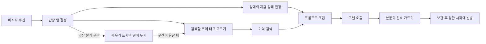
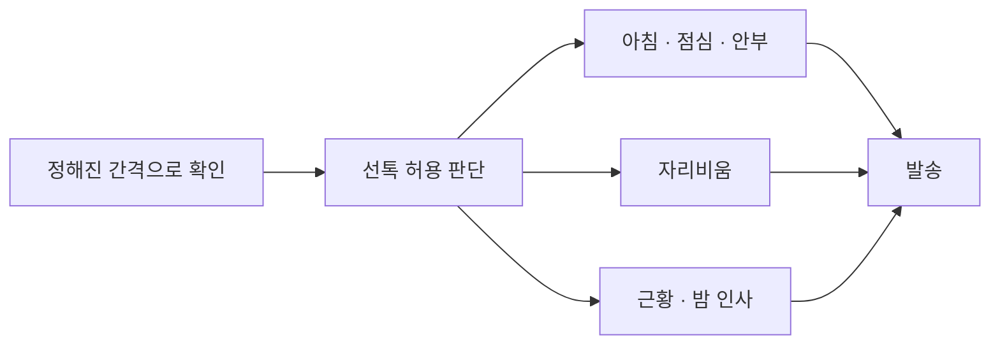
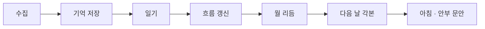
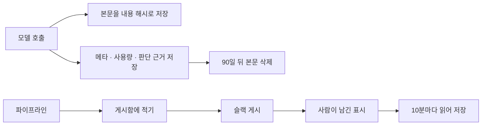

# 모듈 구성 — 코드가 나뉜 단위와 하는 일

[ERD](erd.md)에 그린 데이터를 읽고 쓰는 코드가 어떻게 나뉘어 있는지 정리했다. 코드 구조를 그릴 때 흔히 쓰는 C4 모델은 시스템 전체에서 시작해 실행 단위 · 모듈 · 코드 순으로 한 단계씩 확대해 가며 그리는데, 여기서는 가운데 두 단계인 실행 단위와 모듈만 그렸다. 어떤 변경이 어느 파일로 가고 고칠 때 무엇을 같이 봐야 하는지는 축이 다른 문서인 [areas.md](areas.md)에 있다.

## 실행 단위

봇 프로세스는 계속 실행된 상태로 유저 메시지를 받고 정해진 간격으로 선톡 조건을 확인한다. 새벽 배치는 하루 한 번 실행되어 그날의 대화를 기억으로 정리하고 다음 날에 필요한 것을 미리 만든다. 둘 다 SQLite 한 곳에만 쓰기 때문에 배치를 봇 안에서 실행하든 밖에서 스크립트로 실행하든 결과가 같다.

## 봇 프로세스 — 답장 경로

| 모듈 | 하는 일 | 모델 호출 |
| --- | --- | --- |
| bot.ts | 텔레그램 수신과 발송, 나눠 온 유저 말 모으기, 말풍선 나눠 보내기, 답장 불가 구간이 끝날 때 몰아 답장과 복귀 인사, 답장에서 한 연락 약속을 그 시각에 지키기 | 몰아 답장 · 복귀 인사 · 약속 연락 각 1번 |
| reply-timing.ts | 각본 블록의 두 태그로 답장 텀 계산, 붙잡는 말인지 판정, 답장 불가 구간이면 몰아 답장으로 넘기기 | 붙잡기 판정 1번 |
| tag-pick.ts | 이번 발화로 검색할 주제 태그 고르기, 저장된 태그 목록에 대조해 거르기 | 태그 고르기 1번 |
| user-state.ts | 최근 대화로 상대가 지금 어떤 상태인지 판정, 앞서 판정한 값과 다를 때만 관계 행에 저장. 같은 호출이 열림 신호 4항목을 함께 돌려주고, 코드가 그것을 relationship_signals 표에 턴마다 1행으로 적는다. 태그 고르기와 나란히 돈다 | 상대 상태 판정 1번 |
| memory.ts | 기억 저장과 태그 검색 | 없음 |
| recall.ts | 태그로 찾은 것 중 프롬프트에 넣을 것 고르기, 넣을 줄 만들기 | 없음 |
| turns.ts | 대화 기록을 턴으로 합치고 시간 마커 넣기 | 없음 |
| context.ts | 프롬프트 네 묶음 조립, 캐시 경계 두 곳 표시. 불변층의 관계 절 앞에 관계의 공통 틀과 지금 단계 블록을 넣고(문안은 prompts/relationship.ts), 실시간 꼬리에 「지금 관계」 절을 채운다(채우는 코드는 context/relationship.ts) | 없음 |
| llm.ts | 모델 호출, 프롬프트 캐시 적용, 사용량과 호출 원문 기록 | 있음 |
| reply-signal.ts | 모델에 시킬 출력 형식과 그 답을 본문과 신호로 가르는 읽기. 신호에는 쓴 수 · 처음 · 일정 말함 3항목이 들어 있다 | 없음 |
| relationship-update.ts | 답장에 담겨 온 말투 · 사이 · 서로 부르는 말과 상대 상태 판정 결과를 그 자리에서 저장 | 없음 |
| reply-compose.ts | 답장 한 통을 만드는 순서. 신호의 쓴 수와 일정 말함은 답장 행의 meta_json에 적고, 처음은 firsts 표에 미확정 행으로 넣는다 | 없음 |
| pending.ts | 만들어 둔 답장 보관, 정한 시각에 발송, 구간 끝 깨우기 표시와 연락 약속 보관, 재시작 복구 | 없음 |

## 봇 프로세스 — 선톡 경로

| 모듈 | 하는 일 | 실행 주기 | 모델 호출 |
| --- | --- | --- | --- |
| proactive-policy.ts | 무응답 일수로 그날 보낼 선톡 종류 판단 | 세 모듈 앞 · 새벽 배치 | 없음 |
| dispatch.ts | 새벽에 만들어 둔 아침 · 점심 · 안부 문안 발송 | 3분 간격 | 없음 |
| presence.ts | 긴 일정에 들어가기 직전 예고 선톡, 하루 3회까지 | 10분 간격 | 문안 생성 |
| glance.ts | 불가 블록 안에 온 확인 말에 지금 하는 일과 끝나는 시각을 알리는 틈새 한 줄, 블록마다 1회 | 5분 간격 | 판단 + 문안 생성 |
| followup.ts | 유저와 캐릭터 둘 다 마지막 말이 4시간 넘게 지났으면 근황, 자정 넘겨 1시간 무응답이면 밤 인사, 답장이 판정해 둔 상대 상태가 캐릭터 때문에 안 좋은 채로 30분 조용하면 달래기 | 15분 간격 | 문안 생성 |

세 모듈은 각자 조건을 확인하기 전에 선톡 판단을 먼저 거친다. 유저가 며칠째 답이 없는지를 이 한 곳이 세어 오늘 어떤 선톡을 보낼 차례인지까지 정하므로, 선톡 종류를 더해도 답이 없을 때 멈추는 규칙을 다시 짤 일이 없다. 새벽 배치가 다음 날 문장을 준비할 때와 발송 직전에 다시 확인할 때도 같은 판단을 부른다. 답이 이틀째 없어 아침 대신 점심에 보내는 날은 아침 선톡과 같은 종류로 저장하고 발송 창만 점심 시간대로 잡는다.

다녀온 뒤에 보내는 복귀 인사도 선톡이지만 답장 경로의 bot.ts에 있다. 답장 불가 구간이 끝나는 시각에 깨어나는 자리를 한 곳으로 두어야, 그 사이 쌓인 메시지에 몰아 답할지 복귀 인사를 보낼지를 한 번에 가릴 수 있기 때문이다. 자리비움 선톡은 캐릭터가 나갔다 오는 일정 수만큼 나가는 말이라 하루 총량과 따로 세고, 나가면서 알리는 예고만 하루 3회까지 보낸다. 복귀 인사는 이미 알린 구간을 마무리하는 말이라 그 3회에 넣지 않는다.

답장에서 한 연락 약속도 같은 자리에서 지킨다. 캐릭터가 통화 끝나고 연락하겠다고 하면 답장 신호로 그 약속 문장만 받고, 시각은 코드가 각본 블록이 끝나는 시각에서 골라 pending_replies에 걸어 둔다. 그 시각에 모델을 다시 불러 그때의 대화 기록을 보고 말을 만들고, 유저가 그 사이 말을 보냈으면 그 답장이 약속을 지키는 자리가 된다. 약속을 지키는 말은 하루 상한에 막히면 약속을 어기는 쪽이 되어서 하루 총량에 넣지 않는다.

## 봇 프로세스 — 온보딩 경로

유저가 처음 들어올 때 한 번만 실행되는 경로라 봇 프로세스 안에 있다.

| 모듈 | 하는 일 | 모델 호출 |
| --- | --- | --- |
| user-profile.ts | 부르는 이름 · 성별 · 출생연도를 받고, 하는 일과 사는 지역은 비워 둔 채 시작 | 없음 |
| character.ts | 물음 8개(성별 · 나이대 · 성격 · 출발 설정에 덧붙일 것 · 말투 · 원하는 방식 · 약한 구석 · 바라는 모습)로 받은 입력으로 캐릭터를 생성, 정체성 · 주변 인물 · 진행 중인 일 · 관계 첫 값을 만드는 호출과 삶의 흐름을 쓰는 호출로 나눔. 원하는 방식과 결점은 코드가 정체성 값으로 적고, 관계 단계는 1로 시작하며, 생성 뒤 `character_start` 게시가 나감 | 2번 |

공통으로 쓰는 모듈은 넷이다. db.ts에 스키마와 쿼리가 모여 있고, kst.ts가 한국 시각과 논리일을 계산한다. labels.ts는 닫힌 목록 값의 영어 식별자와 한국어 이름을 한곳에 모으고, thresholds.ts는 선톡 창 · 답장 텀 범위 · 검색 개수 상한처럼 숫자로 관리하는 값을 「고정된 기준값」 표와 1:1로 모은다.

## 새벽 배치

| 모듈 | 하는 일 | 실행 주기 | 모델 호출 |
| --- | --- | --- | --- |
| nightly.ts | 데이터 수집, 기억 정리와 관계 갱신, 일기, 흐름 갱신, 선톡 문안, 한 번에 저장 | 하루 한 번 | 평소 4번 |
| life-plan.ts | 한 달치 이벤트와 매일 컨디션 생성 | 남은 날 6일 이하일 때 | 1번 |
| day-plan.ts | 다음 날 각본 생성 | 하루 한 번 | 1번 |
| tools/ | 배치를 봇 밖에서 실행하는 스크립트, 채점과 분석, 화면 렌더 | 운영자가 실행할 때 | 스크립트마다 다름 |

앞 단계의 결과를 뒤 단계가 읽기 때문에 순서대로 실행한다. 흐름 갱신은 달력 경계에 걸리는 날만, 월 리듬은 이번 달 남은 날이 6일 이하일 때만 실행한다. 각본에는 20분 넘게 자리를 비우는 일정을 하루 3개까지만 넣는다. 그 일정마다 자리비움 선톡이 한 통씩 나가는데, 보낼 때만 막으면 각본에 잡아 둔 일정인데도 알리지 못한 채 지나간다. 전부 만든 다음 한 번에 저장해서, 중간에 실패하면 그날 것이 통째로 남고 다음 실행이 채운다. 각본 없이 시작한 하루에 유저가 먼저 말을 걸면 그 자리에서 임시 각본을 만들고, 다음 새벽 정리가 새로 만든 각본으로 교체하면서 이미 지나간 실제 기록은 그대로 남긴다. 유저와의 관계(사이 정의 · 서로 부르는 말 · 마음 상태 등 relationships의 항목들)는 기억을 정리하는 호출의 출력에 같이 들어 있어서, 관계를 갱신한다고 모델 호출이 늘지 않는다.

## 기록 경로

답장과 새벽 배치 양쪽에 걸리는 경로다. 답이 이상하게 나왔을 때 그 호출에 무엇을 넣었고 무엇이 나왔는지 열어 보려고, 호출마다 프롬프트와 출력 본문에 판단 근거를 더해 남긴다.

| 모듈 | 하는 일 | 실행 주기 | 모델 호출 |
| --- | --- | --- | --- |
| llm.ts | 호출한 프롬프트와 출력, 토큰 사용량, 걸린 시간을 기록 | 호출할 때마다 | 해당 없음 |
| db.ts | 본문을 내용 해시로 저장, 90일 지난 본문과 아무도 가리키지 않는 본문 삭제 | 새벽 5시 50분 | 없음 |
| reply-trace.ts | 호출 기록을 읽어 답장 한 건의 근거(답한 유저 발화 · 답장 텀이 나온 길 · 검색한 태그와 기억 · 관계 단계와 열림 신호)를 게시함에 기록 | 1분 간격 | 없음 |
| nightly-trace.ts | 새벽 정리가 반영하기 전후의 값을 읽어 그 밤의 결과(기억 · 관계 · 일정 · 일기 · 선톡 문안)를 게시함에 기록 | 새벽 정리가 반영할 때 | 없음 |
| trace.ts | 파이프라인이 게시함에 적어 둔 내용을 슬랙 채널에 게시 | 1분 간격 | 없음 |
| feedback.ts | 슬랙 채널에 사람이 남긴 표시(리액션으로 고른 분류 · 스레드에 적은 이유)를 읽어 그 답장을 만든 호출과 묶어 저장 | 10분 간격 | 없음 |
| tools/check-writes.ts | 쌓인 기록을 한 번에 읽는 점검 스크립트 | 운영자가 실행할 때 | 없음 |

답장 파이프라인은 판단 근거도 함께 적는다. 검색한 태그와 프롬프트에 넣은 기억, 개수 상한에 걸려 빠진 후보, 답장 텀이 나온 길과 그 결과, 말풍선 수와 길이까지다. 기억 검색은 꺼낸 기록을 남기는 쓰기 동작이고 각본과 기억은 새벽마다 새로 쓰여서 나중에 같은 프롬프트를 다시 만들 수 없기 때문에, 호출하는 그 시점에 적어 둔다.

슬랙 게시도 보낼 것을 먼저 적어 두는 방식을 쓴다. 파이프라인이 게시함에 행으로 적으면 1분 간격 틱이 가져가 보내기 때문에, 봇이 다시 뜨거나 슬랙이 응답하지 않아도 게시가 밀리기만 한다.

채널에 올라간 답장에는 읽는 사람이 표시를 남길 수 있다. 이상한 답장을 보면 리액션으로 분류를 고르고(사실 오류 · 말투 · 타이밍 · 좋음) 그렇게 본 이유를 스레드에 적으면, 10분 간격 틱이 채널을 다시 읽어 그 표시를 저장한다. 리액션이 달릴 때마다 슬랙이 알려 주는 방식(Socket Mode) 대신 채널을 다시 읽는 방식을 쓴다. 채널을 읽으면 메시지마다 지금 붙어 있는 리액션이 함께 오기 때문에 표시를 한 번에 알 수 있고, 봇이 내려가 있던 동안 남긴 표시도 다음 회차에 들어온다. 표시가 붙은 호출은 90일 정리에서 빼기 때문에 프롬프트와 출력이 함께 남는다. 모아 두기만 하고 캐릭터의 프롬프트나 기억으로는 보내지 않는다.

## 모듈을 이렇게 나눈 기준

- **판단은 코드, 문장은 모델.** 언제 보낼지와 보내도 되는지는 코드가 표와 조건으로 정하고, 모델은 무슨 말을 할지만 정한다. 답장 텀에서 모델을 부르는 자리는 붙잡는 말인지 가르는 한 번뿐이다.
- **모델 호출은 llm.ts 한 곳.** 캐시 적용과 사용량 기록을 여기 모아 두면 부르는 자리가 늘어도 비용을 한 표에서 본다.
- **배치는 수집과 저장을 분리.** 읽기와 쓰기를 갈라 두면 같은 배치를 봇 안에서도, 봇 밖 스크립트로도 실행할 수 있다.

## 구성에 쓴 방식

- **보낼 것을 먼저 DB에 적기.** transactional outbox라고 부르는 방식이다. 답장과 선톡 문안을 만든 자리에서 바로 보내지 않고 pending_replies · scheduled_messages에 적은 다음, 발송을 맡은 쪽이 정해진 시각에 가져가 보낸다. 봇이 내려가도 보낼 것이 남아 있고, 실패한 시도를 같은 행에 세어 둘 수 있다.
- **어디까지 처리했는지 표시하기.** 이런 처리를 idempotent consumer라고 한다. 발송을 마친 마지막 유저 메시지 시각을 recovery_marks에 적어 두고, 다시 시작할 때 그 뒤의 메시지만 처리해서 같은 메시지에 두 번 답하지 않는다.
- **한 번에 커밋하는 배치.** unit of work에 해당한다. 새벽 정리는 모델 호출 4번의 결과를 다 모은 뒤 트랜잭션 하나로 저장해서, 중간에 실패해도 절반만 반영된 하루가 남지 않는다.
- **막는 판단을 객체 하나로.** policy 객체를 두는 것과 같다. 선톡을 보내도 되는지를 proactive-policy.ts가 혼자 답하고, 부르는 쪽은 조건을 모르고 답만 받는다.
- **같은 내용은 한 벌만 저장하기.** 내용 해시를 키로 쓰는 content-addressed storage 방식이다. 프롬프트의 앞 두 묶음은 하루 종일 같은 글자여서 호출마다 통째로 담으면 호출 수만큼 커진다. 본문의 해시를 키로 두고 호출 기록은 해시만 가리키게 해서, 답장 한 건에 새로 쌓이는 양이 40KB에서 7.5KB로 줄었다.
- **태그로 찾는 역색인.** 태그에서 데이터로 가는 방향의 표를 따로 두는 것을 inverted index라고 한다. 데이터마다 태그를 달아 두기만 하면 검색할 때 전부 훑어야 하는데, 방향을 뒤집어 두면 태그 하나로 끝난다.

레이어드 아키텍처나 클린 아키텍처처럼 폴더 구조를 먼저 정하는 방식은 쓰지 않았다. 모듈을 계층이 아니라 대화할 때 · 선톡할 때 · 새벽에처럼 실행되는 시점으로 나눴기 때문에, 계층 이름으로 폴더를 가르면 한 경로를 읽으려고 폴더 셋을 오가게 된다.

## V3에서 바뀌는 흐름

V3(관계를 쌓는 캐릭터, 이슈 #326)가 위 경로에 더하는 단계다. 값과 문안은 relationship.md에 있고, 구현 세션이 코드로 옮기면 그 단계를 위 경로 본문에 넣고 여기서 지운다.

### 답장 경로

- 처음이 표시되면 `first_event` 게시가 따로 나간다.

### 선톡 경로

- 선톡 정책이 근거 종류 4개(의도·일정·달래기·약속)와 단계별 하루 상한으로 답한다. 하루 합계 상한 상수 하나는 단계별 표로 바뀐다.
- 선톡 틱에 의도 선톡이 더해진다. 의도 선톡은 오늘 의도 줄 중 아직 안 쓴 것 하나를 상황 문단에 넣는다. 근황과 밤 인사 문안도 의도 줄을 상황 문단에 받는다. 틈새 한 줄은 glance.ts로 먼저 만들었다.
- 자리 비움 예고는 하루 2번까지로 줄고, 복귀 문안은 무엇을 했는지 대신 상대의 마지막 말을 받는다.
- 선톡 게시에 근거 줄이 붙는다.

### 새벽 배치

- 수집이 열림 신호와 대화 기록으로 문턱 조건을 세고, 어제 쓴 수마다 반응 점수 표본을 계산하고, 시도할 수 추천 목록을 만든다.
- 기억 정리 호출이 입력의 관계 절을 읽고 출력의 관계 절에 넘길지와 근거, 처음 확정, 오늘의 의도 4줄과 앞세울 결을 적는다. 외부 스케줄러의 지시서에도 같은 절이 들어간다.
- 저장 단계가 같은 트랜잭션에서 단계 번호와 시작일, 처음 확정과 취소, 반응 점수, 의도 행을 적는다. 단계를 내리거나 2단계 이상 올리는 출력은 버린다.
- 아침·안부 문안 호출이 의도 4줄을 상황 문단으로 받는다.
- 새벽 게시에 관계 절이 붙고, 단계가 오르면 `stage_change` 게시가 따로 나간다.

### 기록 경로

- 게시 종류 4개(캐릭터 생성·종료·단계 전이·처음 발생)가 늘고, 캐릭터를 끝내는 도구와 단계·처음·점수를 보는 확인 도구가 생긴다.
