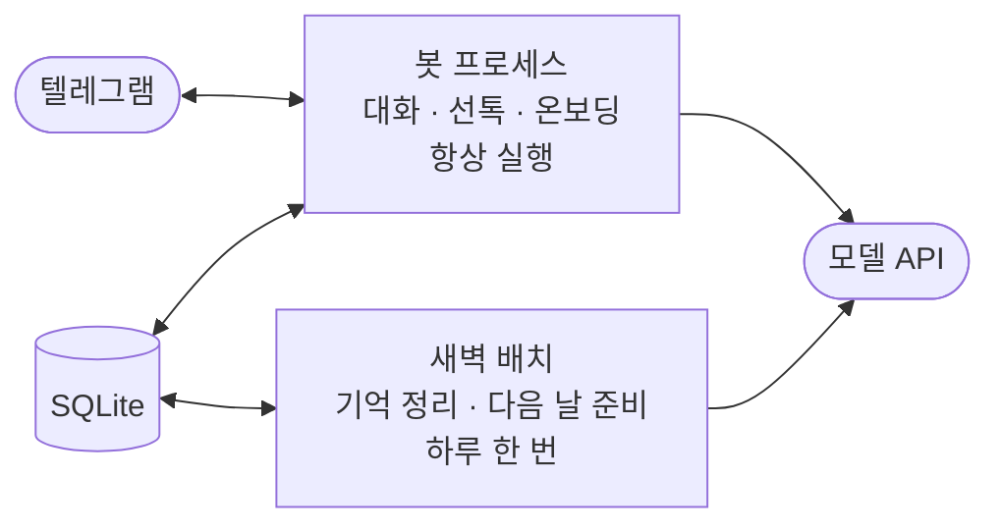
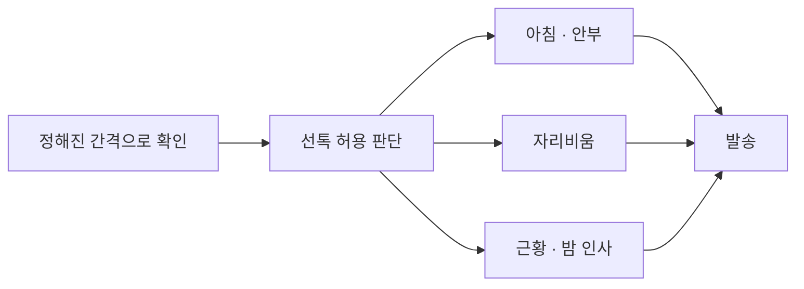

# 모듈 구성 — 코드가 나뉜 단위와 하는 일

[ERD](erd.md)에 그린 데이터를 읽고 쓰는 코드가 어떻게 나뉘어 있는지 정리했다. 코드 구조를 그릴 때 흔히 쓰는 C4 모델은 시스템 전체에서 시작해 실행 단위 · 모듈 · 코드 순으로 한 단계씩 확대해 가며 그리는데, 여기서는 가운데 두 단계인 실행 단위와 모듈만 그렸다.

## 실행 단위

봇 프로세스는 계속 실행된 상태로 유저 메시지를 받고 정해진 간격으로 선톡 조건을 확인한다. 새벽 배치는 하루 한 번 실행되어 그날의 대화를 기억으로 정리하고 다음 날에 필요한 것을 미리 만든다. 둘 다 SQLite 한 곳에만 쓰기 때문에 배치를 봇 안에서 실행하든 밖에서 스크립트로 실행하든 결과가 같다.

## 봇 프로세스 — 답장 경로

| 모듈 | 하는 일 | 모델 호출 |
| --- | --- | --- |
| bot.ts | 텔레그램 수신과 발송, 나눠 온 유저 말 모으기, 말풍선 나눠 보내기 | 없음 |
| reply-timing.ts | 각본 블록의 두 태그로 답장 텀 계산, 붙잡는 말인지 판정 | 붙잡기 판정 1번 |
| memory.ts | 기억 저장과 태그 검색 | 없음 |
| context.ts | 프롬프트 네 묶음 조립, 캐시 경계 표시 | 없음 |
| llm.ts | 모델 호출, 프롬프트 캐시 적용, 사용량 기록 | 있음 |
| bubble-polish.ts | 말풍선 다듬기 | 없음 |
| pending.ts | 만들어 둔 답장 보관, 정한 시각에 발송, 재시작 복구 | 없음 |

## 봇 프로세스 — 선톡 경로

| 모듈 | 하는 일 | 실행 주기 | 모델 호출 |
| --- | --- | --- | --- |
| proactive-policy.ts | 무응답 일수로 선톡 허용 여부 판단 | 세 모듈 앞 | 없음 |
| dispatch.ts | 새벽에 만들어 둔 아침 · 안부 문안 발송 | 3분 간격 | 없음 |
| presence.ts | 긴 일정에 들어가기 직전과 끝난 뒤 선톡 | 10분 간격 | 문안 생성 |
| followup.ts | 4시간 무응답이면 근황, 자정 넘겨 1시간 무응답이면 밤 인사 | 15분 간격 | 문안 생성 |

세 모듈은 각자 조건을 확인하기 전에 선톡 허용 판단을 먼저 거친다. 유저가 며칠째 답이 없을 때 이 한 곳이 전부 막기 때문에, 선톡 종류를 더해도 답이 없을 때 멈추는 규칙을 다시 짤 일이 없다.

## 봇 프로세스 — 온보딩 경로

유저가 처음 들어올 때 한 번만 실행되는 경로라 봇 프로세스 안에 있다.

| 모듈 | 하는 일 | 모델 호출 |
| --- | --- | --- |
| user-profile.ts | 부르는 이름 · 성별 · 출생연도를 받고, 하는 일과 사는 지역은 비워 둔 채 시작 | 없음 |
| character.ts | 유저가 적은 선택지와 서술형 입력을 받아 캐릭터를 한 번의 호출로 생성 | 1번 |

공통으로 쓰는 모듈은 둘이다. db.ts에 스키마와 쿼리가 모여 있고, kst.ts가 한국 시각과 논리일을 계산한다.

## 새벽 배치

| 모듈 | 하는 일 | 실행 주기 | 모델 호출 |
| --- | --- | --- | --- |
| nightly.ts | 데이터 수집, 기억 정리와 관계 갱신, 일기, 흐름 갱신, 선톡 문안, 한 번에 저장 | 하루 한 번 | 평소 4번 |
| life-plan.ts | 한 달치 이벤트와 매일 컨디션 생성 | 남은 날 6일 이하일 때 | 1번 |
| day-plan.ts | 다음 날 각본 생성 | 하루 한 번 | 1번 |
| tools/ | 배치를 봇 밖에서 실행하는 스크립트, 채점과 분석, 화면 렌더 | 운영자가 실행할 때 | 스크립트마다 다름 |

앞 단계의 결과를 뒤 단계가 읽기 때문에 순서대로 실행한다. 흐름 갱신은 달력 경계에 걸리는 날만, 월 리듬은 이번 달 남은 날이 6일 이하일 때만 실행한다. 전부 만든 다음 한 번에 저장해서, 중간에 실패하면 그날 것이 통째로 남고 다음 실행이 채운다. 각본 없이 시작한 하루에 유저가 먼저 말을 걸면 그 자리에서 임시 각본을 만들고, 다음 새벽 정리가 새로 만든 각본으로 교체하면서 이미 지나간 실제 기록은 그대로 남긴다. 유저와의 관계(사이 정의 · 관계의 결 · 마음 상태 등 relationships의 항목들)는 기억을 정리하는 호출의 출력에 같이 들어 있어서, 관계를 갱신한다고 모델 호출이 늘지 않는다.

## 모듈을 이렇게 나눈 기준

- **판단은 코드, 문장은 모델.** 언제 보낼지와 보내도 되는지는 코드가 표와 조건으로 정하고, 모델은 무슨 말을 할지만 정한다. 답장 텀에서 모델을 부르는 자리는 붙잡는 말인지 가르는 한 번뿐이다.
- **모델 호출은 llm.ts 한 곳.** 캐시 적용과 사용량 기록을 여기 모아 두면 부르는 자리가 늘어도 비용을 한 표에서 본다.
- **배치는 수집과 저장을 분리.** 읽기와 쓰기를 갈라 두면 같은 배치를 봇 안에서도, 봇 밖 스크립트로도 실행할 수 있다.

## 구성에 쓴 방식

- **보낼 것을 먼저 DB에 적기.** transactional outbox라고 부르는 방식이다. 답장과 선톡 문안을 만든 자리에서 바로 보내지 않고 pending_replies · scheduled_sends에 적은 다음, 발송을 맡은 쪽이 정해진 시각에 가져가 보낸다. 봇이 내려가도 보낼 것이 남아 있고, 실패한 시도를 같은 행에 세어 둘 수 있다.
- **어디까지 처리했는지 표시하기.** 이런 처리를 idempotent consumer라고 한다. 발송을 마친 마지막 유저 메시지 시각을 recovery_marks에 적어 두고, 다시 시작할 때 그 뒤의 메시지만 처리해서 같은 메시지에 두 번 답하지 않는다.
- **한 번에 커밋하는 배치.** unit of work에 해당한다. 새벽 정리는 모델 호출 4번의 결과를 다 모은 뒤 트랜잭션 하나로 저장해서, 중간에 실패해도 절반만 반영된 하루가 남지 않는다.
- **막는 판단을 객체 하나로.** policy 객체를 두는 것과 같다. 선톡을 보내도 되는지를 proactive-policy.ts가 혼자 답하고, 부르는 쪽은 조건을 모르고 답만 받는다.
- **태그로 찾는 역색인.** 태그에서 데이터로 가는 방향의 표를 따로 두는 것을 inverted index라고 한다. 데이터마다 태그를 달아 두기만 하면 검색할 때 전부 훑어야 하는데, 방향을 뒤집어 두면 태그 하나로 끝난다.

레이어드 아키텍처나 클린 아키텍처처럼 폴더 구조를 먼저 정하는 방식은 쓰지 않았다. 모듈을 계층이 아니라 대화할 때 · 선톡할 때 · 새벽에처럼 실행되는 시점으로 나눴기 때문에, 계층 이름으로 폴더를 가르면 한 경로를 읽으려고 폴더 셋을 오가게 된다.

## 지금 코드에서 바뀌는 것

| 구분 | 대상 |
| --- | --- |
| 바뀌는 모듈 | character.ts(코드가 정하던 성별 · 나이 · MBTI · 애착유형 대신 유저 입력으로 생성), memory.ts(저장 항목 셋으로 정리, origin=creation 행 수정 거부, 주변 인물 저장과 검색), nightly.ts(기억 정리 호출의 출력에 관계 항목 갱신 포함), context.ts(관계 항목을 relationships에서 읽어 항상 주입) |
| 삭제 | cast_members를 읽고 쓰는 코드 — 주변 인물은 memory.ts가 담당한다 |
| 그대로 | bot.ts, llm.ts, bubble-polish.ts, reply-timing.ts, pending.ts, labels.ts, proactive-policy.ts, dispatch.ts, presence.ts, followup.ts, life-plan.ts, day-plan.ts, user-profile.ts, kst.ts, config.ts. db.ts는 스키마 정의 변경만 |
