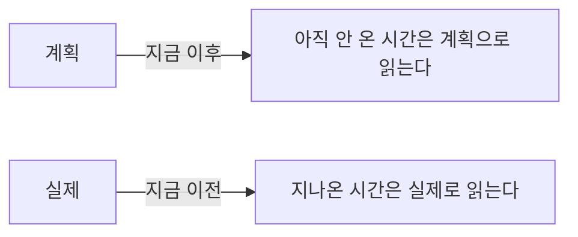
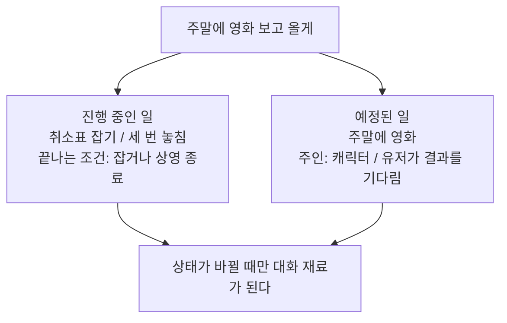
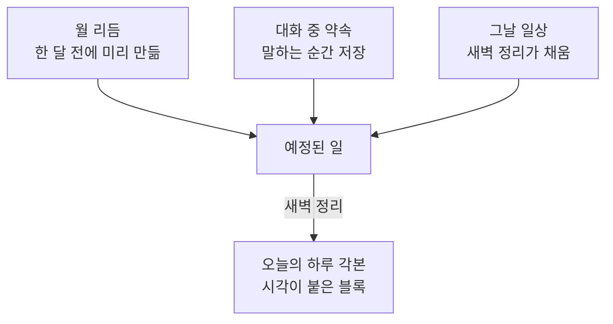
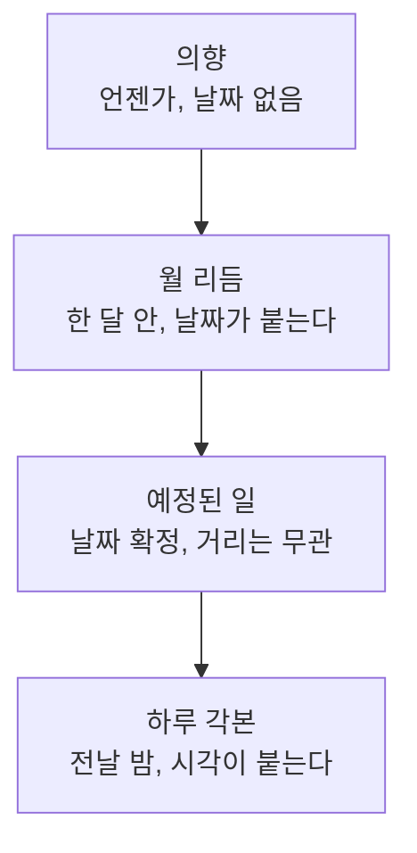
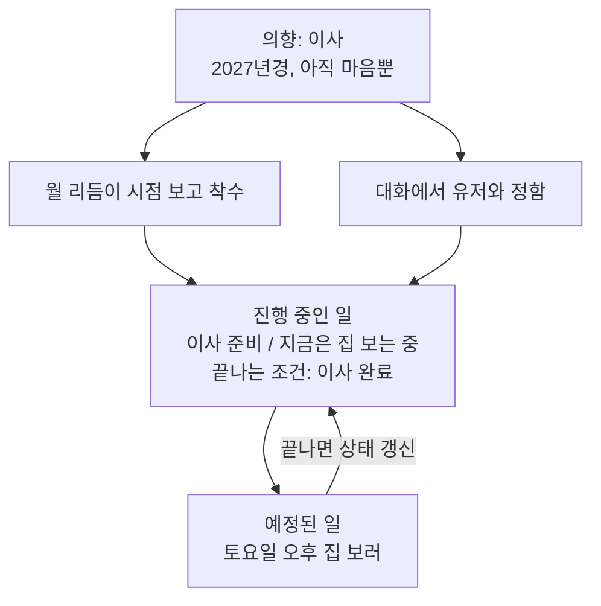
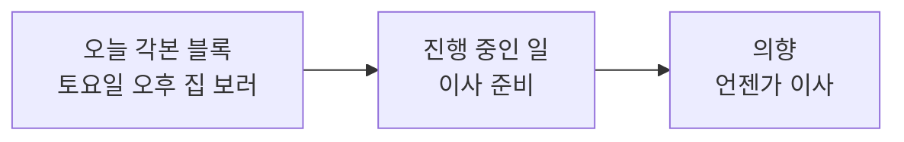
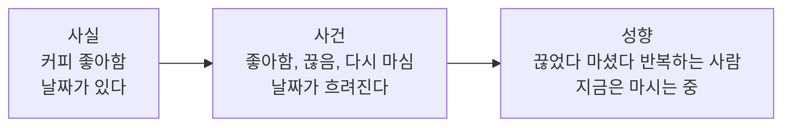

# 시간과 기억

캐릭터의 삶이 어떻게 만들어지고, 무엇이 기억으로 남고, 언제 그것을 꺼내는지에 대한 설계다.

세 갈래가 한 축 위에 있다. **생성**은 앞으로 살 시간을 만들고, **기억**은 지나온 시간을 남기고, **회수**는 지금 무엇을 꺼낼지 정한다. 축은 셋 다 시간이다.

현재 구현된 구조를 설명하는 문서가 아니다. 기존 구조는 그대로 둔 채 백지에서 다시 설계한 결과이고, 정리가 끝나면 이관한다. 진행 상황은 이슈 [#13](https://github.com/hyewon3938/random-ai-companion/issues/13).

## 이 문서에서 쓰는 말

| 말 | 뜻 |
| --- | --- |
| 칸 | 저장 항목 하나. 이 문서 안에서만 쓰는 말이고, 밖으로 나가는 문서에서는 항목이라고 쓴다 |
| 오늘 메모 | 대화 중 즉시 적어두는 자리. 정리 안 된 줄이 그날치만 쌓이고 밤에 비워진다 |
| 정식 칸 | 셀 지도의 열한 칸. 오늘 메모에서 옮겨온 것이 여기 자리 잡는다 |
| 항목 키 | 이 줄이 무엇에 대한 것인지. 항목마다 하나. 덮어쓸 자리를 정한다 |
| 주제 태그 | 어떤 얘기 때 함께 검색되는지. 여러 개. 꺼낼 때 쓴다 |
| 새벽 정리 | 하루치를 정리하는 새벽 배치. 예전 이름은 밤 정리, 코드에서는 nightly |
| 각본 | 하루를 시각 블록으로 펼친 것 |
| 아크 | 요즘 삶이 어떤 결인지 한두 줄. 해, 계절, 달, 주 네 단위 |
| 내다보는 거리 | 지금부터 얼마나 먼 앞일을 다루는지 |

## 왜 다시 설계하는가

세 가지 고장에서 출발했다. 셋 다 원인이 기억의 형태에 있었다.

1. **접기로 한 일정을 실제로 한 일처럼 말한다.** 유저가 붙잡아 접은 일정이 원래 각본에 그대로 남아 있어서, 지나온 시간을 서술할 때 다시 읽힌다. 덮어쓴 쪽이 무엇을 덮었는지 기록하지 않은 탓이다.
2. **경과 시간을 틀린다.** 지금 시각만 주고 마지막 대화 시각을 주지 않으니 캐릭터가 뺄셈을 추측으로 한다.
3. **말투 지시가 희석된다.** 규칙이 금지형으로 여러 블록에 흩어져 있고, 어느 블록이 실제로 효과가 있는지 측정된 적이 없다.

## 기억 셀 지도

변하는 속도로 줄을 세운다. 위쪽은 거의 안 변하고 아래로 갈수록 자주 변한다. 오른쪽 열은 크기가 계속 늘어나는 칸이라 매번 넣지 않고 필요할 때 꺼낸다.

| 변하는 속도 | 항상 들어감 | 조건부로 꺼냄 |
| --- | --- | --- |
| 안 변함 | 나 | |
| 몇 달 | 캐릭터와 유저의 관계, 유저 프로필 | 알게 된 유저 사실, 주변 인물 |
| 며칠에서 몇 주 | 예정된 일, 진행 중인 일 | |
| 하루 | 오늘 | 지난 일기 |
| 매 순간 | 최근 대화, 지금 | |

각 칸이 무엇인지.

- **나** — 이름, 성격, 말투. 씨앗 정체성은 안 변하고, 대화하며 쌓인 자잘한 사실과 아직 날짜가 없는 의향은 그 위에 얹힌다.
- **캐릭터와 유저의 관계** — 친구인지 썸인지, 반말을 쓰는지, 서로를 뭐라고 부르는지.
- **유저 프로필** — 직업, 사는 곳처럼 잘 안 바뀌는 것.
- **알게 된 유저 사실** — 취향, 습관, 최근 상황. 대화할수록 계속 쌓여서 크기에 상한이 없다.
- **주변 인물** — 캐릭터 쪽과 유저 쪽 모두. 이름이 대화에 나올 때만 꺼낸다.
- **예정된 일** — 앞으로 있을 일. 날짜가 붙어 있다.
- **진행 중인 일** — 끝나지 않은 일. 날짜가 없고 상태가 있다.
- **오늘** — 오늘의 계획과 실제. 지금 시각이 둘을 가른다.
- **지난 일기** — 어제 이전의 하루들.
- **최근 대화** — 오늘 대화 요약과 최근 원문 몇 개.
- **지금** — 시각, 요일, 마지막 대화로부터 얼마나 지났는지.

## 칸을 가르는 기준

**다시 계산할 수 있으면 기억하지 않는다.** 답장 지연 시간처럼 매번 상황에서 계산되는 값은 저장할 이유가 없다. 반대로 유저가 문장을 끊어 보내는 간격처럼 관찰해야만 알 수 있는 값은 기억이다.

**크기가 고정된 칸은 항상, 계속 늘어나는 칸은 조건부.** 조건부 주입은 "지금 필요한가"를 판정해야 하는데 이 판정이 틀리면 대화가 깨진다. 몇 줄짜리 고정 크기 칸은 판정을 틀릴 위험이 넣는 비용보다 크므로 그냥 항상 넣는다. 판정할 가치가 있는 건 상한 없이 자라는 칸뿐이다.

**저장은 정확하게, 말은 대충.** 날짜는 `2026-08-19`로 저장하되 대화에서는 "3주 전쯤"이라고 말한다. 사람은 남의 말을 날짜로 기억하지 않는다. 정확한 날짜를 대는 순간 기록을 조회한 티가 난다. 경과 계산은 코드가 하고 캐릭터에게는 이미 흐려진 표현으로 건넨다.

**부딪히는 값은 한 항목 안에 둔다.** "커피 좋아함"과 "커피 끊음"을 따로 저장해 나란히 주입하면 캐릭터가 둘 중 아무거나 고른다. 접은 일정이 되살아나던 고장과 같은 형태다. 서로 부딪히는 값은 반드시 한 항목의 현재값과 이력으로 묶는다.

**유저가 아는 것은 조용히 못 바꾼다.** 유저가 모르는 일정끼리는 배치가 마음대로 밀고 당겨도 된다. 유저에게 말한 순간 그것은 조정 대상이 되고, 조정하면 말해야 하는 것이 된다.

## 계획과 실제

하루는 두 줄로 저장한다. 계획한 것과 실제로 산 것이다. 지금 시각이 둘의 읽는 경계다.



지나온 시간을 계획으로 읽으면 안 한 일을 한 일처럼 말하게 된다. 그렇다고 계획을 지우면 안 된다. 유저가 "나 때문에 운동 못 했네"라고 할 때 캐릭터도 무엇이 밀렸는지 알아야 한다.

그래서 실제 쪽 항목이 계획을 삼킨다.

| 필드 | 값 |
| --- | --- |
| 하려던 것 | 10시 러닝 |
| 어떻게 됐나 | 안 감 |
| 왜 | 유저와 얘기하느라 |

계획대로 된 것은 이유를 남기지 않는다. **어긋난 것만 이유가 붙는다.** 기록량이 그만큼 줄고, 남은 이유들은 전부 실제로 대화에 쓸 수 있는 것이 된다.

## 예정된 일과 진행 중인 일

같은 대화 한 줄에서 나와도 성격이 다르면 다른 칸에 들어간다. 가르는 기준은 **시각이 붙어 있느냐**다.

"주말에 영화 보고 올게"라고 말했고 표는 매진이라 취소표를 노려야 하는 상황을 예로 들면 이렇게 갈린다.



**약속은 별도 타입이 아니라 필드 하나다.** 유저가 "후기 남겨줘"라고 하는 순간 켜지는 것은 `유저가 결과를 기다림` 플래그다. 이 플래그가 꺼져 있으면 캐릭터 혼자 다녀온 일정이고, 켜져 있으면 끝난 뒤 유저가 묻기 전에 먼저 말해야 하는 일이 된다. 캐릭터의 일정, 유저와의 약속, 유저의 일정이 한 구조로 합쳐지는 것도 이 때문이다. 셋 다 같은 연산이 돈다. 지났는지 가르고, 안 지났으면 예정으로 읽고, 지났는데 어긋났으면 이유를 남긴다. 다른 것은 주인과 수명뿐이라 필드로 흡수된다.

**진행 중인 일에는 끝나는 조건이 반드시 붙는다.** 없으면 영영 안 지워지고 쌓인다. 그리고 "종종 얘기한다"의 규칙은 하나다. **상태가 바뀌면 말한다.** 놓친 것도 변화라서 "어제 또 놓쳤어"가 나오고, 며칠째 변화가 없으면 꺼내지 않는다. 상태가 바뀌었는데 유저가 그 자리에 없으면 그것이 먼저 연락할 근거가 된다.

### 오래 걸리는 일에 새 칸은 필요 없다

이사, 승진 심사 준비, 다이어트, 두 달 뒤로 잡아둔 해외여행. 몇 주에서 몇 달이 걸리는 일들인데 이것 때문에 칸을 새로 만들지 않는다. **기간은 축이 아니다.** 축은 시각이 붙어 있느냐 하나이고 긴 일도 거기서 갈린다.

| 예 | 어느 칸 | 왜 |
| --- | --- | --- |
| 이사, 승진 심사 준비, 다이어트 | 진행 중인 일 | 시각이 없고 끝나는 조건이 있다 |
| 두 달 뒤 해외여행 | 예정된 일 | 날짜가 있다. 다가오면 준비라는 진행 중인 일을 낳는다 |

예정된 일은 며칠 안의 것만 담는 칸이 아니다. **날짜가 확정된 것 전부**이고 거리는 상관없다. 두 달 뒤 여행은 월 리듬의 한 달 런웨이 밖이지만 대화에서 날짜가 정해진 순간 예정된 일로 들어가 그 자리에 그대로 있는다.

긴 일의 진짜 어려움은 저장이 아니라 꺼내기다. 두 달 내내 나오면 지겹고 안 나오면 잊은 사람이 된다. 답의 절반은 이미 있다 — **상태가 바뀔 때만 말한다.** 나머지 절반은 거리에서 나온다. 날짜가 있는 일은 가까워질수록 저절로 자주 나온다. 하루 각본이 그 날짜를 재료로 읽기 때문에 한 달 전에는 배경이고 사흘 전에는 준비가 오늘 블록으로 들어온다. 강도를 필드로 관리할 필요가 없다.

### 유저가 어디까지 아는가

약속 플래그는 켜고 끄는 스위치가 아니라 3단계 축이다. 항목마다 이 값이 하나 붙는다.

| 단계 | 뜻 | 지울 때 |
| --- | --- | --- |
| 모름 | 캐릭터만 안다 | 조용히 지운다 |
| 앎 | 대화에 나왔다 | 지우기 전에 말할 거리로 바꾼다 |
| 기다림 | 유저가 결과를 기다린다 | 결과를 먼저 알린다 |

**한 방향으로만 올라간다.** 한 번 말한 것을 유저가 잊었다고 되돌리지 않는다. 그래서 갱신이 싸다. 대화에 나오면 올리고 그 외에는 건드리지 않는다.

원본은 대화록이라 이 값은 원리상 매번 다시 계산할 수 있다. 그렇게 안 하는 이유는 정확도가 아니라 비용이다. 지울 때마다 대화록을 뒤지는 것보다 항목에 한 칸 두는 편이 싸다.

## 일정이 생기는 세 군데



대화에서 정해진 일은 밤을 기다리지 않고 **말하는 순간 저장한다.** 오후에 약속하고 저녁에 유저가 "아까 언제 본다고 했지?"라고 물으면 그 사이에도 답할 수 있어야 한다. 새벽 정리가 하는 일은 생성이 아니라 펼치기다.

형태도 다르다. 대화 중에는 날짜만 남는다. 사람도 "주말에 볼게"라고 말하지 몇 시라고 말하지 않는다. 시각은 그날 각본을 짤 때 붙는다.

### 겹칠 때

충돌은 두 겹으로 미리 막는다. 첫째, 약속하는 순간에 이미 잡힌 미래 일정을 보고 잡는다. 그래야 "그날은 선약이 있어서, 다음 날은 어때?"가 나온다. 둘째, 월 리듬을 새로 만들 때 이미 잡힌 약속 슬롯을 피해서 생성한다. 먼저 정해진 쪽이 이기는 규칙이 아니라 나중에 만드는 쪽이 비켜 가는 방식이다.

그래도 겹치면 **조용히 해결하지 않는다.** 둘 중 하나를 말없이 버리면 어느 쪽이 이겼는지 유저만 모르는 상태가 된다. 규칙을 좁히면 답이 하나로 남는다. 공적 일정은 원래 못 접고, 유저에게 말한 약속은 조용히 못 버린다. 남는 것은 캐릭터가 먼저 말해서 조정하는 것뿐이다. 충돌이 사고가 아니라 대화 재료가 된다.

### 유저가 하지 말라고 할 때

접기와 옮기기는 다른 동작이고 판정도 다르다.

| 묻는 것 | 무엇이 정하나 |
| --- | --- |
| 접을 수 있나 | 일정의 성격 (개인 / 사회 / 공적) |
| 옮길 수 있나 | 시각이 고정인가 |
| 혼자 정할 수 있나 | 상대가 있나 |

개인 일정이고 시각도 자유로우면 그냥 옮긴다. 상대가 있으면 물어봐야 하고, 그 순간 진행 중인 일이 하나 열린다. 공적이면 못 접고 못 옮기되 **빈손으로 거절하지 않는다.** 다 들어주는 것은 아부이고 안 된다고만 하는 것은 무심함이다. 남는 자리는 대안을 내는 쪽이다.

그리고 취소인지 연기인지는 물어봐야 한다. "하지 마"만 듣고 취소로 처리하면 유저는 미루자는 뜻이었을 수 있다. 이 한마디가 상태를 취소로 쓸지 날짜 변경으로 쓸지를 가른다.

### 오늘 것은 덧씌우고, 미래 것은 원본을 고친다

오늘 각본은 이미 펼쳐진 뒤라서 원본을 고쳐도 늦다. 그래서 위에 덮는다. 덮는 방식은 원본이 그대로 남아 있으므로 **무엇을 덮었는지 반드시 같이 적어야 한다.** 이것을 적지 않은 것이 접은 일정이 되살아나던 고장의 원인이다.

미래 일정은 아직 펼쳐지지 않았으니 원본 자체를 고치면 끝이다. 덮을 것이 없고, 그날 밤 각본을 짤 때 자연히 반영된다.

### 하루 각본과 오늘 칸의 모양 (확정 2026-08-24)

오늘 칸에는 3개가 들어 있다. 계획, 실제, 오늘 메모다. 계획은 하루 각본 그대로이고, 실제는 어긋난 것만 쌓이고, 오늘 메모는 아래 「언제 기록하나」 절에서 정한 임시 기록이다.

**각본 블록은 5개 필드다.** 시각(시작~끝), 활동, 답장 여건(즉답·틈틈이·불가), 활동 성격(개인·사회·공적), 출처. 성격은 지금 구현에서 옵셔널이라 비어 있으면 코드가 활동 이름에서 추측하는데, 새 구조에서는 각본 생성이 값으로 적고 추측 코드는 안전망으로만 남긴다. 출처는 이 블록이 어느 예정된 일이나 매주 루틴에서 펼쳐졌는지 가리키는 필드다. 각본은 원본이 아니라 그날치로 펼친 사본이라, 접거나 미룰 때 필요한 '유저가 아는가' 같은 판정 재료는 출처를 따라 원본에서 읽는다. 원본 규칙의 각본 쪽 답이 이것으로 정해진다.

**각본 생성이 읽는 재료는 6개다.** 그날 컨디션 시드, 어제 일기(실제로 산 하루의 여파가 시드보다 우선), 오늘과 가까운 예정된 일, 생활의 매주 루틴, 진행 중인 일의 다음 한 걸음, 아크. 만드는 때는 둘이다. 새벽 정리가 전날 밤에 만들고, 각본 없이 첫 메시지가 오면 그 자리에서 만든 뒤 다음 새벽 정리가 정식본으로 바꾼다. 지금 코드가 이미 이 두 경로로 돌고 있어 새로 만들 것은 재료와 출력 형태뿐이다.

**실제는 어긋난 블록만 적는다.** 계획대로 산 시간은 기록이 없고, 읽을 때 지나간 블록에 실제 항목이 없으면 계획대로 지낸 것으로 읽는다. 항목 필드는 위 계획과 실제 절의 셋 그대로다. 하려던 것, 어떻게 됐나, 왜.

적는 주체는 둘로 갈린다. 코드가 판정할 수 있는 어긋남은 결정 즉시 적는다. 유저가 붙잡아 일정을 접거나 미룬 경우가 대표다. 지금은 즉답 마감 시각 하나만 별도 표에 남아 무엇을 접었는지가 사라지고, 그래서 접은 일정이 각본에 그대로 남아 한 일처럼 들어가던 고장이 났다. 결정 즉시 실제에 '헬스, 접음, 유저와 얘기가 길어져서'로 적으면 덮은 것이 무엇인지가 프롬프트에서도 보인다. 대화 속에서만 드러난 어긋남은 오늘 메모로 잡혀 새벽 정리가 실제로 옮긴다.

밤이 되면 계획·실제·메모가 그날 일기의 재료가 된다. 각본 대비 실제가 일기의 '각본 vs 실제'가 되고, 오늘 칸은 새 각본으로 다시 시작한다.

### 답장 텀은 표 한 장에서 나온다 (확정 2026-08-25)

**답장 텀은 각본이 정하는 뒷 구간만 가리킨다(2026-08-25 정정).** 답이 나가기까지는 두 구간을 지나지만 둘은 서로 다른 일을 한다. 앞 구간은 유저의 말이 다 도착했는지 확인하는 시간이다. 메신저 대화는 한 번에 다 오지 않고 나뉘어 오니 마지막 메시지까지 기다렸다가 한 번에 읽는다. 기본 20초에서 그 유저가 나눠 보낸 간격의 상위값에 맞춰 최대 40초까지 늘리고, 40초에서 자르는 것은 그보다 길면 대화가 끊긴 것처럼 느껴져서다. 이 구간은 유저의 입력 습관만 보고 각본과 무관하므로 답장 텀에 넣어 세지 않는다. 뒷 구간이 답장 텀이고, 입력은 현재 블록의 두 태그와 지금 시각뿐이다.

| 답장 여건 | 개인 | 사회 | 공적 |
| --- | --- | --- | --- |
| 즉답 | 0~2분 | 0~2분 | 0~2분 |
| 틈틈이 | 20초~2분 30초 | 30초~4분, 짧은 쪽에 몰림 | 1~8분, 짧은 쪽에 몰림 |
| 불가 | 일정이 끝날 때. 붙잡는 말이면 20초~2분 30초 | 개인과 같음 | 일정이 끝날 때 |

가운데 값의 이름을 짬짬이에서 **틈틈이**로 바꾼다(2026-08-25). 즉답·불가와 나란히 놓기에 짬짬이가 너무 캐주얼했다. 코드 문자열과 README까지 같이 바꾸는 것은 구현 때 한 번에 한다.

**즉답에서는 0초도 나온다.** 앞 구간에서 이미 20초 넘게 기다린 뒤라 곧바로 답해도 로봇처럼 보이지 않는다. 폰을 들고 있을 때는 바로 답하는 사람이 자연스러워서, 0~2분 균등이던 것을 짧은 쪽에 몰리게 바꾼다.

**불가의 상한 35분은 없앤다.** 지금 코드는 아무리 긴 일정이어도 35분에서 잘라 답하는데, 설계로 정한 값이 아니라 구현에 들어가 있던 값이다. 일정이 끝날 때 답하는 것이 맞다. 세 시간짜리 회의면 세 시간 뒤다. 각본이 정해 둔 시간 블록대로 일정이 끝나므로 예정보다 길어지는 경우는 없고, 이 표를 따르지 않아도 되는 경우는 아래에 따로 정리했다. 다만 대기가 길어지면 프로세스 재시작을 넘겨 타이머가 살아 있어야 한다. 지금 복구 경로가 최근 3시간만 보므로 구현 때 대기 중인 답장을 저장해 재시작 뒤에도 이어가게 만든다.

**붙잡을 수 있는 시간에 제한을 두지 않는다(2026-08-25 다시 정함).** 일정을 시작하고 10분이 지나기 전까지만 취소할 수 있게 하려던 것을 없앤다. 개인 일정과 사회 일정 중에, 유저가 일정을 미루고 얘기하자고 하거나 답을 기다리는 말을 보내면 20초~2분 30초 안에 답하고 그 일정을 취소하거나 미룬다. 평범한 답장이면 답장이 안 되는 상태를 그대로 두고 표대로 일정이 끝날 때 답한다. 공적 일정은 어느 쪽이든 돌아가지 못한다.

**이 판정에는 모델을 한 번 부른다.** 답장 텀은 그동안 코드만으로 정했는데, 붙잡는 말인지는 내용을 읽어야 알 수 있다. 개인·사회의 답장 불가 블록에 유저 메시지가 왔을 때만 짧은 판정을 부르고, 나머지 경우는 코드가 표만 보고 정한다. 공적 일정은 돌아가지 못하므로 판정 자체를 부르지 않는다. 판정 프롬프트에는 유저의 마지막 말과 지금 하는 일 한 줄만 넣는다. 답장을 먼저 생성해 태그로 가르는 방법도 있는데, 그냥 답장이었을 때 몇 시간 뒤에 나갈 문장을 미리 써 두게 되어 취하지 않았다.

**유저가 시간을 두고 여러 번 보내면 그때마다 판정이 붙는다.** 도착을 기다리는 20~40초 안에 온 메시지는 한 번에 묶여서 그 묶음이 판정 한 번이고, 한 시간 뒤에 또 오면 그때 다시 부른다. 붙잡는 말로 판정되는 순간 일정이 취소되어 그 블록에서는 더 부르지 않으므로, 늘어나는 것은 평범한 답장이 여러 번 오는 경우뿐이다. 판정 프롬프트가 두 줄이라 대화 한 통을 만드는 호출보다 훨씬 싸다.

**표를 따르지 않는 경우는 둘이고, 걸리면 바로 답한다.** 유저가 붙잡아 일정을 취소·미룬 상태(그 일정이 끝날 시각까지), 자는 시간에 온 연락. 둘째가 잠 정책이다. 새벽에는 유저가 마음먹고 대화하러 오는 때가 많아서, 그 시간만큼은 자고 있어도 일어나 유저와 있기로 한다. 여기서 바로 답한다는 것은 답장 텀을 0으로 둔다는 뜻이고, 실제 발송은 앞 구간에서 도착을 기다린 20~40초 뒤가 된다. 이 판정이 지금은 각본 프롬프트와 텀 코드 두 곳에 흩어져 있는데 한 곳으로 모으고 프롬프트 쪽은 결과만 받아 쓴다.

**저녁 8시~새벽 2시 예외는 없앤다(2026-08-25).** 45분 안에 주고받은 말이 있으면 텀을 무시한다는 규칙을 두려다 뺐다. 45분이라는 기준에 근거가 없고, 대화가 가장 많은 시간대에 표를 통째로 무시하면 태그를 붙인 의미가 사라진다. 유저가 더 이야기하고 싶으면 붙잡을 것이고 그때는 첫째 예외가 받는다.

**붙잡혔을 때 무엇을 하는지도 활동 성격이 가른다.** 개인은 취소하고, 사회는 만나기로 한 상대에게 양해를 구해 시간을 미루거나 취소하고, 공적은 미루지 못한다. 무엇을 왜 취소했는지는 그 순간 오늘 칸의 실제에 적는다. 그래야 다음 프롬프트에 취소한 일정 대신 실제로 보낸 시간이 들어간다.

이 표와 예외 둘은 코드 한 파일에 두고 다른 곳은 숫자를 갖지 않는다. 유저 리듬에 맞춰 빠른 경로만 당기는 적응형 답장 속도는 데이터가 쌓인 뒤로 미룬 채 그대로 둔다.

### 선톡을 보내는 자리 (확정 2026-08-25)

캐릭터가 먼저 보내는 말을 선톡이라 부른다. 보낼지 말지는 코드가 판정하고 문장은 모델이 쓴다. 종류는 다섯이고, 새벽 정리가 미리 만들어 두는 아침 선톡·안부 선톡과 하루 대화 중에 보내는 자리비움 선톡·근황 선톡·밤 인사 선톡으로 나뉜다.

**아침 선톡은 어제 대화가 있었으면 보낸다(2026-08-25 다시 정함).** 지금은 어제 대화에서 이어질 이야기나 유저의 오늘 일정처럼 꺼낼 근거가 있는 날만 문장을 만들고, 근거가 없으면 그날 아침을 건너뛴다. 근거를 따지지 않고 어제 대화한 다음 날 아침은 항상 보내는 것으로 바꾼다. 아침 인사가 오는 날과 안 오는 날이 갈리면 유저 쪽에서는 이유를 알 수 없고, 매일 아침 인사하는 사이가 관계로도 자연스럽다. 근거가 있는 날은 그 내용을 인사에 얹으면 되고, 유저가 미리 말해 둔 오늘 일정이 대표적으로 얹을 거리다.

**유저가 답이 없는 날부터는 이렇게 보낸다.**

| 유저가 답하지 않은 날 | 그날 보내는 선톡 |
| --- | --- |
| 어제 대화함 | 아침에 한 통 |
| 1일째 | 아침에 한 통 |
| 2일째 | 아침은 거르고 점심 식사 시간에 한 통 |
| 3~13일째 | 없음. 유저가 말해 둔 유저의 일정이 있는 날만 아침에 한 통 |
| 14일째 | 저녁에 안부 선톡 한 통 |
| 15일째부터 | 없음 |

2일째에 아침 대신 점심인 것은, 같은 시간에 세 번 연달아 말을 걸면 정해진 알림처럼 읽혀서다. 시간을 옮겨 하루 한 통만 남긴다. 3일째부터 조용해지는 것과 14일째 한 통은 이미 정해 둔 값을 그대로 쓴다. 3~13일째의 예외는 유저가 미리 말해 둔 유저 자신의 일정이 있는 날이고, 잘하고 오라는 한 통까지는 조용한 기간에도 보낸다. 캐릭터가 그 일정을 아는 것을 유저도 아는 상태라 침묵이 오히려 어색하다. 14일째 한 통에도 답이 없으면 이 예외도 함께 멈춘다.

**근황 선톡의 조건을 4시간 무응답 하나로 줄인다(2026-08-25 다시 정함).** 지금은 약 2시간 무응답에 각본이 다음 활동으로 넘어가는 지점인지까지 겹쳐 보고, 연속 무응답 두 번째에서 멈춘다. 조건이 셋이라 언제 오는 말인지 설명하기 어렵고, 2시간은 낮에 흔한 간격이라 답이 늦은 것과 대화가 끝난 것을 가르지 못한다. 유저가 4시간 답이 없을 때 지금 무엇을 하는지 한 통 보내고, 그날은 더 보내지 않는다.

**자리비움 선톡도 유저가 4시간 안에 말한 적이 있어야 보낸다.** 조건 없이 일정마다 보내면 며칠 조용한 유저에게도 나갔다 왔다는 알림이 하루 몇 통씩 쌓인다. 무응답 4시간을 그날 대화가 끝난 자리로 보고, 근황 한 통을 마지막으로 그날 선톡을 멈춘다. 대화 중에 보내는 셋이 같은 경계를 쓰는 셈이다. 근황을 보낸 뒤에도 답이 없으면 그날은 아무것도 더 보내지 않고, 다음 날 아침 선톡으로 이어진다.

**밤 인사 선톡은 자정 이후 대화에 붙는다(2026-08-25 다시 정함).** 지금은 새벽 2시에서 5시 사이만 보고, 그 시간에 대화가 끊긴 지 한 시간이 지났으면 보낸다. 자정이 지나 대화하다 유저가 자겠다는 말 없이 한 시간 답이 없으면 보내는 것으로 바꾼다. 밤 10시로 잡으면 자정에 자는 사람이 잠깐 딴 일을 한 것뿐인데 잘 자라는 인사를 받아서 그날 대화가 그대로 닫힌다. 자정을 넘겨 조용해진 것은 잠든 쪽에 가깝고, 자겠다는 말이 있었으면 보내지 않는 것은 그대로 둔다.

**밤 인사는 미리 예약하지 않고 15분마다 조건을 다시 본다.** 조건이 맞는 순간 그 자리에서 문장을 만들기 때문에 취소할 일이 없다. 새벽 1시에 유저가 답하면 마지막으로 말한 시각이 그때로 밀려서 한 시간을 다시 세고, 대화가 이어지다 유저가 잘 거라고 말하면 캐릭터가 그 말에 답하는 것이 그날의 마지막 말이라 밤 인사는 따로 나가지 않는다.

**자리비움 선톡에 하루 상한을 두지 않는다(2026-08-25 다시 정함).** 지금은 하루 네 번까지만 보낸다. 답장이 안 되는 일정이 하루에 다섯 개면 다섯 번째부터는 아무 말 없이 사라지는데, 대화하는 중이라면 그때야말로 알려야 한다. 보내는 횟수는 그날 답장이 안 되는 일정 수가 정하고, 유저가 네 시간 안에 말한 적이 있어야 한다는 조건이 이미 대화 중일 때로 범위를 좁힌다. 선톡 전체의 하루 여섯 통 상한에서도 자리비움은 뺀다. 그 상한은 먼저 말을 거는 횟수가 과한지를 막는 장치인데, 자리비움은 일정에 들어가고 나오는 것을 알리는 말이라 성격이 다르다.

**이름 셋을 바꾼다.** 2주 뒤 한 통은 재연결에서 안부 선톡으로 바꾼다. 요새 바쁘냐고 묻는 인사라 안부라는 말이 내용에 맞는다. 밤에 대화가 끊겼을 때 보내는 굿나잇은 밤 인사 선톡, 답장이 안 되는 일정에 들어가기 전 예고와 끝난 뒤 복귀는 자리비움 선톡 하나로 합친다. 뒤의 둘은 나갈 때와 돌아왔을 때 두 시점에 보내는 같은 종류다.

**바뀌는 코드는 셋이다.** 아침 선톡의 조건은 새벽 정리의 문안 준비와 dispatch, 근황 선톡과 밤 인사 선톡은 followup, 자리비움 선톡은 presence다. 침묵 백오프를 판정하는 관제탑은 그대로 두고 날짜 구간만 위 표로 맞춘다.

### 선톡도 대화와 같은 프롬프트를 쓴다 (확정 2026-08-25)

선톡은 다섯 종류이고 문안을 쓰는 자리는 여섯이다. 아침 선톡, 안부 선톡, 근황 선톡, 밤 인사 선톡, 자리비움 선톡의 나갈 때와 돌아왔을 때. 여섯 곳 모두 지금은 자기 프롬프트를 직접 조립한다. 씨앗 정체성을 통째로 붙이고, 말투 판정과 말의 결 압축판과 유저 프로필을 손으로 이어 붙이고, 그 자리에서만 쓰는 재료(이어가지 못한 것, 유저의 다가오는 일정, 지금 블록의 활동)를 더한다.

**그래서 선톡은 대화할 때보다 얇은 사람이 쓴다.** 누적된 사실도, 관계도, 주변 인물도, 아크도, 오늘 각본도 안 들어간다. 대화에서는 아는 것을 먼저 말을 걸 때는 모른다.

**여섯 곳 다 대화와 같은 층을 쌓고, 맨 끝 한 문단만 다르게 한다.** 앞 두 층은 글자 하나까지 같은 함수에서 나와야 캐시가 붙고, 캐시 경계가 일간층 끝에 있어서 그 뒤는 자유롭게 달라도 된다. 꼬리에는 대화와 같은 재료(오늘 각본, 지금 시각, 경과 시간, 지금 말투)를 넣고, 그 아래 상황 문단 하나와 출력 형식을 붙인다. 상황 문단이 여섯 종류다.

이렇게 하면 손으로 잇던 것 셋이 없어진다. 씨앗 정체성 JSON 주입은 씨앗이라는 중간 산출물 자체가 없어지니 같이 사라지고, 말의 결 압축판은 불변층에 전문이 있으니 필요 없고, 미리 계산해 넘기던 이어가지 못한 것은 진행 중인 일과 오늘 메모가 일간층에 이미 들어 있다.

비용은 캐시가 막는다. 아침 선톡과 안부 선톡은 새벽 정리가 준비하는데 기본 경로가 외부 스케줄러라 호출 자체가 없고, 실시간으로 부르는 셋은 유저가 네 시간 안에 말한 적이 있어야 뜬다. 캐시가 한 시간이라 미스가 날 수 있고 미스 나면 그 한 통이 비싼데, 근황과 밤 인사는 하루 한 통이고 자리비움은 그날 답장이 안 되는 일정 수만큼이라 하루에 몇 통 되지 않는다.

### 규칙층은 하는 말로 쓴다 (확정 2026-08-25)

불변층 규칙이 52줄이고 그중 33줄이 하지 말라는 말이다. 말의 결은 10줄 중 9줄, 사실을 다루는 규칙은 4줄 전부가 금지형이다. 금지가 이만큼 쌓이면 어느 것이 중요한지 구분되지 않고, 무엇을 하라는 그림이 없어서 모델은 걸리지 않는 쪽으로만 답한다. 담백하되 무심하지 않게 하려고 넣은 지시가 금지 33줄에 묻히는 게 지금 상태다.

**규칙은 하는 말로 쓰고, 금지는 실제로 재발한 것만 남긴다.** 큰따옴표, 물음표 빠뜨림, 쉼표, 감정 라벨링처럼 대화에서 반복해 나온 것은 금지 문장이 짧고 정확해서 그대로 둔다. 나올까 봐 미리 적어둔 금지는 하는 말로 바꾸거나 지운다. 규칙층에 줄을 더할 때는 어느 대화에서 나온 문제인지 근거를 같이 적고, 근거를 못 대면 넣지 않는다.

**응답 속도 규칙 다섯 줄은 지운다.** 답장 맨 앞에 시간 태그를 붙이라고 시키는데 코드는 그 값을 안 쓴 지 오래고, 텀은 이제 위의 표가 정한다. 늦게 나가는 답장이 늦게 본 결로 쓰여야 하는 것은 남는 문제라, 태그를 시키는 대신 코드가 이 답장이 언제쯤 나가는지를 꼬리에 적어준다. 블록과 시각만 있으면 계산되는 값이라 생성 전에 안다.

**그래서 순서는 텀 결정, 생성, 대기, 발송이다 (확정 2026-08-26).** 유저의 말이 다 도착하면 코드가 몇 분 뒤에 보낼지부터 정하고, 그 시각을 프롬프트 꼬리에 적어 답장을 바로 만든 다음, 정한 시각까지 들고 있다가 보낸다. 지금 코드는 반대로 텀만큼 기다린 뒤에 생성해서, 30분 뒤에 답할 때도 모델은 지금 막 메시지를 본 셈이 되고 그 사이에 자기가 뭘 하고 있었는지가 프롬프트에 없다. 미리 만들면 그 30분이 어떤 일정이었는지를 각본에서 읽어 답에 담을 수 있다. 대신 대기 중에 유저가 말을 더 보내면 만들어 둔 답장을 버리고 텀 결정부터 다시 한다. 지금의 입력 디바운스가 하던 일과 같고, 버리는 비용은 캐시가 붙는 한 통 값이다.

### 캐릭터와 유저의 관계 칸에 드는 다섯 (확정 2026-08-25)

지금은 관계 상태가 JSON 한 덩어리라 여섯 가지가 섞여 있다. 알게 된 유저 사실, 캐릭터가 자기에 대해 말한 것, 유저의 해석 틀, 이어갈 것, 우리끼리 생긴 표현, 작별 여부. 이 가운데 앞의 넷은 새 구조에서 각자 칸을 갖는다. 유저 사실은 알게 된 유저 사실로, 캐릭터가 말한 것은 나(쌓인 사실)로, 이어갈 것은 진행 중인 일로 간다. 이 칸에 남는 것과 새로 드는 것을 합치면 다섯이다.

1. **서로 부르는 말.** 캐릭터가 유저를 뭐라고 부르고 유저가 캐릭터를 뭐라고 부르는지. 처음에는 유저 프로필의 부르는 이름에서 시작해 대화로 바뀐다.
2. **지금 말투와 말을 놓은 날 (2026-08-25 변경).** 존댓말인지 반말인지를 값으로 저장한다. 처음에는 존댓말이고, 대화에서 말을 놓으면 코드가 값을 반말로 바꾸면서 그날 날짜와 누가 먼저 꺼냈는지를 함께 적는다. 저장값이 있으니 프롬프트는 그것을 그대로 읽고 매번 최근 발화를 다시 훑지 않는다. 판정만 하고 저장하지 않던 것을 바꾼 이유는 두 가지다. 반말 사이가 된 뒤에도 유저가 존댓말을 섞어 쓰면 최근 발화만 보는 판정이 존댓말로 되돌아가고, 말을 놓은 날짜만 남기면 지금 말투는 어디에도 없는데 그 날짜가 무슨 상태를 가리키는지 알 수 없다.
3. **관계의 결.** 친구인지 썸인지 같은 라벨 대신 짧은 서술 3~4줄로 둔다. 값으로 박으면 관계가 깊어져도 처음 정한 선이 그대로 남는다. 어디까지 털어놓을지를 값으로 두지 않기로 한 판단과 같은 이유다.
4. **우리끼리 생긴 표현.** 둘 사이에서만 통하는 말과 그게 생긴 순간.
5. **조심할 것.** 유저가 자기 삶을 풀어가는 방식 중 심판하지 않기로 한 것. 태도 규칙의 첫 줄이 이걸 재료로 쓴다.

**넷째와 다섯째는 지금 프롬프트에 자리만 있고 한 번도 채워진 적이 없다.** 관계 상태에 필드가 있고 프롬프트가 읽는데, 새벽 정리의 추출 출력에 그 자리가 없어서 쓰는 쪽이 아무도 없다. 태도 규칙의 첫 줄이 재료 없이 돌아온 셈이다. 이관할 때 새벽 정리 출력에 둘을 더하고, 우진의 지난 대화에서 근거를 찾아 처음 값을 채운다.

**만난 지 며칠인지와 요즘 연락이 얼마나 잦은지는 저장하지 않는다.** 만난 날과 대화 기록에서 계산된다. 다시 계산할 수 있으면 기억하지 않는다는 규칙 그대로다.

### 유저 선호는 그만 쌓는다 (확정 2026-08-25)

새벽 정리가 매일 두 가지를 추출해 쌓고 있다. 유저가 몰입한 소재와, 캐릭터의 어떤 모습에 반응이 좋았는지다. 이 값을 읽는 코드는 없다. 매칭에서 쓰려고 만들었는데 매칭은 아직 없고, 교체 플로우도 이번 범위에서 만들지 않기로 했다.

**추출을 멈추고, 테이블과 이미 쌓인 값은 그대로 둔다.** 지금 형태로 계속 쌓아도 나중에 쓰기 어렵다. 캐릭터의 어떤 모습에 반응이 좋았는지를 재던 축이 케미 축이었는데 그 자리를 MBTI가 대신하기로 해서, 지금 쌓이는 값은 축이 다르다.

**대신 산 기록이 남는다.** 나중에 매칭을 실제로 만들 때 필요한 재료는 추출된 선호가 아니라 대화 원문, 카드 반응, 관계가 얼마나 오래갔는지다. 셋 다 지워지지 않고 쌓이고 있어서, 그때 가서 원하는 축으로 다시 뽑으면 된다. 소재 쪽은 알게 된 유저 사실이 이미 같은 것을 담고 있어서 없어져도 잃는 게 없다.

## 먼 앞일

미리 만드는 것은 전부 부채다. 만들어둔 것이 많을수록 대화와 어긋날 확률이 올라가고, 어긋나면 고쳐야 하고, 고치려면 어디에 흩어져 있는지 알아야 한다. 안 만든 것은 어긋날 일이 없다.

그래서 먼 앞일은 방향만 잡아두고 시간이 다가올 때 구체화한다.



승진 심사를 예로 들면 지금 필요한 것은 "올해 승진 심사가 있다"는 서술 한 줄이다. 이것만 있어도 대화에서 신경 쓰인다는 말이 나온다. 몇 월 며칠인지는 1년 전에 정해봐야 쓰이지 않고, 그 사이 대화로 상황이 바뀌면 폐기해야 한다. 그 달이 다가오면 월 리듬이 날짜를 붙이고 전날 밤에 시각이 붙는다.

**리얼리티는 미리 만든 양이 아니라 일관성에서 나온다.** 한 번 말한 것이 유지되고, 다가오면 구체화되고, 지나면 결과가 남는 것. 1년치를 다 만들어두고 대화와 어긋나기 시작하면 오히려 가짜 티가 난다.

### 멀리 볼수록 대화가 직접 못 고친다

| 내다보는 거리 | 대화가 하는 일 |
| --- | --- |
| 오늘 | 즉시 덧씌운다. 무엇을 덮었는지 함께 적는다 |
| 며칠에서 몇 주 | 원본을 고친다 |
| 달, 계절, 해 | 사실만 남기고 다음 생성 때 반영된다 |

멀리 보는 서술은 여러 사실을 종합한 결과라서 한 줄만 갈아끼우면 앞뒤가 안 맞는다. 대화는 사실을 남기고 반영은 생성이 한다.

### 의향

날짜도 없고 끝나는 조건도 없는 것. "언젠가 이사 가려고" 같은 마음이다. 캐릭터에게 쌓이는 정체성 쪽에 들어간다.

**상대 표현을 그대로 저장하면 안 된다.** "내년쯤"으로 저장하면 해가 바뀌어도 영영 내년이다. 저장은 정확하게 말은 대충의 원칙이 여기에도 걸린다. 가리키는 시점을 정밀도와 함께 저장하고 표현은 읽는 시점에 다시 만든다.

| 필드 | 값 |
| --- | --- |
| 항목 | 이사 |
| 지금 | 가려고 함 |
| 가리키는 시점 | 2027년, 정밀도 '년' |
| 말한 날 | 2026-08-19 |

2026년에 읽으면 "내년쯤", 2027년 3월에 읽으면 "올해 안에", 2028년에 읽으면 "가려던 게 재작년 얘기였는데"가 된다.

가리킨 시점이 지나면 세 갈래로 갈린다. 했으면 사실이 되고, 접었으면 이력에 남고, **아무 일도 없었으면 미뤄지거나 흐려진다.** 세 번째가 제일 중요하다. 사람은 계획을 말해놓고 안 지키는 일이 훨씬 많고, 그것을 나중에 스스로 꺼내는 것이 진짜 같다. 미리 만들어 넣을 수 있는 종류의 리얼리티가 아니라 시간이 지나야 생긴다.

### 의향이 실행으로 넘어갈 때

착수는 두 군데서 결정될 수 있지만 결과물은 하나여야 한다.



대화로 시작한 이사와 리듬이 깐 이사가 따로 굴러가면 둘 다 진짜가 아니게 된다. 경로가 둘이어도 도착지가 하나여야 엉키지 않는다.

**단계 목록을 미리 정의하지 않는다.** 집 보기, 계약, 이삿짐, 이사, 정리를 착수 시점에 다 만들어 두면 한 단계가 어긋나는 순간 뒤쪽 전부를 손봐야 한다. 진행 중인 일은 지금 상태만 들고 **다음 한 걸음만** 예정된 일로 낳는다. 그 일이 끝나면 상태가 갱신되고 거기서 다음 걸음이 나온다. 취소표 잡기와 같은 구조이고, 차이는 취소표가 같은 행동의 반복인 데 비해 이사는 단계가 앞으로 나간다는 것뿐이다.

단계를 스키마로 만드는 것도 피한다. 이사용 단계와 이직용 단계를 각각 정의하면 일 종류마다 예외 처리가 붙는다. 상태를 서술 한 줄로 두면 어떤 일이든 같은 구조로 굴러가고, 다음 걸음은 그 서술을 읽고 만든다.

### 미리 만든 것이 하는 일

미리 만든 것은 대본이 아니라 제약과 씨앗이다. 월 리듬이 만들어 둔 회식은 그날 저녁의 답장 여건을 정하고 다음 날 컨디션에 영향을 주지만 거기서 무슨 얘기가 오갔는지는 정하지 않는다. 아크의 "올해 승진 심사"는 그 시기가 오면 신경 쓰이는 배경이 되지만 심사 날짜를 지금 정하지는 않는다.

**뒤에 올 것의 범위를 좁히는 정도까지가 미리 만드는 것의 몫이다.** 그 안에서 실제로 무슨 일이 있었는지는 살아봐야 안다.

### 아크는 결만 담는다

아크는 단위마다 딱 한 줄이고 이력이 없다. 덮어쓰면 이전 것은 사라진다. 그래서 **사건을 담으면 안 된다.**

| | |
| --- | --- |
| 담는다 | 결과 상태. "요즘 일이 손에 익어서 여유가 생겼다" |
| 안 담는다 | 사건과 일정. "이사 준비로 바쁘다", "3월에 이사" |

이유는 둘이다. 첫째, 이사의 원본은 진행 중인 일 칸이다. 아크에도 쓰면 둘이 어긋나는 순간이 오고 어긋나면 캐릭터가 둘 중 아무거나 고른다. 둘째, 계절 아크는 3개월에 한 번만 바뀐다. 4월에 이사가 끝나도 6월 1일까지 두 달을 더 "이사 준비로 바쁘다"고 말한다.

대신 여파만 담는다. "큰 변화를 하나 치르고 어수선한 계절" 정도는 이사가 끝나도 틀린 말이 아니다.

**갱신 주기는 지금 것을 유지한다.** 주는 월요일, 달은 1일, 계절은 3·6·9·12월 1일, 해는 1월 1일. 만든 날에 따라 첫 갱신까지의 공백이 며칠에서 열 달까지 벌어지지만, 결만 담으면 그 공백이 어긋남이 되지 않는다. 결은 원래 천천히 변하는 것이라 오래 안 바뀌어도 이상하지 않다.

**해 아크는 달력 연도로 읽는다.** 3월에 만들면 이듬해 2월까지가 아니라 그해 남은 기간의 결을 쓰고 1월 1일에 갈아끼운다. 롤링 12개월로 두면 캐릭터가 말하는 "올해"가 유저의 "올해"와 어긋난다.

### 실제로 빼보면 남는 게 얇다

돌고 있는 아크 네 줄에서 사건과 일정을 빼봤다. 주 아크가 특히 심했다. 문장을 조각내니 대부분이 다른 칸의 것이었다.

| 조각 | 원래 있어야 할 칸 |
| --- | --- |
| 쉬고 복귀했다 | 지난 일기 |
| 지점이 하반기 숫자로 조여온다 | 아크에 남음 |
| 미뤄둔 심사가 면담으로 실제 일정이 됐다 | 예정된 일 |
| 유저 근황과 요즘 연락 빈도 | 캐릭터와 유저의 관계, 알게 된 유저 사실 |
| 몰아붙이지 않고 짧게 묻는 쪽으로 간다 | 성격(불변층) |

다섯 조각 중 아크에 남는 것은 하나다. 나머지는 아크가 대신 들고 있던 남의 물건이고, 아크는 덮어쓰기라 이력이 없으니 원본 칸과 어긋나는 순간 캐릭터가 둘 중 아무거나 고른다.

**단위가 짧을수록 결이 얇다.** 주 아크에서 사건을 빼면 "이번 주 온도" 한 줄 이상 나오지 않는다. 이건 주 아크가 쓸모없다는 뜻이 아니라 길이 상한이 단위마다 달라야 한다는 뜻이다. 지금은 주 아크가 제일 길다. 결만 담으면 순서가 뒤집힌다.

| 단위 | 담는 것 | 길이 |
| --- | --- | --- |
| 해 | 올해가 어떤 해인지 | 두 줄 |
| 계절 | 계절 상태와 그로 인한 생활 패턴 | 두 줄 |
| 달 | 이 달의 기조 | 한두 줄 |
| 주 | 이번 주 온도 | 한 줄 |

**결만 남기면 아크는 혼자 읽히지 않는다.** 고유명사가 빠지므로 아크만 봐서는 무슨 일인지 모른다. 그건 의도한 것이다. 무슨 일인지는 예정된 일과 진행 중인 일 칸이 들고 있고, 아크는 그 위에 얹는 온도다. 아크에 사건을 넣는 순간 그 사건이 끝나도 다음 갱신일까지 지워지지 않는데, 실제로 관측된 누수가 정확히 그 모양이었다.

### 맥락은 사슬로 이어진다

"토요일 오후 집 보러"라는 블록만 각본에 추가되면 캐릭터는 자기가 왜 집을 보러 가는지 모른 채 집을 보러 간다. 유저가 "집은 좀 어때"라고 물어도 대답할 재료가 없다.

그래서 각 항목은 자기를 낳은 것을 가리킨다.



블록이 대화에 나올 때 부모의 상태 한 줄이 같이 딸려 온다. 세 군데에 이사 얘기를 복제하는 것이 아니라 **원본은 진행 중인 일 한 곳에 두고 나머지는 가리키기만 한다.** 복제하면 어긋나고, 어긋나면 캐릭터가 둘 중 아무거나 고른다. 부딪히는 값은 한 항목 안에 둔다는 원칙이 칸과 칸 사이에서도 똑같이 걸린다.

### 착수 여부는 누가 정하나

두 층으로 나눈다.

| 층 | 하는 일 |
| --- | --- |
| 코드 | 가리킨 시점이 이 달 안에 들어온 의향을 후보로 올린다 |
| 모델 | 지금 삶에 이것이 들어올 자리가 있는지 보고 판정한다 |

코드가 시점만 보고 자동으로 착수시키면 캐릭터가 계획대로만 사는 사람이 된다. 반대로 모델이 매달 전체를 훑게 하면 비용이 들고 판단이 흔들린다. 시점은 코드가 거르고 판정만 모델이 한다.

**유저 대화는 재료이지 결정권이 아니다.** 유저가 가지 말라고 해서 안 가면 아부이고, 유저 말이 아무 영향도 없으면 벽이다. 그 사이는 대화가 판정의 재료로 들어가되 결론은 캐릭터 삶의 일관성에서 나오는 것이다. 미룬 이유가 유저와의 대화일 수는 있고, 그러면 그 이유가 기록에 남아 나중에 "그때 네 말 듣고 좀 미뤘잖아"가 된다.

### 월 리듬을 만들 때 읽는 것

한 달치 이벤트와 컨디션 시드는 바이블, 아크, 최근 일기, 이미 잡힌 일정(캐릭터 쪽과 유저 쪽 모두)을 보고 만든다. 이미 잡힌 일정과 겹치지 말라는 지시도 들어간다. 여기에 세 가지가 빠져 있다.

- **주변 인물** — 지금은 이벤트가 "친구 만남", "회식"처럼 익명으로 나온다. 대화로 쌓인 인물이 재료로 들어가면 "수요일에 누구와 저녁"이 되고, 유저가 아는 이름이 등장한다. 인물 칸이 조건부인 것은 프롬프트 주입 얘기이고, 생성 재료로는 항상 읽힌다.
- **의향** — 가리키는 시점이 이 달 안에 들어온 의향을 보고 착수 여부를 판정한다. 사다리의 첫 계단이 두 번째로 이어지는 지점이 여기다.
- **진행 중인 일** — 무거운 일은 삶 전체를 흔든다. 이사 전주는 피곤하고 그 분기의 아크가 이사 준비로 채워진다. 컨디션과 이벤트가 그 위에서 흘러야 한다.

### 월 리듬은 저장소를 갖지 않는다 (확정 2026-08-21)

한 달 설계는 절차이지 데이터가 아니다. 내는 것은 셋이고 전부 이미 있는 칸으로 들어간다.

| 내는 것 | 들어가는 곳 |
| --- | --- |
| 이벤트 | 예정된 일 |
| 매일의 컨디션 시드 | 컨디션 시드 |
| 의향 착수 판정 | 의향의 상태를 바꾸고, 진행 중인 일을 만들고, 첫 걸음을 예정된 일로 만든다 |

지금 구현도 이벤트를 일정 테이블에 바로 쓰고 있어서 저장 모양은 이미 이렇다. 이번에 정하는 것은 이게 임시 구현이 아니라 원칙이라는 것이다. 월 리듬을 따로 저장하면 같은 일정이 두 벌이 되고, 어긋나면 캐릭터가 아무거나 고른다.

착수 판정이 산출에 들어가는 것이 이번 추가다. 코드가 가리키는 시점이 이 달 안에 든 의향을 후보로 올리면, 한 달을 설계하는 그 콜이 지금 삶에 자리가 있는지 보고 판정한다. 착수와 이벤트와 시드를 한 콜이 같이 내니까, 이사 착수가 되면 그 주 시드가 어수선해지는 인과도 그 안에서 자연히 맞는다.

### 예정된 일 칸의 필드 (확정 2026-08-21)

이벤트가 익명인 것은 생성이 인물을 안 읽어서만이 아니라 받는 쪽에 적을 자리가 없어서다. 지금 일정 네 필드(날짜, 시간대 힌트, 내용, 누구 쪽)는 그대로 두고 다섯을 더한다. 인물 칸과 같은 방식으로, 필드는 읽는 쪽에서 뽑는다.

| 필드 | 누가 읽나 | 없으면 |
| --- | --- | --- |
| 누구와 | 각본, 프롬프트 | 친구 만남이 매번 다른 익명의 친구가 된다 |
| 영역 | 각본 | 활동 성격(개인·사회·공적)을 키워드로 추측하게 된다 |
| 유저가 아는가 | 접을 때 | 조용히 지울지 말할 거리로 만들지 못 가른다 |
| 출처 | 코드 | 대화에서 나온 일정과 리듬이 깐 일정을 못 가른다 |
| 부모 | 프롬프트 | 왜 하는 일인지 모른 채 한다 |

누구와에는 인물 이름을 그대로 적는다. 이름이 곧 태그라서 인물 칸과 이어지고, 대화에 그 이름이 나오면 일정도 같이 모인다. 영역은 닫힌 목록의 말을 쓴다. 지금은 각본이 활동 문자열의 키워드로 개인·사회·공적을 추측하는데, 리듬이 만들 때부터 영역이 붙어 있으면 추측할 일이 줄어든다.

유저가 아는가는 진행 중인 일과 같은 세 단계 축이고 올리는 것도 같다. 대화에서 나온 일정은 아는 상태로 태어나고, 리듬이 깐 것은 모르는 상태로 태어나 대화에 나온 날 대화 태그가 올린다.

출처는 대화, 리듬, 진행 중인 일 셋 중 하나다. 하루 각본의 source가 lazy 각본을 정식이 교체하게 해준 것과 같은 계열로, 리듬이 만든 것만 골라 다시 만들 수 있게 해준다. 부모에는 이 일정을 낳은 진행 중인 일이나 의향의 키를 적는다. 맥락 사슬 절의 가리키기가 이 필드다. 태그가 하는 연결은 같은 주제를 옆으로 모으는 것이고 부모는 낳은 것을 위로 가리키는 것이라 서로 다른 일을 하고, 링크 테이블은 여전히 없다.

이 칸은 두 자리 키를 받지 않는다. 키가 하는 일은 덮어쓸 자리 찾기인데 일정은 날짜로 찾는 목록이라 그 일이 없다. 인물 칸에 이어 두 번째 예외이고, 예외 둘의 이유가 같다.

### 컨디션 시드는 네 값을 유지한다 (확정 2026-08-21)

기력, 기상, 기분, 이유 넷을 그대로 둔다. 각본 생성이 읽는 것이 딱 이 넷이고 실측 고장도 없다. 이유가 이벤트를 가리키는 것도 서술로 충분하다. 인과는 한 콜이 이벤트와 시드를 같이 내면서 생기는 것이라 어긋날 틈이 없고, 연결을 따로 저장해도 읽을 쪽이 없다.

시드는 기억이 아니라 재료라서 키도 태그도 받지 않고, 실제로 산 하루가 위를 덮어쓰는 관계도 지금 그대로다.

### 아크 갱신이 읽는 것 (확정 2026-08-21)

달력 경계에서 아크를 이어 쓸 때 지금은 이전 아크와 최근 일기만 읽는다. 여기에 진행 중인 일과 가까운 예정된 일을 더한다. 생성 순서 규칙이 갱신에도 똑같이 걸려서, 사건과 할 일을 앞 칸이 이미 들고 있어야 아크에 결만 남는다.

같은 밤에 아크 갱신과 월 리듬 생성이 겹치면 아크가 먼저다. 읽는 쪽이 뒤에 온다.

다음 달 리듬을 며칠 먼저 만들어 두는 런웨이는 유지한다. 그 리듬은 갈아끼우기 전의 이번 달 결을 재료로 삼게 되는데, 결은 천천히 변해서 며칠 이른 재료가 어긋남이 되지 않는다. 빨리 변하는 재료는 이제 진행 중인 일과 예정된 일이 직접 나르니까, 아크가 최신이어야 리듬이 맞는 구조 자체가 풀렸다.

## 변화가 번지는 방향

한쪽이 바뀌면 이어진 쪽도 손봐야 한다. 다만 위아래가 대칭이 아니다.

| 방향 | 언제 | 어디까지 |
| --- | --- | --- |
| 아래에서 위로 | 다음 생성이 읽어갈 때 | 사실만 남기고 기다린다 |
| 위에서 아래로 | 즉시 | 한 칸 아래, 아직 안 온 것만 |

집을 보고 왔으면 진행 중인 일의 상태 한 줄만 갱신하고, 아크는 다음 달 1일에 그걸 재료로 읽는다. 즉시 밀어올리면 아크가 하루 단위로 흔들리고 그러면 아크를 둘 이유가 없어진다. 위는 천천히 변해야 하고 아래는 지금 정확해야 한다.

반대로 이사를 접었으면 아직 안 온 하위 일정은 즉시 정리한다. 이때 앞의 3단계 축이 걸린다. 유저가 모르는 것은 조용히 지우고, 아는 것은 말할 거리로 바꾼 뒤 지운다. **이미 지나간 블록은 실제로 산 기록이라 건드리지 않는다.**

## 관심도는 꺼내기만 조절한다

우진에게 이사는 큰일인데 유저는 별 관심이 없을 수 있다. 사람은 이럴 때 그 얘기를 덜 꺼낸다. 그렇다고 이사를 안 가지는 않는다.

**두 값을 한 점수로 합치지 않는다.** 합치는 순간 유저가 관심 없는 일은 캐릭터의 삶에서도 작아지고, 그러면 유저 눈치를 보는 캐릭터가 된다. 이 프로젝트가 다른 캐릭터챗과 갈라지는 지점이 여기라서 섞으면 안 된다.

| 값 | 정하는 것 |
| --- | --- |
| 캐릭터에게 얼마나 큰 일인가 | 일어나는가, 일정에 잡히는가, 하루를 얼마나 잡아먹는가 |
| 유저가 얼마나 반응했나 | 얼마나 자주 화제로 꺼내는가 |

### 말하기는 세 종류다

관심도가 조절하는 것은 첫 번째뿐이다.

| 종류 | 예 | 무엇이 정하나 |
| --- | --- | --- |
| 화제로 꺼내기 | "집 알아보고 있는데" | 관심도 |
| 상태 보고 | "오늘 이사날이라 정신없어" | 하루 각본 |
| 물으면 답하기 | "이사 어떻게 됐어?" | 항상 답한다 |

이사날에 정신없다는 말은 화제를 꺼내는 게 아니라 지금 왜 답이 느린지를 설명하는 것이다. 유저가 그 주제에 관심이 없어도 나온다. **관심 없는 주제를 안 꺼내는 것과 자기 하루를 숨기는 것은 다르다.**

### 관심도는 어떻게 재나

횟수를 세면 안 된다. 캐릭터가 자주 꺼내면 유저 언급도 따라 늘어서 자기가 자기를 강화한다. 선톡이 선톡을 부르던 것과 같은 형태다.

분모는 캐릭터가 꺼낸 횟수이고 분자는 유저의 반응이다. 3단계면 충분하다.

| 단계 | 유저 반응 |
| --- | --- |
| 먼저 물음 | 유저가 나중에 자기 쪽에서 먼저 물었다 |
| 반응만 | 그 자리에서 반응은 했지만 거기서 끝났다 |
| 화제 전환 | 짧게 받고 화제가 바뀌었다 |

가장 강한 신호는 **유저가 나중에 먼저 묻는 것**이다. 그 자리의 리액션은 예의일 수 있지만 며칠 뒤에 다시 묻는 것은 아니다.

판정은 새벽 정리가 한다. 실시간으로 내리면 그날 유저 컨디션에 휘둘린다. 이 값은 유저가 어디까지 아는가와 달리 양방향으로 움직인다.

세는 일과 정하는 일은 나눈다. 캐릭터가 그 화제를 꺼낸 횟수, 그 뒤에 유저가 그 화제에 답했는지, 유저가 자기 쪽에서 먼저 꺼낸 적이 있는지까지는 대화 기록만 보면 되니 코드가 센다. 새벽 정리는 그 숫자와 그날 대화를 같이 읽고 단계를 옮긴다.

| 어떻게 되면 | 어디로 |
| --- | --- |
| 유저가 자기 쪽에서 먼저 물었다 | 한 번으로 먼저 물음까지 올린다 |
| 꺼냈는데 그 화제에 대한 답이 두 번 연속 없었다 | 한 단계 내린다 |
| 그 자리에서 반응만 하고 끝났다 | 그대로 둔다 |

올리는 쪽은 한 번이고 내리는 쪽은 두 번을 요구하는데, 신호의 세기가 다르기 때문이다. 그날 바빠서 못 받는 일은 흔하지만 며칠 뒤에 자기 쪽에서 먼저 묻는 일은 관심이 없으면 잘 일어나지 않는다.

### 내리는 것은 초대 빈도뿐

| 단계 | 화제로 꺼내는 빈도 |
| --- | --- |
| 먼저 물음 | 상태가 바뀔 때마다 |
| 반응만 | 큰 국면에서만 |
| 화제 전환 | 안 꺼낸다. 하루를 잡아먹을 때 상태 보고만 |

관심도가 바닥이어도 저장과 진행은 그대로다. 일기에도 남고 일정도 돈다. **그래서 유저가 두 달 만에 "이사 어떻게 됐어?" 하고 물으면 그동안이 한꺼번에 나온다.** 안 꺼냈을 뿐 살고 있었다는 증거라서, 자주 말한 것보다 이쪽이 더 살아 있게 느껴진다.

반대 방향에는 잠금이 걸린다. **관심도가 높다고 없는 일을 만들지 않는다.** 유저가 캠핑 얘기에 반응이 좋다고 캐릭터가 갑자기 캠핑을 다니기 시작하면 아부다. 관심도는 꺼내기만 건드리고 삶은 못 건드린다.

### 반대 방향 — 유저가 권한 것

앞의 잠금은 "유저가 좋아한다고 알아서 맞추지 않는다"까지다. 유저가 **직접 권한 것**은 다르다. 영화를 보고 오라고 했고 봤고 후기를 남기는 것은 아부가 아니라 같이 한 일이다.

가르는 것은 세 가지다.

| 무엇을 보나 | 왜 |
| --- | --- |
| 직접 권했나 | 눈치로 읽은 취향은 시작되지 않는다 |
| 하루 안에서 되나 | 시간·돈·기존 일정. 억지로 끼우지 않는다 |
| 스스로 끌리나 | 성향과 안 맞으면 안 간다 |

셋째가 제일 중요하다. **안 갈 수 있어야 갔을 때 의미가 있다.** 권하는 대로 다 하면 그게 아부다. 안 갈 때는 이유를 말하고, 그것도 유저가 아는 항목이라 나중에 "그거 아직 못 봤어"가 나온다.

통과한 항목에는 **출처가 붙는다.** 유저가 권해서 생긴 일이라는 사실이 남아야 "네가 보라고 한 거"라고 말할 수 있고 그게 유대의 실체다. 출처가 유저면 유저가 어디까지 아는가는 자동으로 '기다림'이 된다.

### 아부와 유대는 반복에서 갈린다

한 번 간 것은 사건이지 성향이 아니다. 반복되면 성향으로 접히는데, **반복의 동력이 어디서 나왔는지**가 판정을 가른다.

| | |
| --- | --- |
| 유대 | 두 번째부터는 권유 없이 스스로 갔다 → 성향이 된다 |
| 아부 | 매번 유저가 권해야 간다 → 사건으로만 남는다 |

출처 필드가 있으니 코드로 셀 수 있다. 유저 권유 없이 스스로 한 횟수가 둘을 넘으면 성향으로 묶는다. 사실에서 사건, 사건에서 성향으로 가는 사다리를 그대로 쓰고 조건 하나만 얹는 것이다.

### 취소표는 이미 굴러간다

유저가 "취소표를 주워야 한다"고 흘린 말이 캐릭터의 진행 중인 일이 되고, 상태가 바뀔 때마다("또 놓쳤어", "잡았다") 대화 재료가 되고, 유저가 안 물어도 캐릭터가 먼저 꺼낸다. 여기에 새로 필요한 구조는 없다. 세 규칙이 이미 다 있다.

- 시각이 없고 끝나는 조건이 있으니 진행 중인 일
- 상태가 바뀔 때만 말한다
- 출처가 유저라 '기다림'이고, 기다림은 묻기 전에 먼저 알린다

**유저가 흥미로워한 것을 캐릭터가 먼저 꺼내는 쪽은 빈도를 내리는 축이 아니라 올리는 축이다.** 캐릭터의 일에 대한 유저 관심도는 초대 빈도를 내리고, 유저의 일에 대한 캐릭터의 챙김은 먼저 꺼낼 근거를 만든다. 두 축은 대칭이 아니다.

실제로 이 시나리오는 운영 중인 봇에서 이미 굴러가고 있었다. 다만 굴린 것은 진행 중인 일 칸이 아니었다 — 아래 실측 절.
## 언제 기록하나

전부 실시간으로 잡으려 하지 않는다. **언제까지 알아야 하느냐**가 기록 시점을 정한다.

| 언제까지 알아야 하나 | 어떻게 잡나 | 무엇을 |
| --- | --- | --- |
| 지금 당장 (몇 시간 뒤면 깨짐) | 답장에 태그를 얹음. 추가 호출 없음 | 약속의 날짜, 자리 뜸, 붙잡힘 |
| 오늘 안에 | 몇 턴마다 배치 | 오늘 대화 요약 |
| 내일부터 | 새벽 정리 | 알게 된 유저 사실, 인물, 성향, 1층이 놓친 약속 줍기 |

**별도 추출 모듈을 두지 않는다.** 매 턴 추출 호출을 따로 돌리면 비용이 두 배가 되고 답장이 늦어진다. 더 큰 문제는 판단이 갈라지는 것이다. 방금 무슨 말을 했는지는 그 말을 한 모델이 제일 잘 안다. 추출기는 대화록만 보고 이것이 약속이었는지 추측해야 한다.

도구 호출로 저장을 맡기는 것도 맞지 않는다. 왕복이 한 번 더 생겨 답장이 늦어지는데, 이 프로젝트에서는 답장 타이밍 자체가 설계의 일부다.

**태그는 좁게 유지한다.** 태그가 늘어날수록 모델이 메타 작업에 신경을 쓰고 답장 품질을 먹는다. 실시간으로 잡을 것은 놓치면 몇 시간 안에 깨지는 것뿐이다. 놓쳐도 대화 원문은 그대로 남아 있으므로 잃는 것은 구조화된 형태뿐이고, 새벽 정리가 하루 대화를 다시 훑을 때 주우면 된다. 실시간은 편의이고 진실은 대화록에 있다.

### 즉시 쓴 것은 오늘 메모로 간다

태그로 즉시 잡은 것을 정식 칸에 바로 쓰지 않는다. **오늘 메모라는 한 칸을 두고 거기에 정리 안 된 채로 쌓는다.**

정식 칸에 바로 쓰려면 그 자리에서 판정을 해야 한다. 어느 칸인지, 기존 항목과 같은 것인지, 덮어야 하는지. 답장을 만드는 중에 이 판정을 시키면 태그가 무거워지고, 태그가 무거워지면 답장 품질을 먹는다. 오늘 메모는 판정을 밤으로 미루는 대신 값은 지금 남기는 자리다.

- 오늘 메모는 판정하지 않는다. 들어온 순서대로 줄이 쌓인다.
- 대화 중 읽기는 **정식 칸 더하기 오늘 메모**다. 그래서 오후에 정한 것을 저녁에 꺼낼 수 있다.
- 새벽 정리가 오늘 메모를 비우면서 정식 칸에 덮어쓴다. 수명이 하루라 자라지 않는다.

오늘 메모가 없으면 즉시 기록은 두 갈래뿐이다. 정식 칸에 바로 쓰거나(판정이 무겁다) 밤까지 기다리거나(그 사이 잊은 사람이 된다). 오늘 메모는 그 사이를 메우는 한 칸이고, 대신 새벽 정리가 읽어야 할 입력이 하나 늘어난다.

**오늘 메모는 프롬프트 꼬리에 넣는다.** 앞 두 층은 캐시가 걸려 있고, 매 턴 바뀌는 값을 앞층에 끼우면 그 층 전체가 다시 써진다. 실측에서 캐시 재작성이 지금 가장 비싼 항목이었다. 자주 바뀌는 것은 전부 꼬리로 미는 기존 원칙이 오늘 메모에도 그대로 적용된다.

**밀리는 것은 원문 창이지 기억이 아니다.** 대화가 길어지면 최근 대화 원문이 뒤로 밀려 나간다. 지금 구조에서는 그게 곧 망각인데, 즉시 기억이 없어서 원문이 유일한 근거이기 때문이다. 오늘 메모가 그 구멍을 막는다. 원문이 밀려도 그날 정한 것은 오늘 메모에 줄로 남고, 밤에 정식 칸으로 옮겨진다.

비용은 저장량이 아니라 매 턴 프롬프트에 넣는 양에서 난다. 디스크에 몇 만 줄을 쌓는 것은 사실상 공짜이고, 매 턴 넣는 한 줄이 돈이다. 그래서 목표는 적게 기억하는 것이 아니라 **많이 기억하되 지금 필요한 것만 넣는 것**이다. 주제 태그가 그 분리를 만든다.

### 오늘 메모에 적히는 것은 요약이 아니라 한 줄짜리 사실이다

오늘 대화를 줄여서 넣는 자리가 아니다. 답장을 만들면서 모델이 "이건 남겨야 한다" 싶은 것만 한 줄씩 뱉고, 그 줄이 그대로 쌓인다. 요약본을 만들려면 하루 대화를 다시 훑어야 하는데 그건 새벽 정리가 할 일이다.

한 줄의 모양:

| 칸 | 값 | 누가 채우나 |
| --- | --- | --- |
| 시각 | 2026-08-20 14:32 | 코드 |
| 문장 | 유저가 다음 주 화요일에 면접이 있다고 함 | 모델(태그) |
| 원문 위치 | 메시지 id | 코드 |

**항목 키도 주제 태그도 여기서는 비어 있다.** 둘 다 판정이고, 판정은 밤에 한 번만 한다. 새벽 정리가 이 줄을 읽어 키를 붙이고 정식 칸에 덮어쓰면서 오늘 메모를 비운다.

프롬프트 꼬리에는 세 덩어리가 따로 들어간다.

| 무엇 | 얼마나 | 왜 |
| --- | --- | --- |
| 최근 대화 원문 | 개수 제한 | 말투와 흐름. 길어지면 앞부분부터 밀려 나간다 |
| 오늘 메모 전부 | 하루치라 짧다 | 밀려 나간 구간에서 정한 것을 붙잡는다 |
| 태그로 꺼낸 정식 칸 항목 | 지금 주제에 걸리는 것만 | 어제까지 쌓인 것 중 지금 필요한 것 |

하루 안에서는 원문과 오늘 메모가 같은 내용을 두 번 담을 수 있다. 낭비처럼 보이지만 그게 목적이다. **원문이 밀려 나가는 순간 오늘 메모만 남는다.** 중복은 하루짜리고 메모는 짧다.

### 오늘 메모에도 명령형은 안 들어간다

메모는 실시간으로 쌓인다. 답장을 만들면서 모델이 남길 줄을 한 줄씩 뱉고, 그 줄이 바로 꼬리에 들어간다. 그래서 오후에 정한 것을 저녁에 꺼낼 수 있다. 새벽 정리가 비우기 전까지는 판정 안 된 채로 순서대로 쌓여 있기만 한다.

여기까지는 앞에서 정한 대로인데, 판정을 안 한다는 것이 아무 문장이나 들어가도 된다는 뜻은 아니다. **관측을 적고 지시는 적지 않는다.** 유저가 흥미 없어 보이니 다시 꺼내지 말 것이라고 적으면, 열린 고리에서 본 고장이 밤에서 낮으로 자리만 옮긴다.

| 상황 | 메모에 적히는 줄 | 적으면 안 되는 줄 |
| --- | --- | --- |
| 영화 얘기를 꺼냈는데 유저가 다른 화제로 넘어갔다 | 영화 얘기를 꺼냈으나 유저가 다른 화제로 넘어감 | 영화 얘기는 다시 꺼내지 말 것 |
| 유저가 면접 얘기를 길게 했다 | 유저가 다음 주 면접 얘기를 오래 함 | 면접 얘기를 자주 챙길 것 |

지시가 위험한 이유는 앞에서 본 그대로다. 지시는 그것을 낳은 조건이 사라져도 스스로 만료되지 않는다. 관측은 시각이 붙은 사실이라 다음 관측이 덮는다.

**게다가 관심도는 대개 적을 필요가 없다.** 화제를 꺼냈는데 답이 안 온 횟수는 코드가 센다. 누가 언제 무슨 말을 했는지가 이미 대화 기록에 있고, 세는 데 모델이 필요 없다. 모델이 메모에 남길 것은 세어지지 않는 것뿐이다. 유저가 화제를 돌렸다, 그건 별로라고 말했다 같은 것.

그래서 새벽 정리가 메모를 비울 때 하는 일은 지시를 옮겨 적는 것이 아니라 관측 줄을 읽어 해당 항목의 관심도 필드를 한 단계 옮기는 것이다. 유저가 스스로 그 화제를 다시 꺼내면 같은 필드가 반대로 올라가고, 금지도 따로 풀 것 없이 같이 풀린다.

## 반복해서 뒤집히는 것

같은 항목의 값이 여러 번 뒤집히면 개별 날짜가 의미를 잃는다.



한 번 바뀐 것은 아직 사건이고 날짜가 의미 있다. 세 번째 뒤집히는 순간 개별 날짜는 쓸모가 없어진다. 다 들고 있어봐야 할 수 있는 말은 "원래 그러잖아" 하나이기 때문이다. 이력을 접고 성향 한 줄로 바꾸면 그때부터 저장하는 것은 지금 어느 쪽인지 하나뿐이다.

패턴 기억은 단일 사건 기억과 성질이 다르다. 여러 번 지켜본 사람만 할 수 있는 말이라 그 자체가 오래 봤다는 증거가 된다.

## 항목 키와 주제 태그

같은 것을 같은 것으로 알아보지 못하면 덮어쓸 수가 없다. 운영 데이터에서 사실이 접히지 않고 쌓인 것도 이 때문이다. 항목이 문자열로만 있으니 코드도 모델도 어느 줄이 어느 줄의 옛 버전인지 모른다.

필요한 것은 둘이고 쓰임이 다르다.

| | 무엇 | 언제 쓰나 |
| --- | --- | --- |
| 항목 키 | 이 줄이 무엇에 대한 것인지 | 쓸 때. 같은 키를 찾아 덮는다 |
| 주제 태그 | 어떤 얘기 때 꺼낼 것인지 | 읽을 때. 같은 태그를 모은다 |

둘은 개수가 다르다. **키는 항목마다 하나여야 하고 태그는 여러 개여도 된다.** 키가 하나여야 덮어쓸 자리가 결정되고, 태그가 여럿이어야 여러 갈래 대화에서 같은 항목이 딸려 나온다.

| 필드 | 값 |
| --- | --- |
| 키 | 영화/오디세이 |
| 값 | 세 번 봤다. 용산 아이맥스, 돌비, 4D |
| 태그 | 영화, 놀란, 취향 |

키가 있으면 전체를 훑을 필요가 없다. 새 값을 쓸 때 같은 키를 찾아 덮고, 없으면 새로 만든다. 훑기는 밤에 한 번, 그것도 키가 같은 묶음 안에서만 한다.

태그는 읽는 쪽 문제를 푼다. 영화 얘기가 시작되면 알게 된 유저 사실, 캐릭터의 사실, 진행 중인 일, 지난 일기에서 영화 태그가 붙은 것만 모아 한 번에 꺼낸다. 조건부 칸을 언제 꺼낼지의 판정이 태그 일치 하나로 줄어든다.

**위계는 만들지 않는다.** 영화가 취미의 하위이고 취미가 문화의 하위라는 나무를 유지하는 비용이, 한 항목에 태그를 2~3개 붙이는 비용보다 크다. 위계가 값을 하는 것은 항목이 수만 개여서 태그 일치만으로 후보가 너무 많이 나올 때다. 지금 규모는 수백 줄이다.

다만 나중에 얹을 자리는 열어둔다. 태그를 문자열 여러 개로 두면 위계는 **태그와 상위 태그를 잇는 표 하나**를 추가하는 것으로 생긴다. 항목 쪽 구조는 건드리지 않는다. 읽을 때 태그를 상위까지 펼쳐서 맞춰보는 단계만 늘어난다.

**키는 LLM이 만들되 뼈대는 고정한다.** 캐릭터가 반드시 가져야 하는 항목은 목록으로 박아둔다. 캐릭터가 하나에서 여럿으로 늘어날 때 이 목록이 곧 스키마가 되고, 새 캐릭터는 만들어질 때 이 칸들을 반드시 채운 채로 시작한다. 나머지 키는 살면서 생긴다.

**키를 만드는 호출은 밤에 한 번뿐이다.** 대화 중에는 값만 오늘 메모에 흘려 넣고, 그것이 어느 키에 속하는지는 오늘 메모를 비울 때 정한다. 매 턴 키를 정하게 하면 호출이 늘거나 답장이 무거워지는데, 키 배정은 몇 시간 늦어도 아무것도 깨지지 않는다.

같은 이유로 임베딩 검색도 아직 아니다. 수백 줄에서는 태그 일치가 더 정확하고 싸고 왜 그게 나왔는지 눈으로 확인된다. 후보가 태그만으로 안 좁혀지는 시점이 오면 그때 얹는다.

### 담기는 순서는 칸, 항목, 키다

칸이 항목을 담고 항목이 키를 하나 갖는다. 키 안에 칸이 여럿 있는 것이 아니라 방향이 반대다.

| 여기서 쓰는 말 | 파일로 치면 |
| --- | --- |
| 칸 | 폴더. 셀 지도의 열한 개로 고정이고 늘지 않는다 |
| 항목 | 파일 한 개 |
| 키 | 그 폴더 안에서의 파일 이름 |
| 값과 나머지 필드 | 파일 내용 |
| 태그 | 폴더를 가로지르는 검색어. 파일마다 여러 개 |

그래서 칸은 종류에 가깝다. 진행 중인 일이라는 칸이 있고 그 안에 항목이 여럿 들어 있으며, 그중 하나가 키 `영화/오디세이`를 달고 있다. 같은 폴더에 같은 이름의 파일이 둘일 수 없듯 한 칸에 같은 키는 하나뿐이고, 다른 폴더에는 같은 이름이 있어도 되듯 나 칸에도 알게 된 유저 사실 칸에도 같은 키가 따로 있을 수 있다.

**키를 덮는다는 말은 그 항목의 값을 새 값으로 바꾼다는 뜻이다.** 키 자체는 그대로 있고, 이름이 같은 파일에 새 내용을 쓰는 것과 같다. 용산 취소표를 노리던 항목이 코엑스 돌비관을 알아보는 것으로 바뀔 때 새 줄이 생기지 않고 같은 키의 값만 갱신된다.

블록을 줄별로 읽으면 이렇게 나뉜다.

| 줄 | 무엇 |
| --- | --- |
| 칸 진행 중인 일 | 이 항목이 사는 폴더 |
| 키 영화/오디세이 | 그 폴더 안에서의 이름. 쓸 때 자리를 찾는 데만 쓴다 |
| 값 코엑스 돌비관 쪽 알아보는 중 | 지금 내용. 갱신되면 여기가 바뀐다 |
| 태그 영화, 오디세이, 놀란, 상영관 | 폴더를 가로지르는 검색어. 읽을 때만 쓴다 |
| 추가 정보 관심도 먼저 물음 / 약속 기다림 | 항목에 딸린 나머지 필드를 묶어 추가 정보라고 부른다. 명령형으로 쌓던 것이 여기로 들어온다 |

**태그가 여러 칸에 걸친다는 쪽이 맞다.** 영화 태그가 붙은 항목은 나 칸에도 알게 된 유저 사실 칸에도 진행 중인 일 칸에도 있고, 영화 얘기가 시작되면 칸을 가리지 않고 모인다.

덮을지 새로 만들지는 모델과 코드가 나눠 맡는다. 모델은 줄을 쪼개고 칸과 키와 태그를 붙이는 데까지 하고, 그 칸에 같은 키가 있는지 찾는 것은 문자열 대조라 코드가 한다. 찾았을 때 옛 값을 새 값으로 덮을지 아니면 옛 값이 아직 맞는지는 다시 모델이 정한다.

### 슬래시는 계층이 아니라 이름의 일부다

`영화/오디세이`는 통째로 키 하나다. 두 단계로 파인 것이 아니라 슬래시를 품은 이름 한 개이고, 같은 자리인지 볼 때도 문자열 전체가 같은지만 본다. 앞 단어가 겹친다고 덮지 않아서 `영화/취향`과 `영화/오디세이`는 서로 다른 자리다. 위계를 만들지 않기로 한 앞의 결정과 같은 이야기다.

슬래시를 쓰는 이유는 둘이다. 사람이 목록을 훑을 때 무엇에 대한 항목인지 바로 읽히고, 태그를 지을 재료가 이미 이름 안에 들어 있다.

단어는 둘이다. 하나뿐이면 의미 범위가 너무 넓어 다른 항목과 자리를 다투고, 셋을 넘어가면 상황 설명까지 이름에 섞여 순서가 애매해진다. 왜 둘인지는 아래 「세 번째 단어는 없앴다」에.

**모양에는 위계가 남아 있고, 그 정도면 된다.** 의미 범위가 넓은 단어에서 좁은 단어 순서로 적으니 사람 눈에는 층이 보이지만 코드가 그 순서를 쓰는 데가 없다. 부모와 자식을 적어둔 표가 없고 영화 밑을 다 가져오라는 식의 읽기도 없다. 대신 단어가 태그가 되면서 평평해져서, 영화 태그로 모으면 영화 밑의 것들이 같이 나오는 효과는 그대로 얻고 표를 관리하는 값은 안 치른다. 태그가 된 다음에는 키에 없던 놀란도 같은 자격으로 선다.

위계가 없어서 치르는 값은 하나다. 위를 고치면 아래가 따라오는 일이 없으니, 이름을 잘못 지었을 때 항목마다 고쳐야 한다. 그래서 아래 「표기가 흔들리는 것을 막는 방법」에서 밤마다 이미 있는 키 목록을 같이 넣어준다.

### 키와 태그는 따로 짓지 않는다

키는 주소이고 태그는 색인이다. 하는 일이 서로 반대다.

| | 개수 | 하는 일 | 틀리면 |
| --- | --- | --- | --- |
| 항목 키 | 항목당 하나 | 이 줄을 어디에 덮어쓸지 정한다. 모으는 일은 안 한다 | 같은 사실이 두 줄이 된다 |
| 주제 태그 | 항목당 여럿 | 흩어진 항목을 한 주제로 불러 모은다. 덮는 일은 안 한다 | 필요할 때 안 나온다 |

**키는 핵심을 모아 저장하는 방식이 아니다.** 모으는 일은 전부 태그가 한다. 키는 파일 경로에 가까워서, 같은 경로에 쓰면 앞엣것이 사라지고 다른 경로면 둘 다 남는 것이 하는 일의 전부다.

그래서 키로 할 수 있는 질문은 하나뿐이다 — 이 새 줄이 덮을 자리가 있나. 지금 영화 얘기 중인데 뭘 꺼내면 되나는 키로 답할 수 없고 태그로 답한다.

**태그는 키에서 자동으로 나온다.** 키를 슬래시로 쪼갠 두 단어가 그대로 태그가 되고, 거기에 값에서 뽑은 말을 더한다. 영화가 키의 단어로도 태그로도 보이는 게 이 때문이다. 둘을 따로 지은 것이 아니라 하나가 다른 하나에서 나왔다.

키가 `영화/오디세이`이고 값이 용산 아이맥스 취소표를 노리는 중이면

- 키의 단어에서 그대로: 영화, 오디세이
- 값과 맥락에서 더하는 것: 관람, 놀란, 취향, 용산

단어는 이 항목을 다른 항목과 **가르는 데** 필요한 만큼이고, 더하는 태그는 이 항목이 **함께 검색되어야 할** 다른 갈래다. 놀란 얘기가 나올 때 이 항목이 나와야 하지만, 놀란이라는 말이 이 항목을 다른 항목과 구별해주지는 않는다. 그래서 태그에는 있고 키에는 없다.

개수 규칙도 여기서 나온다. **같은 태그를 여러 항목이 나눠 갖는 것은 정상이고 그게 목적이다. 같은 칸에서 같은 키를 두 항목이 갖는 것은 고장이다.**

### 쓸 때는 키로 찾고 읽을 때는 태그로 모은다

두 동작이 서로 다른 것을 쓴다. 저장할 때는 칸과 키로 덮어쓸 자리를 찾고, 대화 중에 꺼낼 때는 태그로 항목을 모은다. 키로 검색해서 태그가 딸려 나오는 일도, 태그로 덮어쓸 자리를 찾는 일도 없다.

새벽 정리가 오늘 메모 한 문장을 처리하는 순서는 이렇다.

1. 문장을 읽고 사실이 몇 개 들었는지 본다. 둘이면 둘로 나눈다.
2. 항목마다 칸과 키를 붙인다. 이때 프롬프트에 기존 키 목록을 같이 줘서, 같은 것이면 새로 짓지 않고 있는 키를 그대로 쓰게 한다.
3. 그 칸에 같은 키가 이미 있으면 값을 비교해 덮을지 정하고, 없으면 새 항목으로 만든다.
4. 태그를 붙인다. 키의 두 단어는 그대로 옮기고 연결어만 더한다.

3번에서 같은 키가 안 나오면 그대로 새로 쌓는 것이 맞다. 실제로 문제가 되는 쪽은 항목이 이미 있는데 표기가 달라서 못 찾는 경우라서, 2번에서 기존 키 목록을 같이 주는 것이 이 구조에서 가장 중요한 장치가 된다.

**한 줄에서 키가 여러 개 나올 수 있다.** 코엑스가 좋다고 들었고 거기로 알아보겠다는 말이 한 줄로 들어오면 항목 둘에 키도 둘이다. 쪼개는 판정과 키를 짓는 판정이 전부 이 자리에서 한 번에 일어난다.

그래서 이 배치의 품질이 곧 기억 전체의 품질이 된다. 채점 항목 일곱 개를 따로 만들어둔 이유가 이것이고, 사람이 눈으로 확인해야 하는 두 항목인 한 줄 한 키와 칸 배정도 전부 여기서 나온다.

### 칸 사이 연결도 태그가 한다

인물이 일정이나 진행 중인 일이나 일기와 엮일 때 연결 테이블을 따로 만들지 않는다. 사람 이름이 태그가 되고, 그 사람이 걸린 일정과 일기 줄에도 같은 이름이 태그로 붙으므로, 읽을 때 태그 일치가 흩어진 칸을 한자리에 모은다. 주변 인물 칸의 읽는 조건이 이미 이름이 나오거나 태그 일치인 것과 같은 원리다.

연결만 담당하는 두 번째 구조를 만들면 항목이 바뀔 때 링크도 같이 고쳐야 하는데, 열린 고리가 지워지지 않고 쌓였던 것처럼 링크도 아무도 안 고쳐 낡은 채 쌓인다. 잇는 일은 태그가 하고 사실의 원본은 항목마다 한 곳이라는 두 규칙이면 그물 없이도 엮인다.

### 어떤 줄이 키를 받나

**다시 갱신될 줄만 키를 받는다.** 키가 하는 일이 덮어쓸 자리를 정하는 것이라, 두 번째 값이 올 수 없는 줄에는 키가 없어도 아무것도 안 깨진다. 반대로 **태그는 모든 줄에 붙는다.** 일기 줄도 태그로 꺼내지기 때문이다.

| 줄 | 키 | 태그 |
| --- | --- | --- |
| 유저가 오디세이를 세 번 봤다 | 받는다. 네 번째가 온다 | 붙는다 |
| 지난 주말에 부모님이 올라오셨다 | 안 받는다. 지난 일기에 남고 갱신되지 않는다 | 붙는다 |
| 오디세이 얘기는 다시 꺼내지 말 것 | 안 받는다. 항목이 아니다 | 안 붙는다 |

세 번째 줄이 관측된 고장의 핵심이다. **명령형으로 쓰인 줄은 항목이 아니라 항목에 붙는 값이다.** 꺼내지 말라는 것은 관심도가 화제 전환까지 내려갔다는 뜻이고, 챙겨서 알리라는 것은 유저가 기다림이라는 뜻이다. 둘 다 다른 항목에 이미 있는 필드인데, 문장으로 저장해두니 철회된 지시가 안 지워진 채 현재 지시와 나란히 들어갔다.

**사실만 저장하고 행동은 규칙에서 뽑아 쓴다.** 이 한 줄로 열린 고리에 쌓인 일흔 줄 중 상당수가 없어진다.

### 실제 한 밤을 통과시켜 보면

8월 18일 밤에 오간 줄과 그 무렵 새벽 정리가 만든 줄들이다. 규칙을 먼저 세우고 예를 고른 것이 아니라 이 줄들에서 규칙이 나왔다.

| 실제 줄 | 판정 | 저장되는 모습 |
| --- | --- | --- |
| 유저가 표 잘 구해보라고 응원한 말 | 항목이 아니다 | 진행 중인 일 항목의 약속 필드가 기다림이 된다 |
| 캐릭터가 예매 사이트를 들여다보겠다고 답한 말 | 항목 하나 | 진행 중인 일 · 키 영화/오디세이 |
| 그 극장에 가본 적 없다고 지나가듯 한 말 | 다시 갱신될 줄이 아니다 | 키 없이 태그만 — 영화, 상영관, 장소 |
| 새벽 정리가 남긴 "그 얘기는 다시 꺼내지 않기" | 명령형 | 같은 항목의 관심도가 화제 전환으로 내려간다 |
| 주간 아크의 "승진 심사가 면담으로 눈앞에 왔다" | 항목 둘 | 진행 중인 일 일/승진 심사 + 예정된 일 면담 |

**항목을 가르는 기준은 갱신 시점이다.** 사실이냐 행동이냐가 아니다. 한 줄에서 절반만 바뀌는 상황이 그려지면 두 항목이다. 아크 줄이 그렇다. 면담은 18일에 끝나고 승진 심사는 남는다. 한 줄로 붙어 있으니 끝난 면담을 지우려면 심사까지 지워야 하고, 그래서 실제로는 아무것도 안 지워진 채 다음 월요일까지 현재형으로 남았다.

**명령형은 시스템 프롬프트의 규칙이 아니라 새벽 정리가 기억으로 써 놓은 지시문이다.** 열린 고리에 쌓인 줄이 대개 이 꼴이다.

물러남 지시가 생긴 경로는 실물로 이렇다. 유저가 요청한 것도, 얘기가 충분히 끝나서도 아니다.

| 날 | 무슨 일 |
| --- | --- |
| 8월 11일 밤 | 낮에 하다 만 영화 얘기를 보고 "아침에 한 번만 이어 붙여보고 답 없으면 그냥 두기"를 만든다. 조건이 붙은 지시다 |
| 8월 12일 아침 | 선톡으로 이어 붙인다. 답이 오지 않는다 |
| 8월 12일 밤 | 조건의 뒷부분이 발동해 "다시 꺼내지 않기"로 굳는다 |
| 8월 14일 밤 | 다시 "어제 답 안 온 그 얘기는 캐묻지 않기"를 또 만든다 |
| 8월 14일 저녁 | 유저가 스스로 그 화제를 먼저 꺼낸다. 조건은 여기서 끝났다 |
| 이후 | 두 줄 다 그대로 남는다 |

조건이 붙어 만들어진 지시는 그 조건이 끝났다는 것을 알 방법이 없다. 사실로 저장했다면 유저가 먼저 꺼낸 순간 관심도가 올라가면서 저절로 풀렸다. 문제는 지시가 그것을 낳은 조건이 사라져도 스스로 만료되지 않는다는 것이다. 다시 꺼내지 말라는 줄은 유저가 며칠 답이 없던 시기에 나왔고 그 조건은 8월 14일에 끝났는데 줄은 남았다. 그래서 8월 20일 프롬프트에 하지 말라는 두 줄과 챙겨서 알리라는 두 줄이 나란히 들어간다. 지시 대신 그 지시를 낳은 사실을 저장하면 조건이 바뀔 때 행동이 저절로 바뀐다. 유저가 스스로 화제를 다시 꺼내는 순간 관심도가 올라가고 금지도 같이 풀린다.

**값은 키가 아니다.** 항목 하나가 갖는 것은 자리와 내용과 필드 셋이다.

```
칸      진행 중인 일
키      영화/오디세이
값      용산 아이맥스 취소표를 노리는 중, 세 번 놓침
관심도  먼저 물음
약속    기다림 — 유저가 결과를 궁금해한다
```

꺼내지 말라는 것도 챙겨서 알리라는 것도 새 줄이 아니라 이 필드 하나가 바뀌는 일이다.

**키를 안 받는 줄도 저장된다.** 안 받는다는 것은 버린다는 뜻이 아니라 덮어쓸 자리를 안 준다는 뜻이다. 용아맥에 안 가봤다는 말은 두 번째 값이 올 자리가 아니라 키가 없고, 태그만 달고 남아 나중에 용산 얘기가 나올 때 딸려 나온다.

**이 밤에 키를 받는 줄은 하나뿐이다.** 다음날 밤에 나온 코엑스 돌비관 줄은 새 항목이 아니라 같은 키의 새 값이라 그 자리를 덮는다. 지금은 둘 다 남아 있다.


### 같은 키인지 가르는 세 가지

셋을 다 통과해야 같은 키다.

1. **낡게 만드는가.** 새 값이 참이 되는 순간 옛 값이 낡으면 같은 키다. 나란히 두면 캐릭터가 둘 중 아무거나 고르는 관계.
2. **대상과 측면이 같은가.** 키를 문장으로 풀면 무엇에 대한 어떤 면이다. 둘 다 같아야 한다.
3. **지울 때 같이 지워지는가.** 한 줄을 지웠는데 같은 얘기의 잔해가 남으면 키를 잘못 쪼갠 것이다.

경계에 있는 것들.

| 두 줄 | | 왜 |
| --- | --- | --- |
| 오디세이를 봤다 / 세 번 봤다 | 같은 키 | 값만 늘어난다 |
| 커피를 좋아한다 / 커피를 끊었다 | 같은 키 | 뒤집힘도 갱신이다 |
| 오디세이를 세 번 봤다 / 놀란 영화를 좋아한다 | 다른 키 | 한쪽이 바뀌어도 다른 쪽은 안 낡는다. 태그가 같아서 같이 꺼내진다 |
| 유저가 오디세이를 봤다 / 우진은 아직 못 봤다 | 다른 키 | 주어가 다르고 칸도 다르다 |
| 우진은 아직 못 봤다 / 우진이 취소표를 노린다 | 다른 키 | 앞은 사실, 뒤는 끝나는 조건이 있는 일 |
| 코엑스가 좋다고 들었다 / 거기로 알아보겠다 | 다른 키 | 한 줄에 두 항목이 들어온 경우다 |

**한 줄에 키가 둘이면 줄을 쪼갠다.** 오늘 메모는 판정을 안 하니 섞여 들어오고, 쪼개는 것도 밤의 일이다.

### 한 줄에 두 항목이 들었는지 가르는 법

앞의 셋은 이미 있는 두 줄이 같은 것이냐를 묻고, 이건 방금 들어온 한 줄이 사실 둘이냐를 묻는다. 같은 기준을 반대 방향으로 쓴다. **따로 끝날 수 있으면 둘이다.**

부산에 결혼식이 있어서 가는데 겸사겸사 여행도 하고 온다는 말로 해보면.

| 물음 | 답 |
| --- | --- |
| 한쪽만 없어질 수 있나 | 있다. 결혼식만 보고 당일 올라올 수 있다. 반대는 잘 안 된다 |
| 끝나는 모양이 같나 | 다르다. 결혼식은 그날 지나면 지난 일로 사라지고, 여행은 어디 갔고 뭐가 좋았는지가 사실로 남는다 |
| 하나를 지우면 잔해가 남나 | 남는다. 결혼식 줄을 지워도 여행 얘기는 그대로 살아 있다 |

셋 다 갈리므로 두 항목이다. 예정된 일 칸에 키 `결혼식/참석`과 키 `여행/부산` 둘로 들어간다. 같은 칸이지만 키가 달라서 서로를 안 덮는다.

하나로 묶고 싶어지는 이유는 날짜와 장소가 겹쳐서다. **겹치는 것을 담는 자리는 항목이 아니라 태그다.** 둘 다 부산 태그를 달면 부산 얘기가 나올 때 같이 나온다. 묶는 일은 태그가 하고 항목은 따로 둔다.

반대로 쪼개면 안 되는 것들.

| 한 줄 | 판정 | 왜 |
| --- | --- | --- |
| 다음 주 토요일 부산 결혼식에 간다 | 하나 | 날짜와 장소는 항목이 아니라 그 항목의 필드다 |
| 오디세이를 용산 아이맥스에서 봤다 | 하나 | 어디서 봤는지는 관람 항목의 값이다 |
| 코엑스가 좋다고 들었다, 거기로 알아보겠다 | 둘 | 들은 것은 남고 알아보는 것은 끝난다 |

물음 하나로 줄이면, **한쪽이 끝나거나 취소돼도 다른 쪽이 그대로 남으면 두 항목으로 쪼갠다.**

### 키에 값이 들어가면 안 된다

`오디세이/세번봤음`처럼 지으면 네 번째 관람에서 새 키가 생긴다. 운영 데이터에서 사실이 접히지 않은 이유가 이것이다.

검사법은 하나다. **값이 바뀐 뒤에 키를 다시 지어도 같은 키가 나오는가.**

| 좋은 키 | 나쁜 키 | 왜 |
| --- | --- | --- |
| 영화/오디세이 | 오디세이/세번봤음 | 횟수가 늘면 키가 바뀐다 |
| 직업/직급 | 직업/대리 | 승진하면 키가 바뀐다 |
| 주거/지역 | 마포오피스텔 | 이사하면 키가 바뀐다 |

모양은 두 단어를 슬래시로 잇고 둘 다 명사로 끝낸다. 앞이 영역이고 뒤가 무엇이다. **주어는 키에 넣지 않는다.** 칸이 이미 주어를 가른다. 한 칸에 여러 주체가 사는 주변 인물 칸에서만 첫 단어가 이름이 된다.

### 형태가 바뀌어도 키는 그대로

사실에서 사건, 사건에서 성향으로 접히는 사다리에서 **키는 안 옮긴다.** 옮기면 다음 갱신이 옛 자리로 간다. 바뀌는 것은 형태 필드 하나뿐이고, 성향으로 접힐 때 이력이 버려지고 지금 어느 쪽인지만 남는다.

### 칸이 주소의 절반이다

**키는 칸 안에서만 유일하다.** 전역 유일로 두면 같은 문자열이 사실 칸과 진행 중인 일 칸에서 부딪힌다. 아직 못 봤다는 사실이고 취소표를 노린다는 일인데, 둘이 가리키는 것은 하나다.

그래서 일이 끝나면 **주소의 칸 부분만 바뀐다.** 진행 중인 일이 닫히면서 같은 키의 사실이 갱신된다. 칸 사이의 이관이 키를 통해 저절로 이어진다.

### 태그는 관련 주제를 최대한 붙인다

키와 태그는 틀렸을 때 잃는 것이 다르다. 키가 틀리면 덮어쓸 자리를 못 찾아 줄이 쌓이고, 태그가 틀리면 그 항목이 안 나오거나 쓸데없이 나온다. 앞은 저절로 복구되지 않고 뒤는 다음 대화에서 만회된다. 그래서 **키는 정확하게, 태그는 넉넉하게.**

태그에는 키의 단어가 그대로 들어가고 키에 없는 연결어가 더해진다. 오디세이 관람 항목이면 영화, 오디세이, 놀란, 취향, 용산까지.

**태그를 늘리는 것과 항목을 쪼개는 것은 다르다.** 한 항목이 여러 갈래 얘기에 걸릴 때 필요한 것은 태그를 더 붙이는 것이지 줄을 나누는 것이 아니다.

### 태그가 후보를 만들고 꺼내는 양은 따로 정한다

태그를 최대한 붙이라는 말이 다 넣으라는 뜻은 아니다. 태그 일치는 후보를 만드는 데까지이고, 그중 몇 줄을 실제로 프롬프트에 넣을지는 셋이 정한다.

| 무엇 | 어떻게 |
| --- | --- |
| 칸 우선순위 | 진행 중인 일, 예정된 일, 사실, 지난 일기 순으로 지금 굴러가는 것부터 |
| 최신순 | 같은 칸 안에서는 마지막으로 갱신된 것부터 |
| 개수 상한 | 칸마다 몇 줄까지 넣을지 정해 두고, 넘는 것은 넣지 않는다 |

몇 달치 항목이 한 주제에 걸릴 때는 지금 진행 중인 일과 곧 있을 일이 먼저 자리를 잡고, 지나간 얘기는 자리가 남을 때 들어간다. 지난 일기를 맨 뒤에 둔 것도 같은 순서이고, 자리가 남아 들어오면 지난 일도 그대로 꺼내 말할 수 있다.

**칸별 개수는 아직 숫자를 안 정했다.** 셋 중 앞의 둘은 규칙만으로 돌아가는데 개수 상한은 값이 있어야 돈다. 칸마다 따로 두는 이유는 한 칸이 자리를 다 차지하는 것을 막기 위해서다. 지난 일기와 알게 된 사실은 쌓이는 속도가 빨라서 상한이 하나면 그 둘이 자리를 채우고, 진행 중인 일과 예정된 일은 건수가 적어 밀린다. 숫자는 「고정된 기준값」에 결정 필요로 올려두고 실제 프롬프트 길이를 보면서 정한다.

**날짜는 저장한다.** 항목이 아니라 필드라고 한 것은 별도 항목으로 쪼개지 않는다는 뜻이지 안 남긴다는 뜻이 아니다. 예정된 일 칸은 언제가 필수 필드이고, 모든 항목에는 마지막으로 갱신된 시각이 코드로 붙는다.

**꺼낸 항목에는 전부 날짜가 붙는다.** 오래된 것만 가려서 붙이려면 며칠부터가 오래된 것인지를 정해야 하는데 그 기준에 근거가 없다. 태그로 꺼낸 항목마다 마지막으로 갱신된 날짜를 같이 넣고, 그것이 오늘 일인지 지난달 일인지는 모델이 지금 시각과 견줘 판단한다. 날짜 없는 줄이 전부 오늘 일처럼 읽히는 문제는 운영 중인 봇에서 이미 한 번 겪어서 대화 기록에 시간 마커를 붙여 고쳤고, 꺼낸 항목도 같은 처리를 받는다.

**줄줄이 읊는 문제는 양보다 역할에서 온다.** 프롬프트에 들어간 항목은 말할 재료이지 말하라는 지시가 아니다. 꺼내는 빈도는 관심도가, 상태 보고는 하루 각본이 정하니 여러 줄이 들어와도 지금 꺼낼 이유가 있는 것만 나온다. 이 분리가 무너지면 항목 수를 줄여도 같은 증상이 남는다.

### 표기가 흔들리는 것을 막는 방법

키도 태그도 LLM이 짓는다. 같은 것에 매번 다른 표기가 나오면 덮어쓰기가 안 되므로 새벽 정리 프롬프트에 **이미 있는 키와 태그 목록을 같이 준다.** 같은 것이면 있는 키를 그대로 쓰고 없을 때만 새로 짓게 한다. 밤에 한 번 도는 호출이라 목록을 통째로 넣어도 되고, 항목이 많아지면 태그로 후보를 좁혀서 준다.

태그도 표기가 흔들리면 같은 문제가 난다. 한 항목에는 반려동물이 붙고 다른 항목에는 펫이 붙으면 반려동물로 모을 때 한쪽이 빠진다. 다만 태그는 키만큼 단단히 고정하지 않아도 된다. 키는 주소라 한 글자만 달라도 덮어쓰기가 빗나가지만, 태그는 항목마다 여러 장 붙는 그물이라 하나가 어긋나도 다른 것이 걸린다. 그 여러 장 중 두 장은 키의 단어가 그대로 내려온 것이라 키를 고정하는 순간 같이 고정되고, 값에서 뽑는 나머지만 흔들릴 수 있는데 그것도 같은 방법으로 이미 있는 태그 목록에서 먼저 고르고 없을 때만 새로 짓게 한다. 읽을 때 대화의 말과 태그를 어떻게 맞춰볼지는 읽기 설계에서 정할 일이지만 원칙은 같다. 자유롭게 새로 짓는 순간을 최소로 줄이고 나머지는 있는 것에서 고르게 한다.

### 세 번째 단어는 없앴다

단어를 셋으로 두면 순서를 LLM이 정해야 하고, 그러면 흔들린다. 첫날 밤에 `건강/무릎/통증`이 나오고 다음날 밤에 `건강/통증/무릎`이 나오면 단어 구성은 같은데 문자열이 달라서 코드는 남남으로 본다. 같은 무릎이 두 자리에 앉고 옛 값이 안 덮인다.

순서를 규칙으로 못 박기 전에 세 번째 단어가 무엇을 담고 있었는지부터 봤더니 자리 하나에 성격이 다른 것들이 들어와 있었다.

| 키 | 세 번째 단어 | 무엇이었나 |
| --- | --- | --- |
| 영화/오디세이/관람 | 관람 | 행위 |
| 건강/무릎/통증 | 통증 | 증상 |
| 일/승진/심사 서류 | 심사 서류 | 더 좁은 대상 |

행위와 증상과 하위 대상이 한 자리를 나눠 쓰니 순서가 흔들린 것이고, 자리에 올 말을 목록으로 정해줄 수도 없다. 그런데 이 단어가 하던 일은 대부분 다른 데서 이미 하고 있다. 행위와 상태는 칸이 가른다. 같은 `영화/오디세이`라도 나 칸에 있으면 감상이고 진행 중인 일 칸에 있으면 예매다. 남은 세부는 값 한 줄이 담는다.

**그래서 키는 두 자리로 줄인다. 영역과 무엇.**

| 자리 | 어디서 오나 | 예 |
| --- | --- | --- |
| 영역 | 정해둔 닫힌 목록에서 고른다 | 일, 건강, 가족, 친구 같은 갈래 — 구성은 아래 「시작 목록」 절에 |
| 무엇 | 자유롭게 짓는다. 명사 하나 | 오디세이, 무릎, 승진 심사, 직급, 커피 |

두 자리는 나오는 어휘가 서로 달라서 뒤집힐 수가 없다. `무릎/건강`은 첫 자리가 목록에 없으니 코드가 그 자리에서 잡고, 사람이 순서를 눈으로 볼 일이 없어졌다. 단어를 정렬해 맞춰보는 검사도 필요 없어졌다.

더 잘게 나눠야 할 때는 자리를 늘리지 않고 무엇 쪽 이름을 좁힌다. 무릎 하나에 통증과 재활이 같은 칸에서 따로 굴러가면 `건강/무릎 재활`을 새로 만든다. 자리를 늘리면 모든 항목이 그 자리를 채워야 하지만 이름을 좁히는 것은 필요한 항목만 한다.

이름을 좁힌다는 것은 슬래시를 하나 더 넣는 게 아니라 뒷자리에 더 긴 이름을 짓는 것이다. 통증은 `건강/무릎`에 그대로 두고 재활만 `건강/무릎 재활`이라는 다른 항목으로 나와 자기 값과 자기 관심도를 따로 갖는다. 슬래시는 여전히 하나고 자리도 여전히 둘이다. `건강/무릎/재활`로 쓰면 그건 자리를 늘린 것이라 자리 규칙에 걸린다.

쪼개는 때는 부산 결혼식과 부산 여행을 갈랐던 기준과 같다. 값 한 줄에 두 이야기가 안 담기고 둘이 서로 다른 때에 끝나면 두 항목이다. 통증이 나아도 재활은 남고 재활이 끝나도 통증 이력은 남으니 따로 굴러가는 게 맞다. 재활이 통증의 진행 상황일 뿐이면 값 한 줄로 충분하니 안 쪼갠다.

두 자리로 줄여서 눌리는 데도 있다. 한 칸 안에서 같은 무엇에 갈래가 계속 생기면 뒷자리 이름이 길어지고, `건강/무릎 재활 3주차`까지 가면 값에 있어야 할 것이 이름으로 올라온다. 그건 값 오염 채점에 걸려서 조짐은 잡히고, 이름 좁히기로 감당이 안 되는 것이 쌓이면 세 번째 자리를 다시 두되 이번에는 영역처럼 닫힌 목록으로 둔다. 자리가 셋인 게 문제가 아니라 자유롭게 짓게 둔 게 문제였다.

**저장은 두 칸으로 하고 슬래시는 보여줄 때만 잇는다.** 영역과 무엇을 각각 담아두면 같은 자리인지 보는 것이 두 값 비교가 되고, 프롬프트와 목록에 넣을 때만 슬래시로 이어 한 줄로 만든다. 새벽 정리가 내놓는 것도 슬래시 문자열이 아니라 자리 이름이 붙은 두 값이다. 자리 이름을 붙여서 내놓게 하는 편이 순서를 지키라고 시키는 것보다 어긋날 여지가 적다.

### 영역 자리는 목록으로 닫는다

자리를 둘로 줄여도 첫 자리를 무엇으로 잡을지가 남는다. 주말마다 등산을 다니기 시작했다는 말은 `건강/등산`도 되고 `여행/등산`도 된다. 둘 다 말이 되니 그냥 두면 밤마다 다른 쪽이 나오고 같은 등산이 두 자리에 앉는다.

**그래서 영역만 닫힌 목록으로 둔다.** 처음 목록은 제품이 정해 들고 나가는 설정값이다. 삶의 갈래는 유저가 달라도 거의 같아서 시작은 공통으로 하고, 유저마다 달라지는 부분은 아래의 자동 증식이 맡는다. 매일 밤의 쓰기 단계는 그 시점의 목록에서 고르기만 하지 새 영역을 만들지는 못한다. 열 개 남짓으로 삶이 덮이는 이유는 영역이 주제가 아니라 삶의 갈래이기 때문이다. 무릎도 제주도 오디세이도 새로 생기는 말은 전부 무엇 자리로 가서, 영역 어휘는 원래 작고 잘 늘지 않는다. 무엇 자리는 삶에서 계속 새 말이 생기는 자리라 닫을 수가 없어서 열어둔다.

**목록이 못 덮는 갈래가 생기면 억지 선택을 보이게 만들어서 잡는다.** 표시라고 장부를 따로 두는 게 아니라 항목에 빈칸 하나를 얹는 것이다. 새벽 정리가 영역을 고르다 맞는 게 없으면 가장 가까운 것을 고르고 본래 쓰고 싶던 말을 그 빈칸에 적는다. 맞는 게 있었으면 빈칸은 비어 있고, 코드는 그 값을 판정하지 않고 담아두기만 한다.

유저가 강아지를 입양했다고 하자. 첫 밤에 입양 이야기가 `가족/강아지`로 앉으면서 빈칸에 반려동물이 적힌다. 열흘 뒤 사료 이야기가 `음식/강아지 사료`로, 보름 뒤 병원 이야기가 `건강/강아지 병원`으로 앉는데 빈칸에는 셋 다 반려동물이 적혀 있다. 같은 말이 서로 다른 영역 셋에 흩어져 앉은 것이고, 이때가 목록에 반려동물을 더할 때다. 더한 뒤에는 표시 있는 항목들의 영역 열만 고쳐 `반려동물/강아지`, `반려동물/사료`, `반려동물/병원`으로 다시 앉히면 되고, 태그는 처음부터 반려동물이 붙어 있었으니 읽기는 고치기 전에도 후에도 안 깨진다.

**거듭 쌓였다는 코드가 세고, 기준은 횟수가 아니라 흩어짐이다.** 항목 하나에 표시가 열 번 붙어도 그 항목은 관례대로 한 자리에 잘 앉아 있으니 목록을 늘릴 이유가 없고, 같은 말이 적힌 항목이 셋이 되고 그것들이 두 영역 이상에 흩어져 있으면 다음 단계가 돈다. 이 세기는 표시 말끼리 맞춰보는 것뿐이라 판단이 필요 없는데, 표시 말 자체가 밤마다 흔들리면 셀 수가 없으니 표시를 적을 때도 이미 적힌 표시 말 목록을 같이 줘서 같은 갈래면 같은 말을 쓰게 한다. 키 표기를 고정할 때 쓴 방법 그대로다.

체크 자체는 밤마다 돈다. 표시 말끼리 모아 세는 것은 새벽 정리 끝에 붙는 조회 하나라 비용이 없다시피 하고, 조건부로 아끼는 것은 그 뒤의 호출이다. 항목 셋에 영역 둘이라는 숫자는 이렇게 잡았다. 영역이 둘 이상이어야 하는 것은 흩어짐의 정의 그 자체다. 전부 한 영역에 앉아 있으면 관례가 잘 붙들고 있는 것이라 새 영역이 해줄 일이 없다. 항목이 셋이어야 하는 것은 우연과 패턴의 경계를 거기 그은 것인데, 하나는 그 밤의 판단 실수일 수 있고 둘도 우연일 수 있지만 새 영역 하나는 앞으로 모든 밤의 고르기에 선택지를 하나씩 늘리는 전역 비용이라 항목 둘의 지역 문제로 치르기엔 크다. 다만 셋과 둘은 최적값이 아니라 시작값이다. 문턱이 낮으면 목록이 붇고 높으면 흩어진 채 오래 방치되는데, 앞은 목록 크기로 뒤는 빈칸 잔량으로 다 보이는 지표라 숫자는 돌려보고 지표로 조정한다.

**목록을 늘리는 판단은 사람이 아니라 조건이 찬 밤에만 도는 호출 하나가 한다.** 서비스로 돌리면 유저마다 생기는 갈래가 다 달라서 사람이 키워드를 넣어주는 구조는 성립하지 않는다. 흩어짐 조건이 차면 새벽 정리에 목록 관리 단계가 하나 더 돌아서, 현재 목록 전체와 흩어진 항목들을 받아 기존 영역으로 다시 앉힐 수 있으면 그쪽을 고르고 없을 때만 새 영역 이름을 하나 짓는다. 코드는 그 답대로 목록에 더하고 표시 있는 항목들의 영역 열을 고친다.

밤마다 자유롭게 짓게 했을 때 흔들렸던 것과 이것이 다른 이유는 언제, 무엇을 보고, 몇 개를 짓는지가 다 묶여 있어서다. 코드가 정한 조건에서만 돌고, 증거 항목과 현재 목록을 다 보고 고르고, 한 번에 하나만 나온다. 목록이 스무 개를 넘보면 새로 만들기 전에 기존 것과 합칠 수 있는지부터 보게 해서 한없이 붇는 것도 막는다. 비용은 유저당 일 년에 몇 번, 목록과 항목 몇 개를 넣은 작은 호출이라 새벽 정리 전체에 비하면 없는 셈이다. 이 단계가 잘 도는지도 정답 대조가 아니라, 같은 흩어짐을 다시 넣었을 때 같은 이름이 나오는지 보는 재현성으로 잰다. 사람에게 남는 일은 키워드 입력이 아니라 목록 크기와 재현성 점수가 이상해지지 않는지 지켜보는 것이다.

기타라는 영역을 하나 두는 방법도 있지만, 애매하면 뭐든 기타로 몰리기 쉬워서 키는 가까운 영역으로 제대로 앉히고 신호만 따로 담는 쪽을 택했다.

**고르지 않은 쪽은 태그로 남는다.** 영역을 건강으로 정했어도 여행 태그는 붙는다. 애매함의 값은 쓸 때만 치르고 읽을 때는 안 치른다는 뜻이라, 여행 얘기가 나와도 등산 항목은 나온다.

**정답이 없어도 일관성은 얻는다.** 첫 밤에 건강 쪽으로 정해지면 그 키가 이미 있는 키 목록에 들어가고, 다음 밤에는 그 목록이 같은 쪽을 고르게 만든다. 첫 선택이 관례가 되고 관례가 정답 자리를 대신한다. 그래서 이 항목은 정답과 대조해서 채점할 것이 아니라 같은 말을 여러 번 넣었을 때 같은 키가 나오는지로 채점한다. 위 재현성이 그 측정이다.

### 시작 목록은 개수가 아니라 설명을 자세하게

시작 목록을 잘게 늘려두고 싶어지는데, 늘릴수록 오히려 나빠진다. 영역이 하나 늘 때마다 이웃 영역과의 경계면이 늘어서 고르기가 애매해지고 그 애매함이 재현성을 깎는다. 안 쓰는 영역이 스무 개 있으면 고르기 자체가 어려워지고, 무엇보다 증식이 증거를 보고 늘리는 구조인데 미리 늘려두는 것은 증거 없이 예측으로 늘리는 것이라 설계와 반대로 간다. 자세함이 필요한 곳은 개수가 아니라 두 군데, 영역마다 붙이는 경계 설명과 온보딩에서 이미 아는 사실이다.

**코어는 누구의 삶에나 있는 갈래 여덟으로 하고, 이름만 주지 않고 반 줄 경계 설명을 붙여 프롬프트에 준다.** 경계 설명이 있어야 고르기가 흔들리지 않아서, 자세하게 만들 곳이 있다면 여기다.

| 영역 | 경계 설명 |
| --- | --- |
| 일 | 직장, 업무, 커리어, 승진 |
| 건강 | 몸 상태, 통증, 운동, 수면 |
| 가족 | 가족, 본가, 친척 |
| 친구 | 친구, 모임, 아는 사람 |
| 돈 | 소비, 저축, 큰 지출 |
| 집 | 주거, 이사, 집안일 |
| 음식 | 요리, 맛집, 식습관 |
| 여행 | 여행 계획, 다녀온 곳 |

처음 적었던 목록에서 운동, 학교, 영화가 빠졌다. 운동은 건강과의 경계에서 무릎 같은 애매 사례가 이미 나와 있어서 아예 건강에 합쳤다. 관례로 봉합할 수도 있지만 경계 자체를 없애는 쪽이 더 싸다. 학교는 누구에게나 있는 갈래가 아니라서 코어에서 빼고 아래 얹는 층으로 옮겼다. 영화도 같은 이유로 뺐는데, 처음에 코어처럼 보인 것은 지금 이 관계가 영화 이야기를 많이 해서였지 보편이어서가 아니었다. 영화는 미술, 음악, 독서와 나란한 갈래 하나라, 관측 재료였던 관계의 사정이 기준에 스며든 것을 기준이 도로 잡아낸 셈이다. 지금 관계에서는 캐릭터와 유저가 둘 다 영화를 좋아하니 아래 얹는 층이 영화를 올리고, 그래서 문서의 `영화/오디세이` 예시들은 그대로 성립한다.

취미를 코어에 두는 안은 다시 봐도 접는 게 맞다. 영화도 여행도 요리도 취미 아니냐는 반문이 자연스러운데, 그것들이 코어에 든 이유는 취미여서가 아니라 누구의 삶에나 있어서다. 음식은 매일 먹고 이야기하는 생활이고 요리는 그 경계 설명 안에 이미 있다. 취미는 그런 갈래들과 급이 다른 말이다. 삶의 한 갈래가 아니라 갈래들을 담는 라벨이라, 영역으로 앉히면 셋이 무너진다. 영화가 취미의 부분집합이라 목록 안에 포함 관계 겹침이 생기는데, 나란히 붙은 운동과 건강은 관례로 봉합이라도 되지 포함 관계는 영화 항목마다 두 답이 다 정답이라 봉합이 안 된다. `취미/오디세이`처럼 앞자리가 주소 일을 안 해서 가르는 일이 전부 뒷자리로 밀린다. 그리고 여가면 뭐든 취미에 맞아버려 빈칸이 안 적히니 증식 신호가 죽는다. 영역은 구체적이어야 안 맞는 것이 안 맞는다고 드러난다. 그래서 영역은 영화, 음악처럼 구체로만 두고, 그중 무엇이 목록에 들어올지는 얹는 층과 증식이 정한다.

다만 취미라는 이름이 영영 없는 것은 아니다. 잡다한 취미가 많은 유저라면 음악, 게임, 뜨개질이 각각 영역을 얻다가 목록이 상한을 넘볼 때 합치기가 그것들을 취미로 묶을 수 있다. 위에서 박아 넣는 게 아니라 증거가 요구할 때 아래에서 생기는 이름이다.

**시작에 얹는 것은 양쪽에서 온다.** 목록은 캐릭터와 유저의 관계 하나마다 따로 살고, 시작 목록은 코어에 양쪽에서 확실한 갈래를 얹어 만든다. 캐릭터를 생성할 때 바이블에서 나오는 갈래가 한쪽이다. 대학생 캐릭터면 학교가, 밴드를 하는 캐릭터면 음악이 여기서 얹힌다. 유저 온보딩에서 프로필로 아는 갈래가 다른 한쪽이다. 학생이면 학교가, 반려동물이 있다면 반려동물이 얹힌다. 둘 다 흩어짐 세 번을 기다릴 필요가 없는 확실한 갈래라 증거를 안 기다리는 것이고, 얹은 뒤로는 코어와 똑같이 닫힌 목록의 일부로 취급한다. 얹거나 증식으로 들어온 영역도 그 자리에서 반 줄 경계 설명을 같이 지어 코어와 같은 꼴로 목록에 앉는다.

### 채점 일곱 가지

키가 제대로 붙었는지 재는 항목 일곱. 전부 실제 고장에서 나왔고, 통과 기준과 예시는 아래 「채점표」에 모아뒀다.

| 무엇 | 통과 기준 | 누가 확인하나 |
| --- | --- | --- |
| 재현성 | 같은 사실을 다른 날 다른 문장으로 넣어도 같은 키가 나온다 | 코드 |
| 접힘 | 옛 버전이 있는 사실에 새 키를 만들지 않고 기존 키를 덮는다 | 코드가 후보만, 확인은 사람 |
| 값 오염 | 키에 값이 섞이지 않는다 | 코드 |
| 명령형 배제 | 무엇을 하라는 줄에 키를 붙이지 않는다 | 코드 |
| 한 줄 한 키 | 두 항목이 든 줄을 쪼갠다 | 사람 |
| 칸 배정 | 사실, 진행 중인 일, 예정된 일이 맞는 칸으로 간다 | 사람 |
| 자리 규칙 | 단어가 둘이고 첫 단어가 영역 목록 안에 있다 | 코드 |

## 캐릭터 뼈대

캐릭터가 만들어질 때 반드시 채워진 채 시작하는 키 목록이다. 나머지 키는 살면서 생긴다. 캐릭터가 하나에서 여럿으로 늘어날 때 이 목록이 생성 스키마가 된다.

**넣고 빼는 기준은 없으면 무엇이 깨지나 하나다.** 셋 중 하나에 걸리면 뼈대다.

- 각본이나 월 리듬이 재료로 읽는 것. 없으면 생성할 때마다 즉흥으로 메워지고 그때마다 달라진다.
- 대화에서 반드시 나오는 것. 없으면 그 자리에서 지어낸다.
- 나중에 갱신될 자리. 자리가 없으면 갱신이 다른 칸으로 잘못 들어간다.

아래 두 표는 생성 때 채우는 값이다. 여기 없는 값은 전부 대화가 쌓는다.

### 안 변하는 것

| 키 | 예 | 없으면 |
| --- | --- | --- |
| 이름 | 정우진 | |
| 생년월일 | 1991-03-14 | 나이가 안 는다 |
| 성별 | 남 | 매칭 신호가 안 쌓인다 |
| 고향 | 대구 | 명절과 가족 얘기가 매번 달라진다 |
| 그늘 | 오래 남은 상처 하나 | 대화마다 다른 상처가 지어진다 |
| 성향/MBTI | INFP | 물을 때마다 달라진다 |
| 성향/애착유형 | 안정형 | 관계 요동에 일관성이 없다 |
| 대화 성격 | MBTI에 맞춰 생성 콜이 채운다 | 대화 결이 평균으로 수렴한다 |
| 말투/웃음·이모지·입버릇·종결어미 | ㅎㅎ, 안 씀, 그쵸 | 응답마다 표기가 흔들린다 |
| 말투/반말전환 | 며칠 뒤 먼저 제안 | 지금은 종결어미 서술에 섞여 있다 |

**나이대를 저장하지 않는다.** 지금은 30대 중반이라는 상대 표현이 바이블에 박혀 있어서 해가 바뀌어도 영영 30대 중반이다. 저장은 정확하게 말은 대충 원칙이 그대로 걸린다. 생년월일로 저장하고 나이대는 읽을 때 만든다. 생일이 일정의 재료가 되는 것은 덤이다.

### 변하는 것

| 키 | 예 | 없으면 |
| --- | --- | --- |
| 직업/소속 | 은행 마포지점 | |
| 직업/직무 | 개인금융 담당 | |
| 직업/직급 | 대리 | 승진해도 갱신할 자리가 없다 |
| 주거/지역 | 마포 | 이사가 갱신할 자리가 없다 |
| 주거/형태 | 오피스텔, 혼자 | |
| 주거/통근 | 지하철 삼십 분 | 아침 블록이 생성할 때마다 달라진다 |
| 형편 | 빠듯하진 않다 | 외식·여행·영화관 선택의 기준이 없다 |
| 생활/운동 | 퇴근 후 헬스 한 시간 | |
| 생활/술 | 회식에서 두어 잔 | 회식 다음날 컨디션 인과가 안 선다 |
| 생활/잠 | 여섯 시간, 주말에 몰아 잔다 | 기상 시드가 근거 없이 흔들린다 |
| 연애/현재 | 없다 | 관계가 진전될 때마다 지어낸다 |
| 연애/이력 | 삼 년 만난 사람과 작년에 헤어졌다 | 관계가 진전될 때마다 지어낸다 |
| 가족/구성 | 외동 | 형제가 없는 건지 안 나온 건지 구분이 안 된다 |
| 취미/N | 고전 문학, 사색적인 영화, 투자 | 최소 셋 |
| 생활/매주 루틴 | 평일 저녁 헬스 외 2~3개 | 각본의 뼈대가 없다 |

직업을 셋으로 쪼갠 이유는 승진이다. 지금은 통문장이라 승진하면 바이블 문자열 전체를 고쳐야 하고, 그러면 불변이어야 할 씨앗을 건드리게 된다. 쪼개면 직급 키 하나만 갱신된다. 주거와 통근을 쪼갠 이유도 같다.

주변 인물은 뼈대 키가 아니라 별도 칸이지만 **생성 시 최소 3~4명은 채운 채로 시작한다.** 가족, 직장, 오래된 친구 각 하나. 비어 있으면 월 리듬이 이벤트를 친구 만남처럼 익명으로 만든다.

캐릭터와 유저의 관계는 뼈대가 아니다. 관계가 시작될 때 기본값으로 열리고 대화로 채워진다.

### 빈자리는 만들지 않는다 (확정 2026-08-21)

**미리 자리만 만들어두는 값은 없앤다.** 학번, 유년 장면, 상처 셋을 두었다가 상처는 생성 때 채우는 쪽으로 옮겼고 나머지 둘은 자리를 없앴다. 생성 때 안 만든 값은 전부 대화가 만든다.

학번을 자리로 둔 이유였던 사고, 곧 08학번이라 말한 뒤 밝힌 나이와 두 살 넘게 어긋난 일은 자리가 아니라 규칙으로 막는다. **나이에서 계산되는 값은 지어내지 말고 생년월일에서 계산해서 말한다.** 학번도 졸업 연도도 군 복무 시기도 같은 규칙 하나로 덮이고, 자리를 하나씩 늘려가지 않아도 된다.

### 바이블에서 빼는 것

| 지금 있는 것 | 어디로 | 왜 |
| --- | --- | --- |
| 서사 씨앗 (올해 승진 심사) | 진행 중인 일 | 끝나는 조건이 있는 일이다 |
| 현재 아크 (요즘 이 대화가 환기가 된다) | 아크 또는 캐릭터와 유저의 관계 | 씨앗이 아니라 지금 상태다 |
| 가족 서술 (문장) | 가족/구성과 주변 인물 | 인물은 인물 칸이 든다 |
| 나이대 | 생년월일 | 위 |
| 태도 서술 | 대화 성격 | 뜯어보면 대부분 대화 성격의 재서술이다. 거기에 안 담기는 한 줄만 성격 키로 남긴다 |
| 첫 인사 | 그대로 두되 항목이 아니다 | 한 번 쓰고 갱신되지 않는다 |

**바이블은 씨앗이지 원본이 아니다.** 생성 시점에 각 칸으로 내려보내고 바이블에는 남기지 않는다. 남기면 같은 사실이 두 곳에 살고, 어긋나는 순간 캐릭터가 둘 중 아무거나 고른다. 승진 심사가 바이블과 아크와 일기에 흩어져 있고 정작 진행 중인 일에 해당하는 자리에는 없는 것이 그 결과다.

### 내려보내는 절차는 만들지 않는다 (확정 2026-08-21)

**바이블이라는 중간 산출물을 없앤다.** 생성 콜의 출력 스키마를 칸 목록 그 자체로 두면 통문장이 애초에 만들어지지 않아서, 나중에 쪼개 내려보낼 일도 없다. 지금 코드가 마포 쪽 오피스텔에서 혼자 산다는 한 줄에서 어느 조각이 씨앗이고 어느 조각이 갱신될 값인지 못 가리는 것은, 통문장으로 한 번 뭉쳤다가 뒤늦게 쪼개려 하기 때문이다.

불변은 JSON 덩어리가 지키는 게 아니라 쓰기 권한이 지킨다. 칸별 주인 표에 이미 있다. 씨앗은 생성 배치가 만들 때 한 번 쓰고 그 뒤로는 아무도 못 쓴다. 그래서 `bible_json`은 생성 시점 스냅샷으로만 남기고 코드는 읽지 않는다.

**남는 것은 우진 하나의 일회성 이관이고, 절차는 구현 계획으로 간다.** 매핑은 이렇다.

| 지금 바이블 | 새 자리 |
| --- | --- |
| identity.job | 직업/소속, 직업/직무, 직업/직급 |
| identity.living | 주거/지역, 주거/형태, 주거/통근 |
| identity.age_band | 생년월일 |
| backstory.family | 고향, 가족/구성, 주변 인물 |
| backstory.wound | 그늘 |
| story_seeds 승진 심사 | 진행 중인 일. 끝 조건은 심사 결과 |
| story_seeds 무료함 | 아크. 결로 고쳐 쓴다 |
| tastes | 취미/N |
| voice | 말투 넷과 말투/반말전환 |
| chemistry | 대화 성격. 우진이 지금 쓰는 말결을 그대로 옮기고, MBTI는 그 결에 맞는 유형으로 새로 정한다 |
| manner | 대부분 버린다. 대화 성격에 안 담기는 한 줄만 성격 키로 |
| life.weekly | 생활/매주 루틴, 생활/운동 |
| life.current_arc | 캐릭터와 유저의 관계 또는 아크 |
| first_greeting | 운영 묶음 |

이관하면서 새로 채워야 하는 값이 여덟이다. 성별, 형편, 생활/술, 생활/잠, 연애/현재, 연애/이력, 성향/MBTI, 성향/애착유형. 지금 바이블에 자리 자체가 없어서 대화에서 나올 때마다 즉흥이던 값들이다.

## 유저 기본 프로필 (확정 2026-08-21)

가입 때 받는 것은 다섯이다. 부르는 이름, 성별, 출생연도, 하는 일, 사는 지역. 앞 셋은 필수고 뒤 둘은 선택 입력이라 비어 있으면 대화에서 채운다. 부르는 이름은 첫 마디부터 필요하고, 성별과 출생연도는 시스템이 읽고, 하는 일과 사는 지역은 각본과 선톡이 시간대와 거리 감각을 잡을 때 읽는다.

프로필 다섯이 유저 쪽에서 미리 채워지는 전부고, 나머지는 대화로 쌓이는 알게 된 유저 사실이다. 캐릭터와 달리 지어낼 값이 없어서 두 층이 그대로 맞아떨어진다.

## 칸별 주인

규칙을 접으면 이 표 하나가 된다. **쓰는 주체는 셋뿐이다.** 코드, 대화 태그, 새벽 정리.

| 칸 | 쓰는 주체 | 언제 | 읽는 조건 |
| --- | --- | --- | --- |
| 나 (씨앗) | 생성 배치 | 만들 때 한 번 | 항상 |
| 나 (쌓인 사실, 의향) | 새벽 정리 | 하루 한 번 | 항상, 압축해서 |
| 캐릭터와 유저의 관계 | 새벽 정리 | 하루 한 번 | 항상 |
| 유저 프로필 | 새벽 정리 | 하루 한 번 | 항상 |
| 알게 된 유저 사실 | 새벽 정리 | 오늘 메모 비울 때 키로 덮어쓰기 | 주제 태그 일치 |
| 주변 인물 | 새벽 정리 | 하루 한 번 | 이름이 나오거나 태그 일치 |
| 예정된 일 | 대화 태그 · 월 리듬 · 새벽 정리 | 각각 | 가까운 것은 항상 |
| 진행 중인 일 | 대화 태그 · 새벽 정리 | 즉시 쓰고 밤에 정리 | 상태가 바뀌었거나 태그 일치 |
| 오늘 | 새벽 정리가 계획, 코드가 실제 | 전날 밤 · 그때그때 | 항상 |
| 지난 일기 | 새벽 정리 | 하루 한 번 | 최근 3일치 또는 태그 일치 |
| 오늘 메모 | 대화 태그 | 매 턴 | 오늘 것은 항상, 밤에 비움 |
| 최근 대화 | 코드 | 매 턴 | 항상 |
| 지금 | 코드가 계산 | 매 턴 | 항상 |

**한 칸의 주인은 하나다.** 표에서 주인이 여럿인 칸은 예정된 일 하나뿐이고, 그래서 이 칸에만 원본 규칙이 필요하다. 대화에서 정해진 것이 언제나 이긴다. 월 리듬은 빈자리만 채우고, 새벽 정리는 이미 있는 것을 지우지 않는다.

읽는 조건도 두 가지뿐이다. 항상 넣거나, 주제 태그가 맞을 때 넣거나. 조건부 칸의 판정이 전부 태그 일치 하나로 줄어든다.

## 프롬프트에 쌓는 순서

칸을 프롬프트에 넣을 때는 기억 셀 지도의 줄 그대로, 느리게 변하는 것부터 쌓는다. 씨앗과 말투 규칙, 캐릭터와 유저의 관계, 유저 프로필이 맨 앞이고, 하루 동안 같은 오늘 각본과 가까운 예정된 일과 최근 일기가 그다음이고, 태그로 꺼낸 것과 오늘 메모·최근 대화·지금 시각이 꼬리다.

이유는 둘이다. **첫째는 요금.** 프롬프트 앞부분이 직전 요청과 글자까지 같으면 그 부분은 캐시로 재사용되어 십분의 일로 과금된다. 자주 변하는 것을 앞에 두면 그 뒤 전체가 매번 새 요금을 문다. 요금을 직접 조회한 것은 아니고, 답장마다 로그에 찍히는 캐시 재사용 토큰 수에 십분의 일 단가를 적용해 계산한 값이다. 이 배열에서 캐시가 맞은 답장의 입력 요금이 약 85% 줄어든다. 창이 열리는 첫 답장은 캐시를 쓰느라 오히려 조금 더 내고, 출력 요금은 그대로다. 경계는 둘 — 거의 안 변하는 층 끝과 하루 단위 층 끝에 재사용 표시를 건다. 태그로 꺼낸 것은 턴마다 달라지므로 반드시 두 경계 뒤에 놓는다.

**둘째는 주의력.** 모델은 프롬프트 끝, 곧 유저의 방금 말과 가까운 자리에 민감하다. 지금 시각과 이 답장이 나갈 시각이 꼬리에 있어야 답이 지금에 맞는다. 오늘 각본은 새벽에 정해져 하루 동안 바뀌지 않으므로 두 번째 묶음에 둔다. 정체성처럼 매번 같아야 하는 것은 앞에 두어도 흐려지지 않는다.

## 저장하는 것 전부 — 세 묶음

칸 지도는 대화 프롬프트에 들어가는 기억만 다룬다. DB에 저장하는 것 전부를 놓고 보면 세 묶음이고, 묶음마다 읽는 주체가 다르다.

**프롬프트에 넣는 기억.** 위 칸별 주인 표의 열세 칸이다. 응답 모델이 읽는다.

**캐릭터의 삶을 만드는 재료.** 아크, 월 리듬의 이벤트, 매일의 컨디션 시드. 프롬프트에 직접 들어가지 않고 새벽 정리와 각본 생성이 읽는다. 여기서 만들어진 오늘 각본과 일기가 칸으로 들어가므로 유저에게는 결과로만 닿는다.

**운영과 측정.** 기억이 아니라 시스템이 굴러간 흔적이다. 원시 대화 기록은 최근 대화 칸의 원천이자 채점 하네스의 재료인데, 새벽 정리가 소화하고 나면 기억이 원문에 의존하지 않으므로 보관 기한을 두고 지워도 캐릭터는 아무것도 잊지 않는다. 기한 숫자는 채점과 분석에 필요한 만큼만 남기는 것으로 서비스 단계에 정한다. 유저 선호는 캐릭터에게 비공개인 시스템 전용 정보다. 매칭에 쓸지는 미정이고, 안 쓰더라도 유저를 이해하는 운영 참고로 남는다. 선톡 문안과 발송 실패 흔적, 복구 워터마크, 유저가 붙잡아 일정을 접은 상태도 여기다.

고칠 곳을 찾을 때 기억 문제면 첫째 묶음, 삶의 그럴듯함 문제면 둘째, 발송이나 채점 문제면 셋째를 본다.

## 뼈대 두 층 구성 (채택 2026-08-21, 같은 날 세 층에서 둘로)

캐릭터의 칸을 언제 누가 채우는가로 나눈다. 위 뼈대 절의 두 표가 생성 때 채우는 값이고, 나머지는 전부 대화가 쌓는다.

**생성 때 채우는 층.** 기준은 코드가 꺼내 읽는 값인가 하나다. 각본이 직업과 주거를 읽고, 월 리듬이 성격과 매주 루틴을 읽고, 프롬프트 조립이 이름과 말투를 읽는다. 비어 있으면 코드가 재료 없이 돌거나 모델이 즉석에서 메운다. 씨앗에 마포 쪽이라는 통문장만 있어서 대화에서는 여의도에 산다고 말한 것이 이 층이 칸 단위로 안 내려간 결과다. 여기에 그늘이 함께 든다. 코드가 읽지는 않지만 캐릭터 서사의 뼈대라 생성 때 채운다.

**대화가 쌓는 층.** 새로 생긴 취미, 새로 등장한 인물, 유저에 대해 알게 된 것처럼 미리 예상할 수 없는 것이라 키 자체가 대화에서 태어난다.

가운데에 자리만 만들어두는 층을 하나 더 두었다가 같은 날 없앴다. 학번과 유년 장면 둘뿐이었고, 학번이 어긋나는 문제는 생년월일에서 계산해서 말한다는 규칙 하나로 덮인다. 층을 늘리는 것보다 규칙 한 줄이 싸다.

이 구분은 대화하면서 캐릭터를 완성해간다는 초기 기획과 양립한다. 생성 때 채우는 값을 코드가 읽는 최소한으로 묶으면 나머지가 전부 대화의 몫이 된다.

## 생성 순서와 호출 수 (확정 2026-08-21, 호출 수는 08-24)

**순서 규칙은 하나다. 읽는 쪽이 뒤에 온다.** 그리고 이 순서가 규칙을 강제한다는 것이 더 중요하다. 진행 중인 일을 아크보다 먼저 만들면 사건과 할 일을 앞 칸이 이미 가져가서 아크에는 결밖에 남지 않는다. 지금 구현에서 주 아크가 사건을, 달 아크가 할 일을 담고 있는 것은 규칙을 안 지켜서가 아니라 아크를 먼저 만들어서다. 순서를 고치면 규칙을 따로 강제하지 않아도 된다.

**생성 배치의 모델 호출은 둘이다(확정 2026-08-24).** 사람과 진행 중인 일을 만드는 호출 하나, 삶의 흐름을 쓰는 호출 하나. 한 달 설계와 첫날 각본은 생성 배치가 만들지 않는다. 그 둘을 만드는 코드는 이미 있고 매일 돌고 있어서, 생성 쪽에 또 만들면 같은 일을 하는 코드가 두 벌이 되고 둘이 조금씩 어긋나기 시작한다. 생성이 끝나면 그 기계를 한 번 불러주는 것으로 끝낸다. 전부 한 호출로 합치는 안도 검토했는데, 흐름에 사건을 넣지 말라는 규칙을 지시문으로만 막게 되고 흐름을 쓰는 코드도 생성용과 갱신용 두 벌이 되어 택하지 않았다.

**0. 코드가 재료를 정한다.** 유저 프로필을 읽고 성별과 나이 범위를 정하고, MBTI를 뽑고, 애착유형을 안정형으로 둔다. 모델을 부르기 전이고, 넷의 규칙은 다음 절에 있다.

**1. 첫 호출이 사람과 진행 중인 일을 만든다.** 안 변하는 것 표와 변하는 것 표, 주변 인물 3~4명, 진행 중인 일 2~3개를 한 응답으로 낸다. 나눠 부르면 이름과 고향과 직업과 주거와 통근과 가족과 인물이 서로를 못 봐서, 대구 출신인데 부모님이 서울에 있고 통근 삼십 분인데 사는 곳은 반대편인 사람이 나온다. 진행 중인 일을 같은 응답에 두는 것도 같은 이유다. 승진 심사는 직업과, 동생 결혼은 가족 구성과 맞물려야 한다. 출력 스키마가 곧 칸 목록이라 통문장을 거치지 않는다.

**진행 중인 일로 만드는 것은** 해를 넘나드는 굵직한 줄기 2~3개고, 각각에 끝 조건과 다음 한 걸음만 단다. 승진 심사처럼 스스로 하는 일도 있고 동생 결혼이나 이사처럼 벌어지는 일도 있어서 종류를 일로 좁히지 않는다. 어느 쪽이든 한 달 안에 끝나지 않아 월 리듬이 만들어낼 수 없고, 오히려 월 리듬이 이걸 읽어야 이번 달 사건이 그 줄기에 걸린다.

**칸 이름은 진행 중인 일로 둔다(검토 2026-08-21).** 생성 때 들어가는 것만 보면 주요 이벤트에 가깝지만, 같은 칸에 나중에 취소표 잡기나 다이어트처럼 대화에서 생긴 작은 줄기가 쌓인다. 이벤트로 이름을 잡으면 그 작은 것들이 갈 곳을 잃고, 날짜가 있는 예정된 일이나 월 리듬이 만드는 이벤트와도 말이 부딪힌다. 이 칸을 가르는 기준은 크기가 아니라 끝 조건이 있고 날짜가 없다는 점이다. 크기는 생성 때 2~3개를 굵직하게 잡는 것으로 맞춘다.

**예정된 일은 이 단계에서 만들지 않는다(수정 2026-08-21).** 출처가 대화, 리듬, 진행 중인 일 셋뿐이라 생성 시점에 채울 것이 없다. 매주 반복하는 일은 생활 칸의 매주 루틴에 이미 있고 각본이 그걸 직접 읽으므로, 같은 내용을 일정 행으로 또 만들면 한 사실이 두 곳에 산다. 날짜가 붙은 일정은 월 리듬이 한 달치를 만들 때 함께 생긴다.

**2. 두 번째 호출이 삶의 흐름을 쓴다.** 이 호출은 새 코드가 아니라 달력 경계마다 아크를 이어 쓰는 갱신 코드고, 그 코드를 첫날에 한 번 부른다. 첫날의 흐름도 이후 매주의 흐름과 같은 방식으로 쓰이고, 흐름을 쓰는 코드는 한 벌로 남는다. 아크가 가장 넓은 틀인데 마지막 호출인 이유가 순서 규칙이다. 읽을 것이 없는 상태에서 이번 주의 흐름을 쓰라고 하면 모델은 결을 쓸 재료가 없어서 사건을 지어낸다. 첫 호출이 만든 것을 저장된 값으로 받으면 사건은 이미 제자리에 있고 아크에는 결만 남는다. 읽는 재료는 줄기만이 아니라 1번의 사람 전부다. 그늘과 형편과 연애 상태가 올해와 이번 계절의 결을 만들고, 줄기가 이번 달과 이번 주의 결을 만든다.

**3. 생성이 끝나면 기존 기계를 한 번 돌린다.** 월 리듬 코드가 한 달치 이벤트와 컨디션 시드를 만들고(이벤트는 예정된 일 칸으로 들어가고 출처는 리듬이 된다), 각본 코드가 오늘 각본을 만든다. 매일 도는 코드를 생성 직후에 한 번 부를 뿐이라 새 구현이 없다. 월 리듬이 성격, 직업, 매주 루틴, 주변 인물, 의향, 진행 중인 일, 아크의 결을 읽어야 이벤트가 익명이 아니게 나온다는 순서 규칙도 그대로 지켜진다.

미리 돌리는 이유는 첫 답장이다. 생성과 첫 대화 사이의 비는 시간에는 각본을 읽는 코드가 없다. 선톡 계열은 전부 유저 발화 이력이나 새벽 정리 산출물이 있어야 돌아서 그 시간은 비어 있어도 되고, 첫 메시지가 오면 각본 코드가 월 리듬까지 그 자리에서 만드는 경로도 이미 있다. 다만 그 경로에 맡기면 첫 답장이 한 달 생성을 통째로 기다리게 되므로, 생성 직후에 미리 만들어 두고 그 경로는 안전망으로 남긴다.

**유저 프로필 다섯은 제약과 접점 하나로만 들어간다.** 부르는 이름은 관계 칸의 기본값과 첫 인사로, 성별과 출생연도는 캐릭터의 성별과 나이 범위를 정하는 데로, 하는 일과 사는 지역은 취향 접점 한 개와 영역 시작 목록과 거리 감각으로 간다. 접점을 하나로 묶는 것은 지금 시드 규칙과 같다. 유저를 닮은 사람이 아니라 유저와 한 군데 겹치는 낯선 사람이 나와야 한다.

**비어 있는 채로 시작하는 칸은 비었다고 적는다.** 알게 된 유저 사실, 유저 쪽 주변 인물, 오늘 메모, 지난 일기 넷이다. 생성 프롬프트에 이 칸들이 비었다고 명시하지 않으면 모델이 스키마의 빈자리를 그럴듯한 값으로 메운다.

**첫날의 지난 블록은 계획대로 산 것으로 적는다.** 생성 시점이 오후면 그날 오전 블록은 이미 지나 있는데, 어긋날 대화가 아직 없었으니 계획과 실제가 같다.

## 캐릭터 기본 설정 넷 (확정 2026-08-21)

**모델을 부르기 전에 코드가 정하는 값은 넷이다.** 성별, 나이 범위, MBTI, 애착유형.

| 값 | 규칙 |
| --- | --- |
| 성별 | 유저의 반대 성별 |
| 나이 범위 | 유저 나이 위아래 네 살. 유저가 성인이면 캐릭터도 반드시 성인 |
| MBTI | 16종 중 하나를 뽑는다 |
| 애착유형 | 안정형 고정. 유형별 변주는 나중에 본다 |

**대화 성격은 MBTI에서 나온다.** 예전 안은 온도·유머·모드·리듬·풍성함 다섯을 코드가 굴리고 거기서 MBTI를 역산하는 쪽이었는데, 다섯 값이 성격의 일부만 담고 있어서 S와 N처럼 그 값들과 안 닿는 글자를 정할 근거가 없었다. 방향을 뒤집어 MBTI를 먼저 뽑고, 그 유형에 맞는 대화 성격을 생성 콜이 값으로 채운다. 무작위는 16종에서 나오므로 모델에 맡겨도 평균으로 수렴하지 않고, 다섯 값을 따로 굴릴 때보다 성격 안이 서로 맞물린다.

**MBTI와 애착유형은 묶지 않는다.** 안정형이 많은 유형 몇을 추려 거기서만 뽑는 안을 검토했는데 택하지 않았다. 애착은 자란 환경에서 오고 MBTI는 성향이라 둘의 상관이 약하고, 16종을 6~7종으로 줄이면 매번 다른 사람을 만난다는 값이 그만큼 깎인다. 선호 학습을 MBTI로 옮긴 참이라 후보가 줄면 학습할 갈래도 같이 준다.

대신 생성 콜에 둘을 함께 넣어 한 사람으로 빚게 한다. 어떤 유형이든 안정 애착으로 자랐을 수 있고, 그 조합 자체가 개성이 된다. 들뜨지만 돌아올 줄 아는 사람과 거리는 두되 약속은 지키는 사람이 같은 안정형에서 나온다. 애착유형을 고정한 목적인 관계가 흔들릴 때의 예측 가능함은 유형을 추리는 게 아니라 stance 층이 지킨다.

**어디까지 말해주는지는 값으로 두지 않는다(확정 2026-08-21).** 그늘과 연애 이력에 공개도 필드를 붙였다가 뺐다. 얼마나 털어놓을지는 캐릭터가 타고나는 값이 아니라 지금 이 관계가 어디까지 왔는지에 달렸고, 그건 관계 칸과 stance가 이미 판단한다. 값으로 박아두면 관계가 깊어져도 처음 정한 선이 그대로 남는다.

**말투도 성격에서 나온다.** 웃음 표기와 이모지 사용도, 입버릇, 종결어미를 따로 굴리면 성격과 따로 노는 사람이 나온다. 대화 성격과 함께 생성 콜이 정하되 값으로 저장하는데, 값 없이 성격만 주면 같은 캐릭터가 응답마다 ㅋㅋ와 ㅎㅎ를 오간다. 따로 뽑지 않는다는 것과 저장하지 않는다는 것은 다르다.

**선호 학습의 대상도 케미 축에서 MBTI로 옮긴다.** 다섯 축은 조합이 243가지라 한 사람이 겪는 매칭 수로는 가중치가 설 만큼 표본이 모이지 않는다. 16종이면 갈래가 훨씬 굵어서 몇 번의 매칭만으로도 어느 쪽이 잘 맞는지 신호가 잡히고, 유형을 넷으로 쪼개 축마다 보면 더 굵어진다. 실제 가중 방식은 데이터가 쌓인 뒤에 정한다.

## 주변 인물 칸의 필드 (확정 2026-08-21)

**필드는 이 칸을 읽는 쪽 둘에서 나온다.** 월 리듬이 읽는 것과 프롬프트가 읽는 것이 다르다.

| 필드 | 누가 읽나 | 없으면 |
| --- | --- | --- |
| 갈래 | 월 리듬 | 이벤트가 어느 영역 일인지 안 잡힌다. 영역 목록과 같은 말을 쓴다 |
| 만나는 결 | 월 리듬 | 매일 보는 팀장과 명절에나 보는 부모님이 같은 빈도로 등장한다 |
| 어디 | 월 리듬 | 대구에 계신 부모님이 수요일 저녁 약속에 나온다 |
| 관계 한 줄 | 프롬프트 | 이름만 있고 누구인지가 없다 |
| 지금 | 프롬프트 | 요즘 이 사람과 어떤지가 매번 새로 지어진다 |
| 유저가 아는가 | 프롬프트 | 소개한 적 없는 이름을 아는 사람처럼 꺼낸다 |
| 누구 쪽 | 코드 | 캐릭터 쪽인지 유저 쪽인지 구분이 없다 |
| 마지막 등장 | 코드 | 오래 안 나온 사람을 꺼낼 근거가 없다 |

유저가 아는가는 진행 중인 일과 같은 세 단계 축을 그대로 쓴다.

**이 칸은 두 자리 키 규칙의 예외다.** 사람 이름 하나가 키다. 키가 하는 일은 덮어쓸 자리를 찾는 것뿐이고 이름이면 그 일이 끝나기 때문에, 영역 자리를 앞에 붙일 이유가 없다. 대신 팀장과의 갈등처럼 자기 일정으로 굴러가는 것은 인물 칸에 담지 않고 진행 중인 일에 `일/팀장 갈등`으로 둔다. 인물 칸에는 그 사람 자체만 남는다.

**생성 때 채우는 것은 캐릭터 쪽뿐이다.** 가족과 직장과 오래된 친구 각 하나, 최소 셋이고 넷이면 넉넉하다. 유저 쪽은 실존 인물이라 지어낼 수 없어서 비어 있고 대화로만 는다. 프롬프트에 넣을 때는 줄 앞에 누구 쪽 사람인지 붙인다. 실측에서 나온 주어 혼동이 인물에서도 그대로 나기 때문이다.

### 같은 이름이 둘일 때 (확정 2026-08-21)

누구 쪽이 주소의 절반이라 캐릭터 쪽 민수와 유저 쪽 민수는 처음부터 다른 항목이다. 문제는 같은 쪽에 같은 이름이 또 나올 때다.

새벽 정리가 인물 칸에 쓸 때 같은 이름이 이미 있으면 같은 사람인지부터 본다. 관계 한 줄과 대화 맥락이 재료다. 같은 사람이면 덮어쓴다. 키가 원래 하는 일이다. 다른 사람이면 이름을 늘려서 가른다. 회사 민수와 대학 민수처럼 실제로 사람이 구분해 부르는 방식 그대로 짓고, 필요하면 기존 항목의 이름도 같이 늘린다. 재활이 무릎 재활이 되는 좁히기 규칙과 같은 동작이고, 세 번째 자리를 만들지 않는 것도 같다.

태그는 둘 다 민수를 유지한다. 대화에 민수만 나와도 두 항목이 다 후보로 모이고, 누구 얘기인지는 프롬프트 안에서 관계 한 줄이 가른다. 겹치는 태그는 고장이 아니라, 사람이 그 이름을 듣고 둘 다 떠올리는 것과 같은 동작이다.

## 실측 — 굴러가는 건 맞는데 구조가 아니다

운영 중인 DB에서 사흘치를 꺼내 위 시나리오가 실제로 어떻게 흘렀는지 확인했다. 결론은 절반만 맞았다.

굴러가는 건 사실이다. 유저가 흘린 부탁이 캐릭터의 할 일이 됐고, 이틀 연속 아침 선톡에서 유저가 묻기 전에 진행 상황이 먼저 나왔다. 유저가 물은 건 그 뒤 한 번뿐이다.

다만 그걸 굴린 건 진행 중인 일 칸이 아니다. 경로는 이랬다.

```
대화 → 새벽 정리가 일기에 내일 할 일로 적음 → 관계 상태의 열린 고리 목록
     → 다음날 아침 문안 → 대화
```

일기의 내일 항목이 진행 중인 일 칸을 대신하고 있었다. 그래서 문제가 셋 생긴다.

1. **열린 고리가 지워지지 않는다.** 목록이 일흔세 줄까지 쌓였고, 같은 주제에 대해 이미 철회된 지시(꺼내지 말 것)와 현재 지시(챙겨서 알릴 것)가 함께 프롬프트에 들어간다. 뒤집히는 값은 한 항목 안에라는 규칙이 지켜지지 않은 자리다.

   세어보면 절반 넘게가 같은 말의 반복이다. 캐릭터가 한 달 넘게 붙잡고 있는 서류 하나가 19줄, 유저가 조용하던 시기의 물러남 지시가 24줄. 날마다 거의 같은 문장이 새로 태어난다. 키가 있었다면 앞은 진행 중인 일 항목 하나, 뒤는 관심도 필드 하나다.

   더 나쁜 것은 프롬프트에 들어가는 몫이다. 실제 주입은 최근 열두 줄인데, **그중 지금도 유효한 것은 셋뿐이다.** 나머지는 이미 끝난 일정, 조건이 사라진 물러남 지시, 다음 날 줄이 덮었어야 할 옛 값이다. 목록을 자르는 것으로는 이 비율이 안 고쳐진다. 자르기는 오래된 줄을 버릴 뿐이고, 문제는 최근 줄 안에 있다.
2. **사실이 접히지 않는다.** 같은 사실의 옛 버전과 새 버전이 나란히 남는다. 횟수처럼 값만 바뀌는 항목도 줄이 늘어난다.

   캐릭터 누적 사실 50줄을 뼈대 키에 하나씩 대조해보면 23줄이 10묶음의 재기록이라, 접으면 13줄이 준다. 나뉘는 지점이 뚜렷하다. 뼈대에 자리가 있는 29줄은 10줄 중 3줄이 재기록인데 자리가 없는 9줄은 10줄 중 7줄이다. **자리가 없으면 접힐 곳을 못 찾아 매번 새 줄로 다시 태어난다.** 뼈대 키를 늘리는 근거는 취향이 아니라 이 비율에서 나온다.
3. **진행 중인 일이 일정과 이어지지 않는다.** 주말에 하기로 한 일이 문자열로만 있고 일정 칸에는 없다. 그 주말 각본이 그 일을 넣어줄 보장이 구조적으로 없다.
4. **생성 때 비어 있던 자리를 첫 대화가 즉흥으로 메운다.** 서로를 모르는 채 따로 지어지니 값이 어긋난다. 밝힌 나이와 학번이 두 살 넘게 안 맞고, 씨앗이 적어둔 동네와 대화에서 말한 동네가 다르다. 뒤는 사는 곳과 직장 거리가 한 문장에 묶여 있어서 어느 조각이 씨앗인지 코드가 구분하지 못한 탓이다. **씨앗은 통문장이 아니라 칸 단위로 내려보내야 한다.**

아크도 같은 자리에서 확인됐다. 지금 아크에는 결이 아니라 사건과 할 일이 섞여 있고, 이미 끝난 일정이 다음 갱신 주기까지 현재형으로 남아 있다. 결만 담기로 한 규칙이 왜 필요한지가 실물로 나왔다.

**설계에서 추론한 실패 형태 셋이 운영 데이터에서 그대로 나왔다.** 앞으로 규칙을 정할 때 이 사흘치를 검증 재료로 쓴다. 인용이 붙은 상세 기록은 커밋하지 않는 쪽 문서에 있다.

### 주어를 헷갈린 것도 같은 자리에서 나온다

캐릭터가 자기가 주말에 영화를 보러 간다는 것을 유저가 보러 간다는 것으로 받은 일이 있었다. 주어를 가르는 자리가 아예 없어서는 아니다. 지금도 유저의 사실과 캐릭터 자기 사실은 서로 다른 목록에 들어 있다. 세 가지가 겹쳐서 라벨이 힘을 잃었다.

1. **두 목록이 한 블록 안에 있고 블록 제목이 상대에 대해 아는 것이다.** 자기 사실은 그 안에 작은 라벨로 딸려 들어간다. 제목과 라벨이 서로 반대를 가리킨다.
2. **같은 주제의 여러 버전이 접히지 않고 남아 있다.** 자기 사실 쪽에 개봉을 몰랐다, 아직 못 봤다, 주말에 볼 생각이다가 함께 있고 유저 사실 쪽에도 봤다, 두 번 봤다, 세 번 봤다가 함께 있다. 어느 것이 지금인지 표시가 없으니 관람이라는 말이 양쪽에서 같이 나온다.
3. **줄이 서술문이라 주어가 문장 안에만 있다.** 유저 사실 오십 줄과 자기 사실 사십 줄이 나란히 붙으면 라벨과 개별 줄 사이가 멀어진다.

칸을 나누고 키로 접으면 셋 중 둘이 없어진다. 오디세이 관람은 나 칸에 한 줄, 알게 된 유저 사실 칸에 한 줄로만 남고 칸 이름이 각 줄 바로 위에 붙는다. 세 번째는 줄 자체를 짧게 쓰는 문제라 남는다. 그래서 주어 혼동은 구조를 바꾼 뒤에도 계속 재는 항목으로 둔다.

## 구조 점검

축이 하나여서 아직 거미줄은 아니다. 셀 지도의 변하는 속도, 사다리의 거리, 계획과 실제를 가르는 지금 시각, 기록 시점의 언제까지. 전부 시간이라는 같은 축을 다르게 자른 것이다. 합칠 수 있는 것은 계속 합쳐왔다. 캐릭터 일정과 약속과 유저 일정이 한 구조가 됐고, 약속은 플래그 하나가 됐고, 일의 단계는 서술 한 줄이 됐다.

아직 안 꿰인 곳이 셋 있다. 지금 정해두지 않으면 스키마를 짤 때 터진다.

1. **원본이 어디인가.** "이사 준비 중"이 의향에도, 진행 중인 일에도, 아크에도, 오늘 각본에도 나타날 수 있다. 원본을 한 곳으로 정하고 나머지는 가리키게 해야 한다.
2. **칸마다 누가 쓰나.** 열한 칸 각각에 쓰는 주체가 하나여야 한다. 대화 태그와 새벽 정리가 같은 칸을 쓰면 어느 쪽이 최신인지 알 수 없다.
3. **판정하는 자리가 흩어져 있다.** 착수, 충돌, 접기, 선톡, 말할 거리가 각자 "지금 이래도 되나"를 묻는다. 선톡은 이미 관제탑 하나로 합친 전례가 있다. 나머지도 판정하는 곳 두 개, 쓰기와 읽기로 모을 수 있는지 봐야 한다.

## 다음에 정할 것

구조 점검에서 나온 셋 중 둘이 남았다.

1. **원본 규칙** — 항목마다 원본이 있는 칸을 하나 정하고, 다른 칸은 가리키기만 한다. 가리킨 것이 프롬프트에 들어갈 때 어떤 한 줄로 딸려 오는지까지. 아크 쪽은 정해졌다. 결만 담고 사건의 원본은 진행 중인 일이다. 하루 각본 쪽도 정해졌다. 각본 블록은 예정된 일을 그날치로 펼친 사본이고 출처 필드가 원본을 가리킨다. 남은 것은 나머지 칸.
2. ~~**칸별 주인**~~ — 정해졌다. 위 칸별 주인 표. 쓰는 주체는 셋, 읽는 조건은 둘로 줄었다.
3. **판정하는 곳** — 쓰기와 읽기 두 곳으로 모을 수 있는지. 선톡 관제탑이 전례다. 아래 진행 순서 2단계에서 같이 정한다.

## 고정된 기준값 (2026-08-25 정리)

설계 문서와 코드에 흩어져 있는 숫자를 한곳에 모았다. 값마다 어디서 나왔는지를 셋으로 나눠 적었다. 대화 기록이나 실측에서 얻은 값, 재지 않고 사람이 그럴듯하다고 판단해 잡은 값, 구현하다 들어가 지금까지 남은 값이다. 뒤의 둘은 다시 정해야 할 값이라 결정 열에 표시했다.

값을 여기 모으는 이유는 두 가지다. 같은 성격의 값이 흩어져 있으면 하나를 고칠 때 나머지와 어긋나고, 근거 없이 들어간 값이 문서 안에서는 근거 있는 값처럼 읽힌다.

### 답장 텀 — 표 한 장이 갖는 값

| 값 | 쓰는 곳 | 출처 | 결정 |
| --- | --- | --- | --- |
| 20초 | 유저 말 도착을 기다리는 하한 | 측정 · 유저가 나눠 보낸 간격의 상위값에 맞춰 늘리고, 이 아래로는 내리지 않는다 | |
| 40초 | 도착을 기다리는 상한 | 판단 · 그보다 길면 대화가 끊긴 것처럼 느껴진다고 봤다 | ○ |
| 0~2분 | 즉답 블록의 답장 텀 | 판단 | ○ |
| 20초~2분 30초 | 틈틈이 · 개인 | 판단 | ○ |
| 30초~4분 | 틈틈이 · 사회 | 판단 | ○ |
| 1~8분 | 틈틈이 · 공적 | 판단 | ○ |
| 10분 / 12분 | 유저가 붙잡을 수 있는 시간 | 구현 잔재 · 코드는 12분, 문서는 10분이었고 둘 다 잰 값이 아니다. 시간 제한 자체를 없애고 메시지 내용으로 가르기로 했다 | 완료 |
| 35분 | 답장 불가 일정의 대기 상한 | 구현 잔재 · 폐기 확정 | 완료 |
| 45분 | 밤에 대화가 이어지는 중인지 판정 | 구현 잔재 · 저녁 예외를 없애면서 함께 폐기 | 완료 |

틈틈이 세 값의 상한이 각각 2분 30초, 4분, 8분인 것에 별도 근거가 없다. 개인보다 사회가, 사회보다 공적이 오래 걸린다는 순서만 판단으로 정하고 값은 그 순서가 보이게 벌려 잡았다.

### 선톡

| 값 | 쓰는 곳 | 출처 | 결정 |
| --- | --- | --- | --- |
| 3일 / 14일 | 침묵 백오프 · 3일째부터 조용, 14일째 안부 선톡 한 통 | 판단 | ○ |
| 17:00~19:59 | 안부 선톡을 보내는 시각 범위 | 판단 | ○ |
| 90분 | 전송 실패로 아침 시간대를 놓쳤을 때 늦게라도 보내는 유예 | 판단 | ○ |
| 11:00 / 14:00 / 22:00 | 유예 발송의 시간대별 상한 | 판단 | ○ |
| 점심 시간대 | 무응답 2일째에 아침 대신 보내는 시각 범위 | 미정 · 구현 때 정한다 | ○ |
| 4시간 | 근황 선톡을 보내는 무응답 임계이자 자리비움 선톡을 보낼 수 있는 마지막 경계 | 판단 | ○ |
| 60분 | 밤 인사 선톡을 보내는 무응답 임계 | 판단 | ○ |
| 00:00~05:00 | 밤 인사 선톡을 보내는 시간대 | 판단 · 새벽 2~5시에서 넓혔고, 밤 10시는 자정에 자는 사람에게 이르다고 봐서 물렸다 | ○ |
| 20분 | 자리비움 선톡을 보낼 일정의 최소 길이 | 판단 · 이보다 짧으면 알리지 않고 다녀온다 | ○ |
| 시작 15분 전 ~ 3분 후 | 나갈 때 자리비움 선톡을 보내는 시간 창 | 판단 · 직전 블록도 답장 불가면 2분 전 ~ 12분 후 | ○ |
| 12분 | 일정이 끝난 뒤 자리비움 선톡을 보내는 시간 창 | 판단 | ○ |
| 하루 4회 | 자리비움 선톡의 하루 상한 | 폐기 · 일정 수와 4시간 조건이 이미 횟수를 좁힌다 | 완료 |
| 하루 6회 | 선톡 전체의 하루 상한 · 자리비움은 이 상한에서 뺀다 | 판단 · 안전장치 | ○ |
| 100~139분 / 2회 | 낮 근황의 침묵 임계와 반복 상한 | 폐기 · 근황 조건을 4시간 하나로 줄이면서 없앤다 | 완료 |

### 하루와 기록

| 값 | 쓰는 곳 | 출처 | 결정 |
| --- | --- | --- | --- |
| 새벽 5시 | 하루의 경계 · 날짜를 세는 모든 곳이 이 기준을 쓴다 | 판단 · 사람이 하루를 느끼는 방식에 맞췄다 | |
| 새벽 5시 40분 | 새벽 정리를 실행하는 시각 | 구현 잔재 · 하루 경계에서 40분 뒤로 잡아 둔 값이고 근거는 없다 | ○ |
| 6일 | 다음 달 리듬을 미리 만들기 시작하는 기준 · 이번 달 남은 날이 이 값 이하인 날의 새벽 정리에서 생성한다 | 구현 잔재 · 지금 코드가 6일을 쓴다 | ○ |
| 15턴 | 유저에 대해 알게 된 것을 뽑는 주기 | 판단 · 10턴에서 늘렸다 | ○ |
| 3일치 | 주제와 상관없이 프롬프트에 넣는 최근 일기 | 구현 잔재 · 지금 코드가 3개를 읽는다. 그보다 오래된 것은 태그가 맞을 때만 들어가므로 이 값이 곧 항상 보이는 범위다 | |
| 40개 | 프롬프트에 원문 그대로 넣는 최근 메시지 수 | 구현 잔재 · 지금 코드가 40개를 읽는다. 잰 값이 아니고, 말풍선을 나눠 보내면 한 번의 답장이 여러 개를 차지해서 실제로 덮이는 대화 길이는 그때그때 다르다 | ○ |
| 1시간 | 대화 기록에 시간 표시를 붙이는 간격 | 판단 · 이만큼 벌어진 지점에 앞 발화가 언제였는지 적는다 | ○ |
| 말풍선 6개 | 한 답장에 나눠 보내는 말풍선 상한 | 판단 | ○ |
| 1시간 | 프롬프트 재사용이 유지되는 시간 | 모델 쪽에서 정한 값 · 우리가 고를 수 있는 것은 5분과 1시간 둘 | |
| 미정 | 태그로 검색한 항목을 칸마다 몇 건까지 프롬프트에 넣을지 | 판단 · 칸마다 따로 두기로 했고 숫자는 실제 프롬프트 길이를 보면서 정한다 | ○ |
| 매일 | 대화가 없어도 일기를 쓰는 주기 | 판단 · 일기가 그 날짜를 처리했다는 표시라서 매일 필요하다. 다만 유저가 몇 달째 답이 없어도 캐릭터마다 하루 한 번 모델을 부르게 되니, 유저 수가 늘면 비용을 다시 본다 | ○ |

## 채점표 — 하네스 만들 때 그대로 쓸 것

**재료는 새벽 정리 산출물 며칠치다.** 매일 돌리지 않는다. 코드가 다섯을 걸러 표시를 띄우고, 사람은 표시 뜬 줄과 무작위 표본 몇 개만 본다.

**기준선을 먼저 박아둔다.** 지금 값과 비교하지 않으면 좋아졌는지 알 수 없다.

| 지금 | 값 |
| --- | --- |
| 열린 고리 총량 | 71줄 |
| 그중 같은 말의 반복 | 43줄 (서류 19, 물러남 24) |
| 프롬프트에 주입되는 몫 | 최근 12줄 |
| 그중 지금도 유효한 줄 | 3줄 |
| 캐릭터 누적 사실에서 같은 항목의 재기록 | 47줄에 최소 7쌍 |

### 1. 재현성 — 코드

같은 사실을 다른 날 다른 문장으로 넣었을 때 같은 키가 나오는가.

| | 입력 | 나와야 할 키 |
| --- | --- | --- |
| 통과 | 아직 그 영화를 못 봤다고 함 | `영화/오디세이` |
| 통과 | 그 영화 여태 못 봤다는 얘기가 또 나옴 | `영화/오디세이` |
| 불통과 | | `영화/오디세이 미관람` — 상태가 키에 섞였다 |
| 불통과 | | `놀란/오디세이` — 다음에 또 이렇게 나온다는 보장이 없다 |

검사법: 같은 사실을 문장만 바꿔 여러 번 넣고 키 일치율을 센다. **기억해 둘 것 — 이 측정이 예전에 약속한 「항목 키 분류 일관성」과 같은 것이다.** 따로 만들지 말 것.

### 2. 접힘 — 코드가 후보, 확인은 사람

옛 버전이 있는 사실에 새 키를 만들지 않는가.

| | 모습 |
| --- | --- |
| 통과 | 봤다 → 두 번 봤다 → 세 번 봤다가 같은 키 하나, 값만 교체 |
| 불통과 | 세 줄이 나란히 남는다 (지금 상태) |

검사법: 새로 생긴 키가 기존 키와 태그를 절반 이상 공유하면 의심 후보로 띄운다. 자동으로 합치지는 않는다. 다른 키인데 태그가 겹치는 정상 경우가 있다.

### 3. 값 오염 — 코드

| 좋은 키 | 나쁜 키 | 왜 |
| --- | --- | --- |
| `직업/직급` | `직업/대리` | 승진하면 키가 바뀐다 |
| `영화/오디세이` | `오디세이/세번봤음` | 횟수가 늘면 키가 바뀐다 |
| `주거/지역` | `주거/여의도` | 이사하면 키가 바뀐다 |

검사법 둘. 키의 단어에 숫자·횟수·상태 형용사·고유값이 있으면 경고. 그리고 값이 바뀐 다음 회차에서 키까지 바뀌면 자동 불통과.

### 4. 명령형 배제 — 코드

무엇을 하라는 줄에 키를 붙이지 않는가. 실제로 쌓인 것들이 재료다.

| 실제 줄 | 가야 할 곳 |
| --- | --- |
| 아침에 짧은 안부 하나만, 답 없어도 담담히 두기 | 관심도 필드 |
| 잡히면 알려주기 | 약속 필드 |
| 다시 캐묻지 않기 | 관심도 필드 |
| 퇴근 후 서류 남은 부분 이어서 정리하기 | 진행 중인 일 항목의 값 |

검사법: 키를 받은 줄의 어미가 하기·않기·두기·보기로 끝나면 경고.

### 5. 한 줄 한 키 — 사람

판정 기준은 하나다. **이 줄에서 절반만 바뀌는 상황이 그려지는가.**

| | 줄 | 판정 |
| --- | --- | --- |
| 쪼갠다 | 부산 결혼식에 가고, 간 김에 여행도 하고 올 생각이다 | 여행만 없어질 수 있다. 항목 둘 |
| 쪼갠다 | 미뤄둔 심사가 면담으로 눈앞에 왔다 | 면담은 끝나고 심사는 남는다. 항목 둘 |
| 안 쪼갠다 | 한쪽 상영관이 안 잡히면 다른 쪽으로 알아보기로 했다 | 한 항목의 값이 바뀐 것 |
| 안 쪼갠다 | 세 번 봤는데 첫 번째는 스토리 따라가느라 바빴다 | 한 항목의 값이 길어진 것 |

### 6. 칸 배정 — 사람

사실인가, 끝나는 조건이 있는 일인가, 시계가 붙은 일인가, 아무것도 아니고 태그만 붙는가.

| 불통과 실례 | 무엇이 틀렸나 |
| --- | --- |
| 이미 치른 면담이 예정된 일에 남아 있다 | 지난 일로 넘어가지 않았다 |
| 주말에 하기로 한 일이 문자열로만 있고 일정 칸에 없다 | 진행 중인 일이 예정된 일을 못 낳았다 |
| 지나가듯 한 말에 키가 붙었다 | 태그만 붙었어야 한다 |

### 7. 자리 규칙 — 코드

**재는 것**: 새로 지은 키가 두 자리 규칙을 지키는가.

| | 키 | 왜 |
| --- | --- | --- |
| 통과 | `건강/무릎` | 단어 둘이고 첫 단어가 영역 목록 안에 있다 |
| 불통과 | `무릎/건강` | 첫 단어가 목록에 없다. 순서가 뒤집힌 것도 여기서 잡힌다 |
| 불통과 | `영화` | 단어 하나로는 범위가 너무 넓어 다른 항목과 자리를 다툰다 |
| 불통과 | `영화/오디세이/관람/코엑스` | 자리를 늘려 상황을 적었다 |
| 통과 | `김성호` | 주변 인물 칸은 예외다. 사람 이름 하나가 키다 |

**검사법**: 단어 수와 첫 단어의 목록 소속만 보면 되니 전부 코드가 판정한다. 예외는 칸으로 가른다. 주변 인물 칸이면 단어 수 검사를 건너뛴다. 자리를 나눠 저장하면 단어 수는 애초에 어긋날 수 없고, 남는 검사는 영역 목록 소속 하나다.

대조 대상은 이미 있는 키가 아니라 영역 목록이다. 무릎으로 시작하는 키가 있는지 찾는 게 아니라 무릎이 영역 이름인지만 보기 때문에, 저장된 것이 한 줄도 없는 첫 밤에도 `무릎/건강`은 걸린다. 반대로 `여행/제주`는 제주가 처음 나온 말이어도 통과한다. 무엇 자리는 열려 있어서 대조할 것이 없다.

**통과선**: 0건. 어긋난 것이 나오면 그 키는 저장 전에 되돌려 다시 짓게 한다.

### 8. 주어 혼동 — 사람

**재는 것**: 캐릭터가 자기 일과 유저 일을 바꿔 말하는 빈도.

**재는 법**: 같은 주제에 대해 캐릭터와 유저 양쪽에 항목이 있는 상황을 열 개 만들고, 그 주제로 대화를 걸어 답장에서 주어가 바뀐 것을 센다. 위 실측에서 나온 영화 관람이 그대로 재료가 된다.

**통과선**: 열 번 중 0회. 한 번이라도 나오면 그 항목의 칸 이름이 줄 바로 옆에 붙어 있었는지부터 본다.

**왜 사람이 보나**: 주어가 바뀌었는지는 문장을 읽어야 안다. 다만 후보는 코드가 줄일 수 있다. 답장에 캐릭터 쪽 항목의 값과 유저 쪽 항목의 값이 같이 등장한 답장만 골라 보면 된다.

### 9. 상태 변화 추적 — 사람

**재는 것**: 유저가 이직했다, 헤어졌다처럼 상태를 바꿔 말한 뒤 캐릭터가 새 상태 기준으로 말하는가.

**재는 법**: 상태 변화 시나리오 열 개를 만든다. 변화를 말하고 며칠 지난 시점에 그 주제로 대화를 걸어, 답장이 옛 상태를 전제하면 실패로 센다. 옛 값과 새 값이 함께 저장되는 검색 기반 기억이 이 문항에서 사지선다 찍기 수준까지 무너졌다는 외부 실험이 있어서 넣는다. 키 덮어쓰기는 현재 값이 하나만 남아 구조적으로 유리한데, 실제로 그런지 여기서 확인한다.

**통과선**: 열 번 중 8. 업계 공통으로 못 푼 문항이라 다른 항목처럼 0회를 걸지 않고, 현 구조의 기준선을 먼저 재서 새 구조가 넘는지 본다.

### 채점표 밖의 측정 하나

즉시 기억을 답장 앞머리 태그에 얹으면 답장 품질이 얼마나 상하는가. 태그 없는 답장과 태그 얹은 답장을 같은 상황에서 뽑아 비교한다. 키 채점과는 다른 축이라 따로 잰다. 추측으로 정하지 않기로 한 항목이다.

## 진행 순서

**1단계 — 태그와 키, 그리고 캐릭터 뼈대** (했음)

- 키와 태그의 판단 기준, 경계 사례, 채점 일곱 가지는 위 「항목 키와 주제 태그」에.
- 뼈대 목록은 위 「캐릭터 뼈대」에. 바이블에서 빼는 것까지 포함.
- 남은 확인 하나: 우진이 지금 실제로 들고 있는 누적 항목과 대조해 뼈대에서 빠진 키가 더 있는지 본다. 절반은 2026-08-25에 했다. 씨앗 쪽은 로컬 코드로 대조가 되는데, 지금 씨앗이 못 채우는 키가 11개다. 생년월일(나이대만 있다), 성별, MBTI, 애착유형, 형편, 생활의 술과 잠, 연애의 현재와 이력, 가족 구성, 주거의 통근. 이 중 성별과 애착유형은 코드가 정하고 나머지는 이관 3번 단계에서 대화 기록에서 근거를 찾아 채운다.
- 나머지 절반은 운영 DB를 봐야 한다. `relationships.state_json`의 `char_facts`를 꺼내 뼈대 두 표의 키에 하나씩 붙여보고, 어느 키에도 안 붙는 사실이 모이는 자리가 있으면 그게 빠진 키다. 붙는 것들은 이관 4번 단계에서 접히므로 이 확인의 대상이 아니다.

**2단계 — 실제 동작 방식** (남았음 — 구현 전에 마저 한다)

기억 칸 설계(1단계)에서 구현 계획(3단계)으로 건너뛰면서 이 단계가 비었다. 아직 안 건드린 곳을 모으면 넷이다. 각각을 지금까지 만든 어휘로, 무엇을 읽고 무엇을 쓰고 누가 판정하는가만 정하면 된다. 작업 순서는 2026-08-21에 정했다. 월 리듬과 컨디션부터 하고, 하루 각본과 오늘, 판정 한곳으로 순서로 가고, 관계 칸의 속과 유저 선호 처분은 그 뒤에 본다.

1. **하루 각본과 오늘 칸.** 실사용 고장 셋 중 둘이 여기다 — 접은 일정이 산 것처럼 주입되는 것과 경과 시간을 모델이 추측하는 것. 블록의 두 태그(답장 여건, 활동 성격)는 유지하고, 계획과 실제를 나눠 적는 저장 구조, 접을 때 무엇을 덮었는지 기록, 실시간 꼬리의 경과 시간 줄을 정한다.
2. **월 리듬과 컨디션 시드.** 이벤트가 날짜와 내용뿐이라 익명이다. 인물 칸에 갈래·만나는 결·어디를 둔 것은 이쪽이 읽으라고인데, 받는 쪽 이벤트 구조가 미설계다. 시드 네 값(기력·기상·기분·이유)을 그대로 둘지도 여기서 본다. → 했음(2026-08-21). 위 「월 리듬은 저장소를 갖지 않는다」부터 네 절에 확정.
3. **판정을 한곳으로.** 답장 텀이 코드의 분기 더미에 숫자로 박혀 있다. 두 태그에서 파생한다는 원칙은 지켜지고 있으니 파생 표를 설계로 명문화한다. 잠 정책(잠도 즉답)이 각본 프롬프트와 텀 코드에 흩어진 것, 붙잡기 조정의 기록 범위, 선톡 문안 여섯 곳이 프롬프트 조립을 안 타는 것도 여기서 정리한다. → 했음(2026-08-25). 파생 표와 예외 둘, 잠 정책의 단일 판정, 붙잡기 기록은 위 「답장 텀은 표 한 장에서 나온다」에, 선톡 여섯 곳과 규칙층 손질은 그 다음 두 절에 있다.
4. **캐릭터와 유저의 관계 칸의 속과 유저 선호의 처분.** 이 칸은 열세 칸에 들어 있는데 안에 무엇이 드는지(호칭, 반말 여부, 관계의 결)가 미열거다. 유저 선호는 새벽 정리가 추출해 쌓기만 하고 읽는 코드가 없다 — 계속 쌓을지, 무엇으로 줄일지 정한다. → 했음(2026-08-25). 캐릭터와 유저의 관계에 드는 다섯과 선호 추출 중단은 위 「캐릭터와 유저의 관계 칸에 드는 다섯」과 그 다음 절에.

이번에 설계하지 않는 것도 적어둔다. 적응형 답장 속도는 유저 데이터가 쌓여야 해서 기존 보류를 유지하고, 매칭에서 선호를 쓸지도 미정인 채로 둔다.

**남은 순서 (2026-08-25).** 2단계가 같은 날 다 닫혔다. 남은 것은 이 순서로 간다.

1. 1단계의 남은 확인 하나 — 우진이 들고 있는 누적 항목과 뼈대 목록을 대조해 빠진 키를 찾는다.
2. 설계 허브의 남은 카드 셋 — 선톡, 프롬프트 조합 순서, 새벽 정리. 각각 위에서 확정한 절을 그림으로 옮기는 일이라 새로 정할 것은 없다. → 했음(2026-08-25). 카드로 들어갔고, 같은 날 확정한 캐릭터와 유저의 관계 다섯과 선호 추출 중단에 맞춰 캐릭터 생성 카드의 설명도 고쳤다.

   **데이터 지도 카드를 프롬프트 조합 순서에 합쳤다(2026-08-25).** 데이터 지도의 왼쪽 열이 프롬프트에 들어가는 순서를 그대로 그리고 있어서 두 카드가 같은 그림을 두 번 보여주고 있었다. 저장 항목의 설명과 예시를 프롬프트 조합 순서 카드의 각 묶음 안으로 옮겼다. 카드는 여덟에서 일곱으로 줄어 캐릭터 생성부터 시작한다 — 01 캐릭터 생성, 02 하루 각본, 03 답장 텀, 04 선톡, 05 프롬프트 조합 순서, 06 새벽 정리, 07 대화 한 번. 카드 안에서 '층'이라는 말도 걷어냈다.

   **합친 뒤의 손질과 칸 이름 변경(2026-08-25).** 옮겨온 설명이 데이터를 어떻게 저장하는지를 말하고 있어서, 프롬프트에 무엇을 어떻게 꺼내 넣는지로 전부 다시 썼다. 씨앗 정체성은 소개 문장으로 풀지 않고 항목 이름과 값을 짝지어 넣는다는 것, 유저 프로필은 아직 비어 있는 항목을 넣지 않는다는 것, 최근 며칠 일기는 항상 넣고 그보다 오래된 것은 주제가 맞을 때만 꺼낸다는 것처럼 기억 셀 지도의 읽는 조건을 그대로 문장으로 옮겼다. 함께 정한 것 넷이다.

   - **칸 이름을 '우리 사이'에서 '캐릭터와 유저의 관계'로 바꿨다.** 우리가 누구를 말하는지가 문서 밖에서는 안 잡힌다. 이 문서 전체와 허브에 반영했다.
   - **묶음 이름 셋째와 넷째를 고쳤다.** '지금 얘기로 찾아낸 데이터'는 오늘 하루치라는 뜻인지 이번 답장에서 알게 된 것인지 갈려서 '대화 주제에 맞춰 꺼내는 데이터'로, '방금 생긴 데이터'는 '답장할 때마다 달라지는 데이터'로 바꿨다. 넷째에 드는 것은 새로 생긴 것이 아니라 답장마다 값이 달라지는 것들이다.
   - **캐릭터의 삶을 만드는 데이터 곁상자를 뺐다.** 아크와 월 리듬과 컨디션 시드는 프롬프트에 안 들어가고, 01 캐릭터 생성 카드에서 이미 설명한다.
   - **운영과 측정 곁상자를 07 대화 한 번 카드로 옮겼다.** 대화 한 번이 지나가면서 남는 기록이라 그쪽이 자리가 맞다.

   85%는 요금 청구서에서 본 값이 아니라 로그의 캐시 재사용 토큰 수로 계산한 값이어서, 카드 본문과 위 「프롬프트에 쌓는 순서」 양쪽에 계산해서 얻은 값이라고 밝혀 두었다.

   **기억 저장 구조 카드를 새로 만들었다(2026-08-25).** 항목 키와 주제 태그를 정한 절이 문서에만 있고 허브에는 없어서, 프롬프트에 무엇이 들어가는지는 보이는데 그 줄이 어떻게 저장되고 어떻게 찾아지는지가 안 보였다. 선톡과 프롬프트 조합 순서 사이에 05번으로 넣고 뒤 카드를 한 칸씩 밀어 여덟 장이 됐다 — 01 캐릭터 생성, 02 하루 각본, 03 답장 텀, 04 선톡, 05 기억 저장 구조, 06 프롬프트 조합 순서, 07 새벽 정리, 08 대화 한 번. 카드에 넣은 것은 위 「항목 키와 주제 태그」와 그 아래 절들이다. 기록 한 줄의 모양(저장 항목·키·내용·태그·딸린 값), 저장할 때는 키로 덮어쓸 자리를 찾고 가져올 때는 태그로 모은다는 두 동작, 밤에 한 줄이 기록이 되는 4단계, 이름이 태그가 되어 줄끼리 엮인다는 것, 지시문은 저장하지 않고 사실만 저장한다는 것, 뜻이 비슷한 말로 찾는 방법과 위계를 아직 쓰지 않는 이유까지다.

   같은 날 06번 카드에서 고친 것 넷이다. 유저 프로필 설명에서 필드를 왜 비워 두는지를 빼고 값이 있는 것만 넣는다로 줄였고, 태도 규칙은 stance 원문(프레임 존중·안정형·아부 금지)에 맞춰 다시 썼다. 오늘 각본 설명은 태그 두 가지를 다시 풀지 않고 02번 카드를 가리키게 줄였고, 진행 중인 일은 끝나는 조건이 함께 저장된다는 것부터 말하도록 고쳤다. 최근 일기는 며칠치인지 값이 없어서 지금 코드가 읽는 3일치로 적고 위 기준값 표에 올렸다. 저장 쪽 어휘를 05번 카드로 옮긴 만큼 06번에서는 '꺼낸다'를 '가져온다'로 통일했다.

   **툴팁을 클릭으로 바꿨다(2026-08-25).** 마우스를 올려야 보이던 것이 스크롤만 조금 움직여도 사라져서 읽기 어려웠다. 이제 클릭하면 열리고 바깥을 클릭하거나 Esc를 누르면 닫힌다. 열려 있는 동안 오른쪽 위 표시가 '자세히'에서 '닫기'로 바뀐다.

   **기억 저장 구조 카드를 다시 짜고 배치 이름을 새벽 정리로 통일했다(2026-08-25).** 카드가 저장 규칙을 다 담고도 어떤 데이터가 이 구조로 저장되는지를 안 밝혀서, 읽는 사람이 범위를 못 잡았다. 저장 항목 열 가지를 카드에 올리고 검색으로 골라 넣는 4가지(알게 된 유저 사실, 주변 인물, 진행 중인 일, 지난 일기)와 항상 넣는 6가지로 갈랐다. 최근 대화와 지금 시각은 코드가 매 턴 계산하는 값이라 이 구조 밖이라는 것, 유저 성향은 매칭과 운영 전용이라 캐릭터 프롬프트에 안 들어간다는 것도 카드에 적었다. 부제는 대화에 필요한 데이터를 저장하고 주제별로 검색하는 방법으로 바꿨고, 왼쪽은 저장하는 데이터 구조 표와 저장·검색 두 동작으로 다시 썼으며, 밤 4단계 처리는 오른쪽 곁상자에서 왼쪽 본문으로 옮겼다. 저장된 뒤의 것을 줄이라고 부르던 것을 데이터로 고치고, 연결 전용 표 이야기는 사람 이름이 태그가 되어 이름 하나로 인물·일정·일기가 함께 검색된다는 설명으로 바꿨다. 배치 이름은 밤 정리, 새벽 정리, 새벽 하루 정리 셋이 섞여 있어서 새벽 정리로 통일했다 — 실제로 도는 시각이 새벽이고, 밤은 캐릭터가 아직 대화하는 시간이라 밤 정리는 이름과 동작이 어긋났다. 이 문서 전체와 허브를 같이 바꿨고, 코드와 CLAUDE.md의 밤 정리는 구현 때 바꾼다.

   **캐릭터 생성 카드에 9월 달력을 넣었다(2026-08-25).** 월 리듬 코드가 실제로 만든 9월 한 달(이벤트 6개, 매일 컨디션 30일)을 운영 DB에서 읽어와 달력으로 그렸다. 날짜마다 기력을 점의 진하기로, 이벤트와 그날 기분을 글자로 보여주고, 날짜를 클릭하면 기력·기상·기분·이유가 열린다. 승진 서류 제출 다음 날 멍하고 회식 다음 날 피곤한 인과가 달력에서 그대로 보인다.

   **기억 저장 구조 카드를 관리 방식 기준으로 다시 나눴다(2026-08-25).** 카드 위에 이렇게 저장하는 이유를 먼저 적었다. 대화 원문을 통째로 쌓는 대신 사실을 주제 단위로 나눠 저장하고 업데이트해서, 저장량이 사실의 개수만큼만 늘고 주제로 찾을 수 있다는 내용이다. 오른쪽 상자는 프롬프트에 항상 넣는지 검색으로 넣는지로 갈랐던 것을 저장 관리 방식으로 다시 갈랐다. 키와 태그로 관리하는 쪽에 정체성·알게 된 유저 사실·진행 중인 일과 이름이 키인 주변 인물, 키가 미리 정해진 관계·유저 프로필을 두고, 태그로만 관리하는 쪽에 지난 일기와 날짜로 찾는 예정된 일을 두고 사람 이름 태그 설명을 그 밑으로 옮겼다. 항상과 검색의 구분은 프롬프트 쪽 기준이라 06 카드로 넘어갔다. 핵심 흐름은 표 바로 밑에 적었다. 검색은 전부 태그로 하고, 키는 저장할 때 업데이트할 데이터를 찾는 데만 쓴다. 이름 둘을 바꿨다. 항목에 딸린 나머지 필드 묶음은 추가 정보로 부르고, 키를 이루는 두 단어는 조각 대신 단어로 부른다. 키와 태그를 회색과 자주색으로 가르던 범례는 다른 카드에서 코드와 모델을 가르는 색이라 뺐고, 툴팁이 있는 상자에만 클릭할 수 있다는 마우스 모양이 뜨게 고쳤다.

   **기억 저장 구조 카드의 왼쪽을 키 기준 두 갈래로 다시 짰다(2026-08-26).** 오른쪽 회색 상자에 있던 항목 분류를 왼쪽 본문으로 옮기고 이름을 키를 가지는 데이터와 태그만 가지는 데이터로 바꿨다. 키를 가지는 쪽은 두 단어 키·사람 이름 키·미리 고정된 키 세 줄 표로, 태그만 가지는 쪽은 지난 일기·예정된 일 표와 사람 이름 태그 설명으로 적었다. 저장 이유는 두 문장으로 줄여 카드 아래로 내렸고, 표 밑에 있던 핵심 흐름 문단은 검색 상자가 같은 내용을 담고 있어 뺐다. 예시도 정정했다. 취소표를 알아보는 쪽은 유저가 아니라 우진이고, 유저가 재밌다고 한 영화를 보러 가는 흐름이다. 새벽 정리 상자는 낮 대신 대화하는 동안을 기준으로 다시 썼고 1단계 이름을 문장을 가른다에서 사실 단위로 나눈다로 바꿨다. 툴팁도 손봤다. 바뀌는 사실은 그 키 내부의 데이터에 저장한다로, 태그 추가는 내용과 관련된 태그를 뽑아 붙인다로 고치고, 키로 관리하는 데이터 툴팁과 유저 성향 툴팁은 뺐다. 이 문서도 같은 표현을 정리했다. 절 제목을 태그는 관련 주제를 최대한 붙인다로 바꾸고, 딸려 나온다를 함께 검색된다로, 4단계 1번의 줄을 가른다를 문장에서 사실을 나눈다로 고쳤다.

   **기억 저장 구조 카드를 키와 태그 두 꼭지로 다시 짰다(2026-08-26).** 저장과 검색으로 가르던 보라색 상자 둘을 없애고, 카드 맨 위에 저장 항목과 데이터 한 건과 키·태그의 관계를 소개한 뒤 키와 태그 두 꼭지로 설명한다. 키 꼭지는 업데이트할 데이터를 찾는 용도, 데이터 한 건의 모양 예시, 키를 가지는 데이터 표, 키를 짓는 규칙 순서고, 태그 꼭지는 관련 데이터를 검색하는 용도, 태그만 가지는 데이터 표, 태그를 붙이는 규칙 순서다. 예시 설명은 유저가 추천한 영화 오디세이를 우진이가 취소표를 구해 보기로 함으로 정정했다. 데이터 한 건은 사실 하나를 담아서, 하루를 묘사하던 설명을 사실 서술로 고쳤다. 새벽 정리 4단계 상자는 07 카드가 같은 내용을 담고 있어 05에서 뺐고, 기존 키 목록을 프롬프트에 같이 넣는 장치는 키를 짓는 규칙 툴팁으로 옮겼다. 오른쪽 상자도 다시 썼다. 이렇게 저장하는 이유를 오른쪽으로 옮기고, 저장하는 것은 사실뿐 상자는 지시는 사실로 바꿔 저장이라는 제목으로 예시 2개와 함께 다시 썼고, 검색은 태그 일치 하나로 상자는 태그를 붙이는 규칙 툴팁에 흡수하면서 상위 태그 표 문장을 뺐다. 카드 사이를 가리키는 문장은 카드 8장 전체에서 참조 13곳을 눌러서 그 카드로 이동하는 강조 링크로 바꿨다.

   **기억 저장 구조 카드를 좌우 대칭 2단으로 다시 짰다(2026-08-26).** 오른쪽 회색 상자 열을 없애 카드 전체를 세 부분으로 나눴다. 위는 저장하는 이유 두 문장과 데이터 한 건의 모양 예시 표(항목·값·쓰임 3열), 그 아래 지시는 사실로 바꿔 저장 규칙, 가로줄 아래는 키와 태그를 좌우로 놓고 설명 문단 → 표 → 규칙 툴팁 순서로 똑같이 배치했다. 제목을 키와 태그 한 글자로 크게 세워 두 갈래가 한눈에 들어오게 했다. 왼쪽 키 표는 저장 항목별 키 모양 네 줄(두 단어 키 · 사람 이름 키 · 미리 고정된 키 · 키 없음)로 합치면서, 따로 있던 태그만 가지는 데이터 표를 키 없음 줄로 흡수했다. 오른쪽 태그 쪽에는 검색 과정 예시(뽑은 주제 → 찾은 데이터)를 새로 넣어 왼쪽 저장 예시와 짝을 맞췄다. 이렇게 저장하는 이유 상자는 첫 문단으로 올려 없앴고, 지시는 사실로 바꿔 저장 상자는 예시 표 아래 규칙 툴팁으로 옮겼다.
   **카드 8장의 색을 하나로 통일하고 문장형 라벨을 걷어냈다(2026-08-26).** 보라색이 카드마다 다른 뜻으로 쓰여 혼란스러웠던 것을 여섯 가지로 고정했다. 보라는 모델이 하는 일, 회색은 코드가 하는 일, 마젠타는 매일 새벽 정리, 청록은 프롬프트에 항상 들어감, 앰버는 대화 주제로 검색해서 넣음, 남색은 규칙과 설명이다. 색 뜻을 맨 위 소개 아래 한 줄로 적어 두고, 카드마다 있던 범례도 이 여섯 가지 안에서만 쓰게 고쳤다. 설명 상자를 전부 남색으로 옮기면서 02 카드의 하루 각본 생성은 마젠타로, 오늘 메모는 보라로, 06 카드의 항상 들어가는 세 묶음은 청록으로, 검색해서 넣는 묶음은 앰버로 바꿨다. 05 카드에서는 표가 길어 아래가 눌리던 지시는 사실로 바꿔 저장 규칙을 오른쪽 회색 상자로 되돌리고 예시 표 폭을 줄였다. 추가 정보 예시에 쓰던 흘림은 비유라 저장된 값으로도 읽히지 않아서 언급 선호하지 않음으로 바꿨고, 철회가 끝난다는 번역투를 값을 고치기만 하면 된다로 고쳤다. 키 표는 저장 항목 이름만 남겨 두 단어 키에 캐릭터 정체성·알게 된 유저 사실·진행 중인 일, 사람 이름 키에 주변 인물, 미리 고정된 키에 캐릭터와 유저의 관계·유저 프로필을 적고, 설명은 규칙 툴팁으로 옮겼다. 키가 없다는 부정문 대신 업데이트할 일이 있는 항목만 키로 관리한다고 적고, 지난 일기와 예정된 일은 태그 쪽에서 날짜와 주제로 찾는다고 썼다. 설명하려고 든 예시에서 우진이라는 이름을 전부 캐릭터로 바꿨다. 실제로 생성된 값을 보여주는 자리만 이름을 그대로 뒀다. 왜 두 단어인가, 가져온 것을 몇 줄까지 넣나 같은 의문형 제목과 유저가 붙잡으면, 자는 시간에 연락이 오면 같은 조건절 라벨을 명사구로 고쳤고, 07·08 카드의 단계 제목 12개도 하루치 데이터 수집, 답장 시각 먼저 결정처럼 명사형으로 맞췄다. 같은 지적이 여러 차례 반복된 이유는 writing 스킬 1-7이 `~다` 종결과 수동태만 막고 의문형·조건절 종결은 다루지 않아서다. 두 형태의 금지와 교정 예시를 스킬 원본에 추가하고 5절 셀프 체크에도 한 줄 넣었다.

   **색을 두 갈래로 설명하던 자리를 정리하고 프롬프트 조합 카드 색을 바꿨다(2026-08-26).** 03 답장 텀과 04 선톡은 카드 안에서 색을 한 가지만 쓰는데 머리에 색 구분 범례가 붙어 있어서 뺐다. 두 카드가 담고 있던 사실은 그대로 남는다. 03은 붙잡는 말인지 가리는 판정에만 모델을 부른다는 문장이 유저가 붙잡을 때 상자 각주에 있고, 04는 보낼지 말지는 코드가 판정하고 내용은 모델이 작성한다는 문장이 카드 부제에 있다. 색은 카드마다 다 표시할 필요가 없고, 색을 나눠서 설명하는 자리에서만 카드 8장이 같은 뜻을 쓰면 된다. 06 프롬프트 조합 순서의 청록과 앰버는 둘이 함께 놓였을 때 조합이 맞지 않아 파랑과 붉은색으로 바꿨다. 뜻은 그대로 파랑이 프롬프트에 항상 들어감, 붉은색이 대화 주제로 검색해서 넣음이다. 남색(규칙과 설명)과 파랑이 맨 위 색 뜻 줄에서 나란히 놓이는데, 카드 안에서는 남색이 05에만 파랑이 06에만 있어 한 카드에서 겹치지는 않는다.

   **05·06 카드의 설명 여섯 자리를 고쳤다(2026-08-26).** 05 카드 태그 규칙에 있던 저장량이 늘면 뜻이 비슷한 문장을 찾는 검색을 더한다는 문장을 뺐다. 나중에 필요해지면 얹을 자리를 열어둔다는 설계 문서 쪽 메모(「임베딩 검색도 아직 아니다」)가 허브 문장으로 옮겨오면서 지금 하는 일처럼 읽혔다. 허브는 완성된 설계만 담는다. 06 카드 1번의 나 · 씨앗 정체성은 캐릭터 정체성으로 바꿨다. 씨앗이 비유라 뜻이 흐리고, 01 카드가 이미 기본 설정이라는 말을 코드가 정하는 넷(성별·나이·MBTI·애착유형)에 쓰고 있어서 05 카드의 저장 항목 이름과 같은 말로 맞췄다. 3번 설명은 유저가 말한 문장 그대로에서 새벽 정리가 사실 한 줄로 정리해 둔 문장 그대로로 고쳤다. 저장되는 것은 대화 원문이 아니라 그 대화에서 뽑은 사실 한 줄이고, 프롬프트에 넣을 때 그 문장을 더 줄이지 않는다는 뜻이었다. 개수 상자는 세 가지로 제한한다는 말이 세 건만 넣는다는 뜻으로 읽혀서, 태그가 맞는 데이터 가운데 세 가지 기준으로 골라 넣는다로 고치고 셋째 항목 이름도 저장 항목별 개수 상한으로 바꿨다. 각주의 부산·결혼식 예시는 뺐다. 몇 달 전 결혼식을 지금 꺼내는 것이 자연스러운 경우도 있어서 막아야 할 예로 들기에 맞지 않았다. 대신 지금 진행 중인 일과 곧 있을 일이 먼저 자리를 잡고 지나간 얘기는 자리가 남을 때 들어간다는 순서로 다시 썼다. 선톡도 같은 순서 상자는 없애고 카드 각주 두 문장으로 옮겼다. 06 카드에서 알려야 할 것은 선톡도 1번과 2번을 대화할 때와 같게 넣는다는 사실 하나여서 상자 하나를 쓸 분량이 아니었다. 마지막 문단이 여섯 가지인 이유는 문장 안에 남겼다.

   **05·06 카드를 다시 고치면서 설계 셋이 닫혔다(2026-08-26).** 첫째, 태그로 꺼낸 항목에 날짜를 붙이는 규칙에서 오래된 것만 가린다는 조건을 없앴다. 며칠부터가 오래된 것인지에 근거가 없었고, 꺼낸 항목 전부에 갱신 날짜를 붙이면 오늘 일인지 지난달 일인지는 모델이 지금 시각과 견줘 판단한다. 위 「태그가 후보를 만들고 꺼내는 양은 따로 정한다」에 반영했다. 둘째, 답장을 만드는 시점을 정했다. 텀을 정하고 그 시각을 알려준 뒤 바로 만들어 두었다가 정한 시각에 보낸다. 지금 코드는 기다린 뒤에 만들어서 늦게 나가는 답장도 방금 본 결로 쓰이는데, 미리 만들면 그 사이 일정이 무엇이었는지를 각본에서 읽어 담을 수 있다. 셋째, 닫힌 목록의 값을 영어 식별자로 저장하기로 했다. 지금은 답장 여건이 한글 문자열 그대로라 이름을 다듬을 때마다 저장된 값과 코드 분기와 생성 프롬프트가 같이 걸린다. 둘째와 셋째는 「구현 계획」의 스키마와 잔손질에 넣었다. 프롬프트에 넣는 최근 메시지 40개는 잰 값이 아니어서 「고정된 기준값」에 결정 필요로 올렸다. 카드에서는 05의 지시는 사실로 바꿔 저장 상자를 뺐고(곁가지 설명이 저장 구조를 읽는 데 방해가 됐다), 06의 주변 인물과 진행 중인 일 설명에 남아 있던 저장 관리 서술을 프롬프트에 무엇이 들어가는지로 고쳤다. 색은 프롬프트 전용 두 가지를 히어로의 색 뜻에서 빼고 06 카드 안에만 남겼다. 한 카드에만 쓰는 색이 맨 위 목록에 있으면 다른 카드를 볼 때 찾게 된다. 규칙과 설명 색은 남색에서 회색으로 바꿔 코드 색보다 연하게 뒀다.

   **카드 부제 넷을 줄이고 검색 색을 푸른 계열로 옮겼다(2026-08-26).** 부제가 두 줄이 되면 카드 제목보다 부제를 먼저 읽게 된다. 02·03·07은 부제에서 하던 설명을 본문이 이미 담고 있어서 한 줄로 줄였다. 02의 계획과 실제가 각각 무엇인지는 왼쪽 노드 셋이, 03의 두 단계와 태그 두 가지는 본문 단계가, 07의 하는 일 목록은 도는 차례 여섯 단계가 설명한다. 04는 부제 뒷부분에 있던 보낼지 말지는 코드가 정하고 문장은 모델이 쓴다는 사실이 카드 안 다른 데에 없어서 카드 각주 첫 문장으로 옮겼다. 색은 06 카드의 붉은색을 청록으로 바꿨다. 파랑과 나란히 놓이는 자리인데 붉은기가 혼자 튀어서, 둘 다 푸른 계열로 두고 색상만 갈라 파랑 `#0B5FFF`와 청록 `#0B7E96`으로 정했다. 이 두 가지는 06 카드에만 쓴다.

   **07 카드의 앞 네 단계를 다시 썼다(2026-08-26).** 열 제목은 도는 차례에서 실행 순서로, 부제는 앞 단계의 결과를 다음 단계가 사용하기 때문에 순서대로 실행한다로 바꿨다. 1단계는 코드만 하는 수집이라는 것과 무엇을 모으는지를 적었다. 오늘 메모, 오늘 주고받은 대화 원문, 오늘 각본과 실제로 지낸 기록 셋을 모으고, 저장 항목 이름과 이미 쓰고 있는 키, 주제 태그 목록은 다음 단계가 정리할 때 참고하도록 함께 넘긴다. 예전 문장은 참고용 목록을 수집 대상과 같은 줄에 나열해서 왜 주는지가 보이지 않았고 키 목록은 빠져 있었다. 모델 호출이 단계마다 따로이고 평소 하루 4번이라는 사실도 카드 어디에도 없어서 범례에 적었다. 2단계 제목은 남길 내용을 저장 항목별로 정리에서 오늘 대화에서 기억으로 남길 내용 정리로 바꿔 오늘 나눈 이야기 가운데 골라낸다는 뜻이 드러나게 했고, 덮어쓰기 툴팁은 05 카드가 이미 설명한 내용이라 뺐다. 3단계는 캐릭터가 자기 하루를 적는다는 것이 사람의 시선이라는 말에 가려져 있어서 캐릭터 시점의 하루 일기 작성으로 바꾸고, 일기의 쓰임 대신 무엇을 적는지만 남겼다. 한 일과 그때의 기분을 같이 적어 두기 때문에 다음 날 그 하루를 자기 이야기로 이어서 말할 수 있다. 4단계는 제목만 봐서는 매일 하는 일처럼 읽혀서 해당하는 날만이라는 조건을 앞에 붙이고, 얼마 안 남았으면이라고만 적혀 있던 기준을 이번 달 남은 날 6일 이하로 밝혔다. 흐름을 먼저 갱신하는 이유 설명은 뺐고, 한 달치에서 나오는 데이터는 01 카드 4단계가 이미 설명하고 있어서 그쪽을 가리키게 했다.

   **뒤 두 단계와 곁상자, 색까지 이어서 고쳤다(2026-08-26).** 5단계는 아침 선톡만 말하고 있었는데, 실제로 여기서 만드는 것은 보낼 시각이 정해진 아침 선톡과 안부 선톡 둘이고 나머지 셋은 대화 중에 조건이 맞으면 그 자리에서 만든다. 조건은 04 카드를 가리키게 했다. 새벽 정리 시각까지 대화가 이어질 때 어떻게 되는지도 여기서 정리했다. 미루지 않고 정해진 시각에 실행하며, 하루 경계가 새벽 5시라 그때까지 오간 말만 어제치로 들어가고 5시 넘어 나눈 이야기는 오늘치가 된다. 각본이 없는 채로 유저가 먼저 말을 걸면 임시 각본을 만들어 쓰다가 새벽 정리가 만든 각본이 그 자리를 넘겨받고, 지나간 시간의 실제 기록은 계획과 따로 저장하기 때문에 교체해도 남는다. 6단계는 중간에 실패하면 아무것도 바뀌지 않는다고만 적혀 있어서 설계가 비어 보였다. 한 번에 저장하는 이유는 일기만 저장되고 각본이 없는 상태를 막는 것이고, 실패 원인은 모델 응답이 형식에 맞지 않거나 저장 도중 오류가 나는 경우이며, 실패하면 어제 상태로 되돌리고 그 날짜를 다음 실행에서 다시 처리한다. 오늘 메모는 수명이 하루라는 말 대신 그날 하루만 쓰는 자리라 다음 날로 넘어가지 않는다로 적었다. 곁상자 둘도 고쳤다. 하루의 경계 상자에는 하루가 새벽 5시에 시작해 다음 날 새벽 5시에 끝난다는 줄을 앞에 넣고 센다를 간주한다로 바꿨으며, 각주 둘째 문장은 모든 데이터의 하루 기준을 새벽 5시로 맞췄다로 줄였다. 건너뛰거나 실패할 때는 주어가 없어서 예외와 실패로 바꾸고, 오래 답이 없을 때를 3일째부터와 14일째로, 정리가 돌지 못한 날을 실행하지 못한 날로 고치면서 원인과 다음 실행에서 빠진 날짜를 채운다는 것, 같은 날짜를 두 번 처리하는 상황이 왜 생기는지를 적었다. 봇 밖에서 실행하는 정리와 봇 안 재시도를 설명하던 각주는 지웠다. 서비스로 만들 때는 배치 하나로 실행할 예정이라 설계에 남길 사실이 아니다. 01 카드는 단계 번호가 혼자 0부터 시작해서 1부터로 맞추고 달력 설명의 3단계 참조도 4단계로 바꿨다. 06 카드 청록은 회색에 가깝게 보여서 `#0B7E96`에서 `#0895B2`로, 다크는 `#3FB9D1`에서 `#54D2EA`로 채도를 올렸다. 새벽 정리 실행 시각 5시 40분과 다음 달을 미리 만드는 기준 6일은 둘 다 근거를 잰 적이 없어서 「고정된 기준값」에 결정 필요로 올렸다.

   **07 2단계와 예외 상자를 다시 썼다(2026-08-26).** 낮에 저장하지 못한 약속이라는 이름만 봐서는 무엇을 가리키는지 읽히지 않았다. 유저와 대화하면서 정한 약속은 답장을 쓰는 모델이 표시하고 코드가 오늘 메모에 그대로 적어 두는데, 그 자리에서 저장 항목과 키까지 판정하게 하면 답장이 무거워지기 때문이다. 그래서 2단계가 오늘 메모에 쌓인 약속을 예정된 일로 옮기고, 메모에 안 잡힌 것은 오늘 대화 원문을 다시 읽어 찾는다. 카드에는 이 순서를 그대로 적고 제목도 유저와 정한 약속으로 바꿨다. 왜 대화 중에 바로 저장하지 않는지가 08 카드 6단계에도 없어서 그 자리에 한 문장을 넣었다. 3단계에는 대화가 없던 날에도 각본을 보고 혼자 보낸 하루로 일기를 쓴다는 사실을 넣었다. 매일 한 편씩 쌓이기 때문에 그날 일기가 있는지로 그 날짜를 처리했는지 가릴 수 있고, 예외와 실패 상자의 같은 날짜를 두 번 처리한다는 항목이 그 사실 위에 서 있다. 상자 부제 만드는 것이 줄거나는 뜻이 흐려서 일부만 만드는 날, 실행하지 못한 날로 바꿨다. 항목마다 빠진 것도 채웠다. 다음 실행은 다음 날 새벽이고 빠진 날짜를 먼저 채운 뒤 그날 몫을 이어서 하며, 각본과 선톡 문장은 지난 날짜 몫을 만들지 않는다. 3일 조용한 뒤 유저가 오후에 말을 걸면 그 시점에 컨디션을 읽어 임시 각본을 만든다.

   **색은 셋으로 줄이고 규칙과 설명은 형태로 갈랐다(2026-08-26).** 코드 회색과 규칙·설명 회색이 나란히 놓이면 구분이 안 됐다. 색을 하나 더 쓰면 카드가 알록달록해져서, 규칙과 설명 상자는 색을 빼고 점선 테두리에 채움 없는 형태로 바꿨다. 색 점이 있고 면이 채워진 상자는 행위자를 가리키고, 점선 상자는 곁설명이라는 구분이다. 히어로의 색 뜻에는 모델·코드·새벽 정리 셋만 남았다. 02 카드의 현재 시각 줄은 강조 표시인데 옅은 회색이라 눈에 안 띄어서, 코드 회색을 면으로 채우고 글자를 반대색으로 뒤집었다. 다크에서도 같은 대비가 나오도록 테마마다 글자색을 따로 뒀다.

   **08 카드 제목을 바꿨다(2026-08-26).** 대화 한 번이 지나가는 길은 대화가 스스로 움직이는 의인화였다. 유저의 한마디부터 답장까지로 바꾸고, 부제는 유저가 보낸 말이 도착한 뒤 답장이 나가기까지 코드와 모델이 처리하는 순서로 다시 썼다. 앞의 카드들이 맞물리는 순서라는 설명은 단계마다 관련 카드를 이미 가리키고 있어서 뺐다. 1단계에서 유저가 나눠 보내는 습관에 맞춰라는 말도 뺐다. 메시지를 다 보낼 때까지 기다린다는 것만 있으면 된다. 4단계 툴팁 제목은 무엇을 함께 넣는지가 빠져 있어서 남길 내용을 답장과 같이 쓰는 이유로 바꿨다.

   **08 카드의 뒤 세 단계와 곁상자를 다시 쓰고 09 데이터 지도를 만들었다(2026-08-26).** 4단계부터 6단계까지가 무엇을 남기는지 밝히지 않은 채 남길 것이라고만 적혀 있었다. 4단계는 오늘 메모로 정리해 둘 내용을 답장 끝에 한 줄로 같이 적는다로, 6단계는 4번에서 적은 내용을 오늘 메모에 저장한다로 고쳐 두 단계가 같은 것을 가리키게 했다. 6단계에서 저장 항목을 가리지 않는다는 설명은 지우고 저장 방식을 판단하지 않는다는 한 문장만 남겼다. 맨 앞 표시를 어떻게 붙이는지도 없어서 툴팁에 넣었다. 정해진 낱말을 대괄호로 묶어 답장 첫 줄에 붙이고 코드가 떼어낸 뒤 그 내용대로 일정을 조정한다. 5단계 제목 다듬어서 정한 시각에 발송은 무엇을 다듬는지가 없어서 최종 답장본 만들기, 정한 시각에 발송으로 바꾸고, 큰따옴표와 쉼표를 예로 들던 설명은 보내기 전에 사람이 쓴 말투가 맞는지 확인한다로 고쳤다. 카드 각주의 몇 분 간격은 3분에서 15분으로 밝혔다. 한 번 답하는 데 드는 것 상자에서는 캐싱 설명을 앞 묶음 두 개라는 구체 서술에서 되풀이되는 부분을 캐싱해 토큰 사용을 아낀다로 줄였다. 앞 카드가 이미 자세히 설명한 내용이다. 새벽 정리가 이 흐름 밖에서 따로 실행된다는 항목은 지웠다. 여기서 하지 않는 일을 굳이 적으면 읽는 사람이 헷갈린다. 중간에 끊겼을 때 상자는 발송 전에 봇이 멈췄을 때로 바꾸고, 어디까지 보냈는지 표시해 둔다를 답장을 보낸 유저 메시지의 시각을 대화방마다 기록해 이미 처리한 메시지에는 다시 답하지 않는다로 풀어 썼다. 각주도 답장 텀이 몇 시간까지 길어질 수 있어서 보낼 답장을 메모리에 두지 않고 DB에 저장한다로 다시 썼다. 운영과 측정 상자는 08 카드에서 빼고 새로 만든 09 데이터 지도 카드로 옮겼다. 이 카드는 DB에 저장하는 데이터를 대화에 쓰는 기억 아홉 가지, 캐릭터의 삶 세 가지, 운영과 측정 네 가지로만 보여준다. 세부는 05·06 카드가 이미 담고 있어서 이름과 한 줄 설명까지만 적었다. 규칙과 설명 상자의 점선 테두리는 회색이 옅어 구분선이 잘 안 보여서 실선으로 바꿨다. 배경색으로 이미 구분되기 때문에 실선으로도 곁설명으로 읽힌다.

3. 유저와 캐릭터가 실제로 대화하는 흐름도. 앞의 카드가 다 있어야 흐름도가 카드를 가리킬 수 있어서 마지막이다. → 했음(2026-08-25). 08 카드에 유저 메시지 도착부터 오늘 메모까지 여섯 단계로 넣고 각 단계에서 관련 카드를 가리키게 했다. 답장 텀을 답 쓰기 전에 정한다는 것, 모델 호출이 한 번뿐이라는 것, 기다리는 답장을 저장한다는 것 셋이 이 그림에서 눈에 보인다.

세 가지가 끝나서 남은 것은 1번뿐이고, 그것도 운영 DB를 볼 수 있을 때 하면 된다. 구현에 착수할 수 있는 상태다.

**3단계 — 스키마 확정, ADR, 이관 절차** (아래 「구현 계획」)

**순서 변경 (2026-08-21).** 채점 하네스를 먼저 만들고 이관하려던 계획을 바꿔서, 남은 설계를 마치면 새 구조를 실제로 구현해 우진에게 반영하고 배포해서 써보기로 했다. 지금 구조의 허점이 실사용에서 크게 보여서, 전후 비교 기준선을 재는 것보다 실사용 개선이 급하다. 하네스는 그 뒤에 만들어 새 구조를 재는 도구로 쓰고, 만들 때는 위 「채점표」를 그대로 쓴다. 통과 기준과 예시, 기준선 숫자가 다 거기 있다.

**설계 마감 (2026-08-21).** 남은 셋이 닫혔다. 생성 순서와 의존 관계는 위 「생성 순서와 의존 관계」에, 주변 인물의 초기 필드는 「주변 인물 칸의 필드」에, 바이블에서 내려보내는 절차는 「내려보내는 절차는 만들지 않는다」에 있다. 셋째는 절차를 만드는 대신 바이블이라는 중간 산출물을 없애는 것으로 답이 났고, 그래서 남은 일은 우진 하나의 일회성 이관뿐이다.

**순서 재조정 (2026-08-21 밤).** 지금까지 정한 것을 먼저 이관하고 나머지를 다음 작업으로 돌릴지 따져봤는데, 2단계를 마치고 한 번에 간다. 구현에서 제일 큰 두 덩어리가 새벽 정리와 프롬프트 조립의 재작성인데 둘 다 각본·월 리듬·선제 문안과 맞물려 있어서, 나눠 가면 같은 코드를 두 번 갈아엎고 사람 손이 드는 이관 검수도 두 번 하게 된다. 실사용 고장 둘이 아직 안 건드린 각본·지금 쪽에 있어서 기억 칸만 먼저 옮겨도 체감이 반쪽인 것도 이유다. 위 2단계 넷을 닫고, 그 결과를 구현 계획에 얹어 구현과 이관을 한 번에 한다.

## 구현 계획 (2026-08-21)

### 스키마

**새 테이블 넷.**

| 테이블 | 담는 칸 | 유일 키 |
| --- | --- | --- |
| memory_items | 나(씨앗·쌓인 사실·의향), 알게 된 유저 사실, 진행 중인 일 | character_id, 칸, 누구 쪽, 영역, 무엇 |
| item_tags | 위 항목의 주제 태그 | 항목 id, 태그 |
| areas | 영역 닫힌 목록 | character_id, 이름 |
| today_notes | 오늘 메모 | 없음. 시각과 문장과 원문 위치만 |

memory_items의 공통 열은 칸, 누구 쪽, 영역, 무엇, 값, 층, 유저가 아는가, 관심도, 갱신 시각이다. 한 칸에서만 쓰는 값은 attrs 하나에 넣고 칸별로 파서를 둔다. 진행 중인 일의 끝 조건과 다음 한 걸음이 거기 들어간다.

**닫힌 목록의 값은 영어 식별자로 저장하고 한글 이름은 한곳에서 붙인다 (확정 2026-08-26).** 지금 코드는 `"즉답" | "짬짬이" | "불가"`처럼 한글 문자열을 그대로 값으로 쓰고 있어서, 이름을 한 번 다듬으면 저장된 값과 코드 분기와 생성 프롬프트가 같이 걸린다. 미리 정해둔 목록에서 고르는 값 — 저장 항목, 답장 여건, 활동 성격, 누구 쪽, 예정된 일의 출처 — 은 `instant`·`intermittent`·`unavailable` 같은 영어 식별자로 저장하고, 한글 이름은 표 하나에 모아 프롬프트에 넣을 때만 붙인다. 반대로 키의 무엇 자리와 태그와 값은 모델이 한국어 대화에서 짓는 말이라 한글 그대로 둔다. 영역 목록은 areas 테이블에 유저별로 늘어나므로 여기서도 한글이 원본이다. 잔손질에 적어둔 짬짬이에서 틈틈이로 바꾸는 일은 이 결정을 따르면 코드 19곳이 아니라 이름 표 한 줄이 된다.

키를 두 열로 나눠 저장하는 것은 채점표 7번대로다. 나눠 두면 단어 수가 애초에 어긋날 수 없고 남는 검사는 영역 자리가 areas에 있는지 하나뿐이다. 슬래시는 보여줄 때만 붙인다. 태그를 문자열이 아니라 별도 테이블로 두는 것은 읽을 때 태그로 모으는 경로를 한 군데로 묶기 위해서다.

**고치는 테이블 넷.**

- schedules에 누구와, 영역, 유저가 아는가, 출처, 부모를 더한다. 「예정된 일 칸의 필드」의 다섯이다.
- cast_members에 갈래, 만나는 결, 어디, 지금, 유저가 아는가, 마지막 등장을 더한다. 이 칸을 memory_items에 합치지 않는 이유는 키 규칙의 예외이기 때문이고, 예외는 스키마에서도 보이는 편이 낫다.
- user_profile에 부르는 이름, 출생연도, 하는 일, 사는 지역을 더한다. 지금 있는 나이대는 출생연도로 옮기고 버린다. 나이대를 저장하지 않는 원칙이 유저 쪽에도 똑같이 걸린다.
- characters의 bible_json은 컬럼을 남기되 읽는 코드를 없앤다. 생성 시점 스냅샷으로만 남는다.

**그대로 두는 것**은 오늘 각본, 컨디션 시드, 일기, 아크, 대화 기록, 그리고 운영 묶음 전부다. 아크는 테이블이 아니라 담기는 내용이 바뀐다.

**구현 때 같이 하는 잔손질 셋.** 답장 여건 가운데 값의 이름을 짬짬이에서 틈틈이로 바꾼다. 문서는 이미 바꿨고 코드 문자열이 19곳(bot·day-plan·context·render-map)에 남아 있는데, 각본 생성 프롬프트와 저장된 값이 같이 걸려 있어 이관과 같은 배포에 넣는다. 대기 중인 답장을 저장해 프로세스가 다시 떠도 이어가게 만든다. 35분 상한을 없애면 몇 시간짜리 대기가 생기는데 지금 복구 경로는 최근 3시간만 본다. 마지막은 붙잡기 자리다. 지금 코드는 일정을 시작하고 12분 안에 온 메시지에만 조정 여지를 두는데, 시간 제한을 없애기로 했으니 그 상수를 지우고 자리에 내용 판정을 넣는다.

**아침 선톡의 오늘 먼저 연락했는지 판정도 같이 고친다 (2026-08-26).** 지금 `dispatch.ts`는 오늘 새벽 5시 이후에 유저 메시지가 있으면 그날 아침 선톡을 건너뛴다. 하루 경계와 같은 기준이라 대부분 맞는데, 유저가 새벽 4시 30분에 일어나 말을 걸면 그 대화는 어제 하루에 들어가고 판정에도 안 잡혀서 세 시간 뒤 아침 선톡이 그대로 나간다. 방금 이야기하고 헤어진 사람에게 아침 인사를 보내는 꼴이라, 이 판정만 논리일 대신 직전 유저 발화 시각을 보게 바꾼다. 침묵 일수를 세는 쪽은 논리일 그대로 둔다. 며칠 답이 없는지는 날짜 단위로 세는 것이 맞다.

답장을 만드는 시점을 대기 전으로 옮기는 것도 같은 배포에 들어간다. 「그래서 순서는 텀 결정, 생성, 대기, 발송이다」의 결정이고, 대기 중인 답장을 저장하는 잔손질과 같은 자리를 고치는 일이라 따로 떼지 않는다.

선톡 조건을 바꾸는 일은 잔손질에 넣지 않는다. 「선톡을 보내는 자리」의 표대로 dispatch·followup·presence의 조건을 갈아 끼우는 것이고, 저장 구조와 얽히지 않아서 이관과 같은 배포에 묶지 않아도 된다.

ADR을 한 건 쓴다. 되돌리기 어렵고 대안이 있었고 온보딩에서 설명이 필요한 판단이라 기준에 걸린다. 이 저장소는 docs 아래가 통째로 무시되고 있어서 그 폴더만 예외를 열어 표준 경로를 쓴다.

### 지금 있는 캐릭터를 옮기는 절차

일회성이다. 새로 만들어지는 캐릭터는 처음부터 칸으로 태어나므로 이 절차를 타지 않는다.

1. 새 테이블을 만든다. 읽는 코드가 아직 없어서 이 단계만으로는 동작이 바뀌지 않는다.
2. 바이블을 매핑표대로 쪼갠다. 모델이 후보를 내고 사람이 검수한다. 자동으로 확정하지 않는 이유는 통문장을 쪼개는 판단이 틀리면 씨앗이 틀린 채로 굳기 때문이다.
3. 바이블에 자리가 없던 값 여덟은 대화 기록에서 근거를 찾아 채운다. 지어내면 이미 한 말과 어긋난다. 근거가 없으면 비워두고 대화에서 나올 때 쌓는다.
4. 누적 JSON을 키로 접는다. 코드가 접힘 후보를 내고 사람이 확인하는 절차는 채점표 2번 그대로다. 철회된 지시처럼 이미 무효인 줄은 접는 게 아니라 지운다.
5. 주변 인물 새 필드를 채운다. 넷뿐이라 손으로 한다.
6. 아크 넷을 결로 다시 쓴다. 사건과 할 일은 4번에서 진행 중인 일로 이미 빠져 있다.
7. 검증한다. 자리 규칙은 0건, 한 줄 한 키와 칸 배정은 표본으로 본다. 통과선은 채점표에 있다.
8. 삶 재료를 다시 만든다. 옮기는 것은 대화가 원본인 기억까지고, 시스템이 만든 재료는 새 구조로 다시 만든다. 남은 기간의 컨디션 시드와, 리듬이 만들었던 미래 이벤트 중 유저가 모르는 것을 지우고 새로 생성한다. 지금 일정에는 출처 필드가 없지만 리듬 생성분은 한 번에 같은 시각으로 묶여 들어가 있어서, 코드가 후보를 내고 사람이 확인한다. 대화에서 나왔거나 유저가 아는 일정은 그대로 두고, 지나간 시드와 일정과 일기는 산 기록이라 건드리지 않는다. 오늘 각본은 다음 새벽 정리가 새 구조로 쓴다.

### 배포 순서

**이중 기록 기간을 둔다.** 쓰기와 읽기를 한 번에 갈아타면 새 구조가 잘못 쌓이고 있어도 되돌릴 자리가 없다.

1. 스키마 마이그레이션만 배포한다. 새 테이블이 생기고 아직 아무도 읽지 않는다.
2. 운영 DB 사본에 이관 스크립트를 돌려 검수한다. 운영 쪽은 아직 건드리지 않는다.
3. 쓰기를 옮긴다. 새벽 정리와 대화 태그가 새 칸에 쓰고 프롬프트는 아직 옛 경로를 읽는다. 며칠 돌려서 새 칸에 쌓이는 것이 맞는지 본다.
4. 읽기를 옮긴다. 프롬프트 조립이 새 칸을 읽는다. 실사용 체감이 바뀌는 지점이 여기다.
5. 옛 경로를 지운다. 누적 JSON과 바이블을 읽던 코드가 대상이다.

재배포는 로컬에서 동기화하고 컨테이너를 다시 세우는 기존 절차 그대로다. 파일이 새로 생기므로 이미지 다시 빌드가 필수고, DB는 볼륨으로 붙어 있어 배포로 사라지지 않는다. 이관 스크립트는 배포 뒤에 한 번만 돌린다.

6. 며칠 써 본 뒤 아래 「개편 전후 비교」의 확인 열을 채운다. 5단계까지 끝나면 옛 경로가 사라져서 비교할 대상도 같이 사라지므로, 개편 전 상태는 지금 적어 둔 표가 유일한 기록이다.

## 개편 전후 비교 (2026-08-25)

설계 허브와 문서에서 "지금은 이런데 새 구조에서는 이렇게 된다"는 서술을 걷어내면서, 그 내용을 여기 한곳에 모았다. 문서 본문은 완성된 상태만 쓰고, 무엇이 어떻게 나아졌는지는 이 표로 남긴다.

개편 후 열은 지금까지 확정한 설계다. 실제로 나아졌는지는 배포하고 며칠 써 본 뒤 확인 열에 적는다.

| 항목 | 개편 전 | 개편 후 | 어떻게 확인하나 |
| --- | --- | --- | --- |
| 정체성 저장 | 통문장 바이블 하나. 사는 곳이 씨앗에는 마포, 대화에서는 여의도로 갈렸다 | 항목마다 따로 저장 | 같은 질문을 여러 날 던져 같은 답이 나오는지 |
| 캐릭터 기본 설정 | MBTI 없이 만들어져 대화에서 굳었다 | 생성 때 코드가 성별·나이·MBTI·애착유형을 정한다 | 생성 직후 값이 다 차 있는지 |
| 각본의 활동 성격 | 코드가 활동 이름으로 추론 | 각본을 만들 때 값으로 함께 적는다 | 추론이 틀리던 활동(학원, 병원)의 태그 |
| 취소·미룬 일정 | 즉답 마감 시각 하나만 남아 무엇을 취소했는지 사라지고, 취소한 일정이 각본에 그대로 남아 한 일처럼 프롬프트에 들어갔다 | 결정한 순간 실제 기록에 하려던 것·어떻게 됐나·왜로 적는다 | 붙잡아서 취소시킨 다음 날, 그 일을 했다고 말하는지 |
| 경과 시간 | 실시간 꼬리에 줄이 없어 모델이 추측했다 | 코드가 계산해 프롬프트 맨 끝에 넣는다 | 몇 시간 만에 말을 걸었을 때 시간 감각이 맞는지 |
| 진행 중인 일 | 일기와 지시 문장에 흩어져 있었다 | 전용 항목에 다음 한 걸음과 끝나는 조건까지 | 결과를 기다리던 일을 먼저 꺼내는지 |
| 아크 | 분위기에 해야 할 일이 섞였다 | 분위기만. 사건은 진행 중인 일로 | 아크 갱신 출력에 할 일 문장이 없는지 |
| 예정된 일 | 날짜·시간대·내용뿐이라 익명이었다 | 누구와·영역·유저가 아는가·출처·부모 다섯 필드 추가 | 일정을 조정할 때 유저가 아는 일정인지 구분하는지 |
| 즉시 기억 | 원문이 밀려 나가면 그날 정한 것도 같이 사라졌다 | 오늘 메모가 하루치를 붙든다 | 오후에 정한 것을 저녁에 꺼내는지 |
| 유저 프로필 | 하는 일과 사는 지역이 없어 각본과 선톡이 시간대·거리 감각 없이 돌았다 | 빈 항목으로 두고 대화에서 채운다 | 유저 출퇴근 시간대에 맞춘 연락이 오는지 |
| 선톡 | 여섯 곳이 각자 프롬프트를 조립해 누적 사실·관계·아크·각본 없이 쓰였다 | 대화와 같은 층을 쌓고 맨 끝 상황 문단만 다르다 | 아침 선톡이 어제 대화를 이어받는지 |
| 아침 선톡 | 어제 대화에서 이어질 이야기나 유저의 오늘 일정 같은 근거가 있는 날만 보냈다 | 어제 대화했으면 항상 보내고, 답이 없으면 아침 한 번·점심 한 번으로 줄이다 멈춘다 | 아침 인사가 매일 오는지, 조용해진 유저에게는 멈추는지 |
| 근황 선톡 | 2시간 무응답에 각본 전환점이 겹칠 때 보내고 연속 두 번째에서 멈췄다 | 4시간 답이 없으면 한 통 보내고 그날은 멈춘다 | 낮에 오는 선톡이 하루 한 통으로 줄었는지 |
| 밤 인사 선톡 | 새벽 2~5시에 대화가 끊긴 지 한 시간이 지났을 때만 보냈다 | 자정이 지난 대화에서 한 시간 답이 없으면 보낸다 | 자정 넘어 대화가 끊긴 날 새벽 1시쯤 인사가 오는지 |
| 자리비움 선톡 | 하루 네 번까지만 알리고 다섯 번째 일정부터는 아무 말 없이 나갔다 | 상한을 없애고 그날 답장이 안 되는 일정 수만큼 보낸다 | 일정이 많은 날 나갈 때마다 알리는지 |
| 규칙층 | 52줄 중 33줄이 금지형이라 말투 지시가 묻혔다 | 하는 말로 다시 쓰고 금지는 재발한 것만 | 담백하되 무심하지 않게가 실제로 지켜지는지 |
| 캐릭터와 유저의 관계 | 관계 JSON 한 덩어리에 여섯 가지가 섞였고, 우리끼리 표현과 조심할 것은 자리만 있고 비어 있었다 | 다섯으로 열거하고 빈 둘은 새벽 정리가 채운다 | 유저의 틀을 심판하는 답이 줄어드는지 |
| 유저 선호 | 매일 추출해 쌓지만 읽는 코드가 없었다 | 추출을 멈추고 산 기록으로 나중에 다시 뽑는다 | 새벽 정리 출력이 짧아지는지 |
| 답장을 만드는 시점 | 텀만큼 기다린 뒤에 만들어서, 30분 뒤에 답할 때도 모델은 방금 본 셈이었다 | 텀을 정하고 바로 만들어 두었다가 그 시각에 보낸다 | 늦게 온 답장이 그 사이 일정을 알고 쓰였는지 |
| 꺼낸 항목의 날짜 | 대화 기록에만 시간 표시가 있고 태그로 꺼낸 항목에는 없었다 | 꺼낸 항목마다 마지막으로 갱신된 날짜를 함께 넣는다 | 지난달 이야기를 어제 일처럼 받는지 |
| 답장 텀 | 코드 분기에 숫자가 박혀 있고, 아무리 긴 일정이어도 35분에서 잘라 답했다 | 표 한 장과 예외 둘로 정하고, 답장 불가 일정은 끝날 때 답한다 | 긴 회의 중에 보낸 말에 회의가 끝난 뒤 답이 오는지 |
| 붙잡아 취소 | 일정을 시작하고 12분 안에 온 메시지에만 조정 여지를 뒀다 | 시간 제한을 없애고, 답을 기다리는 말인지 판정 한 번으로 가른다 | 한참 지난 일정 중에 놀자고 했을 때 취소하고 오는지 |

위 두 줄이 2단계 3번에서 나온 것이라 표에 바로 더했다. 이 표는 배포 뒤 확인 열을 채울 때까지 계속 늘어난다.
