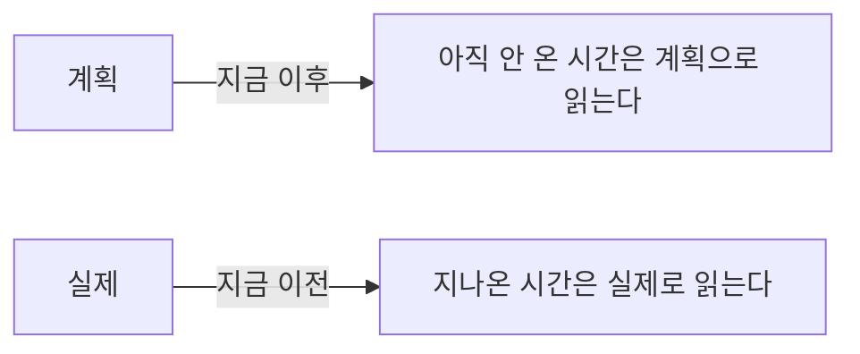
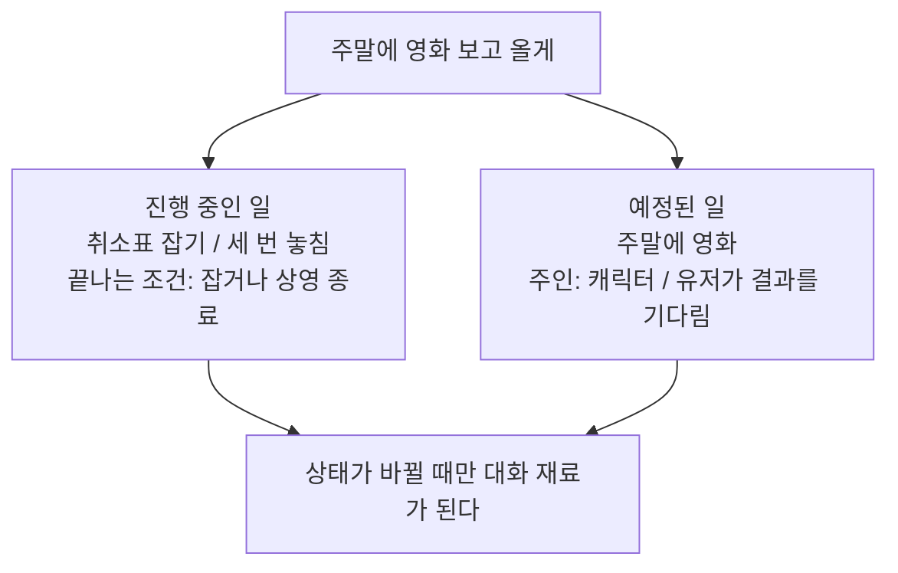
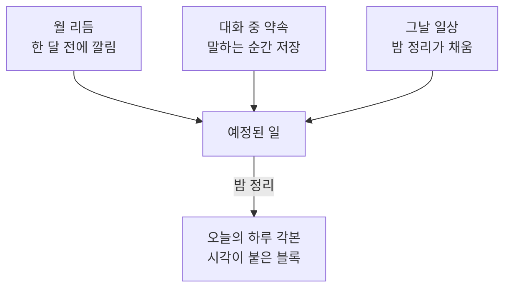
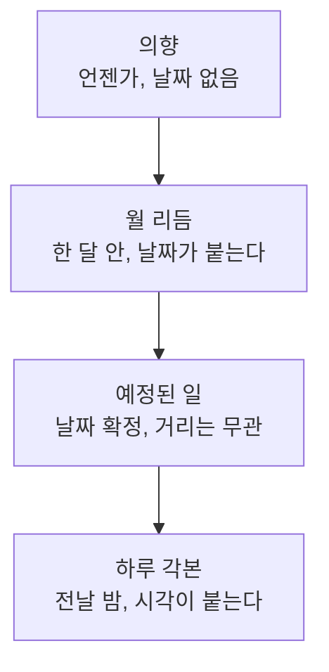
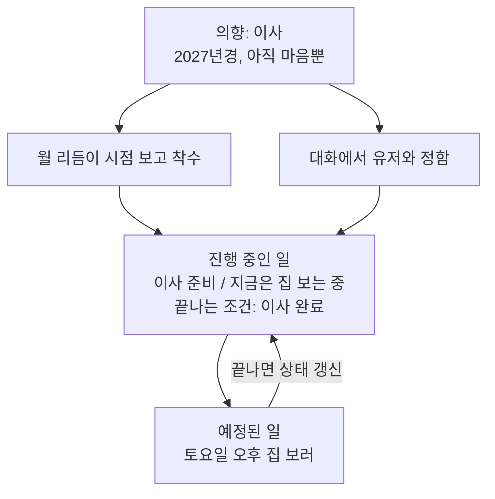
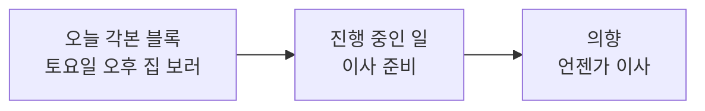
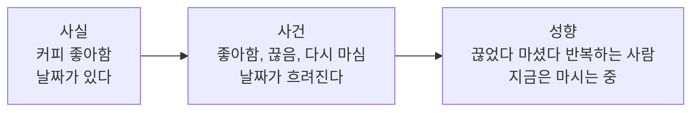

# 시간과 기억

캐릭터의 삶이 어떻게 만들어지고, 무엇이 기억으로 남고, 언제 그것을 꺼내는지에 대한 설계다.

세 갈래가 한 축 위에 있다. **생성**은 앞으로 살 시간을 만들고, **기억**은 지나온 시간을 남기고, **회수**는 지금 무엇을 꺼낼지 정한다. 축은 셋 다 시간이다.

현재 구현된 구조를 설명하는 문서가 아니다. 기존 구조는 그대로 둔 채 백지에서 다시 설계한 결과이고, 정리가 끝나면 이관한다. 진행 상황은 이슈 [#13](https://github.com/hyewon3938/random-ai-companion/issues/13).

## 이 문서에서 쓰는 말

| 말 | 뜻 |
| --- | --- |
| 오늘 메모 | 대화 중 즉시 적어두는 자리. 정리 안 된 줄이 그날치만 쌓이고 밤에 비워진다 |
| 정식 칸 | 셀 지도의 열한 칸. 오늘 메모에서 옮겨온 것이 여기 자리 잡는다 |
| 항목 키 | 이 줄이 무엇에 대한 것인지. 항목마다 하나. 덮어쓸 자리를 정한다 |
| 주제 태그 | 어떤 얘기 때 딸려 나오는지. 여러 개. 꺼낼 때 쓴다 |
| 밤 정리 | 새벽에 하루치를 정리하는 배치 |
| 각본 | 하루를 시각 블록으로 펼친 것 |
| 아크 | 요즘 삶이 어떤 결인지 한두 줄. 해, 계절, 달, 주 네 단위 |
| 내다보는 거리 | 지금부터 얼마나 먼 앞일을 다루는지 |

## 왜 다시 설계하는가

세 가지 고장에서 출발했다. 셋 다 원인이 기억의 형태에 있었다.

1. **접기로 한 일정을 실제로 한 일처럼 말한다.** 유저가 붙잡아 접은 일정이 원래 각본에 그대로 남아 있어서, 지나온 시간을 서술할 때 다시 읽힌다. 덮어쓴 쪽이 무엇을 덮었는지 기록하지 않은 탓이다.
2. **경과 시간을 틀린다.** 지금 시각만 주고 마지막 대화 시각을 주지 않으니 캐릭터가 뺄셈을 추측으로 한다.
3. **말투 지시가 희석된다.** 규칙이 금지형으로 여러 블록에 흩어져 있고, 어느 블록이 실제로 효과가 있는지 측정된 적이 없다.

## 기억 셀 지도

변하는 속도로 줄을 세운다. 위쪽은 거의 안 변하고 아래로 갈수록 자주 변한다. 오른쪽 열은 크기가 계속 늘어나는 칸이라 매번 넣지 않고 필요할 때 꺼낸다.

| 변하는 속도 | 항상 들어감 | 조건부로 꺼냄 |
| --- | --- | --- |
| 안 변함 | 나 | |
| 몇 달 | 우리 사이, 유저 프로필 | 유저 정보, 주변 인물 |
| 며칠에서 몇 주 | 예정된 일, 진행 중인 일 | |
| 하루 | 오늘 | 지난 일기 |
| 매 순간 | 최근 대화, 지금 | |

각 칸이 무엇인지.

- **나** — 이름, 성격, 말투. 씨앗 정체성은 안 변하고, 대화하며 쌓인 자잘한 사실과 아직 날짜가 없는 의향은 그 위에 얹힌다.
- **우리 사이** — 친구인지 썸인지, 반말을 쓰는지, 서로를 뭐라고 부르는지.
- **유저 프로필** — 직업, 사는 곳처럼 잘 안 바뀌는 것.
- **유저 정보** — 취향, 습관, 최근 상황. 대화할수록 계속 쌓여서 크기에 상한이 없다.
- **주변 인물** — 캐릭터 쪽과 유저 쪽 모두. 이름이 대화에 나올 때만 꺼낸다.
- **예정된 일** — 앞으로 있을 일. 날짜가 붙어 있다.
- **진행 중인 일** — 끝나지 않은 일. 날짜가 없고 상태가 있다.
- **오늘** — 오늘의 계획과 실제. 지금 시각이 둘을 가른다.
- **지난 일기** — 어제 이전의 하루들.
- **최근 대화** — 오늘 대화 요약과 최근 원문 몇 개.
- **지금** — 시각, 요일, 마지막 대화로부터 얼마나 지났는지.

## 칸을 가르는 기준

**다시 계산할 수 있으면 기억하지 않는다.** 답장 지연 시간처럼 매번 상황에서 계산되는 값은 저장할 이유가 없다. 반대로 유저가 문장을 끊어 보내는 간격처럼 관찰해야만 알 수 있는 값은 기억이다.

**크기가 고정된 칸은 항상, 계속 늘어나는 칸은 조건부.** 조건부 주입은 "지금 필요한가"를 판정해야 하는데 이 판정이 틀리면 대화가 깨진다. 몇 줄짜리 고정 크기 칸은 판정을 틀릴 위험이 넣는 비용보다 크므로 그냥 항상 넣는다. 판정할 가치가 있는 건 상한 없이 자라는 칸뿐이다.

**저장은 정확하게, 말은 대충.** 날짜는 `2026-08-19`로 저장하되 대화에서는 "3주 전쯤"이라고 말한다. 사람은 남의 말을 날짜로 기억하지 않는다. 정확한 날짜를 대는 순간 기록을 조회한 티가 난다. 경과 계산은 코드가 하고 캐릭터에게는 이미 흐려진 표현으로 건넨다.

**부딪히는 값은 한 항목 안에 둔다.** "커피 좋아함"과 "커피 끊음"을 따로 저장해 나란히 주입하면 캐릭터가 둘 중 아무거나 고른다. 접은 일정이 되살아나던 고장과 같은 형태다. 서로 부딪히는 값은 반드시 한 항목의 현재값과 이력으로 묶는다.

**유저가 아는 것은 조용히 못 바꾼다.** 유저가 모르는 일정끼리는 배치가 마음대로 밀고 당겨도 된다. 유저에게 말한 순간 그것은 조정 대상이 되고, 조정하면 말해야 하는 것이 된다.

## 계획과 실제

하루는 두 줄로 저장한다. 계획한 것과 실제로 산 것이다. 지금 시각이 둘의 읽는 경계다.



지나온 시간을 계획으로 읽으면 안 한 일을 한 일처럼 말하게 된다. 그렇다고 계획을 지우면 안 된다. 유저가 "나 때문에 운동 못 했네"라고 할 때 캐릭터도 무엇이 밀렸는지 알아야 한다.

그래서 실제 쪽 항목이 계획을 삼킨다.

| 필드 | 값 |
| --- | --- |
| 하려던 것 | 10시 러닝 |
| 어떻게 됐나 | 안 감 |
| 왜 | 유저와 얘기하느라 |

계획대로 된 것은 이유를 남기지 않는다. **어긋난 것만 이유가 붙는다.** 기록량이 그만큼 줄고, 남은 이유들은 전부 실제로 대화에 쓸 수 있는 것이 된다.

## 예정된 일과 진행 중인 일

같은 대화 한 줄에서 나와도 성격이 다르면 다른 칸에 들어간다. 가르는 기준은 **시각이 붙어 있느냐**다.

"주말에 영화 보고 올게"라고 말했고 표는 매진이라 취소표를 노려야 하는 상황을 예로 들면 이렇게 갈린다.



**약속은 별도 타입이 아니라 필드 하나다.** 유저가 "후기 남겨줘"라고 하는 순간 켜지는 것은 `유저가 결과를 기다림` 플래그다. 이 플래그가 꺼져 있으면 캐릭터 혼자 다녀온 일정이고, 켜져 있으면 끝난 뒤 유저가 묻기 전에 먼저 말해야 하는 일이 된다. 캐릭터의 일정, 유저와의 약속, 유저의 일정이 한 구조로 합쳐지는 것도 이 때문이다. 셋 다 같은 연산이 돈다. 지났는지 가르고, 안 지났으면 예정으로 읽고, 지났는데 어긋났으면 이유를 남긴다. 다른 것은 주인과 수명뿐이라 필드로 흡수된다.

**진행 중인 일에는 끝나는 조건이 반드시 붙는다.** 없으면 영영 안 지워지고 쌓인다. 그리고 "종종 얘기한다"의 규칙은 하나다. **상태가 바뀌면 말한다.** 놓친 것도 변화라서 "어제 또 놓쳤어"가 나오고, 며칠째 변화가 없으면 꺼내지 않는다. 상태가 바뀌었는데 유저가 그 자리에 없으면 그것이 먼저 연락할 근거가 된다.

### 오래 걸리는 일에 새 칸은 필요 없다

이사, 승진 심사 준비, 다이어트, 두 달 뒤로 잡아둔 해외여행. 몇 주에서 몇 달이 걸리는 일들인데 이것 때문에 칸을 새로 만들지 않는다. **기간은 축이 아니다.** 축은 시각이 붙어 있느냐 하나이고 긴 일도 거기서 갈린다.

| 예 | 어느 칸 | 왜 |
| --- | --- | --- |
| 이사, 승진 심사 준비, 다이어트 | 진행 중인 일 | 시각이 없고 끝나는 조건이 있다 |
| 두 달 뒤 해외여행 | 예정된 일 | 날짜가 있다. 다가오면 준비라는 진행 중인 일을 낳는다 |

예정된 일은 며칠 안의 것만 담는 칸이 아니다. **날짜가 확정된 것 전부**이고 거리는 상관없다. 두 달 뒤 여행은 월 리듬의 한 달 런웨이 밖이지만 대화에서 날짜가 정해진 순간 예정된 일로 들어가 그 자리에 그대로 있는다.

긴 일의 진짜 어려움은 저장이 아니라 꺼내기다. 두 달 내내 나오면 지겹고 안 나오면 잊은 사람이 된다. 답의 절반은 이미 있다 — **상태가 바뀔 때만 말한다.** 나머지 절반은 거리에서 나온다. 날짜가 있는 일은 가까워질수록 저절로 자주 나온다. 하루 각본이 그 날짜를 재료로 읽기 때문에 한 달 전에는 배경이고 사흘 전에는 준비가 오늘 블록으로 들어온다. 강도를 필드로 관리할 필요가 없다.

### 유저가 어디까지 아는가

약속 플래그는 켜고 끄는 스위치가 아니라 3단계 축이다. 항목마다 이 값이 하나 붙는다.

| 단계 | 뜻 | 지울 때 |
| --- | --- | --- |
| 모름 | 캐릭터만 안다 | 조용히 지운다 |
| 앎 | 대화에 나왔다 | 지우기 전에 말할 거리로 바꾼다 |
| 기다림 | 유저가 결과를 기다린다 | 결과를 먼저 알린다 |

**한 방향으로만 올라간다.** 한 번 말한 것을 유저가 잊었다고 되돌리지 않는다. 그래서 갱신이 싸다. 대화에 나오면 올리고 그 외에는 건드리지 않는다.

원본은 대화록이라 이 값은 원리상 매번 다시 계산할 수 있다. 그렇게 안 하는 이유는 정확도가 아니라 비용이다. 지울 때마다 대화록을 뒤지는 것보다 항목에 한 칸 두는 편이 싸다.

## 일정이 생기는 세 군데



대화에서 정해진 일은 밤을 기다리지 않고 **말하는 순간 저장한다.** 오후에 약속하고 저녁에 유저가 "아까 언제 본다고 했지?"라고 물으면 그 사이에도 답할 수 있어야 한다. 밤 정리가 하는 일은 생성이 아니라 펼치기다.

형태도 다르다. 대화 중에는 날짜만 남는다. 사람도 "주말에 볼게"라고 말하지 몇 시라고 말하지 않는다. 시각은 그날 각본을 짤 때 붙는다.

### 겹칠 때

충돌은 두 겹으로 미리 막는다. 첫째, 약속하는 순간에 이미 잡힌 미래 일정을 보고 잡는다. 그래야 "그날은 선약이 있어서, 다음 날은 어때?"가 나온다. 둘째, 월 리듬을 새로 깔 때 이미 잡힌 약속 슬롯을 피해서 생성한다. 먼저 정해진 쪽이 이기는 규칙이 아니라 나중에 만드는 쪽이 비켜 가는 방식이다.

그래도 겹치면 **조용히 해결하지 않는다.** 둘 중 하나를 말없이 버리면 어느 쪽이 이겼는지 유저만 모르는 상태가 된다. 규칙을 좁히면 답이 하나로 남는다. 공적 일정은 원래 못 접고, 유저에게 말한 약속은 조용히 못 버린다. 남는 것은 캐릭터가 먼저 말해서 조정하는 것뿐이다. 충돌이 사고가 아니라 대화 재료가 된다.

### 유저가 하지 말라고 할 때

접기와 옮기기는 다른 동작이고 판정도 다르다.

| 묻는 것 | 무엇이 정하나 |
| --- | --- |
| 접을 수 있나 | 일정의 성격 (개인 / 사회 / 공적) |
| 옮길 수 있나 | 시각이 고정인가 |
| 혼자 정할 수 있나 | 상대가 있나 |

개인 일정이고 시각도 자유로우면 그냥 옮긴다. 상대가 있으면 물어봐야 하고, 그 순간 진행 중인 일이 하나 열린다. 공적이면 못 접고 못 옮기되 **빈손으로 거절하지 않는다.** 다 들어주는 것은 아부이고 안 된다고만 하는 것은 무심함이다. 남는 자리는 대안을 내는 쪽이다.

그리고 취소인지 연기인지는 물어봐야 한다. "하지 마"만 듣고 취소로 처리하면 유저는 미루자는 뜻이었을 수 있다. 이 한마디가 상태를 취소로 쓸지 날짜 변경으로 쓸지를 가른다.

### 오늘 것은 덧씌우고, 미래 것은 원본을 고친다

오늘 각본은 이미 펼쳐진 뒤라서 원본을 고쳐도 늦다. 그래서 위에 덮는다. 덮는 방식은 원본이 그대로 남아 있으므로 **무엇을 덮었는지 반드시 같이 적어야 한다.** 이것을 적지 않은 것이 접은 일정이 되살아나던 고장의 원인이다.

미래 일정은 아직 펼쳐지지 않았으니 원본 자체를 고치면 끝이다. 덮을 것이 없고, 그날 밤 각본을 짤 때 자연히 반영된다.

## 먼 앞일

미리 만드는 것은 전부 부채다. 만들어둔 것이 많을수록 대화와 어긋날 확률이 올라가고, 어긋나면 고쳐야 하고, 고치려면 어디에 흩어져 있는지 알아야 한다. 안 만든 것은 어긋날 일이 없다.

그래서 먼 앞일은 방향만 잡아두고 시간이 다가올 때 구체화한다.



승진 심사를 예로 들면 지금 필요한 것은 "올해 승진 심사가 있다"는 서술 한 줄이다. 이것만 있어도 대화에서 신경 쓰인다는 말이 나온다. 몇 월 며칠인지는 1년 전에 정해봐야 쓰이지 않고, 그 사이 대화로 상황이 바뀌면 폐기해야 한다. 그 달이 다가오면 월 리듬이 날짜를 붙이고 전날 밤에 시각이 붙는다.

**리얼리티는 미리 만든 양이 아니라 일관성에서 나온다.** 한 번 말한 것이 유지되고, 다가오면 구체화되고, 지나면 결과가 남는 것. 1년치를 다 만들어두고 대화와 어긋나기 시작하면 오히려 가짜 티가 난다.

### 멀리 볼수록 대화가 직접 못 고친다

| 내다보는 거리 | 대화가 하는 일 |
| --- | --- |
| 오늘 | 즉시 덧씌운다. 무엇을 덮었는지 함께 적는다 |
| 며칠에서 몇 주 | 원본을 고친다 |
| 달, 계절, 해 | 사실만 남기고 다음 생성 때 반영된다 |

멀리 보는 서술은 여러 사실을 종합한 결과라서 한 줄만 갈아끼우면 앞뒤가 안 맞는다. 대화는 사실을 남기고 반영은 생성이 한다.

### 의향

날짜도 없고 끝나는 조건도 없는 것. "언젠가 이사 가려고" 같은 마음이다. 캐릭터에게 쌓이는 정체성 쪽에 들어간다.

**상대 표현을 그대로 저장하면 안 된다.** "내년쯤"으로 저장하면 해가 바뀌어도 영영 내년이다. 저장은 정확하게 말은 대충의 원칙이 여기에도 걸린다. 가리키는 시점을 정밀도와 함께 저장하고 표현은 읽는 시점에 다시 만든다.

| 필드 | 값 |
| --- | --- |
| 항목 | 이사 |
| 지금 | 가려고 함 |
| 가리키는 시점 | 2027년, 정밀도 '년' |
| 말한 날 | 2026-08-19 |

2026년에 읽으면 "내년쯤", 2027년 3월에 읽으면 "올해 안에", 2028년에 읽으면 "가려던 게 재작년 얘기였는데"가 된다.

가리킨 시점이 지나면 세 갈래로 갈린다. 했으면 사실이 되고, 접었으면 이력에 남고, **아무 일도 없었으면 미뤄지거나 흐려진다.** 세 번째가 제일 중요하다. 사람은 계획을 말해놓고 안 지키는 일이 훨씬 많고, 그것을 나중에 스스로 꺼내는 것이 진짜 같다. 미리 만들어 넣을 수 있는 종류의 리얼리티가 아니라 시간이 지나야 생긴다.

### 의향이 실행으로 넘어갈 때

착수는 두 군데서 결정될 수 있지만 결과물은 하나여야 한다.



대화로 시작한 이사와 리듬이 깐 이사가 따로 굴러가면 둘 다 진짜가 아니게 된다. 경로가 둘이어도 도착지가 하나여야 엉키지 않는다.

**단계 목록을 미리 정의하지 않는다.** 집 보기, 계약, 이삿짐, 이사, 정리를 착수 시점에 다 깔면 한 단계가 어긋나는 순간 뒤쪽 전부를 손봐야 한다. 진행 중인 일은 지금 상태만 들고 **다음 한 걸음만** 예정된 일로 낳는다. 그 일이 끝나면 상태가 갱신되고 거기서 다음 걸음이 나온다. 취소표 잡기와 같은 구조이고, 차이는 취소표가 같은 행동의 반복인 데 비해 이사는 단계가 앞으로 나간다는 것뿐이다.

단계를 스키마로 만드는 것도 피한다. 이사용 단계와 이직용 단계를 각각 정의하면 일 종류마다 예외 처리가 붙는다. 상태를 서술 한 줄로 두면 어떤 일이든 같은 구조로 굴러가고, 다음 걸음은 그 서술을 읽고 만든다.

### 미리 만든 것이 하는 일

미리 만든 것은 대본이 아니라 제약과 씨앗이다. 월 리듬이 깔아둔 회식은 그날 저녁의 답장 여건을 정하고 다음 날 컨디션에 영향을 주지만 거기서 무슨 얘기가 오갔는지는 정하지 않는다. 아크의 "올해 승진 심사"는 그 시기가 오면 신경 쓰이는 배경이 되지만 심사 날짜를 지금 정하지는 않는다.

**뒤에 올 것의 범위를 좁히는 정도까지가 미리 만드는 것의 몫이다.** 그 안에서 실제로 무슨 일이 있었는지는 살아봐야 안다.

### 아크는 결만 담는다

아크는 단위마다 딱 한 줄이고 이력이 없다. 덮어쓰면 이전 것은 사라진다. 그래서 **사건을 담으면 안 된다.**

| | |
| --- | --- |
| 담는다 | 결과 상태. "요즘 일이 손에 익어서 여유가 생겼다" |
| 안 담는다 | 사건과 일정. "이사 준비로 바쁘다", "3월에 이사" |

이유는 둘이다. 첫째, 이사의 원본은 진행 중인 일 칸이다. 아크에도 쓰면 둘이 어긋나는 순간이 오고 어긋나면 캐릭터가 둘 중 아무거나 고른다. 둘째, 계절 아크는 3개월에 한 번만 바뀐다. 4월에 이사가 끝나도 6월 1일까지 두 달을 더 "이사 준비로 바쁘다"고 말한다.

대신 여파만 담는다. "큰 변화를 하나 치르고 어수선한 계절" 정도는 이사가 끝나도 틀린 말이 아니다.

**갱신 주기는 지금 것을 유지한다.** 주는 월요일, 달은 1일, 계절은 3·6·9·12월 1일, 해는 1월 1일. 만든 날에 따라 첫 갱신까지의 공백이 며칠에서 열 달까지 벌어지지만, 결만 담으면 그 공백이 어긋남이 되지 않는다. 결은 원래 천천히 변하는 것이라 오래 안 바뀌어도 이상하지 않다.

**해 아크는 달력 연도로 읽는다.** 3월에 만들면 이듬해 2월까지가 아니라 그해 남은 기간의 결을 쓰고 1월 1일에 갈아끼운다. 롤링 12개월로 두면 캐릭터가 말하는 "올해"가 유저의 "올해"와 어긋난다.

### 실제로 빼보면 남는 게 얇다

돌고 있는 아크 네 줄에서 사건과 일정을 빼봤다. 주 아크가 특히 심했다. 문장을 조각내니 대부분이 다른 칸의 것이었다.

| 조각 | 원래 있어야 할 칸 |
| --- | --- |
| 쉬고 복귀했다 | 지난 일기 |
| 지점이 하반기 숫자로 조여온다 | 아크에 남음 |
| 미뤄둔 심사가 면담으로 실제 일정이 됐다 | 예정된 일 |
| 유저 근황과 요즘 연락 빈도 | 우리 사이, 유저 정보 |
| 몰아붙이지 않고 짧게 묻는 쪽으로 간다 | 성격(불변층) |

다섯 조각 중 아크에 남는 것은 하나다. 나머지는 아크가 대신 들고 있던 남의 물건이고, 아크는 덮어쓰기라 이력이 없으니 원본 칸과 어긋나는 순간 캐릭터가 둘 중 아무거나 고른다.

**단위가 짧을수록 결이 얇다.** 주 아크에서 사건을 빼면 "이번 주 온도" 한 줄 이상 나오지 않는다. 이건 주 아크가 쓸모없다는 뜻이 아니라 길이 상한이 단위마다 달라야 한다는 뜻이다. 지금은 주 아크가 제일 길다. 결만 담으면 순서가 뒤집힌다.

| 단위 | 담는 것 | 길이 |
| --- | --- | --- |
| 해 | 올해가 어떤 해인지 | 두 줄 |
| 계절 | 계절 상태와 그로 인한 생활 패턴 | 두 줄 |
| 달 | 이 달의 기조 | 한두 줄 |
| 주 | 이번 주 온도 | 한 줄 |

**결만 남기면 아크는 혼자 읽히지 않는다.** 고유명사가 빠지므로 아크만 봐서는 무슨 일인지 모른다. 그건 의도한 것이다. 무슨 일인지는 예정된 일과 진행 중인 일 칸이 들고 있고, 아크는 그 위에 얹는 온도다. 아크에 사건을 넣는 순간 그 사건이 끝나도 다음 갱신일까지 지워지지 않는데, 실제로 관측된 누수가 정확히 그 모양이었다.

### 맥락은 사슬로 이어진다

"토요일 오후 집 보러"라는 블록만 각본에 추가되면 캐릭터는 자기가 왜 집을 보러 가는지 모른 채 집을 보러 간다. 유저가 "집은 좀 어때"라고 물어도 대답할 재료가 없다.

그래서 각 항목은 자기를 낳은 것을 가리킨다.



블록이 대화에 나올 때 부모의 상태 한 줄이 같이 딸려 온다. 세 군데에 이사 얘기를 복제하는 것이 아니라 **원본은 진행 중인 일 한 곳에 두고 나머지는 가리키기만 한다.** 복제하면 어긋나고, 어긋나면 캐릭터가 둘 중 아무거나 고른다. 부딪히는 값은 한 항목 안에 둔다는 원칙이 칸과 칸 사이에서도 똑같이 걸린다.

### 착수 여부는 누가 정하나

두 층으로 나눈다.

| 층 | 하는 일 |
| --- | --- |
| 코드 | 가리킨 시점이 이 달 안에 들어온 의향을 후보로 올린다 |
| 모델 | 지금 삶에 이것이 들어올 자리가 있는지 보고 판정한다 |

코드가 시점만 보고 자동으로 착수시키면 캐릭터가 계획대로만 사는 사람이 된다. 반대로 모델이 매달 전체를 훑게 하면 비용이 들고 판단이 흔들린다. 시점은 코드가 거르고 판정만 모델이 한다.

**유저 대화는 재료이지 결정권이 아니다.** 유저가 가지 말라고 해서 안 가면 아부이고, 유저 말이 아무 영향도 없으면 벽이다. 그 사이는 대화가 판정의 재료로 들어가되 결론은 캐릭터 삶의 일관성에서 나오는 것이다. 미룬 이유가 유저와의 대화일 수는 있고, 그러면 그 이유가 기록에 남아 나중에 "그때 네 말 듣고 좀 미뤘잖아"가 된다.

### 월 리듬을 만들 때 읽는 것

한 달치 이벤트와 컨디션 시드는 바이블, 아크, 최근 일기, 이미 잡힌 일정(캐릭터 쪽과 유저 쪽 모두)을 보고 만든다. 이미 잡힌 일정과 겹치지 말라는 지시도 들어간다. 여기에 세 가지가 빠져 있다.

- **주변 인물** — 지금은 이벤트가 "친구 만남", "회식"처럼 익명으로 나온다. 대화로 쌓인 인물이 재료로 들어가면 "수요일에 누구와 저녁"이 되고, 유저가 아는 이름이 등장한다. 인물 칸이 조건부인 것은 프롬프트 주입 얘기이고, 생성 재료로는 항상 읽힌다.
- **의향** — 가리키는 시점이 이 달 안에 들어온 의향을 보고 착수 여부를 판정한다. 사다리의 첫 계단이 두 번째로 이어지는 지점이 여기다.
- **진행 중인 일** — 무거운 일은 삶 전체를 흔든다. 이사 전주는 피곤하고 그 분기의 아크가 이사 준비로 채워진다. 컨디션과 이벤트가 그 위에서 흘러야 한다.

## 변화가 번지는 방향

한쪽이 바뀌면 이어진 쪽도 손봐야 한다. 다만 위아래가 대칭이 아니다.

| 방향 | 언제 | 어디까지 |
| --- | --- | --- |
| 아래에서 위로 | 다음 생성이 읽어갈 때 | 사실만 남기고 기다린다 |
| 위에서 아래로 | 즉시 | 한 칸 아래, 아직 안 온 것만 |

집을 보고 왔으면 진행 중인 일의 상태 한 줄만 갱신하고, 아크는 다음 달 1일에 그걸 재료로 읽는다. 즉시 밀어올리면 아크가 하루 단위로 흔들리고 그러면 아크를 둘 이유가 없어진다. 위는 천천히 변해야 하고 아래는 지금 정확해야 한다.

반대로 이사를 접었으면 아직 안 온 하위 일정은 즉시 정리한다. 이때 앞의 3단계 축이 걸린다. 유저가 모르는 것은 조용히 지우고, 아는 것은 말할 거리로 바꾼 뒤 지운다. **이미 지나간 블록은 실제로 산 기록이라 건드리지 않는다.**

## 관심도는 꺼내기만 조절한다

우진에게 이사는 큰일인데 유저는 별 관심이 없을 수 있다. 사람은 이럴 때 그 얘기를 덜 꺼낸다. 그렇다고 이사를 안 가지는 않는다.

**두 값을 한 점수로 합치지 않는다.** 합치는 순간 유저가 관심 없는 일은 캐릭터의 삶에서도 작아지고, 그러면 유저 눈치를 보는 캐릭터가 된다. 이 프로젝트가 다른 캐릭터챗과 갈라지는 지점이 여기라서 섞으면 안 된다.

| 값 | 정하는 것 |
| --- | --- |
| 캐릭터에게 얼마나 큰 일인가 | 일어나는가, 일정에 잡히는가, 하루를 얼마나 잡아먹는가 |
| 유저가 얼마나 반응했나 | 얼마나 자주 화제로 꺼내는가 |

### 말하기는 세 종류다

관심도가 조절하는 것은 첫 번째뿐이다.

| 종류 | 예 | 무엇이 정하나 |
| --- | --- | --- |
| 화제로 꺼내기 | "집 알아보고 있는데" | 관심도 |
| 상태 보고 | "오늘 이사날이라 정신없어" | 하루 각본 |
| 물으면 답하기 | "이사 어떻게 됐어?" | 항상 답한다 |

이사날에 정신없다는 말은 화제를 꺼내는 게 아니라 지금 왜 답이 느린지를 설명하는 것이다. 유저가 그 주제에 관심이 없어도 나온다. **관심 없는 주제를 안 꺼내는 것과 자기 하루를 숨기는 것은 다르다.**

### 관심도는 어떻게 재나

횟수를 세면 안 된다. 캐릭터가 자주 꺼내면 유저 언급도 따라 늘어서 자기가 자기를 강화한다. 선제 발화가 선제 발화를 부르던 것과 같은 형태다.

분모는 캐릭터가 꺼낸 횟수이고 분자는 유저의 반응이다. 3단계면 충분하다.

| 단계 | 신호 |
| --- | --- |
| 먼저 꺼냄 | 유저가 나중에 자기 쪽에서 먼저 물었다 |
| 되물음 | 그 자리에서 반응은 했지만 거기서 끝났다 |
| 흘림 | 짧게 받고 화제가 바뀌었다 |

가장 강한 신호는 **유저가 나중에 먼저 묻는 것**이다. 그 자리의 리액션은 예의일 수 있지만 며칠 뒤에 다시 묻는 것은 아니다.

판정은 밤 정리가 한다. 실시간으로 내리면 그날 유저 컨디션에 휘둘린다. 이 값은 유저가 어디까지 아는가와 달리 양방향으로 움직인다.

세는 일과 정하는 일은 나눈다. 캐릭터가 그 화제를 꺼낸 횟수, 그 뒤에 유저가 그 화제에 답했는지, 유저가 자기 쪽에서 먼저 꺼낸 적이 있는지까지는 대화 기록만 보면 되니 코드가 센다. 밤 정리는 그 숫자와 그날 대화를 같이 읽고 단계를 옮긴다.

| 어떻게 되면 | 어디로 |
| --- | --- |
| 유저가 자기 쪽에서 먼저 물었다 | 한 번으로 먼저 꺼냄까지 올린다 |
| 꺼냈는데 그 화제에 대한 답이 두 번 연속 없었다 | 한 단계 내린다 |
| 그 자리에서 반응만 하고 끝났다 | 그대로 둔다 |

올리는 쪽은 한 번이고 내리는 쪽은 두 번을 요구하는데, 신호의 세기가 다르기 때문이다. 그날 바빠서 못 받는 일은 흔하지만 며칠 뒤에 자기 쪽에서 먼저 묻는 일은 관심이 없으면 잘 일어나지 않는다.

### 내리는 것은 초대 빈도뿐

| 단계 | 화제로 꺼내는 빈도 |
| --- | --- |
| 먼저 꺼냄 | 상태가 바뀔 때마다 |
| 되물음 | 큰 국면에서만 |
| 흘림 | 안 꺼낸다. 하루를 잡아먹을 때 상태 보고만 |

관심도가 바닥이어도 저장과 진행은 그대로다. 일기에도 남고 일정도 돈다. **그래서 유저가 두 달 만에 "이사 어떻게 됐어?" 하고 물으면 그동안이 한꺼번에 나온다.** 안 꺼냈을 뿐 살고 있었다는 증거라서, 자주 말한 것보다 이쪽이 더 살아 있게 느껴진다.

반대 방향에는 잠금이 걸린다. **관심도가 높다고 없는 일을 만들지 않는다.** 유저가 캠핑 얘기에 반응이 좋다고 캐릭터가 갑자기 캠핑을 다니기 시작하면 아부다. 관심도는 꺼내기만 건드리고 삶은 못 건드린다.

### 반대 방향 — 유저가 권한 것

앞의 잠금은 "유저가 좋아한다고 알아서 맞추지 않는다"까지다. 유저가 **직접 권한 것**은 다르다. 영화를 보고 오라고 했고 봤고 후기를 남기는 것은 아부가 아니라 같이 한 일이다.

가르는 것은 세 가지다.

| 무엇을 보나 | 왜 |
| --- | --- |
| 직접 권했나 | 눈치로 읽은 취향은 시작되지 않는다 |
| 하루 안에서 되나 | 시간·돈·기존 일정. 억지로 끼우지 않는다 |
| 스스로 끌리나 | 성향과 안 맞으면 안 간다 |

셋째가 제일 중요하다. **안 갈 수 있어야 갔을 때 의미가 있다.** 권하는 대로 다 하면 그게 아부다. 안 갈 때는 이유를 말하고, 그것도 유저가 아는 항목이라 나중에 "그거 아직 못 봤어"가 나온다.

통과한 항목에는 **출처가 붙는다.** 유저가 권해서 생긴 일이라는 사실이 남아야 "네가 보라고 한 거"라고 말할 수 있고 그게 유대의 실체다. 출처가 유저면 유저가 어디까지 아는가는 자동으로 '기다림'이 된다.

### 아부와 유대는 반복에서 갈린다

한 번 간 것은 사건이지 성향이 아니다. 반복되면 성향으로 접히는데, **반복의 동력이 어디서 나왔는지**가 판정을 가른다.

| | |
| --- | --- |
| 유대 | 두 번째부터는 권유 없이 스스로 갔다 → 성향이 된다 |
| 아부 | 매번 유저가 권해야 간다 → 사건으로만 남는다 |

출처 필드가 있으니 코드로 셀 수 있다. 유저 권유 없이 스스로 한 횟수가 둘을 넘으면 성향으로 묶는다. 사실에서 사건, 사건에서 성향으로 가는 사다리를 그대로 쓰고 조건 하나만 얹는 것이다.

### 취소표는 이미 굴러간다

유저가 "취소표를 주워야 한다"고 흘린 말이 캐릭터의 진행 중인 일이 되고, 상태가 바뀔 때마다("또 놓쳤어", "잡았다") 대화 재료가 되고, 유저가 안 물어도 캐릭터가 먼저 꺼낸다. 여기에 새로 필요한 구조는 없다. 세 규칙이 이미 다 있다.

- 시각이 없고 끝나는 조건이 있으니 진행 중인 일
- 상태가 바뀔 때만 말한다
- 출처가 유저라 '기다림'이고, 기다림은 묻기 전에 먼저 알린다

**유저가 흥미로워한 것을 캐릭터가 먼저 꺼내는 쪽은 빈도를 내리는 축이 아니라 올리는 축이다.** 캐릭터의 일에 대한 유저 관심도는 초대 빈도를 내리고, 유저의 일에 대한 캐릭터의 챙김은 먼저 꺼낼 근거를 만든다. 두 축은 대칭이 아니다.

실제로 이 시나리오는 운영 중인 봇에서 이미 굴러가고 있었다. 다만 굴린 것은 진행 중인 일 칸이 아니었다 — 아래 실측 절.
## 언제 기록하나

전부 실시간으로 잡으려 하지 않는다. **언제까지 알아야 하느냐**가 기록 시점을 정한다.

| 언제까지 알아야 하나 | 어떻게 잡나 | 무엇을 |
| --- | --- | --- |
| 지금 당장 (몇 시간 뒤면 깨짐) | 답장에 태그를 얹음. 추가 호출 없음 | 약속의 날짜, 자리 뜸, 붙잡힘 |
| 오늘 안에 | 몇 턴마다 배치 | 오늘 대화 요약 |
| 내일부터 | 밤 정리 | 유저 정보, 인물, 성향, 1층이 놓친 약속 줍기 |

**별도 추출 모듈을 두지 않는다.** 매 턴 추출 호출을 따로 돌리면 비용이 두 배가 되고 답장이 늦어진다. 더 큰 문제는 판단이 갈라지는 것이다. 방금 무슨 말을 했는지는 그 말을 한 모델이 제일 잘 안다. 추출기는 대화록만 보고 이것이 약속이었는지 추측해야 한다.

도구 호출로 저장을 맡기는 것도 맞지 않는다. 왕복이 한 번 더 생겨 답장이 늦어지는데, 이 프로젝트에서는 답장 타이밍 자체가 설계의 일부다.

**태그는 좁게 유지한다.** 태그가 늘어날수록 모델이 메타 작업에 신경을 쓰고 답장 품질을 먹는다. 실시간으로 잡을 것은 놓치면 몇 시간 안에 깨지는 것뿐이다. 놓쳐도 대화 원문은 그대로 남아 있으므로 잃는 것은 구조화된 형태뿐이고, 밤 정리가 하루 대화를 다시 훑을 때 주우면 된다. 실시간은 편의이고 진실은 대화록에 있다.

### 즉시 쓴 것은 오늘 메모로 간다

태그로 즉시 잡은 것을 정식 칸에 바로 쓰지 않는다. **오늘 메모라는 한 칸을 두고 거기에 정리 안 된 채로 쌓는다.**

정식 칸에 바로 쓰려면 그 자리에서 판정을 해야 한다. 어느 칸인지, 기존 항목과 같은 것인지, 덮어야 하는지. 답장을 만드는 중에 이 판정을 시키면 태그가 무거워지고, 태그가 무거워지면 답장 품질을 먹는다. 오늘 메모는 판정을 밤으로 미루는 대신 값은 지금 남기는 자리다.

- 오늘 메모는 판정하지 않는다. 들어온 순서대로 줄이 쌓인다.
- 대화 중 읽기는 **정식 칸 더하기 오늘 메모**다. 그래서 오후에 정한 것을 저녁에 꺼낼 수 있다.
- 밤 정리가 오늘 메모를 비우면서 정식 칸에 덮어쓴다. 수명이 하루라 자라지 않는다.

오늘 메모가 없으면 즉시 기록은 두 갈래뿐이다. 정식 칸에 바로 쓰거나(판정이 무겁다) 밤까지 기다리거나(그 사이 잊은 사람이 된다). 오늘 메모는 그 사이를 메우는 한 칸이고, 대신 밤 정리가 읽어야 할 입력이 하나 늘어난다.

**오늘 메모는 프롬프트 꼬리에 넣는다.** 앞 두 층은 캐시가 걸려 있고, 매 턴 바뀌는 값을 앞층에 끼우면 그 층 전체가 다시 써진다. 실측에서 캐시 재작성이 지금 가장 비싼 항목이었다. 자주 바뀌는 것은 전부 꼬리로 미는 기존 원칙이 오늘 메모에도 그대로 적용된다.

**밀리는 것은 원문 창이지 기억이 아니다.** 대화가 길어지면 최근 대화 원문이 뒤로 밀려 나간다. 지금 구조에서는 그게 곧 망각인데, 즉시 기억이 없어서 원문이 유일한 근거이기 때문이다. 오늘 메모가 그 구멍을 막는다. 원문이 밀려도 그날 정한 것은 오늘 메모에 줄로 남고, 밤에 정식 칸으로 옮겨진다.

비용은 저장량이 아니라 매 턴 프롬프트에 넣는 양에서 난다. 디스크에 몇 만 줄을 쌓는 것은 사실상 공짜이고, 매 턴 넣는 한 줄이 돈이다. 그래서 목표는 적게 기억하는 것이 아니라 **많이 기억하되 지금 필요한 것만 넣는 것**이다. 주제 태그가 그 분리를 만든다.

### 오늘 메모에 적히는 것은 요약이 아니라 한 줄짜리 사실이다

오늘 대화를 줄여서 넣는 자리가 아니다. 답장을 만들면서 모델이 "이건 남겨야 한다" 싶은 것만 한 줄씩 뱉고, 그 줄이 그대로 쌓인다. 요약본을 만들려면 하루 대화를 다시 훑어야 하는데 그건 밤 정리가 할 일이다.

한 줄의 모양:

| 칸 | 값 | 누가 채우나 |
| --- | --- | --- |
| 시각 | 2026-08-20 14:32 | 코드 |
| 문장 | 유저가 다음 주 화요일에 면접이 있다고 함 | 모델(태그) |
| 원문 위치 | 메시지 id | 코드 |

**항목 키도 주제 태그도 여기서는 비어 있다.** 둘 다 판정이고, 판정은 밤에 한 번만 한다. 밤 정리가 이 줄을 읽어 키를 붙이고 정식 칸에 덮어쓰면서 오늘 메모를 비운다.

프롬프트 꼬리에는 세 덩어리가 따로 들어간다.

| 무엇 | 얼마나 | 왜 |
| --- | --- | --- |
| 최근 대화 원문 | 개수 제한 | 말투와 흐름. 길어지면 앞부분부터 밀려 나간다 |
| 오늘 메모 전부 | 하루치라 짧다 | 밀려 나간 구간에서 정한 것을 붙잡는다 |
| 태그로 꺼낸 정식 칸 항목 | 지금 주제에 걸리는 것만 | 어제까지 쌓인 것 중 지금 필요한 것 |

하루 안에서는 원문과 오늘 메모가 같은 내용을 두 번 담을 수 있다. 낭비처럼 보이지만 그게 목적이다. **원문이 밀려 나가는 순간 오늘 메모만 남는다.** 중복은 하루짜리고 메모는 짧다.

### 오늘 메모에도 명령형은 안 들어간다

메모는 실시간으로 쌓인다. 답장을 만들면서 모델이 남길 줄을 한 줄씩 뱉고, 그 줄이 바로 꼬리에 들어간다. 그래서 오후에 정한 것을 저녁에 꺼낼 수 있다. 밤 정리가 비우기 전까지는 판정 안 된 채로 순서대로 쌓여 있기만 한다.

여기까지는 앞에서 정한 대로인데, 판정을 안 한다는 것이 아무 문장이나 들어가도 된다는 뜻은 아니다. **관측을 적고 지시는 적지 않는다.** 유저가 흥미 없어 보이니 다시 꺼내지 말 것이라고 적으면, 열린 고리에서 본 고장이 밤에서 낮으로 자리만 옮긴다.

| 상황 | 메모에 적히는 줄 | 적으면 안 되는 줄 |
| --- | --- | --- |
| 영화 얘기를 꺼냈는데 유저가 다른 화제로 넘어갔다 | 영화 얘기를 꺼냈으나 유저가 다른 화제로 넘어감 | 영화 얘기는 다시 꺼내지 말 것 |
| 유저가 면접 얘기를 길게 했다 | 유저가 다음 주 면접 얘기를 오래 함 | 면접 얘기를 자주 챙길 것 |

지시가 위험한 이유는 앞에서 본 그대로다. 지시는 그것을 낳은 조건이 사라져도 스스로 만료되지 않는다. 관측은 시각이 붙은 사실이라 다음 관측이 덮는다.

**게다가 관심도는 대개 적을 필요가 없다.** 화제를 꺼냈는데 답이 안 온 횟수는 코드가 센다. 누가 언제 무슨 말을 했는지가 이미 대화 기록에 있고, 세는 데 모델이 필요 없다. 모델이 메모에 남길 것은 세어지지 않는 것뿐이다. 유저가 화제를 돌렸다, 그건 별로라고 말했다 같은 것.

그래서 밤 정리가 메모를 비울 때 하는 일은 지시를 옮겨 적는 것이 아니라 관측 줄을 읽어 해당 항목의 관심도 필드를 한 단계 옮기는 것이다. 유저가 스스로 그 화제를 다시 꺼내면 같은 필드가 반대로 올라가고, 금지도 따로 풀 것 없이 같이 풀린다.

## 반복해서 뒤집히는 것

같은 항목의 값이 여러 번 뒤집히면 개별 날짜가 의미를 잃는다.



한 번 바뀐 것은 아직 사건이고 날짜가 의미 있다. 세 번째 뒤집히는 순간 개별 날짜는 쓸모가 없어진다. 다 들고 있어봐야 할 수 있는 말은 "원래 그러잖아" 하나이기 때문이다. 이력을 접고 성향 한 줄로 바꾸면 그때부터 저장하는 것은 지금 어느 쪽인지 하나뿐이다.

패턴 기억은 단일 사건 기억과 성질이 다르다. 여러 번 지켜본 사람만 할 수 있는 말이라 그 자체가 오래 봤다는 증거가 된다.

## 항목 키와 주제 태그

같은 것을 같은 것으로 알아보지 못하면 덮어쓸 수가 없다. 운영 데이터에서 사실이 접히지 않고 쌓인 것도 이 때문이다. 항목이 문자열로만 있으니 코드도 모델도 어느 줄이 어느 줄의 옛 버전인지 모른다.

필요한 것은 둘이고 쓰임이 다르다.

| | 무엇 | 언제 쓰나 |
| --- | --- | --- |
| 항목 키 | 이 줄이 무엇에 대한 것인지 | 쓸 때. 같은 키를 찾아 덮는다 |
| 주제 태그 | 어떤 얘기 때 꺼낼 것인지 | 읽을 때. 같은 태그를 모은다 |

둘은 개수가 다르다. **키는 항목마다 하나여야 하고 태그는 여러 개여도 된다.** 키가 하나여야 덮어쓸 자리가 결정되고, 태그가 여럿이어야 여러 갈래 대화에서 같은 항목이 딸려 나온다.

| 필드 | 값 |
| --- | --- |
| 키 | 영화/오디세이 |
| 값 | 세 번 봤다. 용산 아이맥스, 돌비, 4D |
| 태그 | 영화, 놀란, 취향 |

키가 있으면 전체를 훑을 필요가 없다. 새 값을 쓸 때 같은 키를 찾아 덮고, 없으면 새로 만든다. 훑기는 밤에 한 번, 그것도 키가 같은 묶음 안에서만 한다.

태그는 읽는 쪽 문제를 푼다. 영화 얘기가 시작되면 유저 정보, 캐릭터의 사실, 진행 중인 일, 지난 일기에서 영화 태그가 붙은 것만 모아 한 번에 꺼낸다. 조건부 칸을 언제 꺼낼지의 판정이 태그 일치 하나로 줄어든다.

**위계는 만들지 않는다.** 영화가 취미의 하위이고 취미가 문화의 하위라는 나무를 유지하는 비용이, 한 항목에 태그를 두세 개 붙이는 비용보다 크다. 위계가 값을 하는 것은 항목이 수만 개여서 태그 일치만으로 후보가 너무 많이 나올 때다. 지금 규모는 수백 줄이다.

다만 나중에 얹을 자리는 열어둔다. 태그를 문자열 여러 개로 두면 위계는 **태그와 상위 태그를 잇는 표 하나**를 추가하는 것으로 생긴다. 항목 쪽 구조는 건드리지 않는다. 읽을 때 태그를 상위까지 펼쳐서 맞춰보는 단계만 늘어난다.

**키는 LLM이 만들되 뼈대는 고정한다.** 캐릭터가 반드시 가져야 하는 항목은 목록으로 박아둔다. 캐릭터가 하나에서 여럿으로 늘어날 때 이 목록이 곧 스키마가 되고, 새 캐릭터는 만들어질 때 이 칸들을 반드시 채운 채로 시작한다. 나머지 키는 살면서 생긴다.

**키를 만드는 호출은 밤에 한 번뿐이다.** 대화 중에는 값만 오늘 메모에 흘려 넣고, 그것이 어느 키에 속하는지는 오늘 메모를 비울 때 정한다. 매 턴 키를 정하게 하면 호출이 늘거나 답장이 무거워지는데, 키 배정은 몇 시간 늦어도 아무것도 깨지지 않는다.

같은 이유로 임베딩 검색도 아직 아니다. 수백 줄에서는 태그 일치가 더 정확하고 싸고 왜 그게 나왔는지 눈으로 확인된다. 후보가 태그만으로 안 좁혀지는 시점이 오면 그때 얹는다.

### 담기는 순서는 칸, 항목, 키다

칸이 항목을 담고 항목이 키를 하나 갖는다. 키 안에 칸이 여럿 있는 것이 아니라 방향이 반대다.

| 여기서 쓰는 말 | 파일로 치면 |
| --- | --- |
| 칸 | 폴더. 셀 지도의 열한 개로 고정이고 늘지 않는다 |
| 항목 | 파일 한 개 |
| 키 | 그 폴더 안에서의 파일 이름 |
| 값과 나머지 필드 | 파일 내용 |
| 태그 | 폴더를 가로지르는 검색어. 파일마다 여러 개 |

그래서 칸은 종류에 가깝다. 진행 중인 일이라는 칸이 있고 그 안에 항목이 여럿 들어 있으며, 그중 하나가 키 `영화/오디세이`를 달고 있다. 같은 폴더에 같은 이름의 파일이 둘일 수 없듯 한 칸에 같은 키는 하나뿐이고, 다른 폴더에는 같은 이름이 있어도 되듯 나 칸에도 유저 정보 칸에도 같은 키가 따로 있을 수 있다.

**키를 덮는다는 말은 그 항목의 값을 새 값으로 바꾼다는 뜻이다.** 키 자체는 그대로 있고, 이름이 같은 파일에 새 내용을 쓰는 것과 같다. 용산 취소표를 노리던 항목이 코엑스 돌비관을 알아보는 것으로 바뀔 때 새 줄이 생기지 않고 같은 키의 값만 갱신된다.

블록을 줄별로 읽으면 이렇게 나뉜다.

| 줄 | 무엇 |
| --- | --- |
| 칸 진행 중인 일 | 이 항목이 사는 폴더 |
| 키 영화/오디세이 | 그 폴더 안에서의 이름. 쓸 때 자리를 찾는 데만 쓴다 |
| 값 코엑스 돌비관 쪽 알아보는 중 | 지금 내용. 갱신되면 여기가 바뀐다 |
| 태그 영화, 오디세이, 놀란, 상영관 | 폴더를 가로지르는 검색어. 읽을 때만 쓴다 |
| 관심도 먼저 꺼냄 / 약속 기다림 | 이 항목에 딸린 필드. 명령형으로 쌓던 것이 여기로 들어온다 |

**태그가 여러 칸에 걸친다는 쪽이 맞다.** 영화 태그가 붙은 항목은 나 칸에도 유저 정보 칸에도 진행 중인 일 칸에도 있고, 영화 얘기가 시작되면 칸을 가리지 않고 모인다.

덮을지 새로 만들지는 모델과 코드가 나눠 맡는다. 모델은 줄을 쪼개고 칸과 키와 태그를 붙이는 데까지 하고, 그 칸에 같은 키가 있는지 찾는 것은 문자열 대조라 코드가 한다. 찾았을 때 옛 값을 새 값으로 덮을지 아니면 옛 값이 아직 맞는지는 다시 모델이 정한다.

### 슬래시는 계층이 아니라 이름의 일부다

`영화/오디세이`는 통째로 키 하나다. 두 단계로 파인 것이 아니라 슬래시를 품은 이름 한 개이고, 같은 자리인지 볼 때도 문자열 전체가 같은지만 본다. 앞 조각이 겹친다고 덮지 않아서 `영화/취향`과 `영화/오디세이`는 서로 다른 자리다. 위계를 만들지 않기로 한 앞의 결정과 같은 이야기다.

슬래시를 쓰는 이유는 둘이다. 사람이 목록을 훑을 때 무엇에 대한 항목인지 바로 읽히고, 태그를 지을 재료가 이미 이름 안에 들어 있다.

조각은 둘이다. 하나뿐이면 범위가 너무 넓어 다른 항목과 자리를 다투고, 셋을 넘어가면 상황 설명이 이름 안으로 섞여 들어온다. 왜 둘인지는 아래 「세 번째 조각은 없앴다」에.

**모양에는 위계가 남아 있고, 그 정도면 된다.** 넓은 쪽에서 좁은 쪽으로 적으니 사람 눈에는 층이 보이지만 코드가 그 순서를 쓰는 데가 없다. 부모와 자식을 적어둔 표가 없고 영화 밑을 다 가져오라는 식의 읽기도 없다. 대신 조각이 태그가 되면서 평평해져서, 영화 태그로 모으면 영화 밑의 것들이 같이 나오는 효과는 그대로 얻고 표를 관리하는 값은 안 치른다. 태그가 된 다음에는 키에 없던 놀란도 같은 자격으로 선다.

위계가 없어서 치르는 값은 하나다. 위를 고치면 아래가 따라오는 일이 없으니, 이름을 잘못 지었을 때 항목마다 고쳐야 한다. 그래서 아래 「표기가 흔들리는 것을 막는 방법」에서 밤마다 이미 있는 키 목록을 같이 넣어준다.

### 키와 태그는 따로 짓지 않는다

키는 주소이고 태그는 색인이다. 하는 일이 서로 반대다.

| | 개수 | 하는 일 | 틀리면 |
| --- | --- | --- | --- |
| 항목 키 | 항목당 하나 | 이 줄을 어디에 덮어쓸지 정한다. 모으는 일은 안 한다 | 같은 사실이 두 줄이 된다 |
| 주제 태그 | 항목당 여럿 | 흩어진 항목을 한 주제로 불러 모은다. 덮는 일은 안 한다 | 필요할 때 안 나온다 |

**키는 핵심을 모아 저장하는 방식이 아니다.** 모으는 일은 전부 태그가 한다. 키는 파일 경로에 가까워서, 같은 경로에 쓰면 앞엣것이 사라지고 다른 경로면 둘 다 남는 것이 하는 일의 전부다.

그래서 키로 할 수 있는 질문은 하나뿐이다 — 이 새 줄이 덮을 자리가 있나. 지금 영화 얘기 중인데 뭘 꺼내면 되나는 키로 답할 수 없고 태그로 답한다.

**태그는 키에서 자동으로 나온다.** 키를 슬래시로 쪼갠 두 조각이 그대로 태그가 되고, 거기에 값에서 뽑은 말을 더한다. 영화가 키 조각으로도 태그로도 보이는 게 이 때문이다. 둘을 따로 지은 것이 아니라 하나가 다른 하나에서 나왔다.

키가 `영화/오디세이`이고 값이 용산 아이맥스 취소표를 노리는 중이면

- 조각에서 그대로: 영화, 오디세이
- 값과 맥락에서 더하는 것: 관람, 놀란, 취향, 용산

조각은 이 항목을 다른 항목과 **가르는 데** 필요한 만큼이고, 더하는 태그는 이 항목이 **딸려 나와야 할** 다른 갈래다. 놀란 얘기가 나올 때 이 항목이 나와야 하지만, 놀란이라는 말이 이 항목을 다른 항목과 구별해주지는 않는다. 그래서 태그에는 있고 키에는 없다.

개수 규칙도 여기서 나온다. **같은 태그를 여러 항목이 나눠 갖는 것은 정상이고 그게 목적이다. 같은 칸에서 같은 키를 두 항목이 갖는 것은 고장이다.**

### 쓸 때는 키로 찾고 읽을 때는 태그로 모은다

두 동작이 서로 다른 것을 쓴다. 저장할 때는 칸과 키로 덮어쓸 자리를 찾고, 대화 중에 꺼낼 때는 태그로 항목을 모은다. 키로 검색해서 태그가 딸려 나오는 일도, 태그로 덮어쓸 자리를 찾는 일도 없다.

밤 정리가 오늘 메모 한 줄을 처리하는 순서는 이렇다.

1. 줄을 읽고 항목이 몇 개 들었는지 가른다. 둘이면 쪼갠다.
2. 항목마다 칸과 키를 붙인다. 이때 프롬프트에 기존 키 목록을 같이 줘서, 같은 것이면 새로 짓지 않고 있는 키를 그대로 쓰게 한다.
3. 그 칸에 같은 키가 이미 있으면 값을 비교해 덮을지 정하고, 없으면 새 항목으로 만든다.
4. 태그를 붙인다. 키 조각은 그대로 옮기고 연결어만 더한다.

3번에서 같은 키가 안 나오면 그대로 새로 쌓는 것이 맞다. 실제로 문제가 되는 쪽은 항목이 이미 있는데 표기가 달라서 못 찾는 경우라서, 2번에서 기존 키 목록을 같이 주는 것이 이 구조에서 가장 중요한 장치가 된다.

**한 줄에서 키가 여러 개 나올 수 있다.** 코엑스가 좋다고 들었고 거기로 알아보겠다는 말이 한 줄로 들어오면 항목 둘에 키도 둘이다. 쪼개는 판정과 키를 짓는 판정이 전부 이 자리에서 한 번에 일어난다.

그래서 이 배치의 품질이 곧 기억 전체의 품질이 된다. 채점 항목 일곱 개를 따로 만들어둔 이유가 이것이고, 사람이 눈으로 확인해야 하는 두 항목인 한 줄 한 키와 칸 배정도 전부 여기서 나온다.

### 어떤 줄이 키를 받나

**다시 갱신될 줄만 키를 받는다.** 키가 하는 일이 덮어쓸 자리를 정하는 것이라, 두 번째 값이 올 수 없는 줄에는 키가 없어도 아무것도 안 깨진다. 반대로 **태그는 모든 줄에 붙는다.** 일기 줄도 태그로 꺼내지기 때문이다.

| 줄 | 키 | 태그 |
| --- | --- | --- |
| 유저가 오디세이를 세 번 봤다 | 받는다. 네 번째가 온다 | 붙는다 |
| 지난 주말에 부모님이 올라오셨다 | 안 받는다. 지난 일기에 남고 갱신되지 않는다 | 붙는다 |
| 오디세이 얘기는 다시 꺼내지 말 것 | 안 받는다. 항목이 아니다 | 안 붙는다 |

세 번째 줄이 관측된 고장의 핵심이다. **명령형으로 쓰인 줄은 항목이 아니라 항목에 붙는 값이다.** 꺼내지 말라는 것은 관심도가 흘림이라는 뜻이고, 챙겨서 알리라는 것은 유저가 기다림이라는 뜻이다. 둘 다 다른 항목에 이미 있는 필드인데, 문장으로 저장해두니 철회된 지시가 안 지워진 채 현재 지시와 나란히 들어갔다.

**사실만 저장하고 행동은 규칙에서 뽑아 쓴다.** 이 한 줄로 열린 고리에 쌓인 일흔 줄 중 상당수가 없어진다.

### 실제 한 밤을 통과시켜 보면

8월 18일 밤에 오간 줄과 그 무렵 밤 정리가 만든 줄들이다. 규칙을 먼저 세우고 예를 고른 것이 아니라 이 줄들에서 규칙이 나왔다.

| 실제 줄 | 판정 | 저장되는 모습 |
| --- | --- | --- |
| 유저가 표 잘 구해보라고 응원한 말 | 항목이 아니다 | 진행 중인 일 항목의 약속 필드가 기다림이 된다 |
| 캐릭터가 예매 사이트를 들여다보겠다고 답한 말 | 항목 하나 | 진행 중인 일 · 키 영화/오디세이 |
| 그 극장에 가본 적 없다고 지나가듯 한 말 | 다시 갱신될 줄이 아니다 | 키 없이 태그만 — 영화, 상영관, 장소 |
| 밤 정리가 남긴 "그 얘기는 다시 꺼내지 않기" | 명령형 | 같은 항목의 관심도가 흘림이 된다 |
| 주간 아크의 "승진 심사가 면담으로 눈앞에 왔다" | 항목 둘 | 진행 중인 일 일/승진 심사 + 예정된 일 면담 |

**항목을 가르는 기준은 갱신 시점이다.** 사실이냐 행동이냐가 아니다. 한 줄에서 절반만 바뀌는 상황이 그려지면 두 항목이다. 아크 줄이 그렇다. 면담은 18일에 끝나고 승진 심사는 남는다. 한 줄로 붙어 있으니 끝난 면담을 지우려면 심사까지 지워야 하고, 그래서 실제로는 아무것도 안 지워진 채 다음 월요일까지 현재형으로 남았다.

**명령형은 시스템 프롬프트의 규칙이 아니라 밤 정리가 기억으로 써 놓은 지시문이다.** 열린 고리에 쌓인 줄이 대개 이 꼴이다.

물러남 지시가 생긴 경로는 실물로 이렇다. 유저가 요청한 것도, 얘기가 충분히 끝나서도 아니다.

| 날 | 무슨 일 |
| --- | --- |
| 8월 11일 밤 | 낮에 하다 만 영화 얘기를 보고 "아침에 한 번만 이어 붙여보고 답 없으면 그냥 두기"를 만든다. 조건이 붙은 지시다 |
| 8월 12일 아침 | 선톡으로 이어 붙인다. 답이 오지 않는다 |
| 8월 12일 밤 | 조건의 뒷부분이 발동해 "다시 꺼내지 않기"로 굳는다 |
| 8월 14일 밤 | 다시 "어제 답 안 온 그 얘기는 캐묻지 않기"를 또 만든다 |
| 8월 14일 저녁 | 유저가 스스로 그 화제를 먼저 꺼낸다. 조건은 여기서 끝났다 |
| 이후 | 두 줄 다 그대로 남는다 |

조건이 붙어 만들어진 지시는 그 조건이 끝났다는 것을 알 방법이 없다. 사실로 저장했다면 유저가 먼저 꺼낸 순간 관심도가 올라가면서 저절로 풀렸다. 문제는 지시가 그것을 낳은 조건이 사라져도 스스로 만료되지 않는다는 것이다. 다시 꺼내지 말라는 줄은 유저가 며칠 답이 없던 시기에 나왔고 그 조건은 8월 14일에 끝났는데 줄은 남았다. 그래서 8월 20일 프롬프트에 하지 말라는 두 줄과 챙겨서 알리라는 두 줄이 나란히 들어간다. 지시 대신 그 지시를 낳은 사실을 저장하면 조건이 바뀔 때 행동이 저절로 바뀐다. 유저가 스스로 화제를 다시 꺼내는 순간 관심도가 올라가고 금지도 같이 풀린다.

**값은 키가 아니다.** 항목 하나가 갖는 것은 자리와 내용과 필드 셋이다.

```
칸      진행 중인 일
키      영화/오디세이
값      용산 아이맥스 취소표를 노리는 중, 세 번 놓침
관심도  먼저 꺼냄
약속    기다림 — 유저가 결과를 궁금해한다
```

꺼내지 말라는 것도 챙겨서 알리라는 것도 새 줄이 아니라 이 필드 하나가 바뀌는 일이다.

**키를 안 받는 줄도 저장된다.** 안 받는다는 것은 버린다는 뜻이 아니라 덮어쓸 자리를 안 준다는 뜻이다. 용아맥에 안 가봤다는 말은 두 번째 값이 올 자리가 아니라 키가 없고, 태그만 달고 남아 나중에 용산 얘기가 나올 때 딸려 나온다.

**이 밤에 키를 받는 줄은 하나뿐이다.** 다음날 밤에 나온 코엑스 돌비관 줄은 새 항목이 아니라 같은 키의 새 값이라 그 자리를 덮는다. 지금은 둘 다 남아 있다.


### 같은 키인지 가르는 세 가지

셋을 다 통과해야 같은 키다.

1. **낡게 만드는가.** 새 값이 참이 되는 순간 옛 값이 낡으면 같은 키다. 나란히 두면 캐릭터가 둘 중 아무거나 고르는 관계.
2. **대상과 측면이 같은가.** 키를 문장으로 풀면 무엇에 대한 어떤 면이다. 둘 다 같아야 한다.
3. **지울 때 같이 지워지는가.** 한 줄을 지웠는데 같은 얘기의 잔해가 남으면 키를 잘못 쪼갠 것이다.

경계에 있는 것들.

| 두 줄 | | 왜 |
| --- | --- | --- |
| 오디세이를 봤다 / 세 번 봤다 | 같은 키 | 값만 늘어난다 |
| 커피를 좋아한다 / 커피를 끊었다 | 같은 키 | 뒤집힘도 갱신이다 |
| 오디세이를 세 번 봤다 / 놀란 영화를 좋아한다 | 다른 키 | 한쪽이 바뀌어도 다른 쪽은 안 낡는다. 태그가 같아서 같이 꺼내진다 |
| 유저가 오디세이를 봤다 / 우진은 아직 못 봤다 | 다른 키 | 주어가 다르고 칸도 다르다 |
| 우진은 아직 못 봤다 / 우진이 취소표를 노린다 | 다른 키 | 앞은 사실, 뒤는 끝나는 조건이 있는 일 |
| 코엑스가 좋다고 들었다 / 거기로 알아보겠다 | 다른 키 | 한 줄에 두 항목이 들어온 경우다 |

**한 줄에 키가 둘이면 줄을 쪼갠다.** 오늘 메모는 판정을 안 하니 섞여 들어오고, 쪼개는 것도 밤의 일이다.

### 한 줄에 두 항목이 들었는지 가르는 법

앞의 셋은 이미 있는 두 줄이 같은 것이냐를 묻고, 이건 방금 들어온 한 줄이 사실 둘이냐를 묻는다. 같은 기준을 반대 방향으로 쓴다. **따로 끝날 수 있으면 둘이다.**

부산에 결혼식이 있어서 가는데 겸사겸사 여행도 하고 온다는 말로 해보면.

| 물음 | 답 |
| --- | --- |
| 한쪽만 없어질 수 있나 | 있다. 결혼식만 보고 당일 올라올 수 있다. 반대는 잘 안 된다 |
| 끝나는 모양이 같나 | 다르다. 결혼식은 그날 지나면 지난 일로 사라지고, 여행은 어디 갔고 뭐가 좋았는지가 사실로 남는다 |
| 하나를 지우면 잔해가 남나 | 남는다. 결혼식 줄을 지워도 여행 얘기는 그대로 살아 있다 |

셋 다 갈리므로 두 항목이다. 예정된 일 칸에 키 `결혼식/참석`과 키 `여행/부산` 둘로 들어간다. 같은 칸이지만 키가 달라서 서로를 안 덮는다.

하나로 묶고 싶어지는 이유는 날짜와 장소가 겹쳐서다. **겹치는 것을 담는 자리는 항목이 아니라 태그다.** 둘 다 부산 태그를 달면 부산 얘기가 나올 때 같이 나온다. 묶는 일은 태그가 하고 항목은 따로 둔다.

반대로 쪼개면 안 되는 것들.

| 한 줄 | 판정 | 왜 |
| --- | --- | --- |
| 다음 주 토요일 부산 결혼식에 간다 | 하나 | 날짜와 장소는 항목이 아니라 그 항목의 필드다 |
| 오디세이를 용산 아이맥스에서 봤다 | 하나 | 어디서 봤는지는 관람 항목의 값이다 |
| 코엑스가 좋다고 들었다, 거기로 알아보겠다 | 둘 | 들은 것은 남고 알아보는 것은 끝난다 |

물음 하나로 줄이면, **한쪽이 끝나거나 취소돼도 다른 쪽이 그대로 남으면 두 항목으로 쪼갠다.**

### 키에 값이 들어가면 안 된다

`오디세이/세번봤음`처럼 지으면 네 번째 관람에서 새 키가 생긴다. 운영 데이터에서 사실이 접히지 않은 이유가 이것이다.

검사법은 하나다. **값이 바뀐 뒤에 키를 다시 지어도 같은 키가 나오는가.**

| 좋은 키 | 나쁜 키 | 왜 |
| --- | --- | --- |
| 영화/오디세이 | 오디세이/세번봤음 | 횟수가 늘면 키가 바뀐다 |
| 직업/직급 | 직업/대리 | 승진하면 키가 바뀐다 |
| 주거/지역 | 마포오피스텔 | 이사하면 키가 바뀐다 |

모양은 두 조각을 슬래시로 잇고 둘 다 명사로 끝낸다. 앞이 영역이고 뒤가 무엇이다. **주어는 키에 넣지 않는다.** 칸이 이미 주어를 가른다. 한 칸에 여러 주체가 사는 주변 인물 칸에서만 첫 조각이 이름이 된다.

### 형태가 바뀌어도 키는 그대로

사실에서 사건, 사건에서 성향으로 접히는 사다리에서 **키는 안 옮긴다.** 옮기면 다음 갱신이 옛 자리로 간다. 바뀌는 것은 형태 필드 하나뿐이고, 성향으로 접힐 때 이력이 버려지고 지금 어느 쪽인지만 남는다.

### 칸이 주소의 절반이다

**키는 칸 안에서만 유일하다.** 전역 유일로 두면 같은 문자열이 사실 칸과 진행 중인 일 칸에서 부딪힌다. 아직 못 봤다는 사실이고 취소표를 노린다는 일인데, 둘이 가리키는 것은 하나다.

그래서 일이 끝나면 **주소의 칸 부분만 바뀐다.** 진행 중인 일이 닫히면서 같은 키의 사실이 갱신된다. 칸 사이의 이관이 키를 통해 저절로 이어진다.

### 태그는 후하게 붙인다

키와 태그는 틀렸을 때 잃는 것이 다르다. 키가 틀리면 덮어쓸 자리를 못 찾아 줄이 쌓이고, 태그가 틀리면 그 항목이 안 나오거나 쓸데없이 나온다. 앞은 저절로 복구되지 않고 뒤는 다음 대화에서 만회된다. 그래서 **키는 정확하게, 태그는 넉넉하게.**

태그에는 키의 조각이 그대로 들어가고 키에 없는 연결어가 더해진다. 오디세이 관람 항목이면 영화, 오디세이, 놀란, 취향, 용산까지.

**태그를 늘리는 것과 항목을 쪼개는 것은 다르다.** 한 항목이 여러 갈래 얘기에 걸릴 때 필요한 것은 태그를 더 붙이는 것이지 줄을 나누는 것이 아니다.

### 태그가 후보를 만들고 꺼내는 양은 따로 정한다

태그를 후하게 붙이라는 말이 다 넣으라는 뜻은 아니다. 태그 일치는 후보를 만드는 데까지이고, 그중 몇 줄을 실제로 프롬프트에 넣을지는 셋이 정한다.

| 무엇 | 어떻게 |
| --- | --- |
| 칸 우선순위 | 진행 중인 일, 예정된 일, 사실, 지난 일기 순으로 지금 굴러가는 것부터 |
| 최신순 | 같은 칸 안에서는 마지막으로 갱신된 것부터 |
| 개수 상한 | 칸별로 몇 줄까지만 넣고 넘으면 자른다 |

부산 얘기가 몇 달 뒤에 다시 나올 때 지난 결혼식이 같이 나오는 것도 이 셋이 막는다. 결혼식은 그날이 지나면 예정된 일 칸에서 빠져 지난 일기로 내려가고, 지난 일기는 우선순위가 가장 낮아서 앞의 칸들이 상한을 채우면 아예 안 들어간다.

**날짜는 저장한다.** 항목이 아니라 필드라고 한 것은 별도 항목으로 쪼개지 않는다는 뜻이지 안 남긴다는 뜻이 아니다. 예정된 일 칸은 언제가 필수 필드이고, 모든 항목에는 마지막으로 갱신된 시각이 코드로 붙는다.

옛 항목이 프롬프트에 들어갈 때는 언제 일인지도 같이 들어간다. 날짜 없는 줄이 전부 오늘 일처럼 읽히는 문제는 운영 중인 봇에서 이미 한 번 겪어서 대화 기록에 시간 마커를 붙여 고쳤고, 태그로 꺼낸 항목에도 같은 처리가 필요하다.

**줄줄이 읊는 문제는 양보다 역할에서 온다.** 프롬프트에 들어간 항목은 말할 재료이지 말하라는 지시가 아니다. 꺼내는 빈도는 관심도가, 상태 보고는 하루 각본이 정하니 여러 줄이 들어와도 지금 꺼낼 이유가 있는 것만 나온다. 이 분리가 무너지면 항목 수를 줄여도 같은 증상이 남는다.

### 표기가 흔들리는 것을 막는 방법

키도 태그도 LLM이 짓는다. 같은 것에 매번 다른 표기가 나오면 덮어쓰기가 안 되므로 밤 정리 프롬프트에 **이미 있는 키와 태그 목록을 같이 준다.** 같은 것이면 있는 키를 그대로 쓰고 없을 때만 새로 짓게 한다. 밤에 한 번 도는 호출이라 목록을 통째로 넣어도 되고, 항목이 많아지면 태그로 후보를 좁혀서 준다.

태그도 표기가 흔들리면 같은 문제가 난다. 한 항목에는 반려동물이 붙고 다른 항목에는 펫이 붙으면 반려동물로 모을 때 한쪽이 빠진다. 다만 태그는 키만큼 단단히 고정하지 않아도 된다. 키는 주소라 한 글자만 달라도 덮어쓰기가 빗나가지만, 태그는 항목마다 여러 장 붙는 그물이라 하나가 어긋나도 다른 것이 걸린다. 그 여러 장 중 두 장은 키 조각이 그대로 내려온 것이라 키를 고정하는 순간 같이 고정되고, 값에서 뽑는 나머지만 흔들릴 수 있는데 그것도 같은 방법으로 이미 있는 태그 목록에서 먼저 고르고 없을 때만 새로 짓게 한다. 읽을 때 대화의 말과 태그를 어떻게 맞춰볼지는 읽기 설계에서 정할 일이지만 원칙은 같다. 자유롭게 새로 짓는 순간을 최소로 줄이고 나머지는 있는 것에서 고르게 한다.

### 세 번째 조각은 없앴다

조각을 셋으로 두면 순서를 LLM이 정해야 하고, 그러면 흔들린다. 첫날 밤에 `건강/무릎/통증`이 나오고 다음날 밤에 `건강/통증/무릎`이 나오면 조각 구성은 같은데 문자열이 달라서 코드는 남남으로 본다. 같은 무릎이 두 자리에 앉고 옛 값이 안 덮인다.

순서를 규칙으로 못 박기 전에 세 번째 조각이 무엇을 담고 있었는지부터 봤더니 자리 하나에 성격이 다른 것들이 들어와 있었다.

| 키 | 세 번째 조각 | 무엇이었나 |
| --- | --- | --- |
| 영화/오디세이/관람 | 관람 | 행위 |
| 건강/무릎/통증 | 통증 | 증상 |
| 일/승진/심사 서류 | 심사 서류 | 더 좁은 대상 |

행위와 증상과 하위 대상이 한 자리를 나눠 쓰니 순서가 흔들린 것이고, 자리에 올 말을 목록으로 정해줄 수도 없다. 그런데 이 조각이 하던 일은 대부분 다른 데서 이미 하고 있다. 행위와 상태는 칸이 가른다. 같은 `영화/오디세이`라도 나 칸에 있으면 감상이고 진행 중인 일 칸에 있으면 예매다. 남은 세부는 값 한 줄이 담는다.

**그래서 키는 두 자리로 줄인다. 영역과 무엇.**

| 자리 | 어디서 오나 | 예 |
| --- | --- | --- |
| 영역 | 정해둔 닫힌 목록에서 고른다 | 일, 건강, 가족, 친구 같은 갈래 — 구성은 아래 「시작 목록」 절에 |
| 무엇 | 자유롭게 짓는다. 명사 하나 | 오디세이, 무릎, 승진 심사, 직급, 커피 |

두 자리는 나오는 어휘가 서로 달라서 뒤집힐 수가 없다. `무릎/건강`은 첫 자리가 목록에 없으니 코드가 그 자리에서 잡고, 사람이 순서를 눈으로 볼 일이 없어졌다. 조각을 정렬해 맞춰보는 검사도 필요 없어졌다.

더 잘게 나눠야 할 때는 자리를 늘리지 않고 무엇 쪽 이름을 좁힌다. 무릎 하나에 통증과 재활이 같은 칸에서 따로 굴러가면 `건강/무릎 재활`을 새로 만든다. 자리를 늘리면 모든 항목이 그 자리를 채워야 하지만 이름을 좁히는 것은 필요한 항목만 한다.

이름을 좁힌다는 것은 슬래시를 하나 더 넣는 게 아니라 뒷자리에 더 긴 이름을 짓는 것이다. 통증은 `건강/무릎`에 그대로 두고 재활만 `건강/무릎 재활`이라는 다른 항목으로 나와 자기 값과 자기 관심도를 따로 갖는다. 슬래시는 여전히 하나고 자리도 여전히 둘이다. `건강/무릎/재활`로 쓰면 그건 자리를 늘린 것이라 자리 규칙에 걸린다.

쪼개는 때는 부산 결혼식과 부산 여행을 갈랐던 기준과 같다. 값 한 줄에 두 이야기가 안 담기고 둘이 서로 다른 때에 끝나면 두 항목이다. 통증이 나아도 재활은 남고 재활이 끝나도 통증 이력은 남으니 따로 굴러가는 게 맞다. 재활이 통증의 진행 상황일 뿐이면 값 한 줄로 충분하니 안 쪼갠다.

두 자리로 줄여서 눌리는 데도 있다. 한 칸 안에서 같은 무엇에 갈래가 계속 생기면 뒷자리 이름이 길어지고, `건강/무릎 재활 3주차`까지 가면 값에 있어야 할 것이 이름으로 올라온다. 그건 값 오염 채점에 걸려서 조짐은 잡히고, 이름 좁히기로 감당이 안 되는 것이 쌓이면 세 번째 자리를 다시 두되 이번에는 영역처럼 닫힌 목록으로 둔다. 자리가 셋인 게 문제가 아니라 자유롭게 짓게 둔 게 문제였다.

**저장은 두 칸으로 하고 슬래시는 보여줄 때만 잇는다.** 영역과 무엇을 각각 담아두면 같은 자리인지 보는 것이 두 값 비교가 되고, 프롬프트와 목록에 넣을 때만 슬래시로 이어 한 줄로 만든다. 밤 정리가 내놓는 것도 슬래시 문자열이 아니라 자리 이름이 붙은 두 값이다. 자리 이름을 붙여서 내놓게 하는 편이 순서를 지키라고 시키는 것보다 어긋날 여지가 적다.

### 영역 자리는 목록으로 닫는다

자리를 둘로 줄여도 첫 자리를 무엇으로 잡을지가 남는다. 주말마다 등산을 다니기 시작했다는 말은 `건강/등산`도 되고 `여행/등산`도 된다. 둘 다 말이 되니 그냥 두면 밤마다 다른 쪽이 나오고 같은 등산이 두 자리에 앉는다.

**그래서 영역만 닫힌 목록으로 둔다.** 처음 목록은 제품이 정해 들고 나가는 설정값이다. 삶의 갈래는 유저가 달라도 거의 같아서 시작은 공통으로 하고, 유저마다 달라지는 부분은 아래의 자동 증식이 맡는다. 매일 밤의 쓰기 단계는 그 시점의 목록에서 고르기만 하지 새 영역을 만들지는 못한다. 열 개 남짓으로 삶이 덮이는 이유는 영역이 주제가 아니라 삶의 갈래이기 때문이다. 무릎도 제주도 오디세이도 새로 생기는 말은 전부 무엇 자리로 가서, 영역 어휘는 원래 작고 잘 늘지 않는다. 무엇 자리는 삶에서 계속 새 말이 생기는 자리라 닫을 수가 없어서 열어둔다.

**목록이 못 덮는 갈래가 생기면 억지 선택을 보이게 만들어서 잡는다.** 표시라고 장부를 따로 두는 게 아니라 항목에 빈칸 하나를 얹는 것이다. 밤 정리가 영역을 고르다 맞는 게 없으면 가장 가까운 것을 고르고 본래 쓰고 싶던 말을 그 빈칸에 적는다. 맞는 게 있었으면 빈칸은 비어 있고, 코드는 그 값을 판정하지 않고 담아두기만 한다.

유저가 강아지를 입양했다고 하자. 첫 밤에 입양 이야기가 `가족/강아지`로 앉으면서 빈칸에 반려동물이 적힌다. 열흘 뒤 사료 이야기가 `음식/강아지 사료`로, 보름 뒤 병원 이야기가 `건강/강아지 병원`으로 앉는데 빈칸에는 셋 다 반려동물이 적혀 있다. 같은 말이 서로 다른 영역 셋에 흩어져 앉은 것이고, 이때가 목록에 반려동물을 더할 때다. 더한 뒤에는 표시 있는 항목들의 영역 열만 고쳐 `반려동물/강아지`, `반려동물/사료`, `반려동물/병원`으로 다시 앉히면 되고, 태그는 처음부터 반려동물이 붙어 있었으니 읽기는 고치기 전에도 후에도 안 깨진다.

**거듭 쌓였다는 코드가 세고, 기준은 횟수가 아니라 흩어짐이다.** 항목 하나에 표시가 열 번 붙어도 그 항목은 관례대로 한 자리에 잘 앉아 있으니 목록을 늘릴 이유가 없고, 같은 말이 적힌 항목이 셋이 되고 그것들이 두 영역 이상에 흩어져 있으면 다음 단계가 돈다. 이 세기는 표시 말끼리 맞춰보는 것뿐이라 판단이 필요 없는데, 표시 말 자체가 밤마다 흔들리면 셀 수가 없으니 표시를 적을 때도 이미 적힌 표시 말 목록을 같이 줘서 같은 갈래면 같은 말을 쓰게 한다. 키 표기를 고정할 때 쓴 방법 그대로다.

체크 자체는 밤마다 돈다. 표시 말끼리 모아 세는 것은 밤 정리 끝에 붙는 조회 하나라 비용이 없다시피 하고, 조건부로 아끼는 것은 그 뒤의 호출이다. 항목 셋에 영역 둘이라는 숫자는 이렇게 잡았다. 영역이 둘 이상이어야 하는 것은 흩어짐의 정의 그 자체다. 전부 한 영역에 앉아 있으면 관례가 잘 붙들고 있는 것이라 새 영역이 해줄 일이 없다. 항목이 셋이어야 하는 것은 우연과 패턴의 경계를 거기 그은 것인데, 하나는 그 밤의 판단 실수일 수 있고 둘도 우연일 수 있지만 새 영역 하나는 앞으로 모든 밤의 고르기에 선택지를 하나씩 늘리는 전역 비용이라 항목 둘의 지역 문제로 치르기엔 크다. 다만 셋과 둘은 최적값이 아니라 시작값이다. 문턱이 낮으면 목록이 붇고 높으면 흩어진 채 오래 방치되는데, 앞은 목록 크기로 뒤는 빈칸 잔량으로 다 보이는 지표라 숫자는 돌려보고 지표로 조정한다.

**목록을 늘리는 판단은 사람이 아니라 조건이 찬 밤에만 도는 호출 하나가 한다.** 서비스로 돌리면 유저마다 생기는 갈래가 다 달라서 사람이 키워드를 넣어주는 구조는 성립하지 않는다. 흩어짐 조건이 차면 밤 정리에 목록 관리 단계가 하나 더 돌아서, 현재 목록 전체와 흩어진 항목들을 받아 기존 영역으로 다시 앉힐 수 있으면 그쪽을 고르고 없을 때만 새 영역 이름을 하나 짓는다. 코드는 그 답대로 목록에 더하고 표시 있는 항목들의 영역 열을 고친다.

밤마다 자유롭게 짓게 했을 때 흔들렸던 것과 이것이 다른 이유는 언제, 무엇을 보고, 몇 개를 짓는지가 다 묶여 있어서다. 코드가 정한 조건에서만 돌고, 증거 항목과 현재 목록을 다 보고 고르고, 한 번에 하나만 나온다. 목록이 스무 개를 넘보면 새로 만들기 전에 기존 것과 합칠 수 있는지부터 보게 해서 한없이 붇는 것도 막는다. 비용은 유저당 일 년에 몇 번, 목록과 항목 몇 개를 넣은 작은 호출이라 밤 정리 전체에 비하면 없는 셈이다. 이 단계가 잘 도는지도 정답 대조가 아니라, 같은 흩어짐을 다시 넣었을 때 같은 이름이 나오는지 보는 재현성으로 잰다. 사람에게 남는 일은 키워드 입력이 아니라 목록 크기와 재현성 점수가 이상해지지 않는지 지켜보는 것이다.

기타라는 영역을 하나 두는 방법도 있지만, 애매하면 뭐든 기타로 몰리기 쉬워서 키는 가까운 영역으로 제대로 앉히고 신호만 따로 담는 쪽을 택했다.

**고르지 않은 쪽은 태그로 남는다.** 영역을 건강으로 정했어도 여행 태그는 붙는다. 애매함의 값은 쓸 때만 치르고 읽을 때는 안 치른다는 뜻이라, 여행 얘기가 나와도 등산 항목은 나온다.

**정답이 없어도 일관성은 얻는다.** 첫 밤에 건강 쪽으로 정해지면 그 키가 이미 있는 키 목록에 들어가고, 다음 밤에는 그 목록이 같은 쪽을 고르게 만든다. 첫 선택이 관례가 되고 관례가 정답 자리를 대신한다. 그래서 이 항목은 정답과 대조해서 채점할 것이 아니라 같은 말을 여러 번 넣었을 때 같은 키가 나오는지로 채점한다. 위 재현성이 그 측정이다.

### 시작 목록은 개수가 아니라 설명을 자세하게

시작 목록을 잘게 늘려두고 싶어지는데, 늘릴수록 오히려 나빠진다. 영역이 하나 늘 때마다 이웃 영역과의 경계면이 늘어서 고르기가 애매해지고 그 애매함이 재현성을 깎는다. 안 쓰는 영역이 스무 개 깔려 있으면 고르기 자체가 어려워지고, 무엇보다 증식이 증거를 보고 늘리는 구조인데 미리 늘려두는 것은 증거 없이 예측으로 늘리는 것이라 설계와 반대로 간다. 자세함이 필요한 곳은 개수가 아니라 두 군데, 영역마다 붙이는 경계 설명과 온보딩에서 이미 아는 사실이다.

**코어는 누구의 삶에나 있는 갈래 여덟으로 하고, 이름만 주지 않고 반 줄 경계 설명을 붙여 프롬프트에 준다.** 경계 설명이 있어야 고르기가 흔들리지 않아서, 자세하게 만들 곳이 있다면 여기다.

| 영역 | 경계 설명 |
| --- | --- |
| 일 | 직장, 업무, 커리어, 승진 |
| 건강 | 몸 상태, 통증, 운동, 수면 |
| 가족 | 가족, 본가, 친척 |
| 친구 | 친구, 모임, 아는 사람 |
| 돈 | 소비, 저축, 큰 지출 |
| 집 | 주거, 이사, 집안일 |
| 음식 | 요리, 맛집, 식습관 |
| 여행 | 여행 계획, 다녀온 곳 |

처음 적었던 목록에서 운동, 학교, 영화가 빠졌다. 운동은 건강과의 경계에서 무릎 같은 애매 사례가 이미 나와 있어서 아예 건강에 합쳤다. 관례로 봉합할 수도 있지만 경계 자체를 없애는 쪽이 더 싸다. 학교는 누구에게나 있는 갈래가 아니라서 코어에서 빼고 아래 얹는 층으로 옮겼다. 영화도 같은 이유로 뺐는데, 처음에 코어처럼 보인 것은 지금 이 관계가 영화 이야기를 많이 해서였지 보편이어서가 아니었다. 영화는 미술, 음악, 독서와 나란한 갈래 하나라, 관측 재료였던 관계의 사정이 기준에 스며든 것을 기준이 도로 잡아낸 셈이다. 지금 관계에서는 캐릭터와 유저가 둘 다 영화를 좋아하니 아래 얹는 층이 영화를 올리고, 그래서 문서의 `영화/오디세이` 예시들은 그대로 성립한다.

취미를 코어에 두는 안은 다시 봐도 접는 게 맞다. 영화도 여행도 요리도 취미 아니냐는 반문이 자연스러운데, 그것들이 코어에 든 이유는 취미여서가 아니라 누구의 삶에나 있어서다. 음식은 매일 먹고 이야기하는 생활이고 요리는 그 경계 설명 안에 이미 있다. 취미는 그런 갈래들과 급이 다른 말이다. 삶의 한 갈래가 아니라 갈래들을 담는 라벨이라, 영역으로 앉히면 셋이 무너진다. 영화가 취미의 부분집합이라 목록 안에 포함 관계 겹침이 생기는데, 나란히 붙은 운동과 건강은 관례로 봉합이라도 되지 포함 관계는 영화 항목마다 두 답이 다 정답이라 봉합이 안 된다. `취미/오디세이`처럼 앞자리가 주소 일을 안 해서 가르는 일이 전부 뒷자리로 밀린다. 그리고 여가면 뭐든 취미에 맞아버려 빈칸이 안 적히니 증식 신호가 죽는다. 영역은 구체적이어야 안 맞는 것이 안 맞는다고 드러난다. 그래서 영역은 영화, 음악처럼 구체로만 두고, 그중 무엇이 목록에 들어올지는 얹는 층과 증식이 정한다.

다만 취미라는 이름이 영영 없는 것은 아니다. 잡다한 취미가 많은 유저라면 음악, 게임, 뜨개질이 각각 영역을 얻다가 목록이 상한을 넘볼 때 합치기가 그것들을 취미로 묶을 수 있다. 위에서 박아 넣는 게 아니라 증거가 요구할 때 아래에서 생기는 이름이다.

**시작에 얹는 것은 양쪽에서 온다.** 목록은 캐릭터와 유저의 관계 하나마다 따로 살고, 시작 목록은 코어에 양쪽에서 확실한 갈래를 얹어 만든다. 캐릭터를 생성할 때 바이블에서 나오는 갈래가 한쪽이다. 대학생 캐릭터면 학교가, 밴드를 하는 캐릭터면 음악이 여기서 얹힌다. 유저 온보딩에서 프로필로 아는 갈래가 다른 한쪽이다. 학생이면 학교가, 반려동물이 있다면 반려동물이 얹힌다. 둘 다 흩어짐 세 번을 기다릴 필요가 없는 확실한 갈래라 증거를 안 기다리는 것이고, 얹은 뒤로는 코어와 똑같이 닫힌 목록의 일부로 취급한다. 얹거나 증식으로 들어온 영역도 그 자리에서 반 줄 경계 설명을 같이 지어 코어와 같은 꼴로 목록에 앉는다.

### 채점 일곱 가지

키가 제대로 붙었는지 재는 항목 일곱. 전부 실제 고장에서 나왔고, 통과 기준과 예시는 아래 「채점표」에 모아뒀다.

| 무엇 | 통과 기준 | 누가 확인하나 |
| --- | --- | --- |
| 재현성 | 같은 사실을 다른 날 다른 문장으로 넣어도 같은 키가 나온다 | 코드 |
| 접힘 | 옛 버전이 있는 사실에 새 키를 만들지 않고 기존 키를 덮는다 | 코드가 후보만, 확인은 사람 |
| 값 오염 | 키에 값이 섞이지 않는다 | 코드 |
| 명령형 배제 | 무엇을 하라는 줄에 키를 붙이지 않는다 | 코드 |
| 한 줄 한 키 | 두 항목이 든 줄을 쪼갠다 | 사람 |
| 칸 배정 | 사실, 진행 중인 일, 예정된 일이 맞는 칸으로 간다 | 사람 |
| 자리 규칙 | 조각이 둘이고 첫 조각이 영역 목록 안에 있다 | 코드 |

## 캐릭터 뼈대

캐릭터가 만들어질 때 반드시 채워진 채 시작하는 키 목록이다. 나머지 키는 살면서 생긴다. 캐릭터가 하나에서 여럿으로 늘어날 때 이 목록이 생성 스키마가 된다.

**넣고 빼는 기준은 없으면 무엇이 깨지나 하나다.** 셋 중 하나에 걸리면 뼈대다.

- 각본이나 월 리듬이 재료로 읽는 것. 없으면 생성할 때마다 즉흥으로 메워지고 그때마다 달라진다.
- 대화에서 반드시 나오는 것. 없으면 그 자리에서 지어낸다.
- 나중에 갱신될 자리. 자리가 없으면 갱신이 다른 칸으로 샌다.

### 안 변하는 것

| 키 | 예 | 없으면 |
| --- | --- | --- |
| 이름 | 정우진 | |
| 생년월일 | 1991-03-14 | 나이가 안 는다 |
| 성별 | 남 | 매칭 신호가 안 쌓인다 |
| 고향 | 대구 | 명절과 가족 얘기가 매번 달라진다 |
| 케미/온도·유머·모드·리듬·풍성함 | 은근한 다정 외 넷 | 대화 결이 평균으로 수렴한다 |
| 말투/웃음·이모지·입버릇·종결어미 | ㅎㅎ, 안 씀, 그쵸 | |
| 말투/반말전환 | 며칠 뒤 먼저 제안 | 지금은 종결어미 서술에 섞여 있다 |
| 상처 | 공개도 필드가 함께 붙는다 | |

**나이대를 저장하지 않는다.** 지금은 30대 중반이라는 상대 표현이 바이블에 박혀 있어서 해가 바뀌어도 영영 30대 중반이다. 저장은 정확하게 말은 대충 원칙이 그대로 걸린다. 생년월일로 저장하고 나이대는 읽을 때 만든다. 생일이 일정의 재료가 되는 것은 덤이다.

### 변하는 것

| 키 | 예 | 없으면 |
| --- | --- | --- |
| 직업/소속 | 은행 마포지점 | |
| 직업/직무 | 개인금융 담당 | |
| 직업/직급 | 대리 | 승진해도 갱신할 자리가 없다 |
| 주거/지역 | 마포 | 이사가 갱신할 자리가 없다 |
| 주거/형태 | 오피스텔, 혼자 | |
| 주거/통근 | 지하철 삼십 분 | 아침 블록이 생성할 때마다 달라진다 |
| 형편 | 빠듯하진 않다 | 외식·여행·영화관 선택의 기준이 없다 |
| 몸/운동 | 퇴근 후 헬스 한 시간 | |
| 몸/술 | 회식에서 두어 잔 | 회식 다음날 컨디션 인과가 안 선다 |
| 몸/잠 | 여섯 시간, 주말에 몰아 잔다 | 기상 시드가 근거 없이 흔들린다 |
| 연애/현재 | 없다 | 관계가 진전될 때마다 지어낸다 |
| 연애/이력 | 공개도 필드가 함께 붙는다 | |
| 가족/구성 | 외동 | 형제가 없는 건지 안 나온 건지 구분이 안 된다 |
| 취향/N | 고전 문학, 사색적인 영화, 투자 | 최소 셋 |
| 주간고정/요일 | 평일 저녁 헬스 외 두셋 | 각본의 뼈대가 없다 |

직업을 셋으로 쪼갠 이유는 승진이다. 지금은 통문장이라 승진하면 바이블 문자열 전체를 고쳐야 하고, 그러면 불변이어야 할 씨앗을 건드리게 된다. 쪼개면 직급 키 하나만 갱신된다. 주거와 통근을 쪼갠 이유도 같다.

주변 인물은 뼈대 키가 아니라 별도 칸이지만 **생성 시 최소 서넛은 채운 채로 시작한다.** 가족, 직장, 오래된 친구 각 하나. 비어 있으면 월 리듬이 이벤트를 친구 만남처럼 익명으로 만든다.

우리 사이는 뼈대가 아니다. 관계가 시작될 때 기본값으로 열리고 대화로 채워진다.

### 바이블에서 빼는 것

| 지금 있는 것 | 어디로 | 왜 |
| --- | --- | --- |
| 서사 씨앗 (올해 승진 심사) | 진행 중인 일 | 끝나는 조건이 있는 일이다 |
| 현재 아크 (요즘 이 대화가 환기가 된다) | 아크 또는 우리 사이 | 씨앗이 아니라 지금 상태다 |
| 가족 서술 (문장) | 가족/구성과 주변 인물 | 인물은 인물 칸이 든다 |
| 나이대 | 생년월일 | 위 |
| 태도 서술 | 케미 축 | 뜯어보면 대부분 케미 축의 재서술이다. 축으로 표현 안 되는 한 줄만 성격 키로 남긴다 |
| 첫 인사 | 그대로 두되 항목이 아니다 | 한 번 쓰고 갱신되지 않는다 |

**바이블은 씨앗이지 원본이 아니다.** 생성 시점에 각 칸으로 내려보내고 바이블에는 남기지 않는다. 남기면 같은 사실이 두 곳에 살고, 어긋나는 순간 캐릭터가 둘 중 아무거나 고른다. 승진 심사가 바이블과 아크와 일기에 흩어져 있고 정작 진행 중인 일에 해당하는 자리에는 없는 것이 그 결과다.

## 칸별 주인

규칙을 접으면 이 표 하나가 된다. **쓰는 주체는 셋뿐이다.** 코드, 대화 태그, 밤 정리.

| 칸 | 쓰는 주체 | 언제 | 읽는 조건 |
| --- | --- | --- | --- |
| 나 (씨앗) | 생성 배치 | 만들 때 한 번 | 항상 |
| 나 (쌓인 사실, 의향) | 밤 정리 | 하루 한 번 | 항상, 압축해서 |
| 우리 사이 | 밤 정리 | 하루 한 번 | 항상 |
| 유저 프로필 | 밤 정리 | 하루 한 번 | 항상 |
| 유저 정보 | 밤 정리 | 오늘 메모 비울 때 키로 덮어쓰기 | 주제 태그 일치 |
| 주변 인물 | 밤 정리 | 하루 한 번 | 이름이 나오거나 태그 일치 |
| 예정된 일 | 대화 태그 · 월 리듬 · 밤 정리 | 각각 | 가까운 것은 항상 |
| 진행 중인 일 | 대화 태그 · 밤 정리 | 즉시 쓰고 밤에 정리 | 상태가 바뀌었거나 태그 일치 |
| 오늘 | 밤 정리가 계획, 코드가 실제 | 전날 밤 · 그때그때 | 항상 |
| 지난 일기 | 밤 정리 | 하루 한 번 | 최근 며칠 또는 태그 일치 |
| 오늘 메모 | 대화 태그 | 매 턴 | 오늘 것은 항상, 밤에 비움 |
| 최근 대화 | 코드 | 매 턴 | 항상 |
| 지금 | 코드가 계산 | 매 턴 | 항상 |

**한 칸의 주인은 하나다.** 표에서 주인이 여럿인 칸은 예정된 일 하나뿐이고, 그래서 이 칸에만 원본 규칙이 필요하다. 대화에서 정해진 것이 언제나 이긴다. 월 리듬은 빈자리에만 깔고, 밤 정리는 이미 있는 것을 지우지 않는다.

읽는 조건도 두 가지뿐이다. 항상 넣거나, 주제 태그가 맞을 때 넣거나. 조건부 칸의 판정이 전부 태그 일치 하나로 줄어든다.

## 실측 — 굴러가는 건 맞는데 구조가 아니다

운영 중인 DB에서 사흘치를 꺼내 위 시나리오가 실제로 어떻게 흘렀는지 확인했다. 결론은 절반만 맞았다.

굴러가는 건 사실이다. 유저가 흘린 부탁이 캐릭터의 할 일이 됐고, 이틀 연속 아침 선톡에서 유저가 묻기 전에 진행 상황이 먼저 나왔다. 유저가 물은 건 그 뒤 한 번뿐이다.

다만 그걸 굴린 건 진행 중인 일 칸이 아니다. 경로는 이랬다.

```
대화 → 밤 정리가 일기에 내일 할 일로 적음 → 관계 상태의 열린 고리 목록
     → 다음날 아침 문안 → 대화
```

일기의 내일 항목이 진행 중인 일 칸을 대신하고 있었다. 그래서 셋이 샌다.

1. **열린 고리가 지워지지 않는다.** 목록이 일흔한 줄까지 쌓였고, 같은 주제에 대해 이미 철회된 지시(꺼내지 말 것)와 현재 지시(챙겨서 알릴 것)가 함께 프롬프트에 들어간다. 뒤집히는 값은 한 항목 안에라는 규칙이 지켜지지 않은 자리다.

   세어보면 절반 넘게가 같은 말의 반복이다. 캐릭터가 한 달 넘게 붙잡고 있는 서류 하나가 열아홉 줄, 유저가 조용하던 시기의 물러남 지시가 스물네 줄. 날마다 거의 같은 문장이 새로 태어난다. 키가 있었다면 앞은 진행 중인 일 항목 하나, 뒤는 관심도 필드 하나다.

   더 나쁜 것은 프롬프트에 들어가는 몫이다. 실제 주입은 최근 열두 줄인데, **그중 지금도 유효한 것은 셋뿐이다.** 나머지는 이미 끝난 일정, 조건이 사라진 물러남 지시, 다음 날 줄이 덮었어야 할 옛 값이다. 목록을 자르는 것으로는 이 비율이 안 고쳐진다. 자르기는 오래된 줄을 버릴 뿐이고, 문제는 최근 줄 안에 있다.
2. **사실이 접히지 않는다.** 같은 사실의 옛 버전과 새 버전이 나란히 남는다. 횟수처럼 값만 바뀌는 항목도 줄이 늘어난다.
3. **진행 중인 일이 일정과 이어지지 않는다.** 주말에 하기로 한 일이 문자열로만 있고 일정 칸에는 없다. 그 주말 각본이 그 일을 넣어줄 보장이 구조적으로 없다.

아크도 같은 자리에서 확인됐다. 지금 아크에는 결이 아니라 사건과 할 일이 섞여 있고, 이미 끝난 일정이 다음 갱신 주기까지 현재형으로 남아 있다. 결만 담기로 한 규칙이 왜 필요한지가 실물로 나왔다.

**설계에서 추론한 실패 형태 셋이 운영 데이터에서 그대로 나왔다.** 앞으로 규칙을 정할 때 이 사흘치를 검증 재료로 쓴다. 인용이 붙은 상세 기록은 커밋하지 않는 쪽 문서에 있다.

### 주어를 헷갈린 것도 같은 자리에서 나온다

캐릭터가 자기가 주말에 영화를 보러 간다는 것을 유저가 보러 간다는 것으로 받은 일이 있었다. 주어를 가르는 자리가 아예 없어서는 아니다. 지금도 유저의 사실과 캐릭터 자기 사실은 서로 다른 목록에 들어 있다. 세 가지가 겹쳐서 라벨이 힘을 잃었다.

1. **두 목록이 한 블록 안에 있고 블록 제목이 상대에 대해 아는 것이다.** 자기 사실은 그 안에 작은 라벨로 딸려 들어간다. 제목과 라벨이 서로 반대를 가리킨다.
2. **같은 주제의 여러 버전이 접히지 않고 남아 있다.** 자기 사실 쪽에 개봉을 몰랐다, 아직 못 봤다, 주말에 볼 생각이다가 함께 있고 유저 사실 쪽에도 봤다, 두 번 봤다, 세 번 봤다가 함께 있다. 어느 것이 지금인지 표시가 없으니 관람이라는 말이 양쪽에서 같이 나온다.
3. **줄이 서술문이라 주어가 문장 안에만 있다.** 유저 사실 오십 줄과 자기 사실 사십 줄이 나란히 붙으면 라벨과 개별 줄 사이가 멀어진다.

칸을 나누고 키로 접으면 셋 중 둘이 없어진다. 오디세이 관람은 나 칸에 한 줄, 유저 정보 칸에 한 줄로만 남고 칸 이름이 각 줄 바로 위에 붙는다. 세 번째는 줄 자체를 짧게 쓰는 문제라 남는다. 그래서 주어 혼동은 구조를 바꾼 뒤에도 계속 재는 항목으로 둔다.

## 구조 점검

축이 하나여서 아직 거미줄은 아니다. 셀 지도의 변하는 속도, 사다리의 거리, 계획과 실제를 가르는 지금 시각, 기록 시점의 언제까지. 전부 시간이라는 같은 축을 다르게 자른 것이다. 합칠 수 있는 것은 계속 합쳐왔다. 캐릭터 일정과 약속과 유저 일정이 한 구조가 됐고, 약속은 플래그 하나가 됐고, 일의 단계는 서술 한 줄이 됐다.

아직 안 꿰인 곳이 셋 있다. 지금 정해두지 않으면 스키마를 짤 때 터진다.

1. **원본이 어디인가.** "이사 준비 중"이 의향에도, 진행 중인 일에도, 아크에도, 오늘 각본에도 나타날 수 있다. 원본을 한 곳으로 정하고 나머지는 가리키게 해야 한다.
2. **칸마다 누가 쓰나.** 열한 칸 각각에 쓰는 주체가 하나여야 한다. 대화 태그와 밤 정리가 같은 칸을 쓰면 어느 쪽이 최신인지 알 수 없다.
3. **판정하는 자리가 흩어져 있다.** 착수, 충돌, 접기, 선제 발화, 말할 거리가 각자 "지금 이래도 되나"를 묻는다. 선제 발화는 이미 관제탑 하나로 합친 전례가 있다. 나머지도 판정하는 곳 두 개, 쓰기와 읽기로 모을 수 있는지 봐야 한다.

## 다음에 정할 것

구조 점검에서 나온 셋 중 둘이 남았다.

1. **원본 규칙** — 항목마다 원본이 있는 칸을 하나 정하고, 다른 칸은 가리키기만 한다. 가리킨 것이 프롬프트에 들어갈 때 어떤 한 줄로 딸려 오는지까지. 아크 쪽은 정해졌다. 결만 담고 사건의 원본은 진행 중인 일이다. 남은 것은 나머지 칸.
2. ~~**칸별 주인**~~ — 정해졌다. 위 칸별 주인 표. 쓰는 주체는 셋, 읽는 조건은 둘로 줄었다.
3. **판정하는 곳** — 쓰기와 읽기 두 곳으로 모을 수 있는지. 선제 발화 관제탑이 전례다. 아래 진행 순서 2단계에서 같이 정한다.

## 채점표 — 하네스 만들 때 그대로 쓸 것

**재료는 밤 정리 산출물 며칠치다.** 매일 돌리지 않는다. 코드가 다섯을 걸러 표시를 띄우고, 사람은 표시 뜬 줄과 무작위 표본 몇 개만 본다.

**기준선을 먼저 박아둔다.** 지금 값과 비교하지 않으면 좋아졌는지 알 수 없다.

| 지금 | 값 |
| --- | --- |
| 열린 고리 총량 | 71줄 |
| 그중 같은 말의 반복 | 43줄 (서류 19, 물러남 24) |
| 프롬프트에 주입되는 몫 | 최근 12줄 |
| 그중 지금도 유효한 줄 | 3줄 |
| 캐릭터 누적 사실에서 같은 항목의 재기록 | 47줄에 최소 7쌍 |

### 1. 재현성 — 코드

같은 사실을 다른 날 다른 문장으로 넣었을 때 같은 키가 나오는가.

| | 입력 | 나와야 할 키 |
| --- | --- | --- |
| 통과 | 아직 그 영화를 못 봤다고 함 | `영화/오디세이` |
| 통과 | 그 영화 여태 못 봤다는 얘기가 또 나옴 | `영화/오디세이` |
| 불통과 | | `영화/오디세이 미관람` — 상태가 키에 섞였다 |
| 불통과 | | `놀란/오디세이` — 다음에 또 이렇게 나온다는 보장이 없다 |

검사법: 같은 사실을 문장만 바꿔 여러 번 넣고 키 일치율을 센다. **기억해 둘 것 — 이 측정이 예전에 약속한 「항목 키 분류 일관성」과 같은 것이다.** 따로 만들지 말 것.

### 2. 접힘 — 코드가 후보, 확인은 사람

옛 버전이 있는 사실에 새 키를 만들지 않는가.

| | 모습 |
| --- | --- |
| 통과 | 봤다 → 두 번 봤다 → 세 번 봤다가 같은 키 하나, 값만 교체 |
| 불통과 | 세 줄이 나란히 남는다 (지금 상태) |

검사법: 새로 생긴 키가 기존 키와 태그를 절반 이상 공유하면 의심 후보로 띄운다. 자동으로 합치지는 않는다. 다른 키인데 태그가 겹치는 정상 경우가 있다.

### 3. 값 오염 — 코드

| 좋은 키 | 나쁜 키 | 왜 |
| --- | --- | --- |
| `직업/직급` | `직업/대리` | 승진하면 키가 바뀐다 |
| `영화/오디세이` | `오디세이/세번봤음` | 횟수가 늘면 키가 바뀐다 |
| `주거/지역` | `주거/여의도` | 이사하면 키가 바뀐다 |

검사법 둘. 키 조각에 숫자·횟수·상태 형용사·고유값이 있으면 경고. 그리고 값이 바뀐 다음 회차에서 키까지 바뀌면 자동 불통과.

### 4. 명령형 배제 — 코드

무엇을 하라는 줄에 키를 붙이지 않는가. 실제로 쌓인 것들이 재료다.

| 실제 줄 | 가야 할 곳 |
| --- | --- |
| 아침에 짧은 안부 하나만, 답 없어도 담담히 두기 | 관심도 필드 |
| 잡히면 알려주기 | 약속 필드 |
| 다시 캐묻지 않기 | 관심도 필드 |
| 퇴근 후 서류 남은 부분 이어서 정리하기 | 진행 중인 일 항목의 값 |

검사법: 키를 받은 줄의 어미가 하기·않기·두기·보기로 끝나면 경고.

### 5. 한 줄 한 키 — 사람

판정 기준은 하나다. **이 줄에서 절반만 바뀌는 상황이 그려지는가.**

| | 줄 | 판정 |
| --- | --- | --- |
| 쪼갠다 | 부산 결혼식에 가고, 간 김에 여행도 하고 올 생각이다 | 여행만 없어질 수 있다. 항목 둘 |
| 쪼갠다 | 미뤄둔 심사가 면담으로 눈앞에 왔다 | 면담은 끝나고 심사는 남는다. 항목 둘 |
| 안 쪼갠다 | 한쪽 상영관이 안 잡히면 다른 쪽으로 알아보기로 했다 | 한 항목의 값이 바뀐 것 |
| 안 쪼갠다 | 세 번 봤는데 첫 번째는 스토리 따라가느라 바빴다 | 한 항목의 값이 길어진 것 |

### 6. 칸 배정 — 사람

사실인가, 끝나는 조건이 있는 일인가, 시계가 붙은 일인가, 아무것도 아니고 태그만 붙는가.

| 불통과 실례 | 무엇이 틀렸나 |
| --- | --- |
| 이미 치른 면담이 예정된 일에 남아 있다 | 지난 일로 넘어가지 않았다 |
| 주말에 하기로 한 일이 문자열로만 있고 일정 칸에 없다 | 진행 중인 일이 예정된 일을 못 낳았다 |
| 지나가듯 한 말에 키가 붙었다 | 태그만 붙었어야 한다 |

### 7. 자리 규칙 — 코드

**재는 것**: 새로 지은 키가 두 자리 규칙을 지키는가.

| | 키 | 왜 |
| --- | --- | --- |
| 통과 | `건강/무릎` | 조각 둘이고 첫 조각이 영역 목록 안에 있다 |
| 불통과 | `무릎/건강` | 첫 조각이 목록에 없다. 순서가 뒤집힌 것도 여기서 잡힌다 |
| 불통과 | `영화` | 조각 하나로는 범위가 너무 넓어 다른 항목과 자리를 다툰다 |
| 불통과 | `영화/오디세이/관람/코엑스` | 자리를 늘려 상황을 적었다 |

**검사법**: 조각 수와 첫 조각의 목록 소속만 보면 되니 전부 코드가 판정한다. 자리를 나눠 저장하면 조각 수는 애초에 어긋날 수 없고, 남는 검사는 영역 목록 소속 하나다.

대조 대상은 이미 있는 키가 아니라 영역 목록이다. 무릎으로 시작하는 키가 있는지 찾는 게 아니라 무릎이 영역 이름인지만 보기 때문에, 저장된 것이 한 줄도 없는 첫 밤에도 `무릎/건강`은 걸린다. 반대로 `여행/제주`는 제주가 처음 나온 말이어도 통과한다. 무엇 자리는 열려 있어서 대조할 것이 없다.

**통과선**: 0건. 어긋난 것이 나오면 그 키는 저장 전에 되돌려 다시 짓게 한다.

### 8. 주어 혼동 — 사람

**재는 것**: 캐릭터가 자기 일과 유저 일을 바꿔 말하는 빈도.

**재는 법**: 같은 주제에 대해 캐릭터와 유저 양쪽에 항목이 있는 상황을 열 개 만들고, 그 주제로 대화를 걸어 답장에서 주어가 바뀐 것을 센다. 위 실측에서 나온 영화 관람이 그대로 재료가 된다.

**통과선**: 열 번 중 0회. 한 번이라도 나오면 그 항목의 칸 이름이 줄 바로 옆에 붙어 있었는지부터 본다.

**왜 사람이 보나**: 주어가 바뀌었는지는 문장을 읽어야 안다. 다만 후보는 코드가 줄일 수 있다. 답장에 캐릭터 쪽 항목의 값과 유저 쪽 항목의 값이 같이 등장한 답장만 골라 보면 된다.

### 채점표 밖의 측정 하나

즉시 기억을 답장 앞머리 태그에 얹으면 답장 품질이 얼마나 상하는가. 태그 없는 답장과 태그 얹은 답장을 같은 상황에서 뽑아 비교한다. 키 채점과는 다른 축이라 따로 잰다. 추측으로 정하지 않기로 한 항목이다.

## 진행 순서

**1단계 — 태그와 키, 그리고 캐릭터 뼈대** (했음)

- 키와 태그의 판단 기준, 경계 사례, 채점 일곱 가지는 위 「항목 키와 주제 태그」에.
- 뼈대 목록은 위 「캐릭터 뼈대」에. 바이블에서 빼는 것까지 포함.
- 남은 확인 하나: 우진이 지금 실제로 들고 있는 누적 항목과 대조해 뼈대에서 빠진 키가 더 있는지 본다.

**2단계 — 실제 동작 방식**

- 지금까지 쌓인 규칙을 턴 단위 실행 순서로 다시 접는다. 대화 중에 무엇을 읽고 무엇을 쓰는가, 밤에 무엇을 정리하는가, 무엇을 언제 지우는가.
- 프롬프트 조립 순서와 각 덩어리의 크기 상한.
- 위 「다음에 정할 것」 3번(판정하는 곳)을 여기서 같이 정한다.

**3단계 — 스키마 확정, ADR, 이관 절차**

채점 하네스와 블록 단위 ablation은 이 구조와 독립이라 병행한다. 하네스를 만들 때는 위 「채점표」를 그대로 쓴다. 여덟 항목의 통과 기준, 예시, 기준선 숫자가 다 거기 있다.
